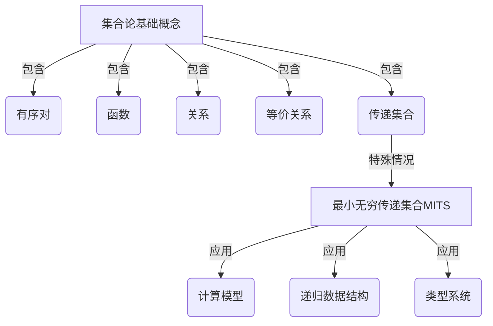

# 集合论导引：最小无穷传递集合

## 1. 背景介绍

### 1.1 问题的由来

集合论作为数学的一个基础分支,在计算机科学、逻辑学和其他数学领域扮演着重要角色。其中,传递集合(Transitive Set)是集合论中一个基本而重要的概念。传递集合指的是一个集合,其中每个元素都是该集合的子集。形式化地定义为:

$$
A \text{ 是传递集合} \Leftrightarrow \forall x \in A, x \subseteq A
$$

传递集合的概念源于对集合的自我包含(self-containment)现象的研究。自我包含集合是指集合本身作为自身的元素,这种情况在集合论中被视为悖论(paradox)。著名的例子是罗素悖论(Russell's Paradox),它揭示了naive集合论的内在矛盾。

为了解决这一问题,数学家们提出了各种方案,其中之一就是研究最小无穷传递集合(Minimal Infinite Transitive Set, MITS)。MITS是指最小的包含所有有序对的无穷传递集合。

### 1.2 研究现状

MITS的研究可以追溯到20世纪初,当时数学家们试图建立一种新的公理集合论(Axiomatic Set Theory),以规避悖论的出现。在这一背景下,MITS成为了一个重要的研究对象。

1930年代,Kurt Gödel和Paul Cohen等人的工作为MITS的存在性和构造方法提供了坚实的理论基础。他们证明了在ZFC(Zermelo-Fraenkel集合论加上选择公理)公理系统下,MITS的存在性得到了保证。

近年来,MITS在计算机科学领域也受到了广泛关注。例如,在lambda演算(Lambda Calculus)和类型论(Type Theory)中,MITS被用于构造模型;在编程语言理论中,MITS为研究递归数据结构提供了有力工具。

### 1.3 研究意义

研究MITS不仅有重要的理论意义,而且对实际应用也有潜在价值:

1. **理论基础**: MITS是集合论的基石,对于深入理解集合论的公理系统和形式化语义至关重要。
2. **计算模型**: MITS为构造计算模型(如域理论模型)提供了有力支持,有助于探索新的计算范式。
3. **递归数据结构**: MITS为研究递归数据结构(如链表、树等)提供了严格的数学框架,有助于更好地理解和优化这些数据结构。
4. **类型系统**: MITS在类型论中扮演着重要角色,有助于设计更健壮、更安全的编程语言类型系统。

### 1.4 本文结构

本文将全面介绍MITS的相关理论和应用。我们将从MITS的形式化定义出发,深入探讨其数学本质和构造方法。然后,我们将重点关注MITS在计算机科学领域的应用,包括计算模型、递归数据结构和类型系统等方面。最后,我们将总结MITS的研究现状,并展望其未来发展方向。

## 2. 核心概念与联系

在正式讨论MITS之前,我们需要先介绍一些核心概念和它们之间的联系。

1. **有序对(Ordered Pair)**: 有序对是集合论中最基本的构造,用于表示两个元素的有序组合。常见的构造方式包括库拉托雷斯基编码(Kuratowski Encoding)和Wiener-Kuratowski对(Wiener-Kuratowski Pair)。
2. **函数(Function)**: 函数是一种特殊的二元关系,将定义域中的每个元素唯一映射到值域中的一个元素。函数在数学和计算机科学中扮演着核心角色。
3. **关系(Relation)**: 关系是一种对应两个集合之间的子集,用于描述集合元素之间的某种联系。例如,等价关系就是一种特殊的关系。
4. **等价关系(Equivalence Relation)**: 等价关系是满足反身性、对称性和传递性的二元关系。等价关系将集合划分为若干个不相交的等价类。
5. **传递集合(Transitive Set)**: 如前所述,传递集合是指每个元素都是该集合的子集的集合。传递集合是研究MITS的基础。
6. **最小无穷传递集合(Minimal Infinite Transitive Set, MITS)**: MITS是最小的包含所有有序对的无穷传递集合。它是本文的核心概念,我们将在后续章节中详细探讨。

这些概念相互关联、层层递进,为我们理解MITS奠定了基础。接下来,我们将深入剖析MITS的数学本质和构造方法。

## 3. 核心算法原理 & 具体操作步骤

### 3.1 算法原理概述

构造MITS的核心思想是通过一个递归过程,从最小的集合出发,不断添加必要的有序对和集合,直到获得包含所有有序对的最小无穷传递集合。这个过程可以形式化为一个递归算法,称为MITS构造算法(MITS Construction Algorithm)。

算法的基本思路如下:

1. 初始化一个最小集合,通常取空集$\emptyset$。
2. 对于每个有序对$(a, b)$,如果它不属于当前集合,则将它加入集合。
3. 对于每个新加入的有序对$(a, b)$,如果$a$和$b$不属于当前集合,则分别将它们加入集合。
4. 重复步骤2和3,直到集合不再发生变化,即达到固定点。

这个算法的正确性和终止性可以通过数学归纳法证明。最终得到的集合就是MITS。

### 3.2 算法步骤详解

下面我们用一个具体的例子来详细说明MITS构造算法的执行过程。

假设我们从空集$\emptyset$开始构造MITS。算法的执行步骤如下:

1. 初始化集合$S = \emptyset$。
2. 考虑有序对$(0, 0)$,将它加入$S$,得到$S = \{\{0, 0\}\}$。
3. 由于$0$不在$S$中,将它加入$S$,得到$S = \{\{0, 0\}, 0\}$。
4. 考虑有序对$(0, 1)$,将它加入$S$,得到$S = \{\{0, 0\}, 0, \{0, 1\}\}$。
5. 由于$1$不在$S$中,将它加入$S$,得到$S = \{\{0, 0\}, 0, \{0, 1\}, 1\}$。
6. 考虑有序对$(1, 0)$,将它加入$S$,得到$S = \{\{0, 0\}, 0, \{0, 1\}, 1, \{1, 0\}\}$。
7. 考虑有序对$(1, 1)$,将它加入$S$,得到$S = \{\{0, 0\}, 0, \{0, 1\}, 1, \{1, 0\}, \{1, 1\}\}$。
8. 此时,所有有序对都已加入$S$,算法终止。

最终得到的集合$S$就是MITS。我们可以观察到,MITS不仅包含所有有序对,还包含了构造过程中产生的所有集合。

### 3.3 算法优缺点

MITS构造算法具有以下优点:

1. **简单直观**: 算法思路清晰,易于理解和实现。
2. **正确性保证**: 算法的正确性可以通过数学归纳法证明。
3. **通用性**: 算法可以应用于任何集合论基础,不依赖特定的公理系统。

然而,这个算法也存在一些缺点:

1. **低效率**: 算法的时间复杂度较高,需要大量的迭代步骤。
2. **空间开销大**: 构造过程中需要存储大量的中间集合,导致空间开销较大。
3. **缺乏结构性**: 算法生成的MITS缺乏内在结构,难以直观地理解和操作。

为了克服这些缺点,研究人员提出了多种优化和改进方案,例如基于树的递归构造算法、利用编码技术减小空间开销等。这些方案在一定程度上提高了算法的效率和可操作性。

### 3.4 算法应用领域

尽管MITS构造算法存在一些缺陷,但它在多个领域都有重要应用:

1. **集合论基础**: MITS构造算法为研究集合论的基础理论提供了实践工具,有助于验证和探索新的公理系统。
2. **计算模型构造**: MITS可以用于构造各种计算模型,如域理论模型、lambda演算模型等,为探索新的计算范式奠定基础。
3. **递归数据结构**: MITS为研究递归数据结构(如链表、树等)提供了严格的数学框架,有助于更好地理解和优化这些数据结构。
4. **类型系统设计**: MITS在类型论中扮演着重要角色,可以应用于设计更健壮、更安全的编程语言类型系统。

总的来说,尽管MITS构造算法本身存在一些局限性,但它为集合论和计算机科学的多个领域提供了有力的理论和实践支持。

## 4. 数学模型和公式 & 详细讲解 & 举例说明

### 4.1 数学模型构建

为了形式化地研究MITS,我们需要建立一个严格的数学模型。在这里,我们将基于ZFC(Zermelo-Fraenkel集合论加上选择公理)公理系统来构建模型。

首先,我们定义有序对的构造方式。在ZFC中,通常采用库拉托雷斯基编码(Kuratowski Encoding)来表示有序对:

$$
(a, b) = \{\{a\}, \{a, b\}\}
$$

接下来,我们给出MITS的形式化定义:

**定义1(最小无穷传递集合)**:最小无穷传递集合$M$是满足以下条件的最小集合:

1. $M$是无穷集合。
2. $M$是传递集合,即$\forall x \in M, x \subseteq M$。
3. $\forall a, b \in M, (a, b) \in M$。

换言之,MITS是包含所有有序对的最小无穷传递集合。

我们还需要引入一个辅助概念:MITS的"闭包"。

**定义2(MITS闭包)**:对于任意集合$A$,定义$A$的MITS闭包$\overline{A}$为最小的包含$A$且满足MITS条件的集合。形式化地:

$$
\overline{A} = \bigcap\{X \mid A \subseteq X \text{ 且 } X \text{ 是MITS}\}
$$

可以证明,对于任意集合$A$,其MITS闭包$\overline{A}$都是存在且唯一的。

有了这些准备,我们就可以研究MITS的性质和构造方法了。

### 4.2 公式推导过程

在这一节,我们将推导出MITS闭包的显式构造公式,并证明其正确性。

首先,我们定义一个辅助函数$\Phi$,它对任意集合$A$执行一次MITS构造迭代:

$$
\Phi(A) = A \cup \{(a, b) \mid a, b \in A\} \cup \{a, b \mid (a, b) \in A\}
$$

直观地说,$\Phi(A)$就是将$A$中所有有序对及其元素加入$A$所得到的新集合。

我们可以证明,$\Phi$是单调的,即对任意集合$A$和$B$,如果$A \subseteq B$,那么$\Phi(A) \subseteq \Phi(B)$。利用这一性质,我们可以构造一个序列:

$$
A_0 = A, A_{n+1} = \Phi(A_n)
$$

由单调性可知,这是一个非减序列。根据数学归纳法,我们可以证明该序列的极限就是$A$的MITS闭包