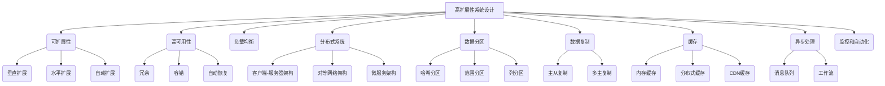

# 高扩展性系统设计的关键要素

## 1. 背景介绍

### 1.1 问题的由来

随着互联网的快速发展和用户数量的不断增长,传统的系统架构已经无法满足日益增长的访问需求和数据处理量。高并发、大流量、海量数据等场景对系统的扩展性提出了更高的要求。因此,设计高扩展性系统成为了当前系统架构设计中的一个核心挑战。

### 1.2 研究现状

近年来,业界和学术界都在积极探索高扩展性系统设计的方法和实践。一些知名的互联网公司,如Google、Amazon、Netflix等,已经在实践中积累了丰富的经验,并提出了一些成熟的架构模式和设计原则。同时,一些开源项目和框架,如Apache Kafka、Hadoop、Spark等,也为构建高扩展性系统提供了有力的支持。

### 1.3 研究意义

设计高扩展性系统对于应对未来的发展趋势至关重要。它不仅可以提高系统的可靠性和响应能力,还能够降低运维成本,提高资源利用率。同时,高扩展性系统设计也为新兴技术的应用奠定了基础,如大数据处理、人工智能、物联网等。因此,研究高扩展性系统设计具有重要的理论和实践意义。

### 1.4 本文结构

本文将从以下几个方面深入探讨高扩展性系统设计的关键要素:

1. 核心概念与联系
2. 核心算法原理与具体操作步骤
3. 数学模型和公式详细讲解与案例分析
4. 项目实践:代码实例和详细解释说明
5. 实际应用场景
6. 工具和资源推荐
7. 总结:未来发展趋势与挑战
8. 附录:常见问题与解答

## 2. 核心概念与联系

在探讨高扩展性系统设计之前,我们需要了解一些核心概念及其相互关系。这些概念构成了高扩展性系统设计的基础,对于理解和实现高扩展性系统至关重要。

### 2.1 可扩展性(Scalability)

可扩展性是指系统能够根据业务发展需求,通过合理的方式来扩展计算资源(如CPU、内存、存储等),从而支撑更高的访问量和数据处理量,而不会影响系统的可用性和响应时间。可扩展性通常分为以下几种类型:

1. **垂直扩展(Scale Up)**:通过增加单个节点的计算资源(如CPU、内存等)来提高系统的处理能力。
2. **水平扩展(Scale Out)**:通过增加节点数量来提高系统的处理能力,这是更加常见的扩展方式。
3. **自动扩展(Auto Scaling)**:根据系统负载自动调整资源数量,实现按需扩展。

### 2.2 高可用性(High Availability)

高可用性是指系统能够在一定时间内无中断地提供服务的能力。它通常通过冗余、容错、自动恢复等机制来实现,确保系统在发生硬件故障、软件错误或者其他异常情况时,仍能够保持正常运行。高可用性是高扩展性系统设计的一个重要目标。

### 2.3 负载均衡(Load Balancing)

负载均衡是指将请求合理地分配到多个服务器上,以实现资源的最佳利用和最大化系统的吞吐量。常见的负载均衡策略包括轮询(Round Robin)、最小连接(Least Connections)、最短响应时间(Shortest Response Time)等。负载均衡是实现高扩展性和高可用性的关键技术之一。

### 2.4 分布式系统(Distributed System)

分布式系统是由多个独立的计算机组成的软件系统,这些计算机通过网络相互协调工作,对外呈现为一个统一的整体。分布式系统具有高度的扩展性和容错性,是构建高扩展性系统的核心架构。常见的分布式系统架构包括客户端-服务器架构、对等网络架构、微服务架构等。

### 2.5 数据分区(Data Partitioning)

数据分区是指将数据按照某种策略划分为多个部分,分别存储在不同的节点上。常见的数据分区策略包括哈希分区(Hash Partitioning)、范围分区(Range Partitioning)、列分区(Column Partitioning)等。数据分区可以提高系统的并行处理能力,是实现高扩展性的重要手段。

### 2.6 数据复制(Data Replication)

数据复制是指将数据复制到多个节点上,以实现数据的冗余备份和负载均衡。常见的数据复制策略包括主从复制(Master-Slave Replication)、多主复制(Multi-Master Replication)等。数据复制可以提高系统的可用性和读取性能,是实现高扩展性和高可用性的关键技术之一。

### 2.7 缓存(Caching)

缓存是指将常用的数据临时存储在内存或者其他快速存储介质中,以提高数据访问的速度。常见的缓存技术包括内存缓存(In-Memory Caching)、分布式缓存(Distributed Caching)、CDN缓存(Content Delivery Network Caching)等。缓存可以显著提高系统的响应速度和吞吐量,是实现高扩展性的重要手段。

### 2.8 异步处理(Asynchronous Processing)

异步处理是指将耗时的操作放到后台进行处理,而不是直接等待操作完成。常见的异步处理技术包括消息队列(Message Queue)、工作流(Workflow)等。异步处理可以提高系统的响应速度和吞吐量,是实现高扩展性的重要手段。

### 2.9 监控和自动化(Monitoring and Automation)

监控和自动化是指通过监控系统的运行状态,并自动化地执行一些操作,如扩展资源、故障转移、负载均衡等。它可以提高系统的可靠性和自动化程度,是实现高扩展性和高可用性的重要手段。

### 2.10 核心概念关系总结

以上这些核心概念相互关联,共同构成了高扩展性系统设计的基础。下图展示了它们之间的关系:

## 3. 核心算法原理 & 具体操作步骤

在高扩展性系统设计中,有一些核心算法和原理需要了解和掌握。这些算法和原理为实现高扩展性提供了理论基础和具体的操作步骤。

### 3.1 算法原理概述

#### 3.1.1 一致性哈希算法(Consistent Hashing)

一致性哈希算法是一种分布式哈希表(Distributed Hash Table)的实现,它可以在节点数量发生变化时,只需重新映射少量数据,从而实现高效的数据分区和负载均衡。该算法的核心思想是将节点和数据都映射到同一个哈希环上,然后根据顺时针方向找到距离数据最近的节点,将数据存储在该节点上。

#### 3.1.2 Paxos算法

Paxos算法是一种分布式一致性算法,它可以在存在节点故障的情况下,保证分布式系统中多个节点对某个值达成一致。Paxos算法通常用于实现分布式锁、分布式事务、分布式协调等场景,是构建高可用和高扩展性系统的关键算法之一。

#### 3.1.3 Raft算法

Raft算法是另一种分布式一致性算法,相比Paxos算法更易于理解和实现。它通过选举机制选出一个领导者(Leader),由领导者负责管理集群中的所有变更操作。Raft算法常用于构建分布式存储系统、分布式协调服务等。

#### 3.1.4 Gossip协议

Gossip协议是一种去中心化的通信协议,它通过节点之间的随机交换信息来传播数据和检测故障。Gossip协议具有良好的容错性和可扩展性,常用于构建分布式系统中的成员管理、元数据共享、数据传播等功能。

#### 3.1.5 Merkle树

Merkle树是一种二叉树结构,它通过哈希值的方式对数据进行编码和验证,可以高效地验证大量数据的完整性和一致性。Merkle树常用于构建分布式存储系统、区块链系统等,以确保数据的完整性和不可篡改性。

### 3.2 算法步骤详解

接下来,我们将详细介绍上述算法的具体操作步骤。

#### 3.2.1 一致性哈希算法步骤

1. 选择一个哈希函数(如MD5、SHA-1等)和一个虚拟节点数量。
2. 对每个实际节点计算多个虚拟节点的哈希值,将这些哈希值映射到一个环形空间中。
3. 对数据项计算哈希值,并将其映射到同一个环形空间中。
4. 顺时针查找距离数据项哈希值最近的虚拟节点,将数据项存储在该虚拟节点所属的实际节点上。
5. 当节点加入或移除时,只需重新映射受影响的数据项即可。

#### 3.2.2 Paxos算法步骤

1. 选举一个提案者(Proposer),负责发起提案。
2. 提案者向所有的接受者(Acceptor)发送准备请求(Prepare Request),询问是否可以发起新的提案。
3. 接受者回复最新的已接受提案的编号和值。
4. 如果提案者收到了多数接受者的响应,并且没有更新的已接受提案,则可以发起新的提案。
5. 提案者向所有接受者发送接受请求(Accept Request),包含提案编号和提案值。
6. 接受者检查提案编号是否为最新,如果是,则接受该提案,并持久化提案值。
7. 如果提案者收到了多数接受者的接受响应,则提案通过,否则重试。

#### 3.2.3 Raft算法步骤

1. 初始化集群,所有节点处于follower状态。
2. 节点通过随机超时机制发起选举,成为候选者(Candidate)。
3. 候选者向其他节点发送请求投票(RequestVote)的RPC请求。
4. 如果候选者获得了多数节点的投票,则成为领导者(Leader)。
5. 领导者开始处理客户端的请求,将日志条目复制到其他节点。
6. 如果领导者失效,则重新进入选举阶段。

#### 3.2.4 Gossip协议步骤

1. 每个节点维护一个成员列表,列出集群中的所有节点。
2. 每个节点定期随机选择一个或多个节点,与之交换状态信息。
3. 如果发现有新的节点加入或离开集群,则更新本地的成员列表。
4. 将更新后的成员列表传播给其他节点,以保持集群视图的一致性。
5. 根据具体的应用场景,可以在状态信息中包含其他数据,如元数据、数据分片等。

#### 3.2.5 Merkle树构建步骤

1. 将要构建Merkle树的数据划分为多个数据块。
2. 对每个数据块计算哈希值。
3. 将相邻的两个哈希值组合,计算它们的父节点哈希值。
4. 重复步骤3,直到计算出