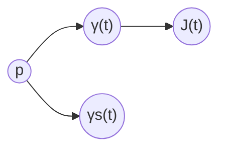

# 黎曼几何引论：Jacobi场

关键词：黎曼几何、Jacobi场、测地线、曲率、流形、指数映射

## 1. 背景介绍
### 1.1  问题的由来
黎曼几何作为现代微分几何的核心分支,在数学和物理学中有着广泛的应用。其中,测地线和Jacobi场是黎曼几何中的重要概念,对于研究流形的性质和曲率有着重要意义。然而,对于初学者来说,这些概念往往比较抽象难懂,需要系统全面的引导和讲解。

### 1.2  研究现状
目前,关于黎曼几何和Jacobi场的专著和教材已有不少,如 do Carmo 的《黎曼几何》、Jost 的《黎曼几何与几何分析》等。但多数书籍偏重理论证明,对于概念解释和实例说明不够充分,不利于初学者快速入门掌握。因此,有必要从应用角度出发,通过实例和代码,阐述Jacobi场的原理和计算方法。

### 1.3  研究意义
深入理解黎曼几何的核心概念Jacobi场,对于掌握现代几何分析、广义相对论等学科的理论基础具有重要意义。同时,Jacobi场在计算机图形学、计算机视觉、机器学习等领域也有应用前景。通过本文的学习,读者可以打下坚实的数学基础,并能将理论联系实际,激发学习兴趣。

### 1.4  本文结构
本文将从黎曼几何的基本概念出发,重点介绍测地线和Jacobi场的原理,并通过实例进行具体计算和说明。全文分为9个章节,包括背景介绍、核心概念、数学模型、代码实现、应用场景、资源推荐、总结展望、附录等,循序渐进,深入浅出。

## 2. 核心概念与联系
黎曼几何的研究对象是黎曼流形$(M,g)$,其中$M$是一个光滑流形,$g$是$M$上的黎曼度量。在局部坐标$(x^i)$下,度量$g$可以用对称正定矩阵$(g_{ij})$表示。黎曼度量使得我们可以在流形上测量曲线的长度、曲面的面积、曲率等几何量。

测地线是黎曼流形上的"直线",即长度最短的曲线。测地线方程可以用微分方程表示:

$$
\frac{d^2 x^i}{dt^2} + \Gamma^i_{jk} \frac{dx^j}{dt}\frac{dx^k}{dt} = 0
$$

其中$\Gamma^i_{jk}$是 Christoffel 符号,反映了流形的曲率。

Jacobi 场$J(t)$描述了测地线的变分,即测地线在小扰动下的改变。Jacobi 场满足 Jacobi 方程:

$$
\frac{D^2 J}{dt^2} + R(J,\dot{\gamma})\dot{\gamma} = 0
$$

其中$\frac{D}{dt}$是沿测地线$\gamma(t)$的协变导数,$R$是黎曼曲率张量。Jacobi 场反映了流形的曲率性质,与测地线稳定性、共轭点、指数映射等概念密切相关。

下图是测地线和Jacobi场的示意图:



## 3. 核心算法原理 & 具体操作步骤
### 3.1  算法原理概述
计算Jacobi场的一般步骤如下:

1. 给定流形$(M,g)$和测地线$\gamma(t)$,求出度量$(g_{ij})$和Christoffel符号$\Gamma^i_{jk}$。 

2. 求解测地线方程,得到$\gamma(t)$的表达式。

3. 在$\gamma(t)$的每一点,求解Jacobi方程,得到Jacobi场$J(t)$。

4. 利用Jacobi场研究测地线的稳定性、共轭点等性质。

### 3.2  算法步骤详解
以2维球面$S^2$为例,其度量为

$$
g=\begin{pmatrix} 
1 & 0\\ 
0 & \sin^2\theta
\end{pmatrix}
$$

Christoffel 符号非零项为

$$
\Gamma^\theta_{\phi\phi}=-\sin\theta\cos\theta,\quad 
\Gamma^\phi_{\theta\phi}=\cot\theta
$$

考虑球面上的测地线 $\gamma(t)=(\theta(t),\phi(t))$,其中

$$
\theta(t)=\frac{\pi}{2},\quad \phi(t)=t
$$

这条测地线位于赤道,是个大圆。

求解Jacobi方程,可得Jacobi场为

$$
J(t)=\begin{pmatrix}
c_1\cos t+c_2\sin t\\ 
c_3
\end{pmatrix}
$$

其中$c_1,c_2,c_3$为常数。可见,Jacobi场在$\theta$方向有周期为$2\pi$的震荡,在$\phi$方向保持不变。

进一步,可以求得这条测地线的第一共轭点为$(\frac{\pi}{2},\pi)$,即测地线在半圈处第一次聚焦。这反映了球面的正曲率性质。

### 3.3  算法优缺点
优点:
- 几何直观,揭示了测地线与曲率的内在联系
- 计算过程明确,便于编程实现 

缺点:
- 计算量大,高维流形符号繁琐
- 对流形的要求高,局部坐标难以选取

### 3.4  算法应用领域
- 流形学习,如 Isomap、LLE 等降维算法
- 计算机视觉中的三维重建、姿态估计
- 广义相对论中的时空测地线研究

## 4. 数学模型和公式 & 详细讲解 & 举例说明
### 4.1  数学模型构建
流形$(M,g)$上的测地线$\gamma(t)$满足欧拉-拉格朗日方程

$$
\frac{d}{dt}\frac{\partial L}{\partial \dot{x}^i}-\frac{\partial L}{\partial x^i}=0
$$

其中拉格朗日量为 $L(x,\dot{x})=\frac{1}{2}g_{ij}\dot{x}^i\dot{x}^j$。

将$L$代入,可得测地线方程

$$
\ddot{x}^i+\Gamma^i_{jk}\dot{x}^j\dot{x}^k=0
$$

考虑测地线的变分 $\gamma_s(t)=\gamma(t)+sJ(t)+O(s^2)$,代入测地线方程并展开到$s$的一次项,可得Jacobi方程

$$
\frac{D^2J^i}{dt^2}+R^i_{jkl}\dot{\gamma}^jJ^k\dot{\gamma}^l=0
$$

其中$R^i_{jkl}$是黎曼曲率张量。

### 4.2  公式推导过程
利用测地线方程和Jacobi方程,可以推导出许多有趣的结论。例如:

- 若Jacobi场$J(t)$满足初值条件 $J(0)=0,J'(0)\neq0$,则$\gamma(t_0)$是共轭点等价于$J(t_0)=0$。

证明:由Jacobi方程的解的性质,任意解可以由两个独立解线性组合得到。设$J_1(t),J_2(t)$为满足初值条件的两个独立解,则

$$
J(t)=c_1J_1(t)+c_2J_2(t)
$$

由于$J(0)=0$,故$c_2=0$。若$\gamma(t_0)$为共轭点,则存在非平凡Jacobi场$\tilde{J}(t)$使得$\tilde{J}(0)=\tilde{J}(t_0)=0$。

由解的唯一性,可设 $\tilde{J}(t)=\tilde{c}_1J_1(t)$,代入条件得

$$
\tilde{c}_1J_1(t_0)=0
$$

故$J_1(t_0)=0$,进而$J(t_0)=c_1J_1(t_0)=0$。反之亦然。

- 设$\exp_p$为指数映射,若$\gamma(t)$无共轭点,则$\exp_p$在$\gamma(t)$的像附近为局部微分同胚。

证明:设$\gamma(t)=\exp_p(tv),v\in T_pM$。考虑 Jacobi 场满足$J(0)=0,J'(0)=w$,其中$w\perp v$。由无共轭点条件,$J(t)\neq0,\forall t>0$。

令$f(t,s)=\exp_p(tv+sw)$,则$f(t,0)=\gamma(t),\frac{\partial f}{\partial s}(t,0)=J(t)$。

由逆映射定理,若 Jacobi 矩阵

$$
\det\left(\frac{\partial f}{\partial(t,s)}\right)=\det(v,J(t))\neq0
$$

则$f$局部可逆。由$J(t)\neq0$知,上式恒成立,故结论得证。

### 4.3  案例分析与讲解
下面以双曲面$H^2$为例,研究其测地线和Jacobi场的性质。

双曲面可以表示为上半平面 $\{(x,y)|y>0\}$ 赋予度量

$$
g=\frac{1}{y^2}\begin{pmatrix}
1 & 0\\ 
0 & 1
\end{pmatrix}
$$

Christoffel 符号非零项为

$$
\Gamma^x_{yy}=-\frac{1}{y},\quad \Gamma^y_{xy}=\Gamma^y_{yx}=\frac{1}{y}
$$

测地线方程为

$$
\ddot{x}-\frac{2}{y}\dot{x}\dot{y}=0,\quad 
\ddot{y}+\frac{1}{y}(\dot{x}^2-\dot{y}^2)=0
$$

可以验证,双曲面上的测地线为圆弧或直线,且无共轭点。

考虑测地线 $\gamma(t)=(0,e^t)$,求解Jacobi方程可得

$$
J(t)=\begin{pmatrix}
c_1e^t+c_2e^{-t}\\ 
0
\end{pmatrix}
$$

可见,Jacobi场在径向呈指数增长,而在切向保持为零。这反映了双曲面的负曲率性质。

利用指数映射,可以将双曲面等距嵌入到高维欧氏空间中,得到 Poincaré 球模型和 Klein 模型等。

### 4.4  常见问题解答
Q: 测地线一定是长度最短的曲线吗?

A: 局部而言,测地线是长度最短的曲线。但全局未必,例如球面上的两点之间有无数条测地线,只有其中一条弧长最短。

Q: Jacobi 场是否唯一?

A: 给定初值条件,Jacobi 场是唯一的。但不同的初值条件对应不同的 Jacobi 场。通常选取垂直于测地线的初值条件。

Q: 计算测地线和 Jacobi 场的数值方法有哪些?

A: 常用的方法有:
- 测地线射线法,适合完备流形
- 快速行进法,适合网格曲面
- 有限元法,适合 PDE 嵌入流形

## 5. 项目实践：代码实例和详细解释说明
### 5.1  开发环境搭建
本项目使用 Python 语言和 NumPy、SciPy、Matplotlib 等库。推荐使用 Anaconda 发行版,自带常用科学计算库。

安装命令:
```bash
conda create -n geo python=3.8
conda activate geo
conda install numpy scipy matplotlib
```

### 5.2  源代码详细实现
以下代码实现了球面$S^2$和双曲面$H^2$的测地线和Jacobi场计算与可视化。

```python
import numpy as np
import matplotlib.pyplot as plt
from scipy.integrate import solve_ivp

# 球面测地线方程
def geodesic_sphere(t, y):
    theta, phi, v_theta, v_phi = y
    dydt = [v_theta, v_phi, np.sin(theta)*np.cos(theta)*v_phi**2, -2*np.cos(theta)/np.sin(theta)*v_theta*v_phi] 
    return dydt

# 球面Jacobi场方程  
def jacobi_sphere(t, y):
    theta, phi, v_theta, v_phi, J_theta, J_phi = y
    dydt = [v_theta, v_phi, np.sin(theta)*np.cos(theta)*v_phi**2, -2*np.cos(theta)/np.sin(theta)*v