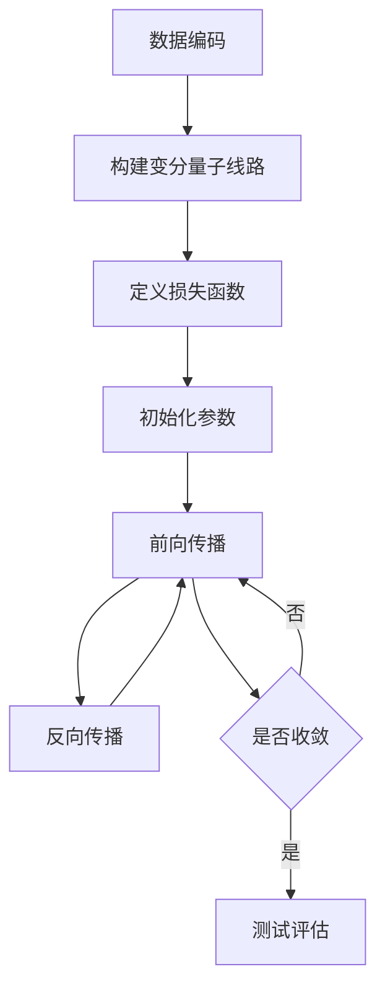

# AGI与量子引力的跨学科合作

## 1. 背景介绍
### 1.1 问题的由来
人工智能(Artificial Intelligence, AI)自诞生以来就一直是科技界关注的焦点。近年来，随着深度学习等技术的快速发展，AI已经在许多领域取得了令人瞩目的成就，如计算机视觉、自然语言处理、语音识别等。然而，当前的AI系统大多是"弱人工智能"或"狭义人工智能"，它们只能在特定的领域内完成特定的任务，离通用人工智能(Artificial General Intelligence, AGI)还有很大距离。

另一方面，量子力学作为描述微观世界的基本理论，与广义相对论一起构成了现代物理学的两大支柱。量子力学的诸多概念和现象，如量子叠加、量子纠缠、量子隧穿等，都与经典物理有着本质的不同。近年来兴起的量子计算，更是为人工智能的发展带来了新的机遇和挑战。

### 1.2 研究现状
目前，将量子力学与人工智能结合起来的研究还处于起步阶段。一些研究者提出了量子机器学习(Quantum Machine Learning)的概念，试图利用量子计算的特性来加速机器学习算法。例如，HHL算法可以在多项式时间内求解线性方程组，而经典算法需要指数时间。

此外，还有研究者探索利用量子退火(Quantum Annealing)来求解组合优化问题，如D-Wave公司的量子退火机。这些研究表明，量子计算与人工智能的结合有望在某些问题上取得突破性进展。

然而，量子力学与人工智能的结合还面临许多挑战。一方面，量子计算的噪声和错误率仍然较高，限制了量子算法的实用性。另一方面，如何将量子力学的概念和方法有机地融入人工智能的框架中，仍然是一个开放的问题。

### 1.3 研究意义
将量子力学与人工智能结合起来，有望在以下几个方面取得重要突破：

1. 大幅提升机器学习算法的效率和性能，特别是在高维数据和复杂模型的情况下。
2. 发掘新的学习范式和算法，突破经典计算的限制，实现更强大的人工智能。
3. 加深对人类智能的本质和机理的理解，为构建类人的AGI系统提供启示。
4. 推动量子计算和量子信息技术的发展，为未来的量子人工智能奠定基础。

总之，量子力学与人工智能的交叉融合，不仅具有重要的理论意义，也有望产生深远的技术和应用价值。

### 1.4 本文结构
本文将围绕AGI与量子引力的跨学科合作这一主题，展开以下讨论：

第2部分介绍AGI与量子引力的核心概念及其内在联系。
第3部分重点阐述将量子力学融入人工智能的核心算法原理和具体实现步骤。
第4部分建立AGI与量子引力的数学模型，给出详细的公式推导和案例分析。
第5部分通过代码实例，演示如何用量子计算加速机器学习算法。
第6部分讨论量子人工智能的实际应用场景和未来愿景。
第7部分推荐相关的学习资源、开发工具和文献资料。
第8部分总结全文，展望量子人工智能的未来发展趋势和面临的挑战。
第9部分列举一些常见问题，并给出简要解答。

## 2. 核心概念与联系
人工智能和量子力学是两个看似风马牛不相及的领域，但它们在本质上却有着诸多联系。

人工智能的核心是智能主体对环境的感知、理解、决策和行动的能力。其中，感知涉及对外界信息的获取和表征，理解涉及对信息的解释和推理，决策涉及在多个备选方案中做出选择，行动则是对决策结果的执行。这些能力都依赖于大脑的认知功能。

量子力学则是描述微观粒子运动规律的基本理论。它的核心概念包括：

- 波粒二象性：粒子具有波的性质，波也具有粒子的性质。
- 测不准原理：粒子的位置和动量不能同时精确测量。
- 量子叠加：粒子可以同时处于多个状态的叠加。
- 量子纠缠：两个或多个粒子之间存在非定域关联。
- 量子隧穿：粒子可以穿透势垒。

这些量子现象与经典物理有着本质的不同，展现了微观世界的奇特性质。

那么，量子力学与人工智能之间有什么联系呢？

首先，人工智能系统的物理载体，如芯片和电路，都遵循量子力学规律。随着集成电路的特征尺寸不断减小，量子效应变得越来越重要，必须在设计中予以考虑。

其次，大脑的认知过程很可能与量子力学有关。一些研究表明，微管等细胞结构可能存在量子相干效应，在信息传递和处理中发挥作用。大脑的记忆、意识等高级功能，可能与量子叠加、纠缠等现象有关。

再次，量子计算为人工智能提供了新的计算范式。传统计算机依赖于经典比特，而量子计算机使用量子比特，能够同时处理多个状态。一些量子算法，如Grover搜索、Shor分解等，在理论上显示出指数级的加速效果。

此外，量子力学的概念和方法也为人工智能的发展提供了新的思路。例如，量子态的概率幅和概率分布，与机器学习中的模型参数和概率分布有相似之处。测不准原理、纠缠等现象，则启发我们去思考认知的不确定性、关联性等问题。

总之，量子力学与人工智能之间存在着深刻的内在联系。将两者结合起来，不仅有助于突破经典计算的瓶颈，实现更强大的人工智能，也有望加深我们对认知和智能的本质认识，最终走向通用人工智能。

## 3. 核心算法原理 & 具体操作步骤
将量子力学引入人工智能领域，需要发展新的量子机器学习算法。本节将重点介绍几种代表性算法的原理和实现步骤。

### 3.1 算法原理概述
量子机器学习的核心思想是利用量子计算的优势，如量子并行、量子纠缠等，来加速经典的机器学习算法。主要有以下几类算法：

1. 基于量子线路的算法：将经典数据编码到量子态，构建量子线路来实现学习和推理。
2. 基于量子核方法的算法：用量子态的内积来构建核函数，实现非线性变换和特征提取。
3. 基于量子退火的算法：用量子退火过程来求解组合优化问题，如聚类、分类等。
4. 基于量子行走的算法：用量子行走来实现图上的快速搜索和采样。
5. 基于变分量子线路的算法：用参数化量子线路和经典优化器来训练量子机器学习模型。

这些算法在理论上显示出了优于经典算法的潜力，但在实际应用中还面临许多挑战，如量子硬件的噪声和错误、编码方式的选择、量子线路的设计等。

### 3.2 算法步骤详解
下面以变分量子分类器(Variational Quantum Classifier, VQC)为例，详细介绍其实现步骤。

VQC是一种基于变分量子线路的监督学习算法，用于二分类任务。其基本思想是用参数化量子线路来构建分类器，通过经典优化器来训练量子线路的参数，使其能够最大化分类准确率。

具体步骤如下：

1. 数据编码：将经典数据样本编码到量子态。常见的编码方式有amplitude encoding、angle encoding等。
2. 构建变分量子线路：设计参数化的量子线路，包括量子门、测量等。线路的结构和参数决定了分类器的性能。
3. 定义损失函数：用经典的损失函数，如交叉熵、铰链损失等，来评估分类器的性能。
4. 初始化参数：随机初始化变分量子线路的参数。
5. 前向传播：将编码后的量子态输入到变分量子线路，测量输出结果，计算损失函数。
6. 反向传播：用经典的优化算法，如梯度下降、Adam等，来更新变分量子线路的参数，最小化损失函数。
7. 迭代优化：重复步骤5-6，直到损失函数收敛或达到预设的迭代次数。
8. 测试评估：用训练好的变分量子分类器对测试集进行预测，计算准确率等指标。

以上步骤可以用下面的Mermaid流程图来表示：

### 3.3 算法优缺点
VQC算法的主要优点包括：

1. 可以利用浅层量子线路和少量量子比特来实现非线性分类。
2. 通过经典优化器来训练，减轻了量子硬件的负担。
3. 变分线路的结构和参数可以灵活设计，适应不同的任务需求。
4. 测量结果直接对应分类标签，易于解释。

但VQC算法也存在一些缺点：

1. 量子线路的设计需要领域知识和试错，目前缺乏系统的指导原则。
2. 训练过程中需要大量的量子线路评估，对量子硬件的质量和稳定性要求较高。
3. 经典优化器的性能对算法的收敛速度和效果有较大影响。
4. 输出结果对量子测量的选择较为敏感，需要仔细设计。

### 3.4 算法应用领域
VQC等量子机器学习算法可以应用于多个领域，如：

1. 量子化学：预测分子性质、药物设计等。
2. 量子图像处理：图像分类、特征提取等。
3. 量子自然语言处理：文本分类、情感分析等。
4. 量子金融：股票预测、风险评估等。

但目前这些应用大多还处于理论探索或原型验证阶段，离实用化还有较大距离。未来需要在量子硬件、量子软件、量子编码等方面取得更大突破，才能真正发挥量子机器学习的优势。

## 4. 数学模型和公式 & 详细讲解 & 举例说明
本节将建立VQC算法的数学模型，推导相关公式，并给出具体的案例分析。

### 4.1 数学模型构建
设训练集为 $\{(\mathbf{x}_i,y_i)\}_{i=1}^N$，其中 $\mathbf{x}_i\in\mathbb{R}^n$ 为第 $i$ 个样本的特征向量，$y_i\in\{0,1\}$ 为其对应的二分类标签。

定义编码函数 $U_{\mathbf{x}_i}$ 将经典特征向量 $\mathbf{x}_i$ 编码到量子态 $|\psi_{\mathbf{x}_i}\rangle$：

$$
U_{\mathbf{x}_i}|0\rangle^{\otimes n}=|\psi_{\mathbf{x}_i}\rangle
$$

其中 $|0\rangle^{\otimes n}$ 表示 $n$ 个量子比特的初始态，所有比特都处于基态 $|0\rangle$。

定义变分量子线路 $V(\theta)$，其中 $\theta$ 为线路的参数向量。$V(\theta)$ 作用于编码后的量子态 $|\psi_{\mathbf{x}_i}\rangle$，得到变换后的量子态 $|\phi_{\mathbf{x}_i}(\theta)\rangle$：

$$
V(\theta)|\psi_{\mathbf{x}_i}\rangle=|\phi_{\mathbf{x}_i}(\theta)\rangle
$$

接下来，对 $|\phi_{\mathbf{x}_i}(\theta)\rangle$ 进行测量，得到输出概率分布 $P(y|\math