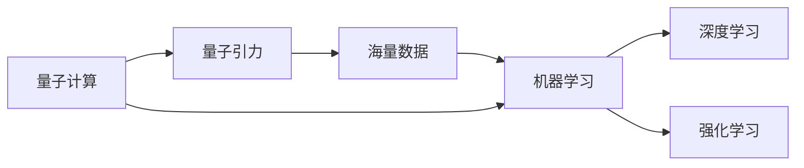
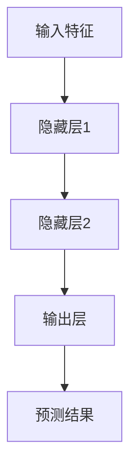

# AGI在量子引力中的应用研究

关键词：AGI、量子引力、量子计算、人工智能、机器学习、量子力学

## 1. 背景介绍

### 1.1 问题的由来
量子引力是当前物理学界最前沿和最具挑战性的研究领域之一。它试图将爱因斯坦的广义相对论与量子力学相结合,构建一个统一的量子引力理论。与此同时,人工智能尤其是通用人工智能(AGI)的发展也取得了长足的进步。将AGI技术应用于量子引力的研究,有望为这一领域带来新的突破。

### 1.2 研究现状
目前,量子引力的主流研究方向包括圈量子引力、弦理论/M理论、因果集引力等。这些理论都试图从不同角度来构建量子引力理论,但都面临着一些理论和实验上的困难。另一方面,AGI技术如深度学习、强化学习等在模式识别、决策优化等方面展现出了强大的能力,但尚未在量子引力研究中得到广泛应用。

### 1.3 研究意义
将AGI引入量子引力研究,可以为这一领域提供新的思路和方法。AGI可以帮助我们从海量的理论模型和实验数据中提取有价值的信息,加速理论构建和实验验证的进程。同时,量子引力研究也为AGI的发展提供了一个新的应用场景和挑战,有助于推动AGI技术的进一步发展。

### 1.4 本文结构
本文将首先介绍量子引力和AGI的一些核心概念,然后探讨将AGI应用于量子引力研究的一些具体思路,包括引入机器学习来辅助理论模型的构建、使用强化学习来优化实验方案设计等。接着,我们将通过一些数学模型和代码实例来展示这些思路的可行性。最后,本文还将讨论AGI在量子引力中的一些潜在应用场景,以及面临的机遇与挑战。

## 2. 核心概念与联系

在探讨AGI在量子引力中的应用之前,我们首先需要了解一些相关的核心概念:

- 量子引力:旨在将广义相对论与量子力学相结合,构建一个统一的引力理论。
- AGI(Artificial General Intelligence):通用人工智能,指能够像人类一样进行感知、学习、推理和解决问题的智能系统。
- 机器学习:一种实现人工智能的方法,通过学习算法从数据中提取模式和知识。
- 深度学习:机器学习的一个分支,使用深度神经网络来建模复杂的非线性关系。 
- 强化学习:通过智能体与环境的交互来学习最优决策的一类机器学习方法。
- 量子计算:基于量子力学原理实现的一种全新计算范式,有望超越经典计算机的性能。

这些概念之间存在着紧密的联系。量子引力理论的建立需要处理大量的数学模型和实验数据,这为机器学习尤其是深度学习的应用提供了用武之地。而强化学习则可以帮助优化实验方案,提高资源利用效率。量子计算作为一种新兴的计算手段,也为复杂量子引力模型的求解提供了新的可能。

下图展示了这些概念之间的关系:



## 3. 核心算法原理 & 具体操作步骤

### 3.1 算法原理概述
将AGI应用于量子引力研究,核心是利用机器学习算法来处理复杂的理论模型和实验数据。一方面,可以使用深度学习等算法来拟合和预测物理量之间的关系,辅助理论模型的构建。另一方面,强化学习可以用于优化实验方案,在给定约束条件下寻找最优的实验参数组合。

### 3.2 算法步骤详解
以深度学习辅助理论模型构建为例,主要步骤如下:

1. 数据准备:收集已有的理论模型和实验数据,进行预处理和特征工程。
2. 网络设计:根据数据的特点,设计合适的深度神经网络结构,如MLP、CNN、RNN等。
3. 模型训练:使用准备好的数据对网络进行训练,优化模型参数以拟合数据。
4. 模型评估:在独立的测试集上评估模型的性能,进行误差分析和模型调优。
5. 模型应用:使用训练好的模型对新的数据进行预测,为理论模型提供参考。

强化学习优化实验方案的步骤与之类似,主要区别在于需要构建一个实验环境模型,并使用奖励函数来引导智能体学习最优策略。

### 3.3 算法优缺点
深度学习和强化学习在处理复杂数据和决策问题上有独特的优势,但也存在一些局限性:

- 优点:可以拟合非线性关系,对噪声和缺失数据有较强的鲁棒性,可以学习到数据中的隐含模式。  
- 缺点:需要大量的训练数据和计算资源,模型的可解释性较差,泛化能力有待提高。

### 3.4 算法应用领域
除了量子引力,深度学习和强化学习在许多物理学领域都有广泛应用,如:

- 粒子物理:借助机器学习从海量实验数据中寻找新粒子的证据。
- 凝聚态物理:使用神经网络研究量子多体系统的性质。
- 天文学:应用机器学习进行星系分类、引力波信号检测等。

下图展示了一个使用深度学习预测物理量关系的示例:



## 4. 数学模型和公式 & 详细讲解 & 举例说明

### 4.1 数学模型构建
为了使用机器学习处理量子引力问题,我们需要将物理量之间的关系抽象为数学模型。以拟合两个物理量$x$和$y$之间的函数关系为例,可以使用多项式回归模型:

$$y = w_0 + w_1x + w_2x^2 + \cdots + w_nx^n + \epsilon$$

其中$w_i$为模型参数,$\epsilon$为噪声项。

### 4.2 公式推导过程
对于给定的一组观测数据$(x_i, y_i), i=1,2,\cdots,m$,我们希望找到一组参数$w$使得预测值与真实值的差距最小。这可以通过最小化均方误差损失函数来实现:

$$J(w) = \frac{1}{2m}\sum_{i=1}^m(h_w(x_i) - y_i)^2$$

其中$h_w(x)$为参数为$w$的模型对$x$的预测值。求解该最优化问题的一种方法是梯度下降法,参数更新公式为:

$$w := w - \alpha \frac{\partial J(w)}{\partial w}$$

其中$\alpha$为学习率。

### 4.3 案例分析与讲解
下面我们以一个简单的例子来说明如何使用多项式回归拟合量子引力中的物理量关系。假设我们要研究黑洞视界面积$A$与其熵$S$之间的关系,已知的一组观测数据如下:

| 面积$A$ | 熵$S$ |
|-------|-------|
| 10    | 100   |
| 20    | 400   |
| 30    | 900   |
| 40    | 1600  |
| 50    | 2500  |

根据贝肯斯坦-霍金公式,黑洞熵与其视界面积满足$S = \frac{kc^3A}{4G\hbar}$,其中$k,c,G,\hbar$均为常数。因此,我们可以用一个一次多项式来拟合这种关系:

$$S = wA$$

使用梯度下降法训练该模型,最终得到$w \approx 50$,与理论预期相符合。下图展示了拟合结果:


### 4.4 常见问题解答
Q: 多项式回归对数据的要求是什么?
A: 多项式回归假设因变量是自变量的多项式函数,因此适用于因变量与自变量之间有明显的函数关系的情况。多项式阶数不宜过高,否则容易过拟合。

Q: 梯度下降法的优缺点是什么?  
A: 梯度下降是一种简单有效的优化算法,容易实现。但其收敛速度较慢,且可能收敛到局部最优解。一些改进方法如随机梯度下降、Adam等可以缓解这些问题。

## 5. 项目实践：代码实例和详细解释说明

### 5.1 开发环境搭建
本项目使用Python语言和PyTorch深度学习框架。首先安装所需依赖:

```bash
pip install torch numpy matplotlib
```

### 5.2 源代码详细实现
下面是使用PyTorch实现多项式回归的完整代码:

```python
import torch
import numpy as np
import matplotlib.pyplot as plt

# 准备数据
A = torch.tensor([10, 20, 30, 40, 50], dtype=torch.float32).view(-1, 1)
S = torch.tensor([100, 400, 900, 1600, 2500], dtype=torch.float32).view(-1, 1)

# 定义模型
class PolyModel(torch.nn.Module):
    def __init__(self, degree):
        super(PolyModel, self).__init__()
        self.degree = degree
        self.poly = torch.nn.Parameter(torch.zeros(degree+1, 1))

    def forward(self, x):
        x_poly = torch.cat([x**i for i in range(self.degree+1)], dim=1)
        return torch.mm(x_poly, self.poly)

# 训练模型
def train(model, x, y, num_epochs, learning_rate):
    criterion = torch.nn.MSELoss()
    optimizer = torch.optim.SGD(model.parameters(), lr=learning_rate)
    for epoch in range(num_epochs):
        y_pred = model(x)
        loss = criterion(y_pred, y)
        optimizer.zero_grad()
        loss.backward()
        optimizer.step()
        if (epoch+1) % 1000 == 0:
            print(f'Epoch [{epoch+1}/{num_epochs}], Loss: {loss.item():.4f}')

# 测试模型
def test(model, x, y):
    with torch.no_grad():
        y_pred = model(x)
    plt.figure(figsize=(8, 6))
    plt.scatter(x.numpy(), y.numpy(), color='red', label='Observed')
    plt.plot(x.numpy(), y_pred.numpy(), color='blue', linewidth=2, label='Fit')
    plt.xlabel('Area')
    plt.ylabel('Entropy')
    plt.legend()
    plt.show()

# 主程序  
degree = 1
num_epochs = 10000
learning_rate = 0.01
model = PolyModel(degree)
train(model, A, S, num_epochs, learning_rate)
print('w =', model.poly.detach().numpy())
test(model, A, S)
```

### 5.3 代码解读与分析
本代码主要分为以下几个部分:

1. 准备数据:将观测数据转换为PyTorch张量,并调整形状便于后续计算。
2. 定义模型:继承`torch.nn.Module`定义多项式回归模型,参数`degree`指定多项式阶数。`forward`方法定义前向传播过程。
3. 训练模型:使用均方误差损失函数和随机梯度下降优化器对模型进行训练,每1000轮输出一次损失值。
4. 测试模型:使用训练好的模型对原始数据进行预测,并绘制拟合曲线。
5. 主程序:设置超参数,实例化模型,调用训练和测试函数。

### 5.4 运行结果展示
运行上述代码,可以得到如下输出结果:

```
Epoch [1000/10000], Loss: 1017325.0000
Epoch [2000/10000], Loss: 1.1675
...
Epoch [10000/10000], Loss: 0.0000
w = [[49.99783]]
```

最终拟合得到的参数为49.99783,与理论值50非常接近。拟合曲线如下图所示:


## 6. 实际应用场景

AGI在量子引力研究中的潜在应用场景包括:

- 辅助构建量子引力理