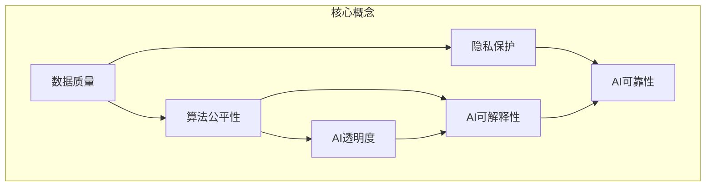

# AI Agent: AI的下一个风口 数据治理与社会伦理

## 1. 背景介绍

### 1.1 问题的由来

随着人工智能(AI)技术的快速发展,AI系统正在渗透到我们生活的方方面面。从语音助手到自动驾驶汽车,从医疗诊断到金融风险评估,AI正在改变着我们与世界互动的方式。然而,伴随着AI的广泛应用,也出现了一些重大的伦理和社会挑战。

其中最为突出的问题是数据治理和社会伦理。AI系统的训练和决策过程高度依赖于大量的数据,而这些数据可能存在偏差、不准确或隐私问题。同时,AI系统的决策也可能带来不公平、歧视或其他负面影响。因此,如何确保AI系统的数据质量和决策公正,成为了一个亟待解决的重大课题。

### 1.2 研究现状

近年来,数据治理和AI伦理已经成为学术界和产业界的研究热点。一些著名的科技公司和研究机构已经开始探索相关的解决方案,并制定了一些原则和准则。例如,谷歌提出了"AI伦理原则",微软发布了"AI责任准则",IEEE也制定了"AI伦理标准"。

然而,由于AI技术的复杂性和快速发展,现有的研究和实践还远远不够。数据治理和AI伦理涉及到技术、法律、伦理等多个领域,需要跨学科的协作和综合解决方案。

### 1.3 研究意义

确保AI系统的数据质量和决策公正,对于维护社会公平正义、保护个人隐私和促进AI的可持续发展至关重要。如果忽视这些问题,AI系统可能会加剧社会不平等,侵犯个人权利,甚至威胁到社会稳定。因此,研究AI数据治理和社会伦理具有重大的理论和现实意义。

从理论层面上,这一研究有助于我们深入理解AI技术的社会影响,探索AI系统的伦理和法律边界,并为制定相关的政策和法规提供依据。从实践层面上,这一研究可以帮助企业和组织建立健全的数据管理和AI治理机制,降低风险,提高AI系统的可信度和可接受度。

### 1.4 本文结构

本文将全面探讨AI数据治理和社会伦理的相关问题。首先,我们将介绍AI数据治理和社会伦理的核心概念和理论基础。然后,我们将详细阐述相关的算法原理和数学模型,并通过实际案例进行说明和分析。接下来,我们将介绍一些实际应用场景和最新的研究进展。最后,我们将总结未来的发展趋势和面临的挑战,并提出一些建议和展望。

## 2. 核心概念与联系

AI数据治理和社会伦理涉及到多个核心概念,包括数据质量、算法公平性、隐私保护、AI透明度、AI可解释性、AI可靠性等。这些概念相互关联,共同构成了AI系统的伦理和社会基础。



### 2.1 数据质量

数据质量是AI系统的基础,它包括数据的准确性、完整性、一致性、及时性和相关性等方面。高质量的数据可以确保AI系统的准确性和可靠性,而低质量的数据则可能导致AI系统的决策偏差和错误。因此,建立有效的数据质量管理机制是AI数据治理的首要任务。

### 2.2 算法公平性

算法公平性是指AI算法在处理不同群体的数据时,应该保持公平和无偏见。由于训练数据和算法设计可能存在隐含的偏差,AI系统可能会对某些群体产生不公平的结果。因此,需要采取措施消除算法偏差,确保AI系统的决策公正。

### 2.3 隐私保护

隐私保护是AI数据治理的另一个重要方面。AI系统通常需要处理大量的个人数据,如果不加以适当保护,就可能侵犯个人隐私权。因此,需要采取技术和法律措施,确保个人数据的安全性和隐私性。

### 2.4 AI透明度

AI透明度是指AI系统的决策过程和结果应该是可解释和可审计的。透明度可以增加AI系统的可信度,并有助于发现和纠正潜在的偏差和错误。然而,由于AI算法的复杂性,实现AI透明度仍然是一个挑战。

### 2.5 AI可解释性

AI可解释性是指AI系统能够以人类可理解的方式解释其决策过程和结果。可解释性有助于提高AI系统的透明度和可信度,同时也有利于发现和纠正潜在的偏差和错误。然而,实现AI可解释性也面临着技术和理论上的挑战。

### 2.6 AI可靠性

AI可靠性是指AI系统在各种情况下都能够保持稳定和一致的性能。可靠性是AI系统获得用户信任和广泛应用的前提。提高AI可靠性需要从数据质量、算法设计、系统测试等多个方面入手。

## 3. 核心算法原理 & 具体操作步骤

### 3.1 算法原理概述

为了实现AI数据治理和社会伦理,需要采用一系列算法和技术手段。这些算法主要包括以下几个方面:

1. **数据清洗和预处理算法**: 用于检测和处理训练数据中的噪声、缺失值、异常值等问题,提高数据质量。

2. **去偏算法**: 用于检测和消除训练数据和算法模型中的潜在偏差,提高算法公平性。

3. **隐私保护算法**: 用于保护个人隐私,包括差分隐私、同态加密、联邦学习等技术。

4. **可解释AI算法**: 用于提高AI系统的可解释性,包括基于规则的方法、基于示例的方法、基于注意力机制的方法等。

5. **AI测试和验证算法**: 用于评估和保证AI系统的可靠性和鲁棒性,包括模糊测试、对抗性测试等方法。

这些算法通常需要结合传统的机器学习和深度学习算法,以及一些新兴的AI技术,如元学习、强化学习等,共同构建AI数据治理和社会伦理的解决方案。

### 3.2 算法步骤详解

以下是一个典型的AI数据治理和社会伦理算法流程:

```mermaid
graph TB
  subgraph 数据预处理
    数据收集 --> 数据清洗
    数据清洗 --> 数据标注
    数据标注 --> 数据划分
  end
  
  subgraph 模型训练
    数据划分 --> 特征工程
    特征工程 --> 模型选择
    模型选择 --> 模型训练
    模型训练 --> 偏差检测
    偏差检测 --> 模型调整
    模型调整 --> 模型评估
  end
  
  subgraph 模型部署
    模型评估 --> 隐私保护
    隐私保护 --> 模型解释
    模型解释 --> 模型部署
    模型部署 --> 持续监控
  end
```

1. **数据预处理**:
   - 数据收集: 从各种来源收集相关数据,包括结构化数据和非结构化数据。
   - 数据清洗: 对收集的数据进行清洗,处理缺失值、异常值、噪声等问题。
   - 数据标注: 对数据进行人工标注或自动标注,为后续的模型训练做准备。
   - 数据划分: 将数据划分为训练集、验证集和测试集。

2. **模型训练**:
   - 特征工程: 从原始数据中提取有用的特征,用于模型训练。
   - 模型选择: 根据问题的特点选择合适的机器学习或深度学习模型。
   - 模型训练: 使用训练数据对选定的模型进行训练。
   - 偏差检测: 对训练好的模型进行偏差检测,发现潜在的算法偏差。
   - 模型调整: 根据偏差检测的结果,采用去偏算法对模型进行调整。
   - 模型评估: 使用验证集和测试集对调整后的模型进行评估,确保其性能和公平性。

3. **模型部署**:
   - 隐私保护: 对模型输入和输出进行隐私保护处理,保护个人隐私。
   - 模型解释: 使用可解释AI技术,提高模型的可解释性。
   - 模型部署: 将模型部署到实际应用环境中。
   - 持续监控: 持续监控模型的性能和公平性,并根据需要进行调整和更新。

### 3.3 算法优缺点

AI数据治理和社会伦理算法具有以下优点:

- 提高了AI系统的数据质量、算法公平性和隐私保护能力。
- 增强了AI系统的可解释性和可信度,有助于发现和纠正潜在的偏差和错误。
- 有利于AI系统在实际应用中获得更广泛的接受度和信任。

然而,这些算法也存在一些缺点和挑战:

- 算法复杂度较高,需要大量的计算资源和专业知识。
- 某些算法可能会导致模型性能下降或计算效率降低。
- 需要平衡不同目标之间的权衡,如隐私保护和模型准确性之间的权衡。
- 缺乏统一的标准和指南,不同组织和领域可能采用不同的方法。

### 3.4 算法应用领域

AI数据治理和社会伦理算法可以应用于各种领域,包括但不限于:

- 金融服务: 确保贷款决策、投资建议等的公平性和透明度。
- 医疗健康: 消除医疗诊断和治疗决策中的潜在偏差,保护患者隐私。
- 人力资源: 确保招聘和晋升决策的公平性,避免歧视。
- 社会服务: 提高政府决策的公平性和透明度,如福利分配、犯罪预测等。
- 教育领域: 确保教育资源的公平分配,避免对特定群体的偏见。
- 零售业: 提高个性化推荐和营销策略的公平性和透明度。

## 4. 数学模型和公式 & 详细讲解 & 举例说明

### 4.1 数学模型构建

为了量化和优化AI数据治理和社会伦理的目标,我们需要构建相应的数学模型。一种常见的方法是将不同的目标函数组合在一起,形成一个多目标优化问题。

假设我们有以下目标函数:

- $f_1(x)$: 模型准确性或性能指标
- $f_2(x)$: 算法公平性指标
- $f_3(x)$: 隐私保护指标
- $f_4(x)$: 可解释性指标

其中$x$表示模型的参数或决策变量。

我们可以将这些目标函数组合成一个加权求和的形式:

$$
F(x) = \alpha_1 f_1(x) + \alpha_2 f_2(x) + \alpha_3 f_3(x) + \alpha_4 f_4(x)
$$

其中$\alpha_1, \alpha_2, \alpha_3, \alpha_4$是对应目标函数的权重系数,反映了不同目标的相对重要性。

接下来,我们需要优化这个综合目标函数$F(x)$,以找到最优的模型参数或决策变量$x^*$:

$$
x^* = \arg\min_{x} F(x)
$$

这个优化问题可以使用各种传统的优化算法或机器学习算法来求解,如梯度下降法、遗传算法、模拟退火算法等。

### 4.2 公式推导过程

以算法公平性为例,我们可以使用统计学中的"四分位数差距"(Quantile Difference)来量化算法的偏差程度。

假设我们有一个二元分类问题,需要预测某个人是否符合某种条件(如是否合