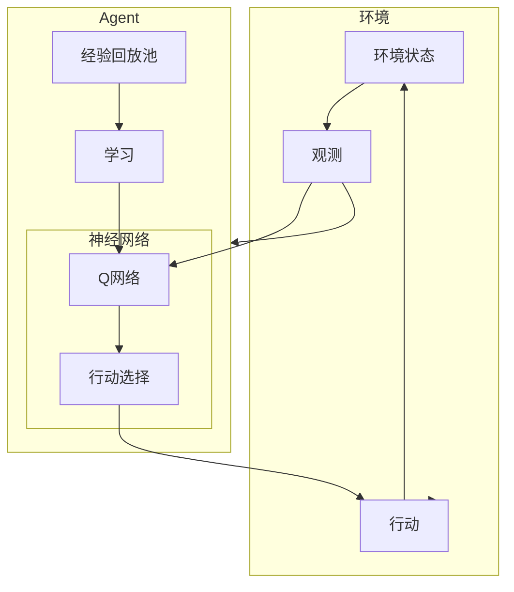

以下是根据您提供的要求和大纲撰写的技术博客文章正文内容:

# AI Agent: AI的下一个风口 自主决策的重要性

## 1. 背景介绍

### 1.1 问题的由来

在过去几十年中,人工智能(AI)技术取得了长足的进步,催生了诸如计算机视觉、自然语言处理、机器学习等多个热门领域。然而,大多数现有AI系统仍然是被动响应的,需要人类不断输入指令和数据才能运行。这种被动响应的范式在很多场景下已经无法满足需求,亟需AI系统能够主动作出决策和行动。

### 1.2 研究现状  

目前,一些领先的AI公司和研究机构已经开始探索赋予AI系统自主决策能力的方法。例如,谷歌的DeepMind团队提出了一种基于深度强化学习的AI Agent框架,能够在复杂环境中自主学习和决策。OpenAI等机构也在努力开发通用人工智能(AGI)系统,希望最终实现与人类相似的自主决策能力。

### 1.3 研究意义

赋予AI自主决策能力对于推动人工智能的发展至关重要。自主决策AI系统能够根据环境变化自主作出判断和行动,无需人工干预,将极大拓展AI的应用场景。在制造业、医疗、交通等领域,自主AI代理可以显著提高效率、降低成本并避免人为失误。此外,自主AI也是实现人工通用智能的关键一步。

### 1.4 本文结构

本文将首先介绍自主决策AI Agent的核心概念,包括马尔可夫决策过程、强化学习等,并分析它们之间的关系。接下来详细阐述自主AI Agent的核心算法原理和数学模型,并结合实例进行讲解。之后介绍自主AI Agent在实际项目中的应用,给出代码示例并解析。最后探讨自主AI Agent的未来发展趋势和面临的挑战。

## 2. 核心概念与联系

自主决策AI Agent的核心概念主要包括:

1. **马尔可夫决策过程(MDP)**: 用于描述决策序列的数学框架,是强化学习的基础。
2. **策略(Policy)**: 定义了AI Agent在每个状态下应当采取的行动。
3. **强化学习(Reinforcement Learning)**: 通过与环境的互动,AI Agent不断优化策略以maximizeize期望回报。
4. **时序差分学习(Temporal Difference Learning)**: 一种无模型的强化学习算法,可以有效估计价值函数。
5. **深度强化学习(Deep Reinforcement Learning)**: 结合深度学习和强化学习,使用神经网络来近似策略或价值函数。

这些概念相互关联并共同奠定了自主AI Agent的理论基础。MDP定义了问题,策略描述了解决方案,强化学习提供了学习策略的范式,时序差分学习和深度强化学习则是具体的学习算法。

## 3. 核心算法原理与具体操作步骤

### 3.1 算法原理概述

自主决策AI Agent的核心算法一般基于**深度Q学习(Deep Q-Learning)**,它结合了深度学习和Q-Learning的优点。Q-Learning是一种著名的时序差分强化学习算法,能够直接从环境反馈中学习最优策略,无需建模。将Q函数用深度神经网络来拟合,就形成了深度Q学习算法。

在深度Q学习中,AI Agent的"大脑"由一个深度神经网络Q网络组成。该网络输入当前状态,输出所有可能行动的Q值评分。Agent选择Q值最大的行动执行,并将结果存储在经验回放池中。然后从经验回放池中抽取批次数据,通过梯度下降的方式不断调整Q网络的参数,使其能够更准确地评估状态-行动对的Q值。

通过不断地与环境互动并学习,AI Agent的Q网络将逐步收敛,最终可以输出在各种状态下的最优行动,从而实现自主决策。



### 3.2 算法步骤详解

1. **初始化**:创建一个随机初始化的Q网络,用于近似Q函数。同时创建一个经验回放池,用于存储Agent与环境的互动数据。

2. **观测环境**:Agent观测当前环境状态。

3. **选择行动**:将当前状态输入Q网络,获得所有可能行动的Q值评分。Agent选择Q值最大的行动执行。

4. **存储经验**:将(状态,行动,奖励,下一状态)的四元组存入经验回放池。

5. **学习**:从经验回放池中随机抽取一个批次的经验数据,计算Q目标值和Q预测值之间的均方误差损失函数。通过反向传播算法,更新Q网络的参数,使得Q预测值逼近Q目标值。

6. **更新目标网络**:为了增加训练稳定性,可以使用目标网络的方法。即每隔一定步数,将Q网络的参数赋值给目标网络。

7. **重复步骤2-6**,直到Q网络收敛,输出的Q值接近真实的最优Q值。

以上算法可以在不建模的情况下,通过与环境持续互动来学习最优策略,实现自主决策。

### 3.3 算法优缺点

**优点**:

- 无需事先建模,可以直接从环境反馈中学习最优策略
- 融合深度学习,可以处理高维状态和连续动作空间
- 经验回放池增加了数据利用效率
- 目标网络提高了训练稳定性

**缺点**:

- 收敛速度较慢,需要大量的环境交互数据
- 存在局部最优和发散的风险
- 超参数选择对性能影响较大
- 在连续控制问题中,收敛性能不佳

### 3.4 算法应用领域

深度Q学习及其变种广泛应用于多个领域:

- **游戏AI**: Atari视频游戏、棋类游戏、三维游戏等
- **机器人控制**: 机械臂控制、行走机器人、无人机导航等
- **智能系统**: 智能交通系统、智能供应链管理、自动化决策等
- **金融投资**: 算法交易、投资组合优化等
- **计算机系统**: 任务调度、资源管理等

## 4. 数学模型和公式详细讲解举例说明  

### 4.1 数学模型构建

在强化学习中,我们通常使用**马尔可夫决策过程(MDP)** 来对决策序列问题进行数学建模。一个MDP可以用元组 $\langle\mathcal{S}, \mathcal{A}, \mathcal{P}, \mathcal{R}, \gamma\rangle$ 来表示:

- $\mathcal{S}$ 是有限的状态空间集合
- $\mathcal{A}$ 是有限的行动空间集合  
- $\mathcal{P}$ 是状态转移概率函数,定义了 $\mathcal{P}(s'|s,a) = \Pr(S_{t+1}=s'|S_t=s, A_t=a)$
- $\mathcal{R}$ 是奖励函数,定义了在状态 $s$ 执行行动 $a$ 后获得的奖励 $\mathcal{R}(s, a)$
- $\gamma \in [0, 1]$ 是折现因子,用于权衡当前和未来奖励的权重

目标是找到一个最优策略 $\pi^*$,使得期望的累积折现奖励最大:

$$\pi^* = \arg\max_\pi \mathbb{E}\left[\sum_{t=0}^\infty \gamma^t R_{t+1} | \pi\right]$$

其中 $R_{t+1}$ 是在时间 $t+1$ 获得的奖励。

### 4.2 公式推导过程  

为了解决MDP问题,我们需要估计出每个状态-行动对的**Q值(Action-Value)**,即执行该行动后能获得的期望累积奖励。Q值可以使用下面的**Bellman方程**进行递归定义:

$$Q(s_t, a_t) = \mathbb{E}_{s_{t+1}}\left[R(s_t, a_t) + \gamma \max_{a} Q(s_{t+1}, a) | s_t, a_t\right]$$

该方程的右边包含两部分:
1. 即时奖励 $R(s_t, a_t)$  
2. 下一状态的最大Q值的折现和,表示未来的期望奖励

我们可以使用**Q-Learning算法**来迭代估计最优Q函数:

$$Q(s_t, a_t) \leftarrow Q(s_t, a_t) + \alpha \left( R(s_t, a_t) + \gamma \max_{a'} Q(s_{t+1}, a') - Q(s_t, a_t) \right)$$

其中 $\alpha$ 是学习率超参数。

通过不断更新Q值表,最终可以收敛到最优Q函数 $Q^*$。对于任意状态 $s$,选择 $\arg\max_a Q^*(s, a)$ 即可获得最优行动。

### 4.3 案例分析与讲解

以经典的"网格世界(Gridworld)"为例,来具体说明Q-Learning是如何工作的:

```python
import numpy as np

# 初始化Q值表,所有状态-行动对的Q值初始化为0
Q = np.zeros((6, 6, 4))  

# 设置学习率和折现因子
alpha = 0.1  
gamma = 0.9

# 定义可能的行动
actions = [(-1, 0), (1, 0), (0, -1), (0, 1)]  # 上下左右

# 训练循环
for episode in range(1000):
    # 重置初始状态
    state = (0, 0)
    
    while state != (5, 5):  # 直到到达终止状态
        # 选择Q值最大的行动
        action_idx = np.argmax(Q[state])
        action = actions[action_idx]
        
        # 执行行动,获得下一状态和奖励
        next_state = (state[0] + action[0], state[1] + action[1])
        reward = -1  # 默认每一步奖励为-1
        if next_state == (5, 5):
            reward = 100  # 到达终止状态获得大奖励
        
        # 更新Q值表
        Q[state][action_idx] += alpha * (reward + gamma * np.max(Q[next_state]) - Q[state][action_idx])
        
        # 转移到下一状态
        state = next_state
        
# 最终的Q值表        
print(Q)
```

上述代码模拟了一个6x6的网格世界,Agent需要从(0,0)出发,找到最短路径到达(5,5)。通过不断与环境交互并更新Q值表,Agent最终学会了找到最优路径。

### 4.4 常见问题解答

**Q: Q-Learning能否解决连续状态和行动空间的问题?**

A: 传统的Q-Learning使用Q值表来存储状态-行动对的Q值,因此无法直接应用于连续的状态和行动空间。但是,我们可以将Q函数用深度神经网络来拟合,这就形成了深度Q网络(DQN),能够处理高维状态和连续动作空间。

**Q: 为什么需要经验回放池和目标网络?**

A: 经验回放池通过存储Agent与环境的交互数据,可以有效提高数据的利用效率,避免数据相关性。目标网络则是为了增加训练稳定性,防止Q网络的参数在训练过程中发散。

**Q: 深度Q学习如何处理连续控制问题?**

A: 对于连续控制问题,例如机器人关节控制,深度Q网络的性能并不理想。这时可以使用**深度确定性策略梯度(DDPG)**等基于Actor-Critic的算法,将策略显式参数化为一个确定性的神经网络,并通过策略梯度的方式进行优化。

## 5. 项目实践: 代码实例和详细解释说明

### 5.1 开发环境搭建

我们将使用Python和PyTorch深度学习框架来实现一个深度Q网络(DQN)Agent,并在OpenAI Gym的CartPole-v1环境中进行训练和测试。首先安装必要的Python库:

```bash
pip install gym pytorch
```