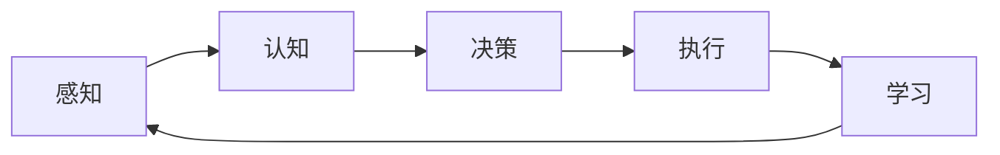

# AI Agent: AI的下一个风口 解决方案与研究方向

关键词：AI Agent、智能代理、人工智能、多模态交互、自主学习、知识图谱、强化学习、自然语言处理

## 1. 背景介绍
### 1.1  问题的由来
随着人工智能技术的飞速发展,智能系统已经渗透到我们生活的方方面面。从智能音箱、智能客服到自动驾驶汽车,AI正在改变着人类的生活和工作方式。然而,目前的AI系统大多是针对特定任务设计的,缺乏通用性和自主学习能力。如何构建具有广泛认知和交互能力的AI Agent,成为了业界关注的焦点。

### 1.2  研究现状 
近年来,学术界和工业界都在积极探索AI Agent的理论和实践。微软的小冰、苹果的Siri、谷歌的Google Assistant等智能助手已经初步展现了AI Agent的应用前景。一些研究机构如OpenAI、DeepMind也在AI Agent领域取得了突破性进展,例如GPT-3语言模型、AlphaGo等。但总的来说,当前的AI Agent还处于起步阶段,离通用人工智能还有很长的路要走。

### 1.3  研究意义
AI Agent代表了人工智能技术的未来方向。构建高度智能化的AI Agent,不仅可以极大提升人机交互的体验,还能扩展人工智能的应用边界,为人类社会发展带来深远影响。同时,AI Agent研究涉及认知科学、自然语言处理、知识表示等多个前沿交叉领域,对推动人工智能基础理论的发展具有重要意义。

### 1.4  本文结构
本文将围绕AI Agent的关键技术、解决方案和研究方向展开论述。第2部分介绍AI Agent的核心概念;第3部分重点阐述AI Agent的关键算法;第4部分建立AI Agent的数学模型;第5部分给出代码实例;第6部分分析AI Agent的应用场景;第7部分推荐相关工具和资源;第8部分总结全文并展望未来。

## 2. 核心概念与联系
AI Agent是一种智能化的软件代理,能够感知环境、理解用户意图、执行任务,并不断从经验中学习优化。它包含了感知、认知、决策、执行等多个模块,涉及自然语言处理、知识表示、推理决策等多项AI技术。

AI Agent的核心概念可以用下面这张Mermaid图来表示:



从图中可以看出,AI Agent的工作流程是一个闭环:通过感知模块获取外界信息,经过认知模块的语义理解和知识推理,在决策模块中生成行动策略,再由执行模块来完成任务,最后通过学习模块优化整个系统。各个模块相互协作,形成了一个完整的认知智能系统。

## 3. 核心算法原理 & 具体操作步骤
### 3.1  算法原理概述
AI Agent涉及多个人工智能的核心算法,主要包括:

1. 自然语言处理算法:用于实现语音识别、语义理解、对话管理等功能,如Transformer、BERT等。

2. 知识图谱算法:用于构建领域知识库,支持语义推理和问答,如TransE、TransR等。  

3. 强化学习算法:用于实现策略优化和自主决策,如DQN、DDPG等。

4. 迁移学习算法:用于解决跨领域、小样本学习问题,提升模型泛化能力,如MAML、Reptile等。

5. 持续学习算法:用于实现增量学习和知识演化,如ELLA、GEM等。

这些算法相互配合,构成了AI Agent的核心引擎,赋予了它感知、理解、决策、学习的综合智能能力。

### 3.2  算法步骤详解
以下以自然语言处理和强化学习为例,详细说明AI Agent的算法步骤。

自然语言处理部分的主要步骤如下:

1. 语音识别:将用户的语音输入转换为文本。
2. 文本预处理:对文本进行分词、词性标注、命名实体识别等。
3. 语义解析:提取文本的语义结构,生成语义表示。
4. 领域分类:判断文本所属的领域类别,如闲聊、任务型对话等。
5. 意图识别:识别用户的意图,如查询、控制等。
6. 槽位填充:提取关键信息,填充到意图的槽位中。
7. 对话管理:根据意图和槽位生成回复策略,控制对话流程。
8. 自然语言生成:将系统回复转换为自然语言文本。

强化学习部分的主要步骤如下:

1. 状态表示:将环境信息编码为状态向量。
2. 动作选择:根据当前状态,选择一个动作。
3. 环境交互:执行动作,获得下一个状态和奖励。
4. 价值评估:评估当前状态的价值函数。
5. 策略优化:基于奖励和价值函数,调整策略网络的参数。
6. 经验回放:将交互数据存入经验池,供离线训练。

通过反复执行上述步骤,AI Agent可以在与环境的交互中不断优化策略,提升决策能力。

### 3.3  算法优缺点
自然语言处理算法的优点是可以实现人机自然交互,增强系统的易用性和人性化。缺点是对领域知识依赖较强,泛化能力有限。

强化学习算法的优点是可以通过自主探索优化策略,具有一定的自适应能力。缺点是样本效率不高,难以处理高维状态和连续动作空间。

总的来说,这些算法在AI Agent中各有所长,需要针对具体任务进行选择和优化。未来还需要在算法的鲁棒性、可解释性、样本效率等方面取得进一步突破。

### 3.4  算法应用领域
自然语言处理和强化学习在AI Agent中有广泛的应用,主要包括:

1. 智能客服:通过对话系统实现自动答疑和问题解决。
2. 智能助手:执行日程管理、信息查询等个人助理任务。
3. 推荐系统:根据用户画像和历史行为,提供个性化推荐。
4. 自动驾驶:通过强化学习优化驾驶策略,实现车辆的自动决策和控制。
5. 智能制造:利用强化学习优化生产调度、设备控制等工业流程。

未来,AI Agent有望在更多领域得到应用,如医疗健康、教育培训、金融投资等,为各行各业赋能。

## 4. 数学模型和公式 & 详细讲解 & 举例说明
### 4.1  数学模型构建
AI Agent可以用马尔可夫决策过程(MDP)来建模,形式化定义为一个六元组:

$$M=<S,A,P,R,\gamma,\mu_0>$$

其中,$S$表示状态空间,$A$表示动作空间,$P$表示状态转移概率,$R$表示奖励函数,$\gamma$表示折扣因子,$\mu_0$表示初始状态分布。

在此基础上,AI Agent的目标可以定义为最大化期望累积奖励:

$$\max_{\pi} \mathbb{E}_{\tau \sim \pi}[\sum_{t=0}^{\infty} \gamma^t r_t]$$

其中,$\pi$表示策略函数,$\tau$表示状态-动作轨迹,$r_t$表示第$t$步的奖励。

### 4.2  公式推导过程
为了求解上述优化问题,可以引入价值函数和动作价值函数:

$$V^{\pi}(s)=\mathbb{E}_{\tau \sim \pi}[\sum_{t=0}^{\infty} \gamma^t r_t|s_0=s]$$

$$Q^{\pi}(s,a)=\mathbb{E}_{\tau \sim \pi}[\sum_{t=0}^{\infty} \gamma^t r_t|s_0=s,a_0=a]$$

其中,$V^{\pi}(s)$表示状态$s$在策略$\pi$下的期望累积奖励,$Q^{\pi}(s,a)$表示在状态$s$下采取动作$a$,然后遵循策略$\pi$的期望累积奖励。

根据贝尔曼方程,价值函数和动作价值函数满足以下递推关系:

$$V^{\pi}(s)=\sum_{a \in A} \pi(a|s) Q^{\pi}(s,a)$$

$$Q^{\pi}(s,a)=R(s,a)+\gamma \sum_{s' \in S} P(s'|s,a) V^{\pi}(s')$$

基于此,可以通过价值迭代或策略迭代等动态规划算法求解最优策略。

在深度强化学习中,价值函数和策略函数通常用深度神经网络来拟合,损失函数定义为:

$$L(\theta)=\mathbb{E}_{(s,a,r,s') \sim D}[(y-Q(s,a;\theta))^2]$$

其中,$\theta$为网络参数,$y=r+\gamma \max_{a'} Q(s',a';\theta)$为TD目标,$D$为经验回放池。

通过随机梯度下降等优化算法最小化损失函数,可以得到最优的价值网络和策略网络。

### 4.3  案例分析与讲解
下面以国际象棋AI为例,说明如何应用强化学习算法。

首先,将棋局状态表示为特征向量,包括棋子位置、类型、数量等信息。动作空间为所有可能的走子方式。奖励函数可以设置为赢棋为1,输棋为-1,平局为0。

然后,构建价值网络和策略网络,分别用于评估棋局价值和生成走子概率。价值网络的输入为棋局状态,输出为一个标量值。策略网络的输入为棋局状态,输出为各个合法动作的概率分布。

在训练阶段,AI Agent与自己或其他对手进行对弈,通过自我博弈生成经验数据。每次走子前,根据策略网络输出的概率分布采样一个动作,执行后得到下一个状态和奖励,构成一条经验样本。将经验样本存入回放池,并从中随机采样一个批次,计算TD误差,更新价值网络和策略网络的参数。

在测试阶段,AI Agent根据当前棋局状态,用价值网络评估每个合法动作的价值,选择价值最高的动作执行。经过多轮迭代,AI Agent可以学到接近最优的下棋策略。

实际应用中,还需要考虑探索与利用的平衡、博弈树搜索的引入等问题,以进一步提升算法的性能。

### 4.4  常见问题解答
Q: 强化学习和监督学习有什么区别?

A: 监督学习需要标注数据,目标是学习输入到输出的映射。强化学习通过与环境交互收集数据,目标是学习最优策略以获得最大累积奖励。强化学习更侧重主动探索和序贯决策。

Q: 强化学习容易出现的问题有哪些?

A: 主要包括:1)难以设计合适的奖励函数;2)状态空间和动作空间过大,导致训练难度大;3)样本利用率低,难以学到有效策略;4)策略易陷入次优解,泛化能力差等。需要针对具体问题采取相应的优化方法。

Q: 强化学习的发展前景如何?

A: 强化学习是实现通用人工智能的重要途径,有望在自动驾驶、机器人控制、智能助手等领域取得突破。未来需要在多智能体学习、层次化学习、迁移学习等方面取得进展,提升算法的适用性和鲁棒性。

## 5. 项目实践：代码实例和详细解释说明
### 5.1  开发环境搭建
AI Agent的开发需要配置相应的软硬件环境。以PyTorch为例,主要包括:

- Python 3.x
- PyTorch 1.x
- CUDA工具包(如需GPU加速)
- 常用的数据处理、可视化库,如NumPy、Matplotlib等

可以使用Anaconda等工具创建虚拟环境,方便管理依赖包。

### 5.2  源代码详细实现
下面给出一个基于DQN算法的AI Agent代码示例:

```python
import torch
import torch.nn as nn
import torch.optim as optim