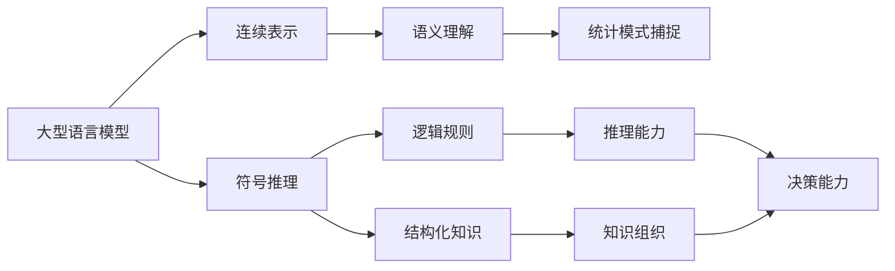
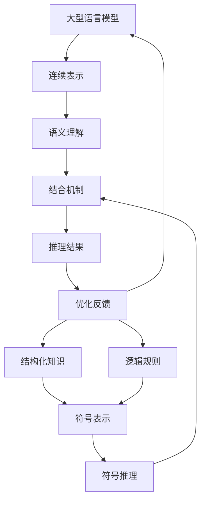

# AI 大模型原理与应用：模型的组织能力

## 1. 背景介绍

### 1.1 问题的由来

在当前的人工智能领域中,大型语言模型(Large Language Models,LLMs)正在引领着一场革命性的变革。这些模型通过在海量数据上进行预训练,展现出令人惊叹的语言理解和生成能力,在自然语言处理(NLP)任务中取得了前所未有的成绩。然而,随着模型规模的不断扩大,人们开始关注它们在推理、规划和决策方面的能力。

传统的语言模型虽然擅长捕捉语言的统计规律,但在处理复杂的推理和决策问题时往往表现不佳。这主要是因为它们缺乏对世界的结构化理解,无法将知识有效地组织和整合。因此,赋予大型语言模型组织知识和推理能力,成为了当前研究的一个重点方向。

### 1.2 研究现状

近年来,研究人员提出了多种方法来增强语言模型的推理和决策能力,其中一个有前景的方向是将符号推理与连续表示相结合。符号推理系统擅长处理结构化知识和逻辑规则,而连续表示则能够捕捉语义和统计模式。将两者相结合,有望产生具有强大推理能力的人工智能系统。

目前,已经出现了一些尝试,例如将知识图谱与语言模型相结合,或者将规则引擎与语言模型相结合。然而,这些方法往往存在一些局限性,例如知识库的构建和维护成本高、规则引擎的可扩展性差等。因此,如何更好地将符号推理与连续表示相结合,仍然是一个具有挑战性的问题。

### 1.3 研究意义

赋予大型语言模型组织知识和推理能力,对于推动人工智能的发展具有重要意义。首先,它有助于构建更加通用和智能的人工智能系统,使其能够更好地理解和推理复杂的问题。其次,它有助于提高人工智能系统的可解释性和可信度,因为符号推理过程更加透明和可解释。此外,它还有助于人工智能系统在各种领域的应用,例如决策支持、自动化规划、智能辅助等。

### 1.4 本文结构

本文将围绕如何赋予大型语言模型组织知识和推理能力这一主题,进行深入探讨。首先,我们将介绍相关的核心概念和理论基础。然后,我们将详细阐述一种新颖的算法原理及其具体实现步骤。接下来,我们将构建相应的数学模型,并推导出关键公式。在此基础上,我们将提供一个实际项目的代码实现,并对其进行详细解释。此外,我们还将探讨该方法在实际应用中的场景,并推荐相关的工具和资源。最后,我们将总结研究成果,展望未来的发展趋势和挑战。

## 2. 核心概念与联系

在探讨如何赋予大型语言模型组织知识和推理能力之前,我们需要先了解一些核心概念和理论基础。

1. **大型语言模型(LLMs)**: 通过在海量数据上进行预训练,获得强大的语言理解和生成能力。
2. **连续表示**: 将文本映射到连续的向量空间,捕捉语义和统计模式。
3. **符号推理**: 基于逻辑规则和结构化知识进行推理,具有强大的推理能力。
4. **语义理解**: 理解语言的含义和上下文,是自然语言处理的核心。
5. **逻辑规则**: 形式化的规则,用于推导和验证推理过程。
6. **结构化知识**: 以图谱、本体论等形式组织的知识,便于推理和查询。
7. **统计模式捕捉**: 从大量数据中学习统计规律,是机器学习的基础。
8. **推理能力**: 根据已有知识和规则,得出新的结论或决策。
9. **决策能力**: 基于推理结果,做出合理的决策和规划。
10. **知识组织**: 将知识以结构化的方式表示和组织,便于推理和查询。

这些概念之间存在着紧密的联系。大型语言模型通过连续表示捕捉语义和统计模式,而符号推理则依赖于逻辑规则和结构化知识。将连续表示和符号推理相结合,有望产生具有强大推理和决策能力的人工智能系统。

## 3. 核心算法原理 & 具体操作步骤

### 3.1 算法原理概述

为了赋予大型语言模型组织知识和推理能力,我们提出了一种新颖的算法,将连续表示与符号推理相结合。该算法的核心思想是:

1. 利用大型语言模型的连续表示捕捉语义和统计模式。
2. 将结构化知识和逻辑规则表示为符号形式。
3. 设计一种机制,将连续表示与符号推理相结合。
4. 在推理过程中,连续表示提供语义理解,而符号推理提供逻辑推导。
5. 通过迭代优化,不断改进模型的推理能力。

该算法的优点在于,它结合了连续表示和符号推理的优势,既能捕捉语义和统计模式,又能进行逻辑推理和知识组织。同时,它也具有一定的可解释性和可扩展性。

### 3.2 算法步骤详解

该算法的具体步骤如下:

1. **预训练大型语言模型**:在海量数据上预训练一个大型语言模型,获得强大的语言理解和生成能力。

2. **构建结构化知识库**:将相关领域的知识以结构化的形式表示,例如知识图谱、本体论等。

3. **定义逻辑规则**:根据领域知识,定义一系列逻辑规则,用于推理和验证。

4. **设计结合机制**:设计一种机制,将大型语言模型的连续表示与结构化知识和逻辑规则相结合。这可以通过注意力机制、记忆增强机制或其他方法实现。

5. **推理与决策**:利用结合机制,在给定的问题或任务上进行推理和决策。连续表示提供语义理解,而符号推理则提供逻辑推导。

6. **优化反馈**:根据推理结果的准确性和效率,对大型语言模型、结构化知识库和逻辑规则进行优化和调整。

7. **迭代训练**:重复上述步骤,不断优化模型的推理能力。

通过这种方式,我们可以赋予大型语言模型组织知识和推理能力,使其能够更好地理解和解决复杂的问题。

### 3.3 算法优缺点

该算法的优点包括:

1. **强大的语义理解能力**:由于利用了大型语言模型的连续表示,能够捕捉语义和统计模式,提供强大的语义理解能力。

2. **逻辑推理和知识组织**:通过结合符号推理,能够进行逻辑推理和知识组织,提高推理能力和可解释性。

3. **可扩展性**:由于将知识和规则与模型分离,因此具有一定的可扩展性,可以方便地添加或修改知识库和规则。

4. **可解释性**:符号推理过程更加透明和可解释,有助于提高模型的可信度。

然而,该算法也存在一些缺点和挑战:

1. **知识库构建成本高**:构建高质量的结构化知识库和逻辑规则需要大量的人工努力,成本较高。

2. **符号推理效率低下**:符号推理过程往往效率较低,可能影响模型的实时响应能力。

3. **结合机制复杂度高**:设计一种有效的机制,将连续表示与符号推理相结合,具有一定的挑战和复杂度。

4. **优化难度较大**:同时优化大型语言模型、知识库和逻辑规则,存在一定的困难和挑战。

### 3.4 算法应用领域

该算法可以应用于多个领域,包括但不限于:

1. **问答系统**:利用推理能力,能够更好地理解和回答复杂的问题。

2. **决策支持系统**:根据推理结果,为决策者提供建议和支持。

3. **自动化规划**:通过推理和决策,实现自动化的任务规划和执行。

4. **智能辅助**:在各种领域提供智能化的辅助和建议,如医疗诊断、法律咨询等。

5. **知识图谱构建**:利用推理能力,自动扩充和完善知识图谱。

6. **自然语言理解**:提高对复杂语言的理解能力,如隐喻、双关语等。

总的来说,该算法为赋予人工智能系统推理和决策能力提供了一种有前景的方法,有望在多个领域发挥重要作用。

## 4. 数学模型和公式 & 详细讲解 & 举例说明

### 4.1 数学模型构建

为了更好地理解和优化该算法,我们需要构建相应的数学模型。我们将大型语言模型的连续表示、结构化知识和逻辑规则统一表示为向量和张量,并定义相应的运算和损失函数。

设输入序列为 $X = (x_1, x_2, \dots, x_n)$,其中 $x_i$ 表示单词的embedding向量。大型语言模型的连续表示可以表示为:

$$h_t = \text{LLM}(x_1, x_2, \dots, x_t)$$

其中 $h_t$ 是时间步 $t$ 的隐状态向量,编码了输入序列的语义信息。

结构化知识可以表示为一个知识图谱 $\mathcal{G} = (\mathcal{E}, \mathcal{R})$,其中 $\mathcal{E}$ 是实体集合,而 $\mathcal{R}$ 是关系集合。每个实体 $e \in \mathcal{E}$ 和关系 $r \in \mathcal{R}$ 都有对应的embedding向量 $\vec{e}$ 和 $\vec{r}$。

逻辑规则可以表示为一个集合 $\mathcal{L} = \{l_1, l_2, \dots, l_m\}$,其中每个规则 $l_i$ 都是一个谓词逻辑公式。

我们需要设计一种机制,将连续表示 $h_t$ 与结构化知识 $\mathcal{G}$ 和逻辑规则 $\mathcal{L}$ 相结合,得到推理结果 $y_t$。这可以表示为:

$$y_t = f(h_t, \mathcal{G}, \mathcal{L})$$

其中 $f$ 是一个将连续表示与符号推理相结合的函数,可以通过注意力机制、记忆增强机制或其他方法实现。

为了优化模型,我们需要定义一个损失函数 $\mathcal{L}(y_t, y_t^*)$,衡量预测结果 $y_t$ 与真实标签 $y_t^*$ 之间的差异。通过最小化损失函数,我们可以不断优化模型的参数,提高推理能力。

### 4.2 公式推导过程

接下来,我们将推导出一些关键公式,以便更好地理解和优化该算法。

首先,我们定义一个注意力机制,用于将连续表示 $h_t$ 与结构化知识 $\mathcal{G}$ 相结合。对于每个实体 $e \in \mathcal{E