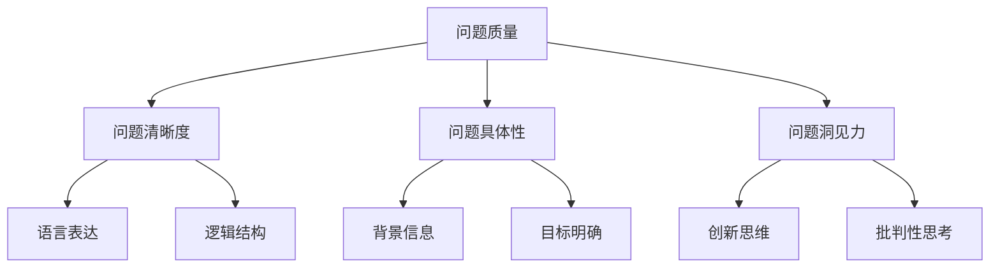

# AIGC从入门到实战：进阶：如何提问以获得高质量答案，解决复杂问题

## 1. 背景介绍

### 1.1 问题的由来

在当今科技飞速发展的时代，人工智能生成内容(AIGC)技术正在席卷各个领域,为人们的工作和生活带来了前所未有的便利。然而,要充分发挥AIGC的潜力并获得高质量的输出,提出高质量的问题是关键所在。无论是在学习、工作还是日常生活中,我们都会遇到各种各样的问题需要解决。有些问题看似简单,但要想获得满意的解决方案并非易事。

### 1.2 研究现状

目前,已有一些研究探讨了如何更好地利用AIGC系统解决问题。其中,一些研究侧重于改进AIGC模型本身的性能,例如通过更大的训练数据集、更复杂的神经网络架构等方式来提高模型的生成质量。另一些研究则关注于如何更好地与AIGC系统交互,包括如何准确表达需求、如何提出高质量的问题等。

然而,现有研究大多局限于特定领域或场景,缺乏一个系统性的框架来指导用户如何在不同情况下提出高质量的问题,从而获得满意的解决方案。

### 1.3 研究意义

学会提出高质量的问题对于充分发挥AIGC系统的潜力至关重要。通过提出清晰、具体和富有洞见的问题,我们可以更好地利用AIGC系统的强大功能,获得更加准确、相关和有价值的答案。这不仅可以帮助我们解决日常生活中的各种问题,也可以在工作和学习中提高效率,甚至推动科技创新。

因此,研究如何提出高质量的问题以获得高质量的答案,对于充分发挥AIGC技术的潜力、提高工作效率、推动创新发展具有重要意义。

### 1.4 本文结构

本文将从以下几个方面探讨如何提出高质量的问题,以获得高质量的答案并解决复杂问题:

1. 介绍提问的核心概念和原则
2. 阐述提问的核心算法原理和具体操作步骤
3. 构建数学模型,推导公式,并通过案例分析进行详细讲解
4. 提供项目实践中的代码实例,并进行详细解释说明
5. 探讨提问技巧在实际应用场景中的运用
6. 推荐相关工具和学习资源
7. 总结提问技巧的未来发展趋势和面临的挑战
8. 附录部分回答常见问题

## 2. 核心概念与联系

在探讨如何提出高质量的问题之前,我们需要先了解一些核心概念及其相互关系。

如上图所示,**问题质量**是评估一个问题是否高质量的核心标准,它主要取决于以下三个方面:

1. **问题清晰度**:指问题的表述是否清晰、简洁、易于理解。它与语言表达和逻辑结构密切相关。
2. **问题具体性**:指问题是否提供了足够的背景信息,并明确了解决问题的目标和期望。
3. **问题洞见力**:指问题是否体现了创新思维和批判性思考,能够引发深入探讨和发现新的见解。

只有当一个问题在这三个方面都达到了较高的水平,才能被认为是高质量的问题,从而更有望获得高质量的答案。接下来,我们将详细探讨如何提高问题在这三个方面的质量。

## 3. 核心算法原理 & 具体操作步骤

### 3.1 算法原理概述

为了提出高质量的问题,我们需要遵循一定的原理和步骤。这里介绍一种通用的"5W2H"算法,它可以帮助我们系统地分析问题,提高问题的质量。

"5W2H"算法的核心思想是通过回答以下七个问题,来全面地了解和定义问题的本质:

- What(什么)? 问题的核心是什么?
- Why(为什么)? 为什么会出现这个问题?
- Where(在哪里)? 问题出现的具体场景或背景是什么?
- When(什么时候)? 问题出现的时间或阶段是什么?
- Who(谁)? 谁会受到这个问题的影响?
- How(如何)? 如何解决或缓解这个问题?
- How much(多少)? 解决问题需要投入多少资源或付出多大代价?

通过回答这七个问题,我们可以全面地了解问题的来龙去脉、影响范围、解决方案等,从而提出更加清晰、具体和富有洞见的问题。

### 3.2 算法步骤详解

具体来说,提出高质量问题的步骤如下:

1. **明确问题背景**
    - 回答What、Why、Where和When,了解问题的核心、原因、场景和时间背景。
    - 收集相关信息,确保提供足够的背景知识。

2. **分析问题影响**
    - 回答Who,分析问题会影响到哪些人或团体。
    - 考虑问题的潜在影响范围和严重程度。

3. **探索解决方案**
    - 回答How,思考可能的解决方案或缓解措施。
    - 运用创新思维和批判性思考,提出新颖的解决思路。

4. **评估成本和代价**
    - 回答How much,估算解决问题所需的资源和代价。
    - 权衡解决方案的收益和代价,选择最优方案。

5. **提出高质量问题**
    - 根据前面的分析,提出清晰、具体且富有洞见的问题。
    - 确保问题包含必要的背景信息、明确的目标和创新的思路。

6. **优化和完善**
    - 反复审视问题,检查是否存在歧义、遗漏或逻辑错误。
    - 根据反馈,不断优化和完善问题的表述。

通过遵循这些步骤,我们可以有效地提高问题的质量,从而更有望获得高质量的答案,解决复杂的问题。

### 3.3 算法优缺点

"5W2H"算法的优点包括:

- 系统性强,能够全面分析问题的各个方面。
- 思路清晰,易于操作和实施。
- 适用范围广,可应用于各种类型的问题。
- 有助于培养创新思维和批判性思考能力。

但该算法也存在一些局限性:

- 对于一些特殊或高度专业化的问题,可能需要更加专门的分析方法。
- 分析过程可能会比较耗时,对于一些需要快速反应的情况可能不太适用。
- 算法本身无法保证提出的问题一定是高质量的,还需要依赖于个人的分析能力和表达技巧。

### 3.4 算法应用领域

"5W2H"算法可以广泛应用于各种领域,包括但不限于:

- **教育领域**:教师可以引导学生使用该算法提出高质量的问题,培养学生的批判性思维和探究能力。
- **科研领域**:研究人员可以使用该算法明确研究问题,并探索创新的解决方案。
- **商业领域**:企业可以应用该算法分析市场需求、产品问题等,提出有针对性的解决方案。
- **日常生活**:个人可以使用该算法分析和解决日常生活中遇到的各种问题。

总的来说,无论在何种领域,只要存在需要解决的问题,都可以考虑使用"5W2H"算法来提高问题的质量,从而获得更好的解决方案。

## 4. 数学模型和公式 & 详细讲解 & 举例说明

除了"5W2H"算法之外,我们还可以构建数学模型来量化评估问题的质量,并推导相关公式,为提出高质量问题提供理论支持。

### 4.1 数学模型构建

我们将问题质量$Q$建模为三个核心因素的函数:

$$Q = f(C, S, I)$$

其中:

- $C$表示问题的清晰度(Clarity)
- $S$表示问题的具体性(Specificity)
- $I$表示问题的洞见力(Insight)

我们可以进一步将这三个因素分解为多个子因素:

$$C = g(L, R)$$
$$S = h(B, G)$$ 
$$I = k(N, T)$$

- $L$表示语言表达(Language)的质量
- $R$表示逻辑结构(Reasoning)的合理性
- $B$表示提供的背景信息(Background)的充分性
- $G$表示目标(Goal)的明确性
- $N$表示创新思维(Novelty)的程度
- $T$表示批判性思考(Critical Thinking)的深度

将这些子因素代入原函数,我们可以得到:

$$Q = f(g(L, R), h(B, G), k(N, T))$$

### 4.2 公式推导过程

为了量化评估问题质量,我们需要为每个子因素赋予一个分数,并确定它们之间的权重。假设每个子因素的分数范围为0到1,且它们对问题质量的影响程度不同,我们可以引入权重系数$\alpha, \beta, \gamma$,将公式进一步表示为:

$$Q = \alpha g(L, R) + \beta h(B, G) + \gamma k(N, T)$$
$$\text{subject to: } \alpha + \beta + \gamma = 1, 0 \leq \alpha, \beta, \gamma \leq 1$$

其中,权重系数$\alpha, \beta, \gamma$的取值取决于具体情况和偏好。例如,如果我们更看重问题的洞见力,可以给$\gamma$一个较大的值;如果我们更看重问题的具体性,可以给$\beta$一个较大的值。

进一步地,我们可以为每个子因素设计具体的评分标准和计算方法。例如,对于语言表达$L$,我们可以考虑词汇的准确性、句子的流畅性等指标;对于创新思维$N$,我们可以考虑问题的新颖性、独特性等指标。

通过对各个子因素打分,并根据权重系数进行加权求和,我们就可以得到问题质量$Q$的最终分数,从而对问题的质量进行量化评估。

### 4.3 案例分析与讲解

为了更好地理解上述数学模型和公式,让我们通过一个具体案例进行分析和讲解。

**案例背景**:某公司面临产品销量下滑的问题,需要提出相关问题以寻求解决方案。

**问题1**:"我们的产品销量为什么会下滑?"

对于这个问题,我们可以这样评分:

- 语言表达$L$分数较高,表述清晰、简洁。
- 逻辑结构$R$分数一般,缺乏对问题原因的深入探讨。
- 背景信息$B$分数较低,未提供足够的背景信息。
- 目标$G$分数较高,目标明确,即寻找销量下滑的原因。
- 创新思维$N$分数较低,问题提法较为传统。
- 批判性思考$T$分数一般,缺乏对现有策略的批判性分析。

根据上述评分,我们可以计算出这个问题的质量分数$Q_1$。

**问题2**:"在当前市场环境和竞争格局下,我们的产品在营销策略、定价模式和用户体验方面存在哪些不足,导致了销量下滑?如何通过创新的方式提升产品的竞争力?"

对于这个问题,我们可以这样评分:

- 语言表达$L$分数较高,表述流畅、条理清晰。
- 逻辑结构$R$分数较高,问题结构合理,包含背景、原因和解决方案三个部分。
- 背景信息$B$分数较高,提供了市场环境和竞争格局等背景信息。
- 目标$G$分数较高,明确了寻找销量下滑原因和提升竞争力的目标。
- 创