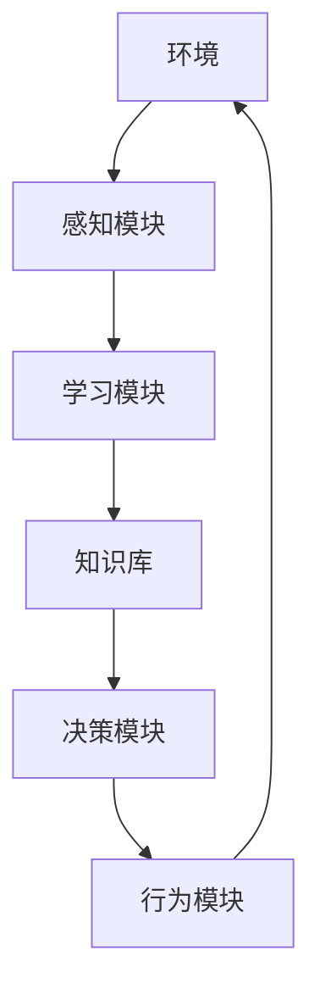

以下是标题为《AI人工智能 Agent：对未来工作的影响》的技术博客文章正文内容：

# AI人工智能 Agent：对未来工作的影响

## 1. 背景介绍

### 1.1 问题的由来

在过去的几十年里，人工智能(AI)技术取得了长足的进步,尤其是近年来机器学习和深度学习的兴起,使得AI系统在语音识别、图像识别、自然语言处理等领域展现出超乎想象的能力。随着AI技术的不断发展和广泛应用,人们开始思考AI会如何影响未来的工作方式和就业市场。

### 1.2 研究现状  

目前,已有一些研究机构和学者对AI对未来工作的影响进行了初步探讨。例如,牛津大学的两位学者(Frey和Osborne)在2013年的一项研究中估计,未来20年内约47%的就业岗位存在被自动化取代的高风险。另一方面,也有研究认为AI不会完全取代人类工作,而是会促进工作方式的转变,人机协作将成为未来工作的新常态。

### 1.3 研究意义

准确预测和理解AI对未来工作的影响,对于政府、企业和个人来说都具有重要意义。政府需要制定相应的政策来应对就业市场的变化;企业需要调整业务策略,培养员工适应新形势下的工作方式;个人也需要提前做好职业规划,获得必要的技能以适应未来的工作环境。

### 1.4 本文结构

本文将首先介绍AI Agent的核心概念和原理,然后分析AI Agent对不同行业和工作岗位的影响,探讨人机协作的新模式,并对未来工作的发展趋势进行前瞻性分析。最后,本文将总结AI时代下个人和组织应该如何准备和应对未来工作的变革。

## 2. 核心概念与联系

AI Agent是指具有一定智能和自主性的软件实体,能够感知环境、处理信息、做出决策并执行行为。AI Agent通常由以下几个核心模块组成:

1. **感知模块(Perception Module)**: 用于获取环境信息,如视觉、语音、文本等数据。
2. **学习模块(Learning Module)**: 基于感知到的数据,通过机器学习算法进行模式识别和知识获取。
3. **决策模块(Decision Module)**: 根据学习得到的知识,结合目标和约束,做出行为决策。  
4. **行为模块(Action Module)**: 执行决策模块的行为指令,与外部环境进行交互。
5. **知识库(Knowledge Base)**: 存储学习模块获取的知识表示。



上图展示了AI Agent的基本工作流程。Agent首先通过感知模块获取环境数据,然后在学习模块中对数据进行处理、模式识别,并将获取的知识存储在知识库中。决策模块根据知识库中的知识、目标和约束做出行为决策,行为模块执行相应的动作,对环境产生影响,循环往复。

## 3. 核心算法原理 & 具体操作步骤  

### 3.1 算法原理概述

AI Agent的核心是机器学习算法,通过对大量数据的学习,获取潜在的知识模式,并应用于决策和行为执行。常见的机器学习算法包括:

1. **监督学习算法**: 利用带有标签的训练数据,学习出一个从输入到输出的映射函数,如分类和回归算法。
2. **非监督学习算法**: 对无标签数据进行聚类和降维,发现数据内在的模式和结构。
3. **强化学习算法**: 通过与环境的互动,获取反馈奖惩信号,不断优化决策策略,实现目标导向的学习。
4. **深度学习算法**: 基于人工神经网络,通过多层非线性变换拟合复杂函数,在计算机视觉、自然语言处理等领域表现卓越。

### 3.2 算法步骤详解

以监督学习算法为例,一般包括以下几个步骤:

1. **数据预处理**: 对原始数据进行清洗、标准化、特征提取等预处理,将其转换为算法可以处理的格式。

2. **模型选择**: 根据问题的特点,选择合适的算法模型,如逻辑回归、决策树、支持向量机等。

3. **模型训练**: 利用训练数据,通过优化目标函数(如最小化损失函数),学习模型参数的最优值。

4. **模型评估**: 在保留的测试数据集上,评估模型的泛化性能,如准确率、查准率、查全率等指标。

5. **模型调优**: 根据评估结果,通过调整超参数、特征选择等方法,优化模型性能。

6. **模型部署**: 将训练好的模型集成到AI系统中,用于实际的预测和决策任务。

### 3.3 算法优缺点

机器学习算法的优点包括:

- 可以自动从数据中学习知识模式,减轻人工设计知识库的工作量。
- 具有很强的泛化能力,能够处理未见过的新数据样本。
- 随着数据量的增加,算法性能通常会不断提高。

缺点包括:

- 需要大量的高质量数据用于训练,否则容易产生过拟合或欠拟合问题。
- 算法的可解释性较差,很难解释内部学习到的知识表示。
- 存在潜在的偏差和公平性问题,如对某些群体的歧视。

### 3.4 算法应用领域

机器学习算法在诸多领域都有广泛的应用,包括但不限于:

- **计算机视觉**: 图像分类、目标检测、语义分割等。
- **自然语言处理**: 机器翻译、文本生成、情感分析等。  
- **推荐系统**: 个性化推荐、协同过滤等。
- **金融**: 信用评分、欺诈检测、自动交易等。
- **医疗健康**: 医学影像分析、药物设计、疾病诊断等。
- **交通运输**: 自动驾驶、交通流量预测等。

## 4. 数学模型和公式 & 详细讲解 & 举例说明

### 4.1 数学模型构建

机器学习算法通常基于一定的数学模型,对输入数据进行函数拟合,得到所需的输出。以线性回归为例,其数学模型为:

$$y = w_1x_1 + w_2x_2 + ... + w_nx_n + b$$

其中:
- $y$为预测的目标值
- $x_1, x_2, ..., x_n$为输入的特征值 
- $w_1, w_2, ..., w_n$为对应的权重系数
- $b$为偏置项

通过优化目标函数(如最小化均方误差),可以学习得到最优的权重系数$w$和偏置项$b$。

### 4.2 公式推导过程  

对于线性回归模型,我们的目标是最小化预测值$\hat{y}$与真实值$y$之间的均方误差:

$$J(w, b) = \frac{1}{2m}\sum_{i=1}^{m}(f(x^{(i)}) - y^{(i)})^2$$

其中:
- $m$为训练样本数量
- $x^{(i)}$为第$i$个训练样本的输入特征向量
- $y^{(i)}$为第$i$个训练样本的真实目标值
- $f(x^{(i)}) = w_1x_1^{(i)} + w_2x_2^{(i)} + ... + w_nx_n^{(i)} + b$为线性回归模型

通过对$J(w, b)$关于$w_j$和$b$分别求偏导数并令其等于0,可以得到最优解的闭式解:

$$w_j = \frac{\sum_{i=1}^{m}(y^{(i)} - \overline{y})*(x_j^{(i)} - \overline{x_j})}{\sum_{i=1}^{m}(x_j^{(i)} - \overline{x_j})^2}$$
$$b = \overline{y} - \sum_{j=1}^{n}w_j\overline{x_j}$$

其中$\overline{y}$和$\overline{x_j}$分别为$y$和$x_j$的均值。

### 4.3 案例分析与讲解

假设我们要基于一个城市的房屋数据,预测房屋的价格。输入特征包括房屋面积(平方英尺)、卧室数量和地理位置(邮编),我们用线性回归模型对其进行拟合:

$$\text{Price} = w_1 \times \text{Area} + w_2 \times \text{Bedrooms} + w_3 \times \text{Zipcode} + b$$

经过训练,得到权重系数:
- $w_1 = 109.25$ (每增加1平方英尺,价格上涨109.25美元)
- $w_2 = 23145.6$ (每增加1个卧室,价格上涨23145.6美元)  
- $w_3 = 0.0027$ (邮编对应的地理位置系数)
- $b = 127642.8$ (基础价格)

如果一个房屋的面积为1800平方英尺,3个卧室,邮编为98033,那么根据模型预测的价格为:

$$\begin{aligned}
\text{Price} &= 109.25 \times 1800 + 23145.6 \times 3 + 0.0027 \times 98033 + 127642.8\\
           &= 324292.8
\end{aligned}$$

### 4.4 常见问题解答

**Q: 线性回归只能处理线性可分的数据吗?**

A: 线性回归模型本身是线性的,但是通过特征工程(如多项式特征、交叉特征等),可以将非线性问题转化为线性问题,从而使用线性回归模型进行处理。

**Q: 如何避免线性回归模型的过拟合问题?**

A: 可以采用正则化技术(如L1、L2正则化)对模型进行约束,防止权重系数过大。另外也可以使用交叉验证等方法选择合适的模型复杂度。

**Q: 线性回归模型的优缺点是什么?**

A: 优点是模型简单,可解释性强,计算高效。缺点是对于非线性数据的拟合效果较差,对异常值较为敏感。

## 5. 项目实践:代码实例和详细解释说明

### 5.1 开发环境搭建

本例使用Python语言和Scikit-learn机器学习库进行开发。首先需要安装相关的Python包:

```bash
pip install scikit-learn pandas numpy matplotlib
```

导入所需的库:

```python
import pandas as pd
import numpy as np
from sklearn.linear_model import LinearRegression
import matplotlib.pyplot as plt
```

### 5.2 源代码详细实现

1. 加载并探索数据

```python
# 加载数据
data = pd.read_csv('housing.csv')

# 查看数据描述
print(data.describe())

# 查看特征与目标值的相关性
corr_matrix = data.corr()
print(corr_matrix['MEDV'].sort_values(ascending=False))
```

2. 准备训练数据

```python
# 将特征数据和目标值分开
X = data[['RM', 'LSTAT', 'PTRATIO']]
y = data['MEDV']

# 分割训练集和测试集
from sklearn.model_selection import train_test_split
X_train, X_test, y_train, y_test = train_test_split(X, y, test_size=0.2, random_state=42)
```

3. 训练线性回归模型

```python
# 创建线性回归模型实例
model = LinearRegression()

# 训练模型
model.fit(X_train, y_train)
```

4. 评估模型性能

```python  
# 在测试集上评估模型性能
y_pred = model.predict(X_test)

# 计算均方根误差
from sklearn.metrics import mean_squared_error
mse = mean_squared_error(y_test, y_pred)
rmse = np.sqrt(mse)
print(f'RMSE: {rmse:.2f}')
```

5. 模型调优

```python
# 使用Ridge回归(L2正则化)
from sklearn.linear_model import Ridge
model = Ridge(alpha=0.5)
model.fit(X_train, y_train)
y_pred = model.predict(X_test)
mse = mean_squared_error(y_test, y_pred)
rmse = np.sqrt(mse)
print(f'RMSE (Ridge): {rmse:.2f}')