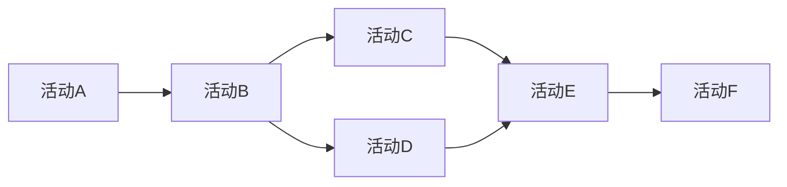

# AI人工智能代理工作流AI Agent WorkFlow：在智能家居场景应用代理技术

## 1. 背景介绍

### 1.1 问题的由来

随着人工智能技术的快速发展，智能家居系统逐渐成为现代生活的一部分。智能家居旨在通过集成各种智能设备和系统,为用户提供更加舒适、便利和高效的居住环境。然而,由于智能家居涉及多种异构设备和系统,如何有效地协调和管理这些系统之间的交互成为了一个挑战。

传统的智能家居系统往往采用集中式架构,所有设备和系统都直接连接到一个中央控制系统。这种方式存在一些缺陷,例如单点故障风险、可扩展性差、响应延迟等。因此,需要一种更加灵活、分布式的解决方案来应对这些挑战。

### 1.2 研究现状

为了解决上述问题,研究人员提出了基于智能代理的分布式智能家居系统架构。智能代理是一种自主的软件实体,能够感知环境、执行任务并与其他代理协作。每个智能设备或子系统都有一个关联的智能代理,负责管理该设备或子系统的操作。

智能代理之间通过工作流技术进行协作,以实现复杂的家居自动化任务。工作流定义了一系列有序的活动,描述了完成特定任务所需的步骤。通过将任务分解为多个活动,并由不同的智能代理来执行,可以实现高效、灵活的任务协调。

目前,已有一些研究探索了基于智能代理的智能家居系统,但大多数工作仍停留在概念验证或原型系统阶段。如何设计高效、可靠的智能代理工作流,并将其应用于实际的智能家居场景,仍然是一个值得深入研究的课题。

### 1.3 研究意义

设计高效的智能代理工作流技术,对于构建下一代智能家居系统具有重要意义:

1. **提高系统灵活性和可扩展性**:代理工作流架构能够轻松地集成新设备和功能,满足不断变化的用户需求。

2. **增强系统鲁棒性**:分布式架构避免了单点故障,提高了系统的容错能力。

3. **优化资源利用**:通过任务分解和代理协作,可以更好地利用系统资源,提高效率。

4. **增强用户体验**:代理工作流能够自动化复杂的家居任务,为用户带来无缝的智能体验。

5. **推动智能家居产业发展**:高效的代理工作流技术将促进智能家居产品的创新和商业化进程。

### 1.4 本文结构

本文将深入探讨智能代理工作流技术在智能家居场景中的应用。文章首先介绍智能代理和工作流的核心概念,然后详细阐述代理工作流的算法原理和数学模型。接下来,我们将通过一个实际项目案例,展示代理工作流的具体实现和应用。最后,我们讨论该技术的实际应用场景、未来发展趋势和面临的挑战。

## 2. 核心概念与联系

在探讨智能代理工作流技术之前,我们需要先了解两个核心概念:智能代理和工作流。

### 2.1 智能代理

智能代理(Intelligent Agent)是一种具有自主性、反应性、主动性和社会能力的软件实体。它能够感知环境,根据感知到的信息做出决策,并采取相应的行动来完成特定任务。智能代理通常具有以下特征:

1. **自主性(Autonomy)**: 智能代理能够在一定程度上控制自己的行为,而无需人工干预。

2. **反应性(Reactivity)**: 智能代理能够感知环境的变化,并相应地调整自己的行为。

3. **主动性(Proactiveness)**: 智能代理不仅能够响应环境的变化,还能够主动地采取行动来实现自己的目标。

4. **社会能力(Social Ability)**: 智能代理能够与其他代理进行交互和协作,以完成复杂的任务。

在智能家居系统中,每个智能设备或子系统都可以与一个智能代理相关联。这些代理负责管理相应设备的操作,并与其他代理协作以实现复杂的家居自动化任务。

### 2.2 工作流

工作流(Workflow)是一种用于描述业务流程的模型。它定义了一系列有序的活动,以及在特定条件下执行这些活动的规则。工作流技术常用于自动化和优化业务流程,提高效率和一致性。

在智能家居场景中,工作流可用于描述完成特定家居任务所需的一系列步骤。每个步骤都由一个智能代理来执行,代理之间通过工作流引擎进行协调和通信。通过将复杂的任务分解为多个活动,并由不同的代理来执行,可以实现高效、灵活的任务协调。

### 2.3 智能代理工作流

智能代理工作流技术将智能代理和工作流概念相结合,用于构建分布式智能家居系统。在这种架构中,每个智能设备或子系统都与一个智能代理相关联。这些代理通过工作流技术进行协作,以实现复杂的家居自动化任务。

智能代理工作流架构具有以下优点:

1. **分布式和可扩展**:系统由多个独立的智能代理组成,可以轻松地添加或移除代理,提高了系统的可扩展性。

2. **容错和鲁棒**:由于没有单点故障,系统具有更好的容错能力和鲁棒性。

3. **异构集成**:代理可以封装不同类型的设备和系统,实现异构系统的无缝集成。

4. **任务自动化**:通过工作流技术,可以自动化复杂的家居任务,提高效率和用户体验。

5. **动态适应**:代理可以根据环境变化动态调整工作流,提高系统的适应性。

接下来,我们将详细探讨智能代理工作流的算法原理和数学模型。

## 3. 核心算法原理与具体操作步骤

### 3.1 算法原理概述

智能代理工作流算法的核心思想是将复杂的家居任务分解为一系列有序的活动,并由不同的智能代理来执行这些活动。算法的主要步骤如下:

1. **任务分解**: 将家居任务分解为一系列有序的活动,构建工作流模型。

2. **代理分配**: 为每个活动分配一个合适的智能代理来执行。

3. **工作流执行**: 通过工作流引擎协调代理之间的交互,按照工作流模型执行各个活动。

4. **结果汇总**: 将各个代理执行活动的结果汇总,得到最终的任务执行结果。

5. **反馈与优化**: 根据任务执行的反馈,动态优化工作流模型和代理分配策略。

该算法的关键在于合理地分解任务、分配代理和协调代理之间的交互,以实现高效、灵活的任务执行。下面我们将详细讨论算法的具体步骤。

### 3.2 算法步骤详解

#### 3.2.1 任务分解

任务分解是智能代理工作流算法的第一步。在这一步骤中,我们需要将复杂的家居任务分解为一系列有序的活动,并构建工作流模型。

工作流模型通常采用有向无环图(Directed Acyclic Graph, DAG)的形式表示。在DAG中,每个节点代表一个活动,边表示活动之间的执行顺序和依赖关系。一个简单的工作流模型示例如下:

在上图中,活动A必须先执行,然后才能执行活动B。活动B完成后,才能执行活动C和活动D。活动C和活动D都必须完成,才能执行活动E。最后,活动E完成后,才能执行活动F。

任务分解的质量直接影响到工作流的执行效率和灵活性。一般来说,我们应该遵循以下原则进行任务分解:

1. **职责分离原则**: 每个活动应该只负责完成一个相对独立的子任务,避免过度耦合。

2. **最小化依赖原则**: 尽量减少活动之间的依赖关系,提高并行执行的可能性。

3. **可重用性原则**: 设计通用的活动,以便在不同的工作流中重用。

4. **可扩展性原则**: 工作流模型应该具有良好的扩展性,能够轻松地添加或修改活动。

任务分解通常需要对家居场景和用户需求有深入的理解,并结合专家知识和历史数据进行优化。

#### 3.2.2 代理分配

完成任务分解后,下一步是为每个活动分配一个合适的智能代理来执行。代理分配策略直接影响到工作流的执行效率和资源利用率。

代理分配算法需要考虑多个因素,包括:

1. **代理能力**: 每个代理都有自己的功能和能力,只有能够胜任特定活动的代理才能被分配。

2. **代理负载**: 为了平衡系统负载,应该尽量将活动分配给当前负载较低的代理。

3. **代理位置**: 某些活动可能需要与特定位置的设备交互,因此应该优先分配位置合适的代理。

4. **代理可靠性**: 可靠性高的代理应该被优先分配关键活动。

5. **活动优先级**: 对于高优先级的活动,应该分配更多资源来保证其执行效率。

6. **活动依赖**: 如果两个活动存在依赖关系,可以考虑将它们分配给同一个代理,以减少通信开销。

代理分配算法通常采用启发式或元启发式方法,例如遗传算法、模拟退火等,以求得近似最优解。算法的具体实现取决于系统的具体需求和约束条件。

#### 3.2.3 工作流执行

完成代理分配后,下一步是通过工作流引擎协调各个代理之间的交互,按照工作流模型执行各个活动。

工作流引擎是智能代理工作流系统的核心组件,负责管理和执行工作流实例。它的主要功能包括:

1. **活动调度**: 根据工作流模型和代理分配结果,调度合适的代理执行相应的活动。

2. **数据传递**: 在活动之间传递所需的数据和上下文信息。

3. **事件处理**: 处理活动执行过程中产生的各种事件,如活动完成、异常等。

4. **状态管理**: 跟踪工作流实例的执行状态,以便在发生故障时进行恢复。

5. **监控和审计**: 记录工作流执行的日志,用于监控和审计目的。

6. **异常处理**: 处理活动执行过程中发生的异常情况,如代理故障、活动失败等。

工作流引擎通常采用基于规则的方式来协调代理之间的交互。例如,当一个活动完成时,引擎会检查工作流模型,找到下一个应该执行的活动,并调度相应的代理执行该活动。

为了提高工作流执行的效率和可靠性,工作流引擎还需要支持以下特性:

1. **并行执行**: 能够同时执行多个并行活动,充分利用系统资源。

2. **事务处理**: 对于需要保证原子性的活动序列,应该支持事务处理机制。

3. **容错和恢复**: 能够在代理故障或活动失败时进行容错和恢复,保证工作流的完整性。

4. **动态调整**: 能够根据环境变化动态调整工作流模型和代理分配策略。

5. **安全和隐私保护**: 确保工作流执行过程中的数据安全和用户隐私得到保护。

工作流执行是智能代理工作流算法的核心环节,直接决定了系统的性能和可靠性。

#### 3.2.4 结果汇总

在所有活动都成功执行后,工作流引擎需要将各个代理执行活动的结果进行汇总,得到最终的任务执