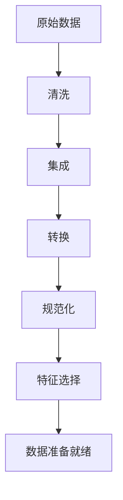
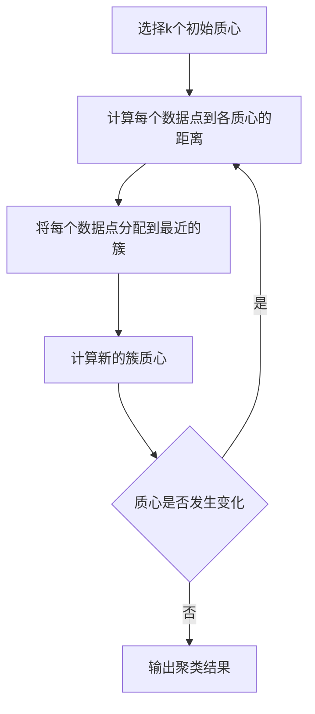
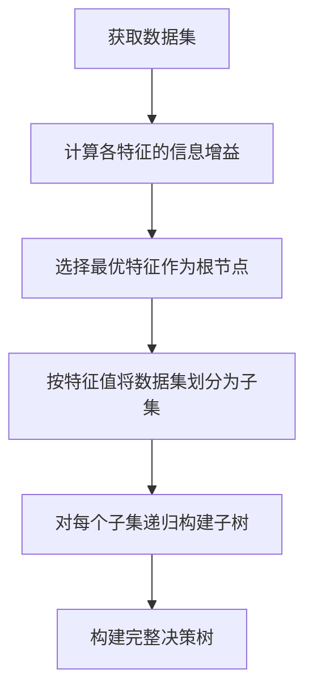
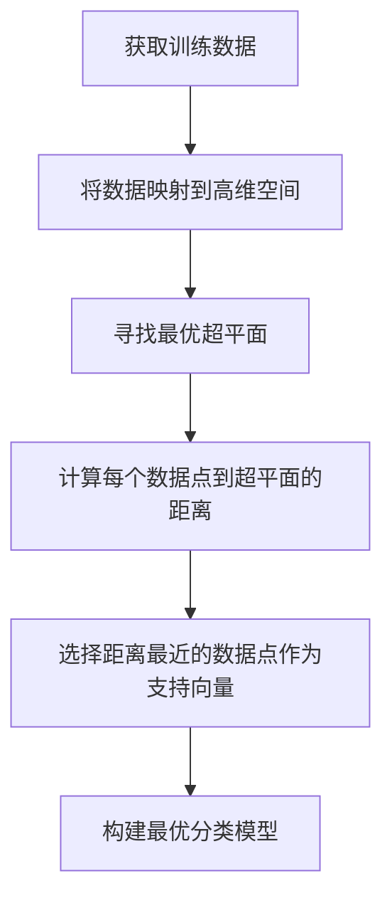
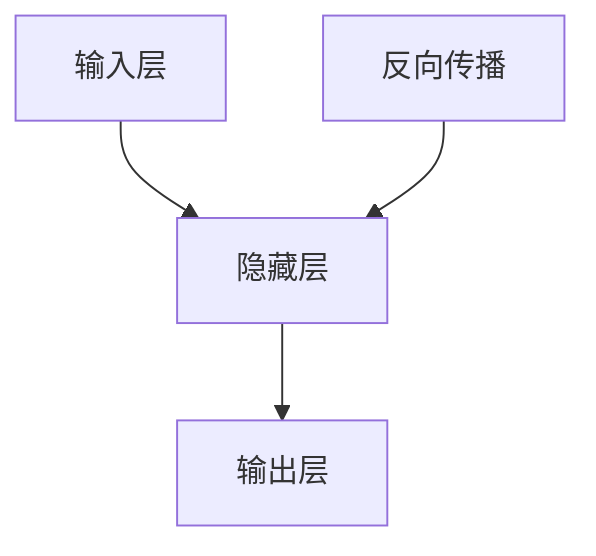

好的,我会严格遵循您提供的约束条件,以"AI人工智能核心算法原理与代码实例讲解：数据处理"为主题,撰写一篇专业的技术博客文章。请注意,由于内容较长,我将分多个回复完成。

# AI人工智能核心算法原理与代码实例讲解：数据处理

## 1. 背景介绍

### 1.1 问题的由来

在当今的数字时代,海量的数据被不断产生和积累。无论是个人还是企业,都面临着如何高效处理这些庞大的数据集的挑战。传统的数据处理方法已经不够用了,我们需要新的解决方案来应对日益复杂的数据处理需求。

### 1.2 研究现状  

人工智能(AI)技术的快速发展为解决这一问题提供了新的思路。通过机器学习、深度学习等算法,AI可以自动化地从大规模数据中提取有价值的信息和模式。目前,AI已经广泛应用于图像识别、自然语言处理、推荐系统等诸多领域的数据处理任务中。

### 1.3 研究意义

掌握AI核心算法原理对于高效处理海量数据至关重要。本文将深入探讨数据处理领域的核心AI算法,剖析其内在原理,并通过代码实例加深读者的理解。无论是数据科学从业者还是AI爱好者,都可以从中获益。

### 1.4 本文结构

本文将从以下几个方面全面介绍AI数据处理算法:

1. 核心概念与联系
2. 核心算法原理与具体操作步骤  
3. 数学模型和公式详细讲解与案例分析
4. 项目实践:代码实例和详细解释
5. 实际应用场景
6. 工具和学习资源推荐
7. 总结未来发展趋势与挑战
8. 常见问题解答

## 2. 核心概念与联系

在深入探讨核心算法之前,我们先来了解一些基本概念。

### 2.1 数据预处理



数据预处理是数据处理过程中的重要环节。它包括以下步骤:

1. **清洗**:移除原始数据中的噪声和不一致性
2. **集成**:将多个数据源合并为统一的数据存储区
3. **转换**:进行数据规范化或归一化
4. **规范化**:数据值转化为小范围如0到1之间
5. **特征选择**:选取对预测目标更有意义的特征子集

经过以上步骤,原始数据就可以被用于后续的机器学习算法了。

### 2.2 特征工程

特征工程是使原始数据适应于机器学习的关键步骤。常见的特征工程技术包括:

- 特征编码:将分类数据编码为数值型数据
- 特征提取:从原始数据构造出更具表达能力的特征
- 特征选择:移除冗余和无关的特征
- 特征降维:降低特征空间维度,减少计算复杂度

特征工程对最终模型的性能有着至关重要的影响。

### 2.3 模型评估

为了选择最优模型,我们需要对不同模型进行评估和比较。常用的评估指标有:

- 准确率
- 精确率和召回率
- F1分数
- 均方根误差(RMSE)
- 平均绝对误差(MAE)

我们还需要使用诸如交叉验证等技术来评估模型的泛化能力。

## 3. 核心算法原理与具体操作步骤

在这一部分,我们将介绍几种核心的数据处理算法,并深入探讨它们的原理和操作步骤。

### 3.1 k-均值聚类算法

k-均值是一种无监督学习算法,可用于发现数据内在的簇结构。它的工作原理如下:



1. 随机选择k个初始质心
2. 计算每个数据点到各个质心的距离
3. 将每个数据点分配到最近的簇
4. 计算新的簇质心
5. 重复2-4步骤,直到质心不再发生变化
6. 输出最终的聚类结果

k-均值算法的优点是简单高效,但也存在一些缺陷,如对噪声和异常值敏感、需要预先指定簇数k等。

### 3.2 决策树算法

决策树是一种监督学习算法,可用于分类和回归任务。它的构建过程如下:



1. 获取训练数据集
2. 计算各个特征的信息增益或其他指标
3. 选择最优特征作为当前节点
4. 按该特征的取值将数据集划分为子集
5. 对每个子集递归构建子树
6. 构建完整的决策树

决策树算法易于理解和解释,但也存在过拟合的风险。我们可以通过剪枝等技术来控制模型复杂度。

### 3.3 支持向量机算法

支持向量机(SVM)是一种有监督学习模型,通常用于分类任务。它的工作原理是在高维空间寻找一个最优超平面,将不同类别的数据点分隔开来。



1. 获取训练数据集
2. 将数据映射到高维空间
3. 在高维空间中寻找最优超平面
4. 计算每个数据点到超平面的距离
5. 选择距离最近的数据点作为支持向量
6. 基于支持向量构建最优分类模型

SVM的优点是泛化能力强,即使在高维空间也能有效工作。但它对于非线性数据的拟合能力较弱。

### 3.4 神经网络算法

神经网络是一种强大的机器学习模型,可用于分类、回归、聚类等多种任务。它的工作原理借鉴了生物神经网络的结构。



1. 输入层接收原始数据
2. 隐藏层对数据进行非线性转换
3. 输出层给出最终的预测结果
4. 通过反向传播算法不断调整网络权重
5. 重复2-4步骤,直到网络收敛

神经网络可以自动从数据中学习特征表示,擅长处理高维复杂数据。但它也被批评为"黑箱",内部工作机制不够透明。

## 4. 数学模型和公式详细讲解与举例说明  

在上一部分,我们介绍了几种核心算法的原理。现在,让我们深入探讨它们背后的数学模型和公式。

### 4.1 k-均值聚类的数学模型

k-均值聚类的目标是最小化所有数据点到其所属簇质心的平方距离之和,即:

$$J = \sum_{i=1}^{k}\sum_{x \in C_i} \left \| x - \mu_i \right \|^2$$

其中:
- $k$是簇的数量
- $C_i$是第$i$个簇
- $\mu_i$是第$i$个簇的质心
- $\left \| x - \mu_i \right \|$是数据点$x$到质心$\mu_i$的距离

通过不断迭代更新簇分配和质心位置,算法可以收敛到局部最优解。

### 4.2 决策树中的信息增益

决策树算法中,我们需要选择最优特征作为节点。常用的指标是信息增益,定义为:

$$\text{Gain}(D, a) = \text{Entropy}(D) - \sum_{v \in \text{Values}(a)} \frac{|D^v|}{|D|} \cdot \text{Entropy}(D^v)$$

其中:
- $D$是当前数据集
- $a$是特征
- $\text{Values}(a)$是特征$a$的所有可能取值
- $D^v$是特征$a$取值为$v$的子集
- $\text{Entropy}(D)$是数据集$D$的信息熵,衡量数据纯度

具有最大信息增益的特征被选为当前节点。

### 4.3 支持向量机的核技巧

支持向量机的关键是找到一个最优超平面,可以通过以下公式表示:

$$\begin{aligned}
\min_{\omega, b} \frac{1}{2} \| \omega \|^2 \\
\text{subject to: } y_i(\omega^T \phi(x_i) + b) \geq 1, \quad i = 1, 2, \ldots, n
\end{aligned}$$

其中:
- $\omega$和$b$定义了超平面
- $\phi(x)$是将数据映射到高维空间的函数
- $y_i$是第$i$个数据点的标签

通过引入核函数$K(x_i, x_j) = \phi(x_i)^T \phi(x_j)$,我们可以在高维空间进行内积计算,而无需显式知道映射函数$\phi$。这就是著名的"核技巧"。

### 4.4 神经网络中的反向传播

神经网络中,我们需要通过反向传播算法来更新网络权重,使损失函数最小化。假设损失函数为$L$,对于第$l$层的权重$W^{(l)}$,其梯度为:

$$\frac{\partial L}{\partial W^{(l)}} = \frac{\partial L}{\partial z^{(l+1)}} \frac{\partial z^{(l+1)}}{\partial W^{(l)}}$$

其中$z^{(l+1)}$是第$l+1$层的加权输入。通过链式法则,我们可以计算出每一层的梯度,并使用梯度下降等优化算法更新权重。

## 5. 项目实践:代码实例和详细解释说明

理论知识很重要,但实践更加重要。在这一部分,我们将通过真实的代码示例,加深对上述算法的理解。

### 5.1 开发环境搭建

我们将使用Python作为开发语言,并利用以下库:

- NumPy: 科学计算库
- Pandas: 数据处理库 
- Scikit-learn: 机器学习库
- Matplotlib: 数据可视化库

你可以使用Anaconda等工具轻松安装所需的库。

### 5.2 k-均值聚类实现

```python
from sklearn.cluster import KMeans

# 加载数据
data = ...

# 初始化k-means模型
kmeans = KMeans(n_clusters=3, random_state=0)

# 训练模型
kmeans.fit(data)

# 获取聚类标签
labels = kmeans.labels_

# 获取质心
centroids = kmeans.cluster_centers_
```

在这个示例中,我们使用Scikit-learn库中的`KMeans`类来执行k-均值聚类。首先,我们需要导入数据集。然后,初始化`KMeans`对象,并指定簇的数量`n_clusters`。

接着,我们在数据集上调用`fit`方法来训练模型。训练完成后,可以通过`labels_`属性获取每个数据点的簇标签,通过`cluster_centers_`属性获取各簇的质心。

### 5.3 决策树分类器实现  

```python
from sklearn.tree import DecisionTreeClassifier
from sklearn.datasets import load_iris
from sklearn.model_selection import train_test_split
from sklearn.metrics import accuracy_score

# 加载iris数据集
iris = load_iris()
X, y = iris.data, iris.target

# 划分训练集和测试集
X_train, X_test,