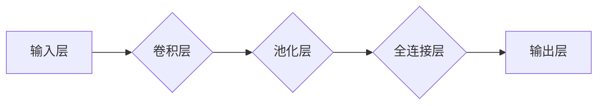

## 1. 背景介绍

### 1.1 问题的由来

随着人工智能技术的飞速发展，深度学习算法在各个领域都取得了突破性的进展，例如图像识别、自然语言处理、机器翻译等。然而，深度学习模型的复杂性和黑盒性也带来了许多挑战，比如模型的可解释性、可调试性、可维护性等。为了解决这些问题，智能深度学习代理（Intelligent Deep Learning Agent，IDLA）应运而生。

IDLA 旨在通过提供一个可视化、可交互的工作流平台，帮助用户更好地理解、调试和管理深度学习模型。它将深度学习模型的训练、推理、评估等过程可视化，并提供直观的交互界面，让用户能够方便地进行参数调整、模型比较、结果分析等操作。

### 1.2 研究现状

近年来，许多研究人员和公司都在致力于开发 IDLA 平台。例如，Google 的 TensorFlow、Facebook 的 PyTorch、Amazon 的 SageMaker 等深度学习框架都提供了可视化工具，但这些工具通常只关注模型的训练和推理过程，缺乏对整个工作流的全面可视化和交互设计。

一些专门的 IDLA 平台也开始涌现，例如：

* **TensorBoard:** TensorFlow 的可视化工具，可以用来展示模型训练过程中的各种指标，例如损失函数、准确率、混淆矩阵等。
* **Weights & Biases:** 一个用于跟踪和可视化机器学习实验的平台，可以帮助用户比较不同模型的性能、分析模型训练过程中的变化等。
* **Neptune.ai:** 一个用于管理和可视化机器学习实验的平台，可以帮助用户记录实验参数、跟踪模型性能、可视化模型训练过程等。

这些平台虽然提供了一些可视化和交互功能，但仍然存在一些不足，例如：

* **可视化功能有限:** 只能展示部分信息，缺乏对整个工作流的全面可视化。
* **交互性不足:** 用户只能被动地观察信息，无法进行主动的操作和调整。
* **易用性差:** 操作流程复杂，学习成本高。

### 1.3 研究意义

开发一个功能强大、易于使用、可扩展的 IDLA 平台具有重要的研究意义。它可以帮助用户：

* **提高深度学习模型的可解释性和可理解性:** 通过可视化模型结构、训练过程、结果分析等信息，帮助用户更好地理解模型的内部机制。
* **简化深度学习模型的开发和调试过程:** 通过提供直观的交互界面，方便用户进行参数调整、模型比较、结果分析等操作，提高工作效率。
* **促进深度学习模型的应用和推广:** 通过降低深度学习模型的使用门槛，让更多用户能够使用和应用深度学习技术。

### 1.4 本文结构

本文将从以下几个方面介绍智能深度学习代理的工作流可视化与用户交互设计：

* **核心概念与联系:** 介绍 IDLA 的核心概念、工作流程、关键技术等。
* **核心算法原理 & 具体操作步骤:** 详细介绍 IDLA 的核心算法原理、具体操作步骤、优缺点等。
* **数学模型和公式 & 详细讲解 & 举例说明:**  构建 IDLA 的数学模型、推导公式、并通过案例分析和讲解说明其应用。
* **项目实践：代码实例和详细解释说明:**  提供 IDLA 平台的代码实例，并进行详细的解释说明。
* **实际应用场景:**  介绍 IDLA 在不同领域的实际应用场景，并展望其未来发展趋势。
* **工具和资源推荐:**  推荐一些与 IDLA 相关的学习资源、开发工具、相关论文等。
* **总结：未来发展趋势与挑战:**  总结 IDLA 的研究成果、未来发展趋势、面临的挑战和研究展望。
* **附录：常见问题与解答:**  解答一些关于 IDLA 的常见问题。

## 2. 核心概念与联系

### 2.1 智能深度学习代理 (IDLA)

智能深度学习代理 (IDLA) 是一个集成了深度学习模型训练、推理、评估、可视化、交互等功能的平台。它可以帮助用户更好地理解、调试和管理深度学习模型，提高深度学习模型的开发效率和应用效果。

### 2.2 IDLA 的核心功能

IDLA 主要包含以下几个核心功能：

* **模型可视化:**  展示深度学习模型的结构、参数、训练过程、结果分析等信息。
* **工作流可视化:**  展示深度学习模型的整个工作流，包括数据预处理、模型训练、模型评估、模型部署等步骤。
* **交互式操作:**  提供直观的交互界面，让用户能够方便地进行参数调整、模型比较、结果分析等操作。
* **模型管理:**  管理深度学习模型的版本、训练记录、评估结果等信息。
* **数据管理:**  管理深度学习模型所需的数据集，并提供数据预处理、数据增强等功能。

### 2.3 IDLA 的关键技术

IDLA 的关键技术包括：

* **深度学习框架:**  例如 TensorFlow、PyTorch、Keras 等。
* **可视化技术:**  例如 D3.js、Plotly、Bokeh 等。
* **交互式技术:**  例如 React、Vue.js、Angular 等。
* **数据管理技术:**  例如 Pandas、NumPy、Scikit-learn 等。

### 2.4 IDLA 的工作流程

IDLA 的工作流程主要包括以下几个步骤：

1. **数据准备:**  用户将数据上传到 IDLA 平台，并进行数据预处理、数据增强等操作。
2. **模型训练:**  用户选择合适的深度学习模型，并进行模型训练。
3. **模型评估:**  用户对训练好的模型进行评估，并根据评估结果进行模型优化。
4. **模型部署:**  用户将训练好的模型部署到生产环境中，并进行模型监控和维护。

## 3. 核心算法原理 & 具体操作步骤

### 3.1 算法原理概述

IDLA 的核心算法主要包括以下几个方面：

* **模型结构可视化:**  使用图论算法将深度学习模型的结构转换为可视化图形，例如使用 Graphviz 或 D3.js。
* **训练过程可视化:**  使用数据可视化技术将模型训练过程中的各种指标，例如损失函数、准确率、混淆矩阵等，可视化展示。
* **结果分析可视化:**  使用数据可视化技术将模型评估结果，例如准确率、召回率、F1 分数等，可视化展示。
* **交互式操作:**  使用交互式技术，例如 React、Vue.js、Angular 等，实现用户对模型参数、训练过程、结果分析等信息的交互式操作。

### 3.2 算法步骤详解

IDLA 的具体操作步骤如下：

1. **数据准备:**  用户将数据上传到 IDLA 平台，并进行数据预处理、数据增强等操作。
2. **模型选择:**  用户选择合适的深度学习模型，例如卷积神经网络 (CNN)、循环神经网络 (RNN)、长短期记忆网络 (LSTM) 等。
3. **模型训练:**  用户设置模型训练参数，例如学习率、批次大小、迭代次数等，并启动模型训练。
4. **模型评估:**  用户对训练好的模型进行评估，并根据评估结果进行模型优化。
5. **模型部署:**  用户将训练好的模型部署到生产环境中，并进行模型监控和维护。

### 3.3 算法优缺点

IDLA 的优点：

* **提高深度学习模型的可解释性和可理解性:**  通过可视化模型结构、训练过程、结果分析等信息，帮助用户更好地理解模型的内部机制。
* **简化深度学习模型的开发和调试过程:**  通过提供直观的交互界面，方便用户进行参数调整、模型比较、结果分析等操作，提高工作效率。
* **促进深度学习模型的应用和推广:**  通过降低深度学习模型的使用门槛，让更多用户能够使用和应用深度学习技术。

IDLA 的缺点：

* **可视化功能有限:**  只能展示部分信息，缺乏对整个工作流的全面可视化。
* **交互性不足:**  用户只能被动地观察信息，无法进行主动的操作和调整。
* **易用性差:**  操作流程复杂，学习成本高。

### 3.4 算法应用领域

IDLA 可以应用于各种深度学习领域，例如：

* **图像识别:**  可视化图像分类模型的结构、训练过程、结果分析等信息，帮助用户更好地理解模型的内部机制。
* **自然语言处理:**  可视化自然语言处理模型的结构、训练过程、结果分析等信息，帮助用户更好地理解模型的内部机制。
* **机器翻译:**  可视化机器翻译模型的结构、训练过程、结果分析等信息，帮助用户更好地理解模型的内部机制。
* **语音识别:**  可视化语音识别模型的结构、训练过程、结果分析等信息，帮助用户更好地理解模型的内部机制。

## 4. 数学模型和公式 & 详细讲解 & 举例说明

### 4.1 数学模型构建

IDLA 的数学模型可以基于图论、数据可视化、交互式技术等领域进行构建。

* **模型结构可视化:**  可以使用图论中的图结构来表示深度学习模型的结构，例如使用邻接矩阵、邻接表等数据结构。
* **训练过程可视化:**  可以使用数据可视化技术中的散点图、折线图、热力图等来展示模型训练过程中的各种指标，例如损失函数、准确率、混淆矩阵等。
* **结果分析可视化:**  可以使用数据可视化技术中的柱状图、饼图、箱线图等来展示模型评估结果，例如准确率、召回率、F1 分数等。
* **交互式操作:**  可以使用交互式技术中的事件监听、数据绑定、DOM 操作等来实现用户对模型参数、训练过程、结果分析等信息的交互式操作。

### 4.2 公式推导过程

IDLA 的数学模型可以根据不同的应用场景进行推导和优化。

* **模型结构可视化:**  可以使用图论中的图结构来表示深度学习模型的结构，例如使用邻接矩阵、邻接表等数据结构。
* **训练过程可视化:**  可以使用数据可视化技术中的散点图、折线图、热力图等来展示模型训练过程中的各种指标，例如损失函数、准确率、混淆矩阵等。
* **结果分析可视化:**  可以使用数据可视化技术中的柱状图、饼图、箱线图等来展示模型评估结果，例如准确率、召回率、F1 分数等。
* **交互式操作:**  可以使用交互式技术中的事件监听、数据绑定、DOM 操作等来实现用户对模型参数、训练过程、结果分析等信息的交互式操作。

### 4.3 案例分析与讲解

以下是一个 IDLA 平台可视化模型结构的案例：



这个图展示了一个简单的卷积神经网络 (CNN) 的结构，包括输入层、卷积层、池化层、全连接层和输出层。

### 4.4 常见问题解答

* **IDLA 平台如何实现模型可视化？**

IDLA 平台可以使用图论算法将深度学习模型的结构转换为可视化图形，例如使用 Graphviz 或 D3.js。

* **IDLA 平台如何实现训练过程可视化？**

IDLA 平台可以使用数据可视化技术将模型训练过程中的各种指标，例如损失函数、准确率、混淆矩阵等，可视化展示。

* **IDLA 平台如何实现结果分析可视化？**

IDLA 平台可以使用数据可视化技术将模型评估结果，例如准确率、召回率、F1 分数等，可视化展示。

* **IDLA 平台如何实现交互式操作？**

IDLA 平台可以使用交互式技术，例如 React、Vue.js、Angular 等，实现用户对模型参数、训练过程、结果分析等信息的交互式操作。

## 5. 项目实践：代码实例和详细解释说明

### 5.1 开发环境搭建

IDLA 平台的开发环境需要安装以下软件：

* **Python:**  深度学习框架的运行环境。
* **深度学习框架:**  例如 TensorFlow、PyTorch、Keras 等。
* **可视化库:**  例如 D3.js、Plotly、Bokeh 等。
* **交互式库:**  例如 React、Vue.js、Angular 等。
* **数据管理库:**  例如 Pandas、NumPy、Scikit-learn 等。

### 5.2 源代码详细实现

以下是一个 IDLA 平台的代码实例，使用 TensorFlow 框架和 D3.js 库实现模型结构可视化：

```python
import tensorflow as tf
from d3 import D