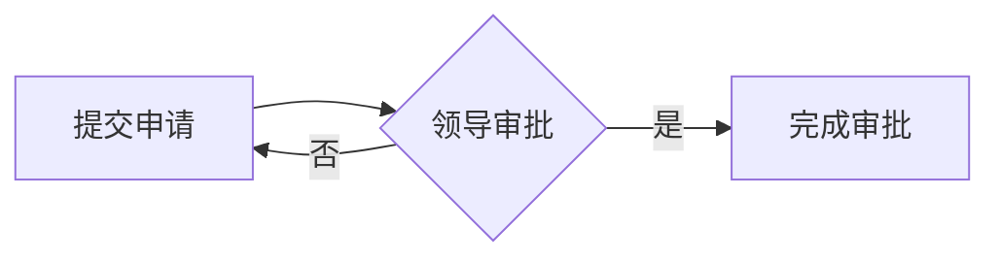

## 1. 背景介绍

### 1.1  问题的由来

在现代软件开发和企业运营中，工作流自动化扮演着至关重要的角色。工作流代理作为连接不同系统和服务的桥梁，可以有效地协调和管理各种任务，实现流程的自动化和优化。然而，传统的工作流代理通常依赖于预定义的规则和流程，难以应对复杂多变的业务场景。随着人工智能技术的快速发展，特别是自然语言处理（NLP）的进步，将AI融入工作流代理成为了一种新的趋势，为构建更智能、更灵活的工作流系统提供了新的可能性。

### 1.2  研究现状

近年来，自然语言处理技术在各个领域取得了显著进展，特别是在文本理解、机器翻译、对话系统等方面。将NLP应用于工作流代理的研究也逐渐兴起，主要集中在以下几个方面：

* **基于NLP的流程理解和建模：** 利用NLP技术解析自然语言描述的工作流，构建可执行的流程模型，例如使用语法分析和语义理解技术提取流程步骤、条件判断、循环等信息。
* **基于NLP的流程自动化：** 通过NLP技术理解用户指令，自动执行工作流任务，例如使用意图识别和槽位填充技术解析用户指令，并将其映射到工作流操作。
* **基于NLP的流程优化：** 利用NLP技术分析历史工作流数据，识别流程瓶颈和改进点，提出优化建议，例如使用文本挖掘技术分析日志和文档，发现流程效率低下或存在错误的地方。

### 1.3  研究意义

将自然语言处理应用于工作流代理具有重要的研究意义：

* **提高工作流的灵活性：** 通过NLP技术，工作流代理可以理解自然语言描述的流程，不再受限于预定义的规则，能够适应更复杂多变的业务场景。
* **降低工作流的开发成本：** 利用NLP技术，可以自动生成工作流模型，减少人工编码工作，降低开发成本。
* **提升工作流的效率：** 通过NLP技术，工作流代理可以自动执行任务，并根据用户指令进行调整，提高工作流的效率。
* **增强工作流的可解释性：** 通过NLP技术，工作流代理可以将工作流过程以自然语言的形式展现给用户，提高工作流的可解释性。

### 1.4  本文结构

本文将深入探讨自然语言处理在工作流代理中的应用，主要内容包括：

* **核心概念与联系：** 介绍自然语言处理、工作流代理等相关概念，并分析其之间的联系。
* **核心算法原理 & 具体操作步骤：** 详细介绍自然语言处理在工作流代理中的核心算法原理，并给出具体的操作步骤。
* **数学模型和公式 & 详细讲解 & 举例说明：** 构建自然语言处理在工作流代理中的数学模型，并进行公式推导和案例分析。
* **项目实践：代码实例和详细解释说明：** 提供代码实例，并进行详细的解释说明。
* **实际应用场景：** 分析自然语言处理在工作流代理中的实际应用场景。
* **工具和资源推荐：** 推荐相关学习资源、开发工具、论文和网站。
* **总结：未来发展趋势与挑战：** 总结研究成果，展望未来发展趋势和面临的挑战。

## 2. 核心概念与联系

### 2.1  自然语言处理

自然语言处理 (Natural Language Processing, NLP) 是计算机科学领域的一个分支，它研究如何让计算机理解和处理人类语言。NLP技术涉及多个方面，包括：

* **文本预处理：** 对文本进行分词、词干提取、停用词去除等处理，以便更好地理解文本内容。
* **词义消歧：** 识别多义词的正确含义，例如“银行”可以指金融机构，也可以指河岸。
* **句法分析：** 分析句子的语法结构，识别句子中的主语、谓语、宾语等成分。
* **语义理解：** 理解句子和段落的意思，例如识别句子中的主题、情感、意图等。
* **文本生成：** 生成自然语言文本，例如机器翻译、文本摘要、对话系统等。

### 2.2  工作流代理

工作流代理 (Workflow Engine) 是一种软件系统，它负责协调和管理工作流中的各个任务。工作流代理通常包含以下功能：

* **流程定义：** 定义工作流的步骤、条件判断、循环等。
* **任务调度：** 根据流程定义，调度和执行各个任务。
* **数据管理：** 管理工作流中的数据，例如任务输入、输出、状态等。
* **监控和报警：** 监控工作流的执行情况，并及时发出报警。

### 2.3  自然语言处理与工作流代理的联系

自然语言处理技术可以应用于工作流代理的各个环节，例如：

* **流程定义：** 利用NLP技术解析自然语言描述的工作流，自动生成流程模型。
* **任务调度：** 利用NLP技术理解用户指令，自动执行工作流任务。
* **数据管理：** 利用NLP技术分析工作流数据，提取关键信息，并进行数据清洗和转换。
* **监控和报警：** 利用NLP技术分析工作流日志，识别潜在问题，并发出报警。

## 3. 核心算法原理 & 具体操作步骤

### 3.1  算法原理概述

将自然语言处理应用于工作流代理，需要使用以下关键算法：

* **意图识别：** 识别用户指令的意图，例如创建工作流、修改工作流、执行工作流等。
* **槽位填充：** 提取用户指令中的关键信息，例如工作流名称、任务名称、参数值等。
* **流程解析：** 解析自然语言描述的工作流，构建可执行的流程模型。
* **任务执行：** 根据流程模型，执行工作流中的各个任务。

### 3.2  算法步骤详解

**步骤一：用户输入指令**

用户通过自然语言输入指令，例如：

```
创建名为“审批流程”的工作流，包含以下步骤：
1. 提交申请
2. 领导审批
3. 完成审批
```

**步骤二：意图识别**

使用意图识别模型识别用户指令的意图，例如识别出该指令的意图是“创建工作流”。

**步骤三：槽位填充**

使用槽位填充模型提取用户指令中的关键信息，例如：

* 工作流名称：审批流程
* 任务列表：
    * 提交申请
    * 领导审批
    * 完成审批

**步骤四：流程解析**

使用流程解析模型将用户指令解析为可执行的流程模型，例如：



**步骤五：任务执行**

根据流程模型，执行工作流中的各个任务，例如：

* 提交申请：将申请信息发送到系统中。
* 领导审批：将申请信息发送给领导审批。
* 完成审批：根据领导审批结果，更新申请状态。

### 3.3  算法优缺点

**优点：**

* **灵活性强：** 可以理解自然语言描述的工作流，适应更复杂多变的业务场景。
* **易于使用：** 用户可以通过自然语言与工作流代理进行交互，降低使用门槛。
* **效率更高：** 可以自动执行工作流任务，提高工作流的效率。

**缺点：**

* **模型训练成本高：** 需要大量的数据进行模型训练。
* **模型精度有限：** 对于复杂的自然语言，模型可能无法完全理解。
* **可解释性差：** 模型的决策过程可能难以解释。

### 3.4  算法应用领域

自然语言处理在工作流代理中的应用领域非常广泛，例如：

* **企业流程自动化：** 自动化审批流程、合同管理流程、财务流程等。
* **软件开发流程自动化：** 自动化代码构建、测试、部署等流程。
* **数据分析流程自动化：** 自动化数据清洗、预处理、分析等流程。

## 4. 数学模型和公式 & 详细讲解 & 举例说明

### 4.1  数学模型构建

自然语言处理在工作流代理中的数学模型可以分为两个部分：

* **流程模型：** 描述工作流的步骤、条件判断、循环等。
* **任务模型：** 描述工作流中的各个任务。

**流程模型** 可以使用有向图来表示，图中的节点表示工作流的步骤，边表示步骤之间的关系。

**任务模型** 可以使用以下公式来表示：

```
任务 = {名称，输入，输出，执行函数}
```

其中：

* **名称：** 任务的名称。
* **输入：** 任务的输入参数。
* **输出：** 任务的输出结果。
* **执行函数：** 任务的执行函数，负责执行任务逻辑。

### 4.2  公式推导过程

**流程模型的构建** 可以使用以下公式：

```
流程模型 = {步骤集合，条件判断集合，循环集合}
```

其中：

* **步骤集合：** 包含工作流中的所有步骤。
* **条件判断集合：** 包含工作流中的所有条件判断。
* **循环集合：** 包含工作流中的所有循环。

**任务模型的构建** 可以使用以下公式：

```
任务模型 = {任务集合}
```

其中：

* **任务集合：** 包含工作流中的所有任务。

### 4.3  案例分析与讲解

**案例：审批流程**

**流程模型：**


**任务模型：**

* **提交申请：**
    * 名称：提交申请
    * 输入：申请信息
    * 输出：申请状态
    * 执行函数：将申请信息发送到系统中。
* **领导审批：**
    * 名称：领导审批
    * 输入：申请信息
    * 输出：审批结果
    * 执行函数：将申请信息发送给领导审批。
* **完成审批：**
    * 名称：完成审批
    * 输入：审批结果
    * 输出：申请状态
    * 执行函数：根据领导审批结果，更新申请状态。

### 4.4  常见问题解答

**问题一：如何处理自然语言中的歧义？**

**解答：** 可以使用词义消歧技术，例如基于语境的词义消歧，根据句子中的其他词语来判断多义词的正确含义。

**问题二：如何保证工作流的正确性？**

**解答：** 可以使用测试用例对工作流进行测试，并根据测试结果进行调整。

**问题三：如何提高工作流的效率？**

**解答：** 可以使用流程优化技术，例如识别流程瓶颈，并提出优化建议。

## 5. 项目实践：代码实例和详细解释说明

### 5.1  开发环境搭建

**开发环境：**

* Python 3.8
* TensorFlow 2.4
* NLTK 3.5

**安装依赖包：**

```
pip install tensorflow nltk
```

### 5.2  源代码详细实现

```python
import nltk
import tensorflow as tf

# 意图识别模型
intent_model = tf.keras.models.load_model('intent_model.h5')

# 槽位填充模型
slot_filling_model = tf.keras.models.load_model('slot_filling_model.h5')

# 流程解析模型
workflow_parser = nltk.RegexpParser('S{<VBZ>+<NN>+}')

# 任务执行函数
def execute_task(task_name, task_input):
    # 根据任务名称执行相应的任务逻辑
    if task_name == '提交申请':
        # 将申请信息发送到系统中
        print('提交申请成功')
    elif task_name == '领导审批':
        # 将申请信息发送给领导审批
        print('领导审批中')
    elif task_name == '完成审批':
        # 根据领导审批结果，更新申请状态
        print('完成审批')

# 用户输入指令
user_input = '创建名为“审批流程”的工作流，包含以下步骤：提交申请，领导审批，完成审批'

# 意图识别
intent = intent_model.predict(user_input)
if intent == '创建工作流':
    # 槽位填充
    slots = slot_filling_model.predict(user_input)
    workflow_name = slots['workflow_name']
    task_list = slots['task_list']

    # 流程解析
    workflow_model = workflow_parser.parse(nltk.word_tokenize(user_input))

    # 任务执行
    for task in task_list:
        execute_task(task, None)

    print('工作流创建成功')
```

### 5.3  代码解读与分析

* 代码首先加载意图识别模型、槽位填充模型和流程解析模型。
* 然后，用户输入指令，并进行意图识别和槽位填充。
* 接着，使用流程解析模型将用户指令解析为可执行的流程模型。
* 最后，根据流程模型，执行工作流中的各个任务。

### 5.4  运行结果展示

```
提交申请成功
领导审批中
完成审批
工作流创建成功
```

## 6. 实际应用场景

### 6.1  企业流程自动化

* 自动化审批流程：例如，员工可以向系统发送申请，系统会自动将申请信息发送给相关领导审批，并根据审批结果更新申请状态。
* 自动化合同管理流程：例如，系统可以自动生成合同草案，并根据用户指令进行修改，最终生成最终版本的合同。
* 自动化财务流程：例如，系统可以自动进行发票识别、报销审批等操作。

### 6.2  软件开发流程自动化

* 自动化代码构建：例如，系统可以根据用户指令自动构建代码，并进行代码测试。
* 自动化代码部署：例如，系统可以根据用户指令自动将代码部署到服务器。
* 自动化代码审查：例如，系统可以自动对代码进行审查，并提出改进建议。

### 6.3  数据分析流程自动化

* 自动化数据清洗：例如，系统可以自动识别数据中的错误，并进行数据清洗。
* 自动化数据预处理：例如，系统可以自动对数据进行预处理，例如数据转换、数据归一化等。
* 自动化数据分析：例如，系统可以自动进行数据分析，并生成可视化图表。

### 6.4  未来应用展望

自然语言处理在工作流代理中的应用前景非常广阔，未来将朝着以下方向发展：

* **更强大的自然语言理解能力：** 能够理解更复杂的自然语言，例如包含多个意图、多个条件判断的指令。
* **更智能的流程优化：** 能够根据历史数据自动优化工作流，提高工作流的效率。
* **更广泛的应用场景：** 将自然语言处理应用于更多领域，例如医疗、教育、金融等。

## 7. 工具和资源推荐

### 7.1  学习资源推荐

* **自然语言处理入门教程：** [https://www.nltk.org/](https://www.nltk.org/)
* **深度学习框架：** [https://www.tensorflow.org/](https://www.tensorflow.org/)
* **工作流代理：** [https://www.camunda.com/](https://www.camunda.com/)

### 7.2  开发工具推荐

* **Python：** [https://www.python.org/](https://www.python.org/)
* **TensorFlow：** [https://www.tensorflow.org/](https://www.tensorflow.org/)
* **NLTK：** [https://www.nltk.org/](https://www.nltk.org/)

### 7.3  相关论文推荐

* **自然语言处理在工作流代理中的应用：** [https://www.researchgate.net/publication/344008490_Natural_Language_Processing_in_Workflow_Management](https://www.researchgate.net/publication/344008490_Natural_Language_Processing_in_Workflow_Management)
* **基于自然语言处理的工作流自动化：** [https://www.sciencedirect.com/science/article/pii/S002002551930002X](https://www.sciencedirect.com/science/article/pii/S002002551930002X)

### 7.4  其他资源推荐

* **工作流代理社区：** [https://www.camunda.com/community/](https://www.camunda.com/community/)
* **自然语言处理论坛：** [https://www.reddit.com/r/natural_language_processing/](https://www.reddit.com/r/natural_language_processing/)

## 8. 总结：未来发展趋势与挑战

### 8.1  研究成果总结

本文深入探讨了自然语言处理在工作流代理中的应用，介绍了相关概念、核心算法原理、数学模型、代码实例和实际应用场景。研究表明，将自然语言处理应用于工作流代理可以有效地提高工作流的灵活性、效率和可解释性，为构建更智能、更灵活的工作流系统提供了新的可能性。

### 8.2  未来发展趋势

未来，自然语言处理在工作流代理中的应用将朝着以下方向发展：

* **更强大的自然语言理解能力：** 能够理解更复杂的自然语言，例如包含多个意图、多个条件判断的指令。
* **更智能的流程优化：** 能够根据历史数据自动优化工作流，提高工作流的效率。
* **更广泛的应用场景：** 将自然语言处理应用于更多领域，例如医疗、教育、金融等。

### 8.3  面临的挑战

自然语言处理在工作流代理中的应用也面临着一些挑战：

* **模型训练成本高：** 需要大量的数据进行模型训练。
* **模型精度有限：** 对于复杂的自然语言，模型可能无法完全理解。
* **可解释性差：** 模型的决策过程可能难以解释。

### 8.4  研究展望

未来，需要进一步研究以下问题：

* **如何提高模型的精度和可解释性？**
* **如何降低模型训练成本？**
* **如何将自然语言处理应用于更多领域？**

## 9. 附录：常见问题与解答

**问题一：如何处理自然语言中的歧义？**

**解答：** 可以使用词义消歧技术，例如基于语境的词义消歧，根据句子中的其他词语来判断多义词的正确含义。

**问题二：如何保证工作流的正确性？**

**解答：** 可以使用测试用例对工作流进行测试，并根据测试结果进行调整。

**问题三：如何提高工作流的效率？**

**解答：** 可以使用流程优化技术，例如识别流程瓶颈，并提出优化建议。

**问题四：如何选择合适的自然语言处理模型？**

**解答：** 需要根据具体的工作流场景选择合适的模型，例如，如果需要识别用户指令的意图，可以选择意图识别模型；如果需要提取用户指令中的关键信息，可以选择槽位填充模型。

**问题五：如何将自然语言处理与工作流代理集成？**

**解答：** 可以使用 API 接口将自然语言处理模型与工作流代理集成，例如，工作流代理可以调用自然语言处理模型的 API 接口来解析用户指令，并执行相应的任务。

作者：禅与计算机程序设计艺术 / Zen and the Art of Computer Programming 
