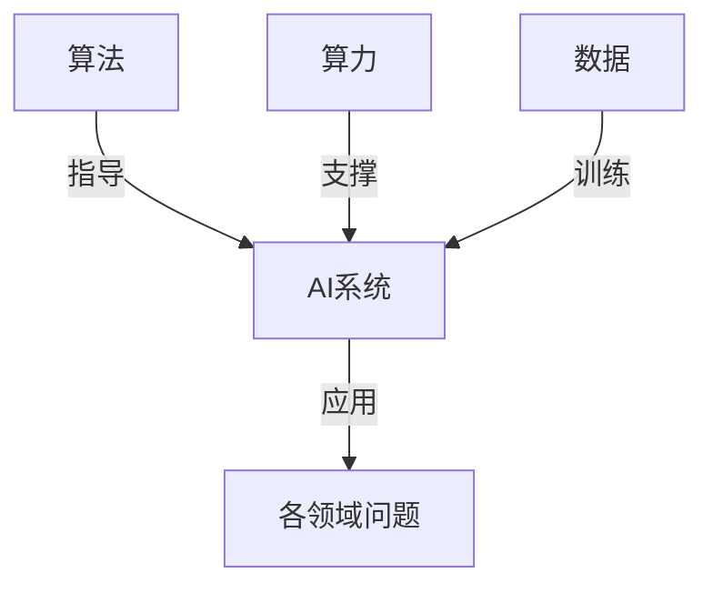

# AI发展的三匹马：算法、算力与数据

## 1. 背景介绍

### 1.1 问题的由来

人工智能(AI)的发展离不开三个关键因素:算法、算力和数据。这三者相互影响、相辅相成,推动着AI技术的飞速进步。

算法是AI的大脑和理论基础,它决定了AI系统的功能和性能。优秀的算法能够从海量数据中发现隐藏的规律和模式,并将其应用于各种实际问题的解决。

算力则是AI系统的计算能力,它决定了算法能够处理数据的规模和速度。随着硬件技术的快速发展,尤其是GPU和TPU等专用硬件的出现,算力的提升为AI算法的实现提供了强大的动力。

而数据是训练AI模型的基础,高质量的数据集能够帮助算法更好地学习和泛化。大数据时代的到来,使得各行各业都产生了海量的数据,为AI提供了充足的燃料。

只有算法、算力和数据三者的协同发展,AI技术才能不断突破新的frontier。本文将深入探讨这三匹马在AI发展中的作用和相互关系,并展望未来的发展趋势和挑战。

### 1.2 研究现状

近年来,AI取得了令人瞩目的进展,在计算机视觉、自然语言处理、决策控制等多个领域展现出了超人的能力。这些成就的取得,很大程度上归功于算法、算力和数据三驾马车的驰骋。

**算法方面**,深度学习算法在多个领域取得了突破性进展。卷积神经网络(CNN)在计算机视觉任务中表现出色,循环神经网络(RNN)和Transformer在自然语言处理任务中大放异彩,强化学习算法在决策控制领域取得了长足进步。

**算力方面**,GPU和TPU等专用硬件的出现,极大地提升了深度学习模型的训练和推理速度。同时,分布式并行计算技术的发展,使得训练大规模模型成为可能。

**数据方面**,互联网公司和科研机构积累了大量的结构化和非结构化数据集,为训练高质量的AI模型提供了基础。开源社区的兴起,也促进了数据和模型的共享,加速了AI技术的发展。

然而,现有的算法、算力和数据还存在一些不足,制约着AI技术的进一步发展。例如,当前的深度学习算法存在可解释性差、数据效率低下等问题。算力的提升也面临着能耗和制程工艺等瓶颈。而高质量数据的获取和标注也是一个巨大的挑战。

### 1.3 研究意义

算法、算力和数据是AI发展的三驾马车,对它们的深入研究,具有重要的理论意义和应用价值:

- **理论意义**:探索算法、算力和数据之间的内在联系,有助于构建AI发展的理论框架,揭示其本质规律。这将为AI技术的长期发展提供理论指导。

- **应用价值**:优化算法、提升算力、挖掘高质量数据,将直接推动AI在各个领域的实际应用,为社会发展和人类文明进步贡献力量。

通过本文的研究,我们将全面剖析算法、算力和数据在AI发展中的作用,并探讨它们之间的相互关系和发展趋势,为AI技术的未来发展指明方向。

### 1.4 本文结构

本文共分为8个部分:

1. **背景介绍**:阐述算法、算力和数据在AI发展中的重要性,以及研究现状和意义。

2. **核心概念与联系**:介绍算法、算力和数据的核心概念,并探讨它们之间的内在联系。

3. **核心算法原理与具体操作步骤**:重点分析当前主流的AI算法原理,并详细讲解其具体操作步骤。

4. **数学模型和公式详细讲解与举例说明**:构建AI算法的数学模型,推导核心公式,并通过案例分析加深理解。

5. **项目实践:代码实例和详细解释说明**:提供AI算法的代码实现示例,并进行详细的解读和分析。

6. **实际应用场景**:介绍算法、算力和数据在实际应用中的案例,并展望未来的发展方向。

7. **工具和资源推荐**:推荐AI领域的学习资源、开发工具、相关论文和其他有价值的资源。

8. **总结:未来发展趋势与挑战**:总结研究成果,展望AI算法、算力和数据的发展趋势,并分析面临的挑战。

9. **附录:常见问题与解答**:针对算法、算力和数据的常见问题,给出解答和建议。

通过全面而深入的分析,本文将为读者提供算法、算力和数据在AI发展中的本质认识,并为未来的研究和应用指明方向。

## 2. 核心概念与联系

在探讨算法、算力和数据的核心概念之前,我们先来看一下它们在AI发展中的地位和作用:

如上图所示,算法是AI系统的大脑和理论指导,它决定了AI系统的功能和性能;算力为算法的实现提供了计算能力的支撑;而数据则是训练AI模型的基础资源。AI系统通过算法、算力和数据的协同,最终被应用于解决各个领域的实际问题。

接下来,我们逐一介绍算法、算力和数据的核心概念。

### 2.1 算法

算法是一种解决特定问题的规则或步骤的集合。在AI领域,算法主要包括以下几种类型:

1. **监督学习算法**:根据带有标签的训练数据,学习出一个模型,用于对新的输入数据进行预测或分类。常见算法包括线性回归、逻辑回归、支持向量机(SVM)、决策树、随机森林等。

2. **无监督学习算法**:从未标注的数据中发现隐藏的模式或规律。常见算法包括聚类算法(如K-Means)、关联规则挖掘、降维算法(如PCA)等。

3. **深度学习算法**:基于人工神经网络的一种表示学习算法,能够从原始数据中自动学习特征表示。包括卷积神经网络(CNN)、循环神经网络(RNN)、生成对抗网络(GAN)等。

4. **强化学习算法**:通过与环境的交互,学习一个策略,使代理能够获得最大的累积回报。常见算法包括Q-Learning、策略梯度等。

5. **进化算法**:模拟生物进化过程,通过选择、交叉和变异等操作,逐步优化解的群体。包括遗传算法、蚁群算法等。

6. **其他算法**:如规则系统、决策树、贝叶斯网络等。

这些算法各有特点,适用于不同的问题场景。选择合适的算法,并对其进行优化和改进,是提升AI系统性能的关键。

### 2.2 算力

算力是指AI系统进行计算的能力,主要包括以下几个方面:

1. **计算硬件**:CPU、GPU、TPU、FPGA等不同类型的计算硬件,决定了AI系统的计算能力上限。

2. **内存和存储**:内存(RAM)决定了可以同时加载的数据和模型的规模,存储(SSD/HDD)决定了可以访问的数据集的大小。

3. **网络带宽**:在分布式训练和推理场景下,网络带宽决定了数据和模型在不同节点之间的传输速度。

4. **并行计算**:通过多线程、多进程、多机器等方式,实现计算任务的并行化,从而提高计算效率。

5. **算力优化**:包括模型压缩、量化、异构计算等技术,旨在充分利用现有硬件资源,提升算力利用率。

6. **能源效率**:计算所消耗的能源,决定了算力的成本和可持续性。

算力的提升不仅能够支撑更大规模、更复杂的AI模型,还能够加快模型的训练和推理速度,从而扩展AI的应用场景。然而,算力的无限扩展也面临着能耗、制程工艺等瓶颈,需要在算法和硬件层面共同努力。

### 2.3 数据

数据是训练AI模型的基础资源,其质量和数量直接影响着模型的性能。在AI领域,常见的数据类型包括:

1. **结构化数据**:具有固定模式的数据,如数据库中的表格数据、电子表格等。

2. **非结构化数据**:不具有固定模式的数据,如文本、图像、视频、语音等。

3. **时序数据**:按时间顺序排列的数据,如传感器数据、日志数据等。

4. **图数据**:由节点和边组成的网络结构数据,如社交网络、知识图谱等。

除了数据类型,数据的质量也是一个重要指标,包括:

1. **准确性**:数据是否准确反映了真实世界。

2. **完整性**:数据是否完整,没有缺失或错误。

3. **一致性**:数据之间是否存在矛盾或冲突。

4. **多样性**:数据是否包含了足够的差异性,避免过拟合。

5. **标注质量**:对于有监督学习,标注的准确性和一致性至关重要。

6. **隐私和安全**:数据是否遵守隐私和安全法规。

获取高质量的数据是一个巨大的挑战,需要投入大量的人力和资源。同时,如何高效利用现有数据,提升数据效率,也是AI发展的一个重要课题。

### 2.4 三者的内在联系

算法、算力和数据在AI发展中相互影响、相辅相成:

1. **算法驱动算力需求**:复杂的算法需要更强大的算力作为支撑,如深度学习算法对GPU/TPU的算力需求。

2. **算力推动算法创新**:算力的提升为更复杂算法的实现创造了条件,如大规模语言模型的出现。

3. **算法提高数据利用率**:优秀的算法能够从有限的数据中学习到更多的知识,提高数据的利用效率。

4. **数据驱动算法发展**:新的数据类型和应用场景,促使算法不断进化以适应新的需求。

5. **数据对算力提出需求**:大规模数据集需要更强的算力进行存储、传输和处理。

6. **算力支撑数据处理**:算力的提升使得对海量数据的高效处理成为可能。

因此,算法、算力和数据之间存在着错综复杂的相互关系,它们的发展是一个相互促进、相互驱动的过程。只有三者的协同发展,AI技术才能取得持续的突破。

## 3. 核心算法原理与具体操作步骤

在上一节中,我们介绍了AI领域的主要算法类型。本节将重点分析当前主流的深度学习算法的原理,并详细讲解其具体操作步骤。

### 3.1 算法原理概述

深度学习算法的核心思想是通过构建深层次的神经网络模型,从原始数据中自动学习出多层次的特征表示,并基于这些特征表示完成各种任务,如分类、回归、聚类等。

深度学习算法的主要特点包括:

1. **端到端学习**:不需要人工设计特征,而是由模型自动从原始数据中学习特征表示。

2. **层次化特征表示**:通过多层非线性变换,模型能够学习出底层的低级特征和高层的抽象特征。

3. **共享权重**:同一层内的神经元共享权重参数,大大减少了需要学习的参数量。

4. **可微分**:神经网络的前向计算和反向传播都是可微分的,可以通过梯度下降等优化算法进行端到端的训练。

5. **高度并行化**:神经网络的计算过程天然具有并行性,可以充分利用现代硬件(如GPU)的并行计算能力。

深度学习算法主要分为以下几类:

1. **前馈神