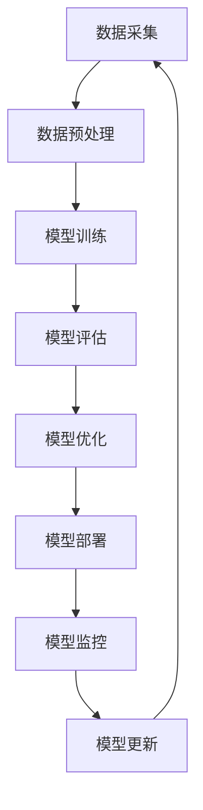

# AI工程学：实战开发手册

## 1. 背景介绍

### 1.1 问题的由来

在当今时代，人工智能(AI)已经渗透到我们生活和工作的方方面面。从语音助手到自动驾驶汽车，从医疗诊断到金融风险评估，AI无处不在。然而，尽管AI带来了巨大的机遇和挑战，但将AI理论付诸实践并将其集成到实际应用程序中仍然是一个艰巨的任务。

传统的软件开发方法往往难以应对AI系统的复杂性和不确定性。AI系统需要处理大量的数据、复杂的模型和算法,并在动态环境中做出智能决策。此外,AI系统还需要考虑诸如公平性、隐私、安全性和可解释性等关键因素。

因此,迫切需要一种系统化的方法来设计、开发、测试和部署AI应用程序。这种方法应该提供一套最佳实践、工具和技术,以确保AI系统的可靠性、可扩展性和可维护性。

### 1.2 研究现状

近年来,AI工程学(AI Engineering)作为一个新兴的研究领域,旨在解决AI系统开发中的挑战。AI工程学致力于建立一个系统化的框架,将AI理论与软件工程实践相结合,以构建高质量、可靠和可扩展的AI应用程序。

目前,已有一些组织和研究机构开始探索AI工程学的实践。例如,Google的AI工程团队致力于构建可扩展和可靠的AI系统;微软的AI工程实践团队则专注于将AI集成到企业级应用程序中。此外,一些开源社区也在推动AI工程学的发展,如TensorFlow Extended(TFX)和Kubeflow等。

然而,尽管取得了一些进展,但AI工程学仍处于起步阶段。现有的方法和工具往往局限于特定的领域或用例,缺乏一个全面的、统一的框架。此外,AI工程学还面临着一些挑战,如模型可解释性、隐私保护、公平性等。

### 1.3 研究意义

AI工程学的发展对于推动AI技术的实际应用至关重要。通过建立系统化的方法和最佳实践,我们可以更好地设计、开发、测试和部署AI应用程序,确保它们的可靠性、可扩展性和可维护性。

具体而言,AI工程学可以带来以下好处:

1. **提高开发效率**:通过提供标准化的工作流程、工具和框架,AI工程学可以简化AI系统的开发过程,提高开发效率。

2. **确保系统质量**:AI工程学强调测试、验证和质量保证,有助于构建高质量、可靠的AI系统。

3. **促进协作**:AI工程学为不同角色(如数据科学家、软件工程师、领域专家等)的协作提供了一个共同语言和框架。

4. **提高可维护性**:通过模块化设计、版本控制和自动化测试等实践,AI工程学可以提高AI系统的可维护性。

5. **解决伦理挑战**:AI工程学还关注AI系统的伦理和社会影响,如公平性、隐私和可解释性等,旨在构建更加负责任的AI系统。

综上所述,AI工程学为实现AI技术的广泛应用奠定了坚实的基础,对于推动AI的发展具有重要意义。

### 1.4 本文结构

本文将全面介绍AI工程学的核心概念、方法和实践。文章的主要结构如下:

1. **背景介绍**:阐述AI工程学的由来、研究现状和意义。

2. **核心概念与联系**:探讨AI工程学的关键概念,如AI系统生命周期、MLOps等,并阐明它们之间的关系。

3. **核心算法原理与具体操作步骤**:深入剖析AI工程学中常用的算法原理,如机器学习算法、模型评估和优化等,并详细介绍其具体操作步骤。

4. **数学模型和公式详细讲解与举例说明**:阐述AI工程学中常用的数学模型和公式,如机器学习模型、优化算法等,并通过实例进行详细讲解。

5. **项目实践:代码实例和详细解释说明**:提供一个端到端的AI工程项目实践,包括开发环境搭建、源代码实现、代码解读和运行结果展示。

6. **实际应用场景**:介绍AI工程学在不同领域的实际应用场景,如计算机视觉、自然语言处理、推荐系统等,并探讨未来的应用前景。

7. **工具和资源推荐**:推荐AI工程学中常用的工具和学习资源,如开发框架、模型库、教程和论文等。

8. **总结:未来发展趋势与挑战**:总结AI工程学的研究成果,并展望未来的发展趋势和面临的挑战。

9. **附录:常见问题与解答**:解答AI工程学中常见的问题和困惑。

通过全面介绍AI工程学的理论基础和实践技巧,本文旨在为读者提供一个实用的指南,帮助他们更好地设计、开发和部署AI应用程序。

## 2. 核心概念与联系

在探讨AI工程学的核心概念之前,我们先来了解一下AI系统的生命周期。AI系统的生命周期通常包括以下几个阶段:

1. **数据采集**:从各种来源收集和整理数据,如传感器、日志文件、网络爬虫等。

2. **数据预处理**:对原始数据进行清洗、转换和标注,以准备用于模型训练。

3. **模型训练**:使用机器学习算法在预处理后的数据上训练模型。

4. **模型评估**:评估模型的性能和质量,确定是否需要进一步优化。

5. **模型优化**:根据评估结果,调整模型参数或算法,以提高模型性能。

6. **模型部署**:将优化后的模型集成到实际应用程序中,并投入生产环境。

7. **模型监控**:持续监控模型在生产环境中的表现,识别任何异常或性能下降。

8. **模型更新**:根据监控结果和新数据,重新训练或微调模型,以保持其性能和准确性。

这个生命周期是循环的,需要持续迭代以适应不断变化的数据和需求。AI工程学旨在为每个阶段提供最佳实践、工具和技术,以确保AI系统的高质量和可靠性。

### 2.1 AI系统生命周期管理

AI系统生命周期管理(AI System Lifecycle Management)是AI工程学的核心概念之一。它涉及管理和协调AI系统整个生命周期中的各个阶段和活动,包括:

- **数据管理**:收集、存储、版本控制和访问数据。
- **模型开发**:选择合适的算法、训练模型、评估模型性能。
- **模型部署**:将模型集成到应用程序中,并部署到生产环境。
- **模型监控**:监控模型在生产环境中的表现,识别任何异常或性能下降。
- **模型更新**:根据新数据和反馈,重新训练或微调模型。

AI系统生命周期管理还涉及跨职能团队的协作,如数据工程师、机器学习工程师、软件工程师和领域专家等。它还需要考虑AI系统的伦理和社会影响,如公平性、隐私和可解释性等。

### 2.2 MLOps

MLOps(Machine Learning Operations)是AI工程学中另一个关键概念。它借鉴了DevOps的理念和实践,将软件工程的原则应用于机器学习系统的开发和部署过程。

MLOps旨在建立一个端到端的工作流程,涵盖了AI系统生命周期的各个阶段,包括:

- **数据管理**:版本控制数据,确保数据的可追溯性和一致性。
- **模型训练和评估**:自动化模型训练和评估过程,加快迭代周期。
- **模型部署**:将模型部署到生产环境,并确保无缝集成。
- **模型监控**:持续监控模型的性能和质量,及时发现异常。
- **模型更新**:自动化模型更新过程,确保模型始终保持最新状态。

MLOps还强调自动化、版本控制、测试和监控等实践,以提高AI系统的可靠性、可重复性和可维护性。它还涉及构建可扩展的基础设施和工具,以支持AI系统的开发、测试和部署。

### 2.3 AI工程学与其他领域的关系

AI工程学与其他领域密切相关,如软件工程、数据工程、机器学习和系统架构等。它借鉴了这些领域的理念和实践,并将它们应用于AI系统的开发和部署过程。

- **软件工程**:AI工程学采用了软件工程中的许多实践,如敏捷开发、持续集成和持续交付(CI/CD)、测试驱动开发(TDD)等。
- **数据工程**:AI工程学依赖于数据工程,以确保高质量的数据供给和有效的数据管理。
- **机器学习**:AI工程学建立在机器学习的理论和算法基础之上,并将它们应用于实际应用程序中。
- **系统架构**:AI工程学需要考虑AI系统的整体架构,如微服务架构、事件驱动架构等,以确保系统的可扩展性和可维护性。

通过将这些领域的最佳实践相结合,AI工程学为构建高质量、可靠和可扩展的AI系统提供了一个全面的框架。

## 3. 核心算法原理与具体操作步骤

在AI工程学中,有许多核心算法和技术被广泛应用。本节将重点介绍其中几种最常见和最重要的算法原理,并详细阐述它们的具体操作步骤。

### 3.1 算法原理概述

#### 3.1.1 监督学习算法

监督学习是机器学习中最常见和最成熟的一种范式。它的目标是根据一组已标记的训练数据,学习出一个映射函数,该函数可以对新的未标记数据进行预测或分类。

常见的监督学习算法包括:

- **线性回归**:用于预测连续值的输出。
- **逻辑回归**:用于二分类问题。
- **支持向量机(SVM)**:用于分类和回归问题,具有良好的泛化能力。
- **决策树**:通过递归分割特征空间来进行预测或分类。
- **随机森林**:集成多个决策树,提高预测准确性和鲁棒性。
- **神经网络**:通过模拟生物神经元的工作原理,学习复杂的非线性映射关系。

#### 3.1.2 无监督学习算法

无监督学习旨在从未标记的数据中发现内在的模式和结构。它广泛应用于聚类、降维和异常检测等任务。

常见的无监督学习算法包括:

- **K-means聚类**:将数据划分为K个簇,使得簇内数据点相似度高,簇间相似度低。
- **层次聚类**:通过递归地将数据划分为更小的簇,形成一个层次结构。
- **主成分分析(PCA)**:将高维数据投影到一个低维空间,实现降维。
- **自编码器**:通过神经网络学习数据的压缩表示,用于降维和异常检测。

#### 3.1.3 强化学习算法

强化学习是一种基于反馈的学习范式,其目标是通过与环境的交互,学习出一个策略,使得代理能够最大化预期的累积奖励。

常见的强化学习算法包括:

- **Q-Learning**:基于价值迭代的经典强化学习算法。
- **策略梯度**:直接优化策略函数,常用于连续动作空间的问题。
- **深度Q网络(DQN)**:将Q-Learning与深度神经网络相结合,可以处理高维观测数据。
- **近端策略优化(PPO)**:一种高效且稳定的策略梯度算法,广泛应用于复杂