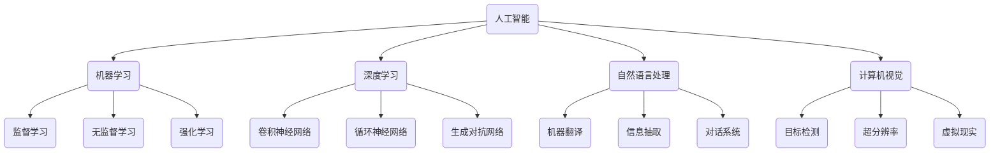
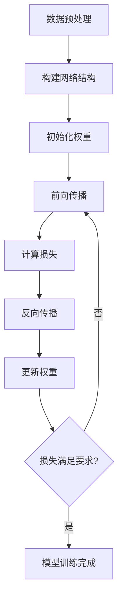

好的,我明白了您的要求。以下是题为《AI应用的新趋势与实践》的技术博客文章正文:

# AI应用的新趋势与实践

## 1. 背景介绍

### 1.1 问题的由来

在过去几十年中,人工智能(AI)技术取得了长足的进步,并被广泛应用于各个领域。随着算力的不断提升、数据量的激增以及算法的创新,AI已经渗透到我们生活和工作的方方面面。然而,AI的发展也面临着诸多挑战,例如算法偏差、数据隐私、安全性等问题。因此,探索AI的新趋势和实践,解决AI发展过程中遇到的问题,是当前AI研究的重中之重。

### 1.2 研究现状  

目前,AI的研究主要集中在以下几个方向:

1. 机器学习算法的优化和创新,包括深度学习、强化学习、迁移学习等。
2. 大规模数据处理和挖掘技术的发展。
3. AI系统的可解释性、公平性和安全性研究。
4. AI与其他领域的融合,如物联网、云计算、边缘计算等。
5. AI芯片和硬件加速技术的发展。

### 1.3 研究意义

探索AI的新趋势和实践对于推动AI技术的发展具有重要意义:

1. 有助于解决AI发展过程中遇到的各种挑战和问题。
2. 可以拓展AI的应用领域,发掘更多潜在的商业价值。
3. 促进AI技术与其他领域的融合,产生新的创新应用。
4. 提高AI系统的可靠性、安全性和可解释性,增强公众对AI的信任。

### 1.4 本文结构

本文将从以下几个方面探讨AI应用的新趋势与实践:

1. 介绍AI的核心概念和关键技术。
2. 阐述AI核心算法的原理和具体操作步骤。
3. 分析AI中常用的数学模型和公式,并结合案例进行讲解。
4. 通过实际项目实践,展示AI应用的代码实现和运行结果。
5. 探讨AI在不同领域的实际应用场景。
6. 推荐AI学习资源、开发工具和相关论文。
7. 总结AI的未来发展趋势和面临的挑战。

## 2. 核心概念与联系

在探讨AI应用的新趋势与实践之前,我们需要先了解AI的核心概念和关键技术。AI是一个庞大的领域,涵盖了多个子领域,如机器学习、深度学习、自然语言处理、计算机视觉等。这些子领域之间存在着密切的联系,相互影响和促进。

如上图所示,机器学习是AI的核心部分,包括监督学习、无监督学习和强化学习等不同的学习范式。深度学习是机器学习的一个分支,利用深度神经网络模型解决复杂的问题,如卷积神经网络(CNN)、循环神经网络(RNN)和生成对抗网络(GAN)等。自然语言处理(NLP)和计算机视觉(CV)则是AI的两大应用领域,分别处理文本和图像数据。

这些核心概念和关键技术相互关联、相互促进,共同推动着AI技术的发展。例如,深度学习技术的进步为NLP和CV任务带来了突破性的提升;而NLP和CV任务的需求又反过来推动了深度学习模型的创新。因此,全面理解这些核心概念及其联系,对于掌握AI应用的新趋势与实践至关重要。

## 3. 核心算法原理 & 具体操作步骤

### 3.1 算法原理概述

在AI领域,有许多核心算法被广泛应用,如决策树、支持向量机(SVM)、K-近邻(KNN)、贝叶斯分类器、人工神经网络等。这些算法各有特点,适用于不同的场景和任务。

以人工神经网络为例,它是一种模拟生物神经元结构和功能的数学模型。神经网络由多层节点(神经元)组成,每层节点通过加权连接与下一层节点相连。输入数据经过多层处理和非线性变换,最终得到输出结果。神经网络的关键在于通过训练数据对网络中的权重参数进行调整,使得输出结果与期望值之间的误差最小化。

### 3.2 算法步骤详解

以下是训练一个简单的前馈神经网络的具体步骤:

1. **数据预处理**:对输入数据进行归一化或标准化处理,使其分布更加合理。
2. **构建网络结构**:确定网络的层数、每层神经元个数、激活函数等参数。
3. **初始化权重**:通常采用小的随机值初始化网络中的权重参数。
4. **前向传播**:输入数据经过多层神经元的加权求和和激活函数处理,得到最终输出。
5. **计算损失**:比较输出结果与期望值之间的差异,计算损失函数的值。
6. **反向传播**:根据损失函数的梯度,通过反向传播算法计算每个权重参数的梯度。
7. **更新权重**:使用优化算法(如梯度下降)根据梯度值更新网络中的权重参数。
8. **重复训练**:重复执行步骤4-7,直到损失函数的值达到预期或达到最大迭代次数。

上述步骤可以通过流程图更直观地展示:

需要注意的是,不同的神经网络架构和任务可能会有一些细节上的差异,但总体思路是相似的。此外,还有许多技巧和优化方法可以提高训练效率和模型性能,如正则化、dropout、批归一化等。

### 3.3 算法优缺点

人工神经网络具有以下优点:

1. 强大的拟合能力,可以学习复杂的非线性映射关系。
2. 良好的泛化能力,能够很好地推广到新的未见过的数据。
3. 端到端的训练方式,无需人工设计特征。

但同时也存在一些缺点:

1. 需要大量的训练数据和计算资源。
2. 训练过程是一个黑箱操作,缺乏可解释性。
3. 容易过拟合,导致在训练集上表现良好,但在测试集上表现差。

### 3.4 算法应用领域

人工神经网络在多个领域都有广泛的应用,包括但不限于:

- **计算机视觉**:图像分类、目标检测、语义分割等。
- **自然语言处理**:机器翻译、文本生成、情感分析等。
- **语音识别**:自动语音识别、语音合成等。
- **推荐系统**:个性化推荐、协同过滤等。
- **金融**:信用评分、欺诈检测、风险管理等。
- **医疗**:病理诊断、药物发现、医学影像分析等。

总的来说,人工神经网络是一种强大的机器学习模型,在AI的多个领域发挥着重要作用。随着算法和硬件的不断进步,神经网络的应用场景将会越来越广泛。

## 4. 数学模型和公式 & 详细讲解 & 举例说明

### 4.1 数学模型构建

在AI领域,数学模型是描述和解释现象的重要工具。构建合适的数学模型对于算法的设计和优化至关重要。以下是一些常见的数学模型:

1. **线性模型**:线性回归、logistic回归等。
2. **概率模型**:朴素贝叶斯、隐马尔可夫模型等。
3. **核方法**:支持向量机、核Ridge回归等。
4. **决策树模型**:决策树、随机森林等。
5. **神经网络模型**:前馈神经网络、卷积神经网络、递归神经网络等。

以线性回归为例,它试图学习一个线性函数来拟合输入数据和目标值之间的关系。线性回归的数学模型可以表示为:

$$y = w^Tx + b$$

其中$x$是输入特征向量,$y$是目标值,$w$和$b$分别是权重向量和偏置项,需要通过训练数据来估计。

### 4.2 公式推导过程  

在机器学习中,我们通常需要优化某个目标函数(如损失函数)来获得最优模型参数。以线性回归为例,我们可以定义平方损失函数:

$$L(w, b) = \frac{1}{2n}\sum_{i=1}^n(y_i - w^Tx_i - b)^2$$

其中$n$是训练样本的个数。我们的目标是最小化损失函数$L(w, b)$,从而得到最优的$w$和$b$。

通过对$w$和$b$分别求偏导,并令偏导数等于0,我们可以得到损失函数的极小值点:

$$\begin{aligned}
\frac{\partial L}{\partial w} &= -\frac{1}{n}\sum_{i=1}^n(y_i - w^Tx_i - b)x_i = 0\\
\frac{\partial L}{\partial b} &= -\frac{1}{n}\sum_{i=1}^n(y_i - w^Tx_i - b) = 0
\end{aligned}$$

上式可以进一步化简为:

$$\begin{aligned}
w^T\sum_{i=1}^nx_ix_i^T &= \sum_{i=1}^nx_iy_i\\
\sum_{i=1}^n(y_i - w^Tx_i) &= 0
\end{aligned}$$

这就是线性回归的解析解,可以通过矩阵运算直接求解。在实际应用中,我们还可以使用梯度下降等优化算法来迭代求解$w$和$b$的值。

### 4.3 案例分析与讲解

为了更好地理解线性回归模型,我们来看一个实际案例。假设我们有一组房屋数据,包括每个房屋的面积(平方米)和价格(万元)。我们希望构建一个线性模型,根据房屋面积来预测其价格。

设$x_i$为第$i$个房屋的面积,$y_i$为其价格,我们可以构建如下线性回归模型:

$$y_i = w_0 + w_1x_i + \epsilon_i$$

其中$w_0$是偏置项,$w_1$是面积的权重系数,$\epsilon_i$是随机噪声项。我们的目标是通过训练数据估计出$w_0$和$w_1$的值,使得模型能够很好地拟合房屋面积和价格之间的关系。

假设我们有以下10个训练样本:

| 面积(平方米) | 价格(万元) |
|--------------|------------|
| 80           | 350        |
| 120          | 480        |
| 95           | 420        |
| ...          | ...        |
| 110          | 460        |

通过上述公式推导过程,我们可以得到$w_0$和$w_1$的解析解或使用梯度下降法进行迭代求解。最终得到的线性回归模型为:

$$y = 200 + 2.5x$$

也就是说,每增加1平方米的面积,房屋的价格就会增加2.5万元。我们可以使用这个模型来预测新房屋的价格,例如一个150平方米的房屋,预测价格为:

$$y = 200 + 2.5 \times 150 = 575 (万元)$$

当然,这只是一个简单的示例,实际情况可能会