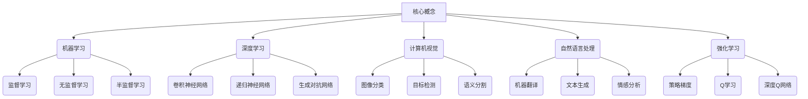

好的,我会严格按照您提供的要求和模板结构,以"AI技术在不同场景中的应用"为主题,撰写一篇专业的技术博客文章。

# AI技术在不同场景中的应用

## 1. 背景介绍

### 1.1 问题的由来

在当今时代,人工智能(AI)技术已经渗透到我们生活的方方面面。从语音助手到自动驾驶汽车,从医疗诊断到金融风险评估,AI无处不在。然而,不同的应用场景对AI技术提出了不同的挑战和需求。因此,探索AI技术在各种场景中的应用及其独特需求,对于推动AI技术的发展至关重要。

### 1.2 研究现状  

近年来,AI技术在诸多领域取得了长足进步,例如计算机视觉、自然语言处理、机器学习等。研究人员和工程师不断探索AI在不同场景中的应用潜力,旨在提高效率、优化决策过程,并为人类生活带来便利。然而,每个应用场景都有其独特的特点和约束条件,需要针对性地调整和优化AI算法和模型。

### 1.3 研究意义

深入探讨AI技术在不同场景中的应用,有助于我们更好地理解每个场景的独特需求,从而设计出更加高效、可靠和适用的AI解决方案。同时,这也将推动AI技术在各个领域的创新和发展,为解决复杂的现实世界问题提供强大的工具。

### 1.4 本文结构

本文将首先介绍AI技术在不同场景中应用所需的核心概念和算法原理。然后,我们将深入探讨数学模型和公式在AI应用中的作用,并通过实际案例进行详细说明。接下来,文章将提供一个实际项目的代码实现和解释,以加深读者对AI技术应用的理解。最后,我们将讨论AI技术在不同场景中的实际应用,并分享相关的工具和资源,总结未来的发展趋势和挑战。

## 2. 核心概念与联系

在探讨AI技术在不同场景中的应用之前,我们需要了解一些核心概念及其之间的联系。这些概念构成了AI技术的基础,对于理解和应用AI技术至关重要。

上图展示了AI技术中的一些核心概念及其相互关系。机器学习、深度学习、计算机视觉、自然语言处理和强化学习是AI技术的主要分支。每个分支都有自己的一系列算法和模型,用于解决特定类型的问题。

例如,机器学习包括监督学习、无监督学习和半监督学习等不同的学习范式。深度学习则涉及卷积神经网络、递归神经网络和生成对抗网络等模型。计算机视觉专注于图像分类、目标检测和语义分割等任务。自然语言处理则关注机器翻译、文本生成和情感分析等应用。强化学习则包括策略梯度、Q学习和深度Q网络等算法。

这些概念和算法相互关联,共同构建了AI技术的理论基础和实践应用。理解它们之间的联系对于有效应用AI技术至关重要。

## 3. 核心算法原理与具体操作步骤

在上一节中,我们介绍了AI技术中的一些核心概念。现在,让我们深入探讨其中一些核心算法的原理和具体操作步骤。

### 3.1 算法原理概述

在这一部分,我们将重点介绍两种广泛应用于不同场景的核心算法:支持向量机(SVM)和卷积神经网络(CNN)。

**支持向量机(SVM)**是一种监督学习算法,主要用于分类和回归任务。SVM的基本思想是在高维空间中构建一个超平面,将不同类别的数据点分开,并最大化每个类别数据点与超平面之间的距离。SVM通过核技巧将数据映射到高维空间,从而在低维空间中线性不可分的数据也可以在高维空间中变得可分。

**卷积神经网络(CNN)**是一种深度学习模型,广泛应用于计算机视觉任务,如图像分类、目标检测和语义分割。CNN由多个卷积层、池化层和全连接层组成。卷积层通过滤波器(kernel)在输入数据(如图像)上进行卷积操作,提取局部特征。池化层则用于降低特征图的维度,减少计算量。全连接层类似于传统的神经网络,用于将提取的特征映射到最终的输出。

### 3.2 算法步骤详解

**支持向量机(SVM)算法步骤:**

1. 数据预处理:对输入数据进行标准化或归一化,以提高算法的收敛速度和性能。
2. 核函数选择:选择合适的核函数(如线性核、多项式核或高斯核),将数据映射到高维空间。
3. 求解优化问题:通过求解对偶问题,找到最优超平面,使得每个类别的数据点与超平面之间的距离最大化。
4. 模型评估:使用交叉验证或测试集评估模型的性能,如准确率、精确率、召回率等指标。
5. 模型调优:根据评估结果,调整核函数参数、正则化参数等超参数,以提高模型性能。

**卷积神经网络(CNN)算法步骤:**

1. 数据预处理:对输入数据(如图像)进行预处理,如归一化、数据增强等。
2. 网络架构设计:设计CNN的架构,包括卷积层、池化层和全连接层的数量和参数。
3. 初始化权重:使用合适的方法(如Xavier初始化或He初始化)对网络权重进行初始化。
4. 前向传播:输入数据经过卷积层、池化层和全连接层,计算输出结果。
5. 反向传播:计算损失函数,并通过反向传播算法更新网络权重。
6. 模型训练:使用优化算法(如随机梯度下降或Adam优化器)迭代训练网络,直到达到预期性能或达到最大迭代次数。
7. 模型评估:使用测试集评估模型的性能,如准确率、精确率、召回率等指标。
8. 模型调优:根据评估结果,调整网络架构、超参数等,以提高模型性能。

### 3.3 算法优缺点

**支持向量机(SVM):**

优点:
- 理论基础坚实,有良好的数学理论支持。
- 对噪声和outlier具有较强的鲁棒性。
- 在高维空间中表现良好,可以有效处理高维数据。
- 通过核技巧,可以解决非线性可分问题。

缺点:
- 对大规模数据集的训练速度较慢。
- 对参数选择敏感,需要进行调参。
- 对于非线性可分问题,需要选择合适的核函数。
- 对于非均衡数据集,需要进行额外处理。

**卷积神经网络(CNN):**

优点:
- 在计算机视觉任务中表现出色,如图像分类、目标检测等。
- 通过卷积操作和权重共享,可以有效提取图像的局部特征。
- 具有一定的平移不变性和尺度不变性。
- 可以自动学习特征表示,无需手工设计特征。

缺点:
- 需要大量的训练数据和计算资源。
- 存在过拟合的风险,需要进行正则化和数据增强。
- 网络架构的设计需要一定的经验和试错。
- 对于序列数据或非结构化数据,可能需要特殊的网络架构。

### 3.4 算法应用领域

**支持向量机(SVM):**

- 文本分类:将文本文档分类到预定义的类别中,如垃圾邮件过滤、新闻分类等。
- 生物信息学:用于基因表达数据分析、蛋白质结构预测等。
- 图像识别:用于手写数字识别、人脸识别等任务。
- 金融风险管理:用于信用评分、欺诈检测等。

**卷积神经网络(CNN):**

- 图像分类:将图像分类到预定义的类别中,如物体识别、场景分类等。
- 目标检测:在图像中定位和识别特定目标的位置和类别。
- 语义分割:将图像中的每个像素分配到预定义的类别,用于场景理解和图像解析。
- 自然语言处理:通过一维卷积操作处理序列数据,应用于文本分类、机器翻译等任务。
- 推荐系统:通过CNN提取用户和商品的特征,用于个性化推荐。

## 4. 数学模型和公式详细讲解与举例说明

在上一节中,我们介绍了支持向量机(SVM)和卷积神经网络(CNN)的算法原理和步骤。现在,让我们深入探讨这些算法背后的数学模型和公式,并通过具体案例进行详细说明。

### 4.1 数学模型构建

**支持向量机(SVM)数学模型:**

SVM的目标是在高维空间中找到一个最优超平面,将不同类别的数据点分开,并最大化每个类别数据点与超平面之间的距离。这个距离被称为"函数间隔"(functional margin)。

对于线性可分的二分类问题,我们可以定义超平面为:

$$
\vec{w}^T\vec{x} + b = 0
$$

其中$\vec{w}$是超平面的法向量,决定了超平面的方向;$b$是偏置项,决定了超平面在空间中的位置;$\vec{x}$是输入数据点。

我们希望找到一个最优超平面,使得每个类别的数据点与超平面之间的距离最大化。这个距离被称为"几何间隔"(geometric margin),定义为:

$$
\gamma = \min_{i=1,\dots,n} \frac{|y_i(\vec{w}^T\vec{x_i} + b)|}{\|\vec{w}\|}
$$

其中$y_i$是数据点$\vec{x_i}$的标签,取值为+1或-1。

为了最大化几何间隔,我们可以等价地最小化$\|\vec{w}\|^2$,从而将问题转化为以下约束优化问题:

$$
\begin{aligned}
\min_{\vec{w},b} &\quad \frac{1}{2}\|\vec{w}\|^2 \\
\text{s.t.} &\quad y_i(\vec{w}^T\vec{x_i} + b) \geq 1, \quad i=1,\dots,n
\end{aligned}
$$

通过引入拉格朗日乘子法,我们可以将上述优化问题转化为对偶形式,从而求解出最优超平面的参数$\vec{w}$和$b$。

**卷积神经网络(CNN)数学模型:**

CNN的核心操作是卷积(convolution)和池化(pooling)。卷积操作通过滤波器(kernel)在输入数据上进行卷积,提取局部特征。池化操作则用于降低特征图的维度,减少计算量。

对于一个二维输入数据$X$和一个二维滤波器$K$,卷积操作可以表示为:

$$
S(i, j) = (X * K)(i, j) = \sum_{m}\sum_{n}X(i+m, j+n)K(m, n)
$$

其中$S(i, j)$是输出特征图在位置$(i, j)$处的值,$*$表示卷积操作。

常见的池化操作包括最大池化(max pooling)和平均池化(average pooling)。最大池化的数学表达式为:

$$
\text{pool}(X)_{i, j} = \max_{(m, n) \in R} X_{i+m, j+n}
$$

其中$R$是池化区域