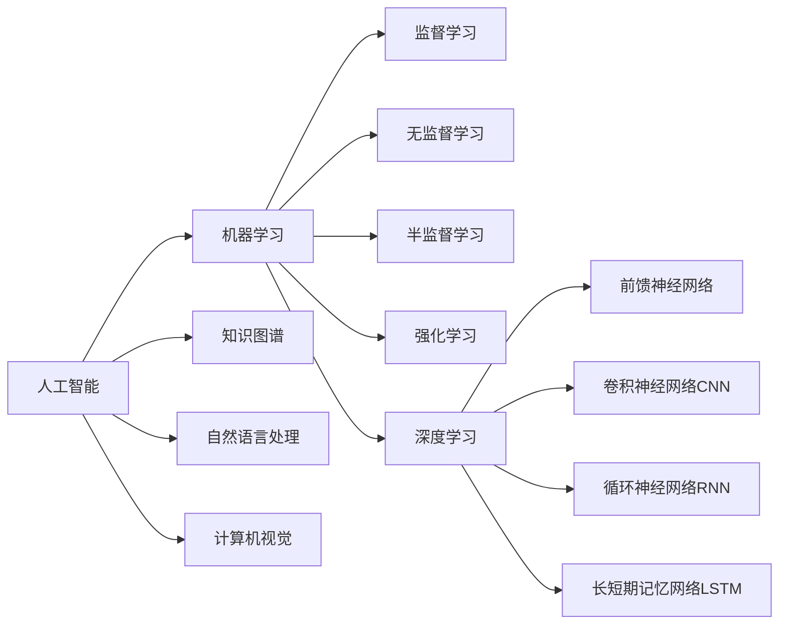

# AI进展的意义与未来展望

关键词：人工智能、机器学习、深度学习、神经网络、自然语言处理、计算机视觉、强化学习、AI伦理、AI安全、AI未来

## 1. 背景介绍
### 1.1 问题的由来
人工智能(Artificial Intelligence,AI)自1956年达特茅斯会议提出以来,经历了几次起起伏伏。近年来,随着算力的提升、大数据的积累以及算法的创新,AI再次迎来蓬勃发展,在语音识别、图像识别、自然语言处理等领域取得了突破性进展,引发了学术界和产业界的广泛关注。然而,当前AI的发展也面临着诸多问题和挑战,亟需学界和业界的共同努力。

### 1.2 研究现状 
当前,AI的研究主要集中在机器学习、深度学习、知识图谱、自然语言处理、计算机视觉等领域。以深度学习为代表的AI技术,在图像分类、语音识别、机器翻译等任务上已经达到甚至超过了人类的水平。谷歌DeepMind的AlphaGo击败世界围棋冠军,展现了深度强化学习的威力。OpenAI的GPT-3语言模型可以生成接近人类水平的文本。这些进展标志着AI正在从感知智能走向认知智能。

### 1.3 研究意义
AI的发展对科技进步、经济增长和社会变革具有重大意义。首先,AI可以极大提升生产力,释放人力,创造巨大经济价值。其次,AI可以在教育、医疗、交通、环保等领域广泛应用,造福人类。第三,AI将推动科技的跨越式发展,催生新的学科和产业。但同时,AI也带来了就业、隐私、安全、伦理等方面的挑战,需要未雨绸缪。总之,把握AI发展机遇,应对AI带来的挑战,对个人、国家乃至人类命运至关重要。

### 1.4 本文结构
本文将围绕AI进展的意义与未来展望展开论述。第2部分介绍AI的核心概念及其内在联系。第3部分重点阐述主流的机器学习算法原理和操作步骤。第4部分系统讲解AI中的数学模型和公式。第5部分通过代码实例演示AI项目的实现。第6部分分析AI技术的典型应用场景。第7部分推荐AI领域的学习资源和工具。第8部分总结全文,展望AI未来发展趋势和挑战。第9部分附录,解答AI学习中的常见问题。

## 2. 核心概念与联系
人工智能是计算机科学的一个分支,旨在研究如何让机器像人一样感知、认知、决策和行动。机器学习是实现AI的主要途径,通过学习数据来优化模型。深度学习是机器学习的一个重要分支,使用类似人脑的神经网络,逐层提取数据的特征。

机器学习主要包括监督学习、无监督学习、半监督学习和强化学习。监督学习需要标注数据,常用于分类和回归任务。无监督学习不需要标注,用于聚类、降维等。半监督学习介于两者之间。强化学习通过奖惩来学习最优策略。

深度学习的典型网络包括前馈神经网络、卷积神经网络(CNN)、循环神经网络(RNN)、长短期记忆网络(LSTM)等。CNN擅长处理图像,RNN和LSTM擅长序列数据。

知识图谱是将知识以图网络的形式表示出来,便于机器理解和推理。自然语言处理让机器能理解、生成和翻译人类语言。计算机视觉让机器能识别图像和视频中的物体、场景等。

AI的核心概念环环相扣,构成了AI的知识体系,如下图所示:



## 3. 核心算法原理 & 具体操作步骤
### 3.1 算法原理概述
机器学习的核心是让机器通过学习数据来优化模型参数,从而对新数据做出正确判断。监督学习中,模型在带标签的训练集上学习,通过最小化损失函数来调整参数,提高在测试集上的性能。无监督学习从无标签数据中发现内在结构和规律。半监督学习同时利用少量有标签数据和大量无标签数据。强化学习中,智能体通过与环境交互,根据奖惩来优化策略,最大化长期累积奖赏。

深度学习使用神经网络来表征从简单到复杂的特征层次。前馈网络逐层传递信号。CNN通过卷积、池化等操作来提取图像特征。RNN通过循环连接来处理序列依赖。LSTM通过门机制来缓解梯度消失。各种网络结构和训练技巧不断推陈出新,使得模型性能不断刷新纪录。

### 3.2 算法步骤详解
以监督学习的分类任务为例,详细说明机器学习的步骤:

1. 收集和标注数据,划分训练集、验证集和测试集。
2. 选择合适的模型,如逻辑回归、决策树、支持向量机、神经网络等。
3. 定义损失函数,如交叉熵、铰链损失等,表征预测值与真实值的差异。
4. 选择优化算法,如梯度下降、Adam等,来最小化损失函数。
5. 在训练集上迭代优化模型,并在验证集上评估模型性能,适时停止训练以防过拟合。
6. 在测试集上评估模型的泛化性能,如准确率、召回率、F1值等。
7. 如果性能不满意,可以调整模型的超参数,如学习率、正则化系数等,重复训练过程。
8. 将训练好的模型应用于实际任务,并持续监控和更新模型。

### 3.3 算法优缺点
监督学习的优点是可以学习复杂的非线性模式,并且可解释性较好。缺点是需要大量标注数据,且泛化能力依赖数据质量。

无监督学习的优点是不需要标注,可发现数据内在结构。缺点是学习到的模式可解释性不强。

强化学习的优点是可以学习连续的动作策略,并主动探索环境。缺点是样本效率低,且不稳定性高。

深度学习的优点是可以学习到高层次的抽象特征,并可端到端训练。缺点是需要大量数据和算力,且可解释性差。

### 3.4 算法应用领域
机器学习在互联网、金融、医疗、教育、制造、交通等领域得到广泛应用。如搜索引擎、推荐系统、欺诈检测、智能助理、自动驾驶、医学影像、智能制造等。

深度学习特别适合处理语音、图像、视频和文本等非结构化数据。如人脸识别、语音识别、机器翻译、自动驾驶、药物发现等。

强化学习在游戏、机器人、无人驾驶、网络优化等领域崭露头角。如AlphaGo、OpenAI Five、Libratus等。

## 4. 数学模型和公式 & 详细讲解 & 举例说明
### 4.1 数学模型构建
机器学习的本质是统计学习,通过构建数学模型来近似数据的真实分布。监督学习可以表示为条件概率分布$P(Y|X)$,无监督学习可以表示为联合概率分布$P(X)$。

以线性回归为例,我们假设因变量$y$和自变量$x$之间存在线性关系:

$$y=w^Tx+b+\epsilon$$

其中$w$是权重向量,$b$是偏置项,$\epsilon$是噪声项。我们的目标是学习$w$和$b$,使得预测值$\hat{y}=w^Tx+b$尽可能接近真实值$y$。

### 4.2 公式推导过程
为了学习最优的模型参数,我们需要最小化损失函数。以均方误差为例,损失函数定义为:

$$J(w,b)=\frac{1}{2m}\sum_{i=1}^m(\hat{y}^{(i)}-y^{(i)})^2$$

其中$m$是样本数量,$\hat{y}^{(i)}$是第$i$个样本的预测值,$y^{(i)}$是第$i$个样本的真实值。

我们可以用梯度下降法来最小化损失函数。参数$w$和$b$的更新公式为:

$$w:=w-\alpha\frac{\partial J}{\partial w}$$
$$b:=b-\alpha\frac{\partial J}{\partial b}$$

其中$\alpha$是学习率。将$J$对$w$和$b$求偏导,可得:

$$\frac{\partial J}{\partial w}=\frac{1}{m}\sum_{i=1}^m(\hat{y}^{(i)}-y^{(i)})x^{(i)}$$
$$\frac{\partial J}{\partial b}=\frac{1}{m}\sum_{i=1}^m(\hat{y}^{(i)}-y^{(i)})$$

将偏导数代入参数更新公式,即可迭代优化模型。

### 4.3 案例分析与讲解
下面我们用一个简单的二维数据集来说明线性回归的过程。假设我们有5个样本点:

$$(x^{(1)},y^{(1)})=(1,3)$$
$$(x^{(2)},y^{(2)})=(2,5)$$ 
$$(x^{(3)},y^{(3)})=(3,7)$$
$$(x^{(4)},y^{(4)})=(4,9)$$
$$(x^{(5)},y^{(5)})=(5,11)$$

我们要学习一个线性模型$y=wx+b$来拟合这些点。初始化参数为$w=0,b=0$,学习率$\alpha=0.01$。

在第一次迭代中,我们计算损失函数关于$w$和$b$的偏导数:

$$\frac{\partial J}{\partial w}=\frac{1}{5}\sum_{i=1}^5(0-y^{(i)})x^{(i)}=-11$$
$$\frac{\partial J}{\partial b}=\frac{1}{5}\sum_{i=1}^5(0-y^{(i)})=-7$$

然后更新参数:

$$w:=0-0.01\times(-11)=0.11$$
$$b:=0-0.01\times(-7)=0.07$$

在第二次迭代中,我们计算新的偏导数:

$$\frac{\partial J}{\partial w}=\frac{1}{5}\sum_{i=1}^5(0.11x^{(i)}+0.07-y^{(i)})x^{(i)}=-9.615$$
$$\frac{\partial J}{\partial b}=\frac{1}{5}\sum_{i=1}^5(0.11x^{(i)}+0.07-y^{(i)})=-6.755$$

然后更新参数:

$$w:=0.11-0.01\times(-9.615)=0.2062$$
$$b:=0.07-0.01\times(-6.755)=0.1376$$

如此迭代下去,直到损失函数收敛。最终学习到的模型可能是$y=2x+1$,如下图所示:

```
5 |                 *
4 |             *
3 |         *
2 |     *
1 | * 
  ---------------------
    1 2 3 4 5
```

可以看到,线性回归可以很好地拟合这些点。当然,实际问题中的数据分布可能没有这么理想,需要更复杂的非线性模型。

### 4.4 常见问题解答
**Q:** 梯度下降法的缺点有哪些?

**A:** 梯度下降法可能收敛到局部最优而非全局最优,对参数初始值敏感。此外,学习率的选择也很关键,太大会震荡,太小收敛慢。为此,提出了许多改进算法,如随机梯度下降、Adam等。

**Q:** 过拟合和欠拟合的原因和解决方法?

**A:** 过拟合是模型过于复杂,把噪声也拟合进去。欠拟合是