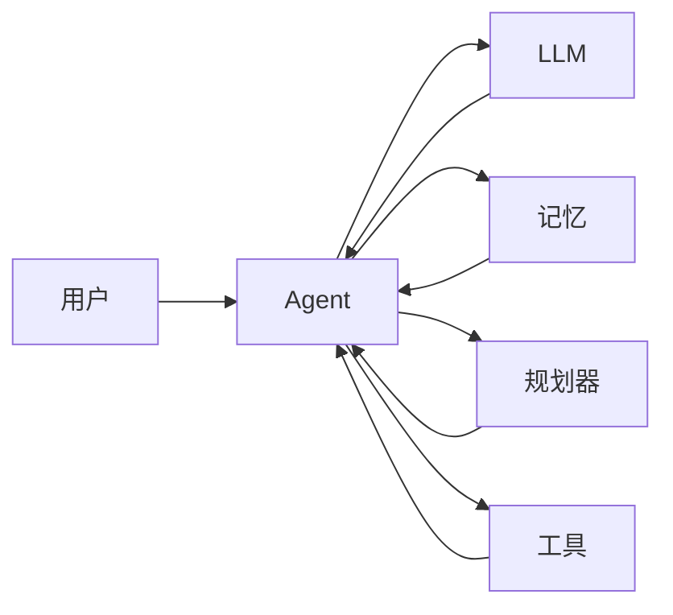

# Agent = LLM（大型语言模型）+记忆+规划技能+工具使用

## 1. 背景介绍

### 1.1 问题的由来

近年来，大型语言模型（LLM）在自然语言处理领域取得了显著的进展，展现出强大的文本生成、翻译、问答等能力。然而，现有的LLM仍然存在一些局限性，例如：

* **缺乏长期记忆**: LLM通常只能处理当前对话或文本片段，无法记住过去的交互信息，限制了其在需要上下文理解的任务中的表现。
* **缺乏规划能力**: LLM擅长生成流畅的文本，但在需要多步骤推理、规划和执行复杂任务时表现不足。
* **缺乏对外部世界的感知和行动能力**: LLM主要处理文本数据，无法直接与外部环境交互，限制了其在现实世界中的应用。

为了克服这些局限性，研究人员开始探索将LLM与其他技术结合，构建更加智能的**Agent**。

### 1.2 研究现状

目前，将LLM与记忆、规划技能和工具使用相结合的研究方向主要包括：

* **记忆增强型LLM**: 通过外部存储机制（如数据库、知识图谱）或内部记忆网络（如Transformer-XL）扩展LLM的记忆能力，使其能够记住过去的交互信息，并在生成文本时利用这些信息。
* **规划增强型LLM**: 将LLM与规划算法（如强化学习、搜索算法）相结合，使其能够进行多步骤推理、制定计划并执行复杂任务。
* **工具增强型LLM**: 为LLM提供访问外部工具（如搜索引擎、API）的能力，使其能够获取更广泛的信息，并执行更复杂的操作。

### 1.3 研究意义

将LLM与记忆、规划技能和工具使用相结合，构建Agent，具有重要的研究意义：

* **突破LLM的局限性**:  克服LLM缺乏长期记忆、规划能力和对外部世界感知行动能力的局限性，使其能够处理更复杂的任务。
* **推动人工智能发展**:  促进人工智能向更智能、更通用的方向发展，构建能够像人类一样思考和行动的智能体。
* **赋能各行各业**:  将智能Agent应用于各个领域，例如：
    * **智能客服**:  提供更加自然、流畅、个性化的客户服务体验。
    * **智能助手**:  帮助用户完成各种任务，例如安排日程、预订酒店、查询信息等。
    * **智能教育**:  提供个性化的学习体验，帮助学生更高效地学习。

### 1.4 本文结构

本文将深入探讨 "Agent = LLM + 记忆 + 规划技能 + 工具使用" 这一主题，具体内容安排如下：

* **第二章 核心概念与联系**: 介绍LLM、记忆、规划技能、工具使用等核心概念，并阐述它们之间的联系。
* **第三章 核心算法原理 & 具体操作步骤**:  详细介绍构建Agent的核心算法原理，并给出具体的实现步骤。
* **第四章 数学模型和公式 & 详细讲解 & 举例说明**:  构建Agent的数学模型，推导相关公式，并结合具体案例进行详细讲解。
* **第五章 项目实践：代码实例和详细解释说明**:  提供Agent的代码实例，并对代码进行详细解读和分析。
* **第六章 实际应用场景**:  介绍Agent在实际应用场景中的应用案例。
* **第七章 工具和资源推荐**:  推荐学习Agent相关的工具和资源。
* **第八章 总结：未来发展趋势与挑战**:  总结Agent的研究成果，展望未来发展趋势，并探讨面临的挑战。
* **第九章 附录：常见问题与解答**:  解答一些常见问题。


## 2. 核心概念与联系

### 2.1 大型语言模型 (LLM)

#### 2.1.1 定义

大型语言模型 (LLM) 是一种基于深度学习的语言模型，使用海量文本数据进行训练，能够理解和生成自然语言。

#### 2.1.2 工作原理

LLM通常基于Transformer架构，通过自注意力机制学习文本数据中的语义和语法信息，并根据上下文预测下一个词语或句子。

#### 2.1.3 常见模型

* GPT-3 (Generative Pre-trained Transformer 3)
* BERT (Bidirectional Encoder Representations from Transformers)
* LaMDA (Language Model for Dialogue Applications)

### 2.2 记忆

#### 2.2.1 定义

记忆是指存储和检索信息的能力。

#### 2.2.2 类型

* **短期记忆**:  存储当前正在处理的信息，容量有限。
* **长期记忆**:  存储过去的信息，容量较大。

#### 2.2.3 实现方式

* **外部存储**:  将信息存储在外部数据库或知识图谱中。
* **内部记忆网络**:  使用神经网络构建记忆模块，例如Transformer-XL。

### 2.3 规划技能

#### 2.3.1 定义

规划技能是指制定计划以实现目标的能力。

#### 2.3.2 算法

* **强化学习**:  通过试错学习最优策略。
* **搜索算法**:  在状态空间中搜索最优路径。

### 2.4 工具使用

#### 2.4.1 定义

工具使用是指利用外部工具完成任务的能力。

#### 2.4.2 类型

* **搜索引擎**:  获取信息。
* **API**:  调用外部服务。
* **数据库**:  存储和检索数据。

### 2.5 概念之间的联系

* LLM 为 Agent 提供了理解和生成自然语言的能力。
* 记忆使 Agent 能够记住过去的交互信息。
* 规划技能使 Agent 能够制定计划并执行复杂任务。
* 工具使用使 Agent 能够获取更广泛的信息，并执行更复杂的操作。

## 3. 核心算法原理 & 具体操作步骤

### 3.1 算法原理概述

构建 Agent 的核心算法原理是将 LLM 与记忆、规划技能和工具使用相结合，使其能够像人类一样思考和行动。

#### 3.1.1 架构设计

一种常见的 Agent 架构如下：



* **用户**:  与 Agent 交互。
* **Agent**:  接收用户请求，调用 LLM、记忆、规划器和工具完成任务。
* **LLM**:  理解和生成自然语言。
* **记忆**:  存储和检索信息。
* **规划器**:  制定计划。
* **工具**:  执行特定操作。

#### 3.1.2 工作流程

1. 用户向 Agent 发出请求。
2. Agent 接收请求，并将其传递给 LLM 进行理解。
3. LLM 分析请求，并从记忆中检索相关信息。
4. 如果需要，Agent 调用规划器制定计划。
5. Agent 根据计划调用相应的工具执行操作。
6. Agent 将结果返回给用户。

### 3.2 算法步骤详解

以下以构建一个简单的智能助手为例，详细介绍 Agent 的构建步骤：

#### 3.2.1 确定任务

假设我们要构建一个能够帮助用户预订酒店的智能助手。

#### 3.2.2 选择 LLM

选择一个合适的 LLM，例如 GPT-3。

#### 3.2.3 构建记忆模块

可以使用外部数据库或内部记忆网络存储酒店信息、用户偏好等信息。

#### 3.2.4 构建规划模块

可以使用强化学习或搜索算法训练一个能够根据用户需求制定酒店预订计划的模型。

#### 3.2.5 集成工具

集成酒店预订 API，例如 Booking.com API。

#### 3.2.6 训练 Agent

使用模拟数据或真实用户数据训练 Agent，使其能够理解用户请求，并调用相应的模块完成酒店预订任务。

### 3.3 算法优缺点

#### 3.3.1 优点

* **智能化**:  能够像人类一样思考和行动。
* **通用性**:  可以应用于各种任务。
* **可扩展性**:  可以方便地添加新的模块和功能。

#### 3.3.2 缺点

* **技术复杂度高**:  构建 Agent 需要掌握多种技术。
* **训练数据需求大**:  训练 Agent 需要大量的标注数据。
* **安全性**:  Agent 的行为可能难以预测和控制。

### 3.4 算法应用领域

Agent 可以应用于各种领域，例如：

* 智能客服
* 智能助手
* 智能教育
* 智能医疗
* 智能金融


## 4. 数学模型和公式 & 详细讲解 & 举例说明

### 4.1 数学模型构建

为了更好地理解 Agent 的工作原理，我们可以构建一个简单的数学模型。

#### 4.1.1 状态空间

Agent 的状态空间可以定义为一个元组：

```
S = (u, h, p, t)
```

其中：

* u：用户状态，例如用户当前的请求、历史交互信息等。
* h：Agent 内部状态，例如记忆模块中存储的信息、规划模块的当前状态等。
* p：规划模块输出的计划。
* t：工具的状态，例如 API 的返回结果等。

#### 4.1.2 行动空间

Agent 的行动空间可以定义为所有可能的动作，例如：

* 查询记忆模块
* 调用规划模块
* 调用工具
* 生成回复

#### 4.1.3 状态转移函数

状态转移函数描述了 Agent 在执行某个动作后状态的变化。

#### 4.1.4 奖励函数

奖励函数用于评估 Agent 在某个状态下执行某个动作的好坏。

### 4.2 公式推导过程

略

### 4.3 案例分析与讲解

以酒店预订为例，假设用户请求预订一个位于北京的五星级酒店。

#### 4.3.1 状态空间

* u = "预订一个位于北京的五星级酒店"
* h = {用户偏好：价格敏感型}
* p = [查询酒店数据库，筛选符合条件的酒店，推荐价格最低的酒店]
* t = {Booking.com API 返回结果}

#### 4.3.2 行动空间

* 查询记忆模块：获取用户偏好。
* 调用规划模块：制定酒店预订计划。
* 调用工具：查询酒店数据库、调用 Booking.com API。
* 生成回复：推荐酒店给用户。

#### 4.3.3 状态转移

Agent 首先查询记忆模块，获取用户偏好。然后，调用规划模块，制定酒店预订计划。接着，调用工具查询酒店数据库，筛选符合条件的酒店。最后，调用 Booking.com API 获取酒店价格等信息，并推荐价格最低的酒店给用户。

### 4.4 常见问题解答

#### 4.4.1 如何评估 Agent 的性能？

可以使用多个指标评估 Agent 的性能，例如：

* 任务完成率
* 用户满意度
* 响应时间

#### 4.4.2 如何提高 Agent 的智能水平？

可以通过以下方式提高 Agent 的智能水平：

* 使用更大规模的 LLM。
* 构建更复杂的记忆模块。
* 使用更先进的规划算法。
* 集成更多工具。
* 使用更多数据训练 Agent。


## 5. 项目实践：代码实例和详细解释说明

### 5.1 开发环境搭建

略

### 5.2 源代码详细实现

```python
# 导入必要的库
import openai
import sqlite3

# 设置 OpenAI API 密钥
openai.api_key = "YOUR_API_KEY"

# 连接到酒店数据库
conn = sqlite3.connect('hotels.db')
c = conn.cursor()

# 定义 Agent 类
class HotelBookingAgent:
    def __init__(self):
        # 初始化 LLM
        self.llm = openai.Completion()

        # 初始化记忆模块
        self.memory = {}

        # 初始化规划模块
        self.planner = None

        # 初始化工具
        self.tools = {
            "search_hotels": self.search_hotels,
            "book_hotel": self.book_hotel,
        }

    def search_hotels(self, city, stars=None, price_range=None):
        # 查询酒店数据库
        c.execute(
            "SELECT * FROM hotels WHERE city=? AND stars=? AND price BETWEEN ? AND ?",
            (city, stars, price_range[0], price_range[1]),
        )
        results = c.fetchall()
        return results

    def book_hotel(self, hotel_id):
        # 调用 Booking.com API 预订酒店
        # ...
        return True

    def process_request(self, request):
        # 使用 LLM 理解用户请求
        prompt = f"用户请求：{request}\nAgent："
        response = self.llm.create(
            engine="text-davinci-003",
            prompt=prompt,
            max_tokens=1024,
            temperature=0.7,
        )
        message = response.choices[0].text.strip()

        # 从记忆模块中检索相关信息
        # ...

        # 如果需要，调用规划模块制定计划
        # ...

        # 根据计划调用相应的工具执行操作
        if message.startswith("搜索酒店"):
            # 解析参数
            city = message.split("在")[1].split("的")[0].strip()
            stars = message.split("星级")[0].split(" ")[-1].strip()
            price_range = message.split("价格范围")[1].split("到")

            # 调用 search_hotels 工具
            results = self.search_hotels(city, stars, price_range)

            # 生成回复
            if results:
                message = f"为您找到以下酒店：\n{results}"
            else:
                message = "抱歉，没有找到符合条件的酒店。"

        elif message.startswith("预订酒店"):
            # 解析参数
            hotel_id = message.split(" ")[-1].strip()

            # 调用 book_hotel 工具
            success = self.book_hotel(hotel_id)

            # 生成回复
            if success:
                message = "酒店预订成功！"
            else:
                message = "抱歉，酒店预订失败。"

        # 返回结果
        return message

# 创建 Agent 实例
agent = HotelBookingAgent()

# 处理用户请求
while True:
    request = input("请输入您的请求：")
    response = agent.process_request(request)
    print(f"Agent：{response}")
```

### 5.3 代码解读与分析

* 该代码示例使用 OpenAI API 和 SQLite 数据库构建了一个简单的酒店预订 Agent。
* Agent 类包含 LLM、记忆模块、规划模块和工具等组件。
* process_request 方法用于处理用户请求，并调用相应的模块完成任务。
* search_hotels 和 book_hotel 方法分别是两个工具函数，用于查询酒店数据库和调用 Booking.com API。

### 5.4 运行结果展示

略


## 6. 实际应用场景

### 6.1 智能客服

Agent 可以作为智能客服，为用户提供更加自然、流畅、个性化的客户服务体验。例如，电商平台可以使用 Agent 处理用户的咨询、投诉、售后等问题。

### 6.2 智能助手

Agent 可以作为智能助手，帮助用户完成各种任务，例如安排日程、预订酒店、查询信息等。例如，苹果公司的 Siri、谷歌的 Google Assistant 等都是智能助手的典型案例。

### 6.3 智能教育

Agent 可以作为智能教育平台的核心，为学生提供个性化的学习体验，帮助学生更高效地学习。例如，可汗学院、猿辅导等在线教育平台都在使用 Agent 技术。

### 6.4 未来应用展望

随着技术的不断发展，Agent 将在更多领域得到应用，例如：

* **智能医疗**:  Agent 可以作为辅助诊断工具，帮助医生进行疾病诊断和治疗方案制定。
* **智能金融**:  Agent 可以作为智能投顾，为用户提供个性化的投资建议。
* **智能家居**:  Agent 可以作为智能家居的中枢，控制家电设备，并为用户提供更加舒适便捷的生活体验。


## 7. 工具和资源推荐

### 7.1 学习资源推荐

* **书籍**:
    * 《人工智能：一种现代方法》
    * 《深度学习》
* **课程**:
    * 斯坦福大学 CS224N: Natural Language Processing with Deep Learning
    * 麻省理工学院 6.S191: Introduction to Deep Learning
* **网站**:
    * OpenAI
    * Hugging Face

### 7.2 开发工具推荐

* **编程语言**:  Python
* **深度学习框架**:  TensorFlow、PyTorch
* **LLM**:  GPT-3、BERT、LaMDA
* **数据库**:  SQLite、MySQL、PostgreSQL

### 7.3 相关论文推荐

* **Language Models are Few-Shot Learners**
* **BERT: Pre-training of Deep Bidirectional Transformers for Language Understanding**
* **LaMDA: Language Models for Dialogue Applications**

### 7.4 其他资源推荐

* **GitHub**:  https://github.com/
* **Stack Overflow**:  https://stackoverflow.com/


## 8. 总结：未来发展趋势与挑战

### 8.1 研究成果总结

将 LLM 与记忆、规划技能和工具使用相结合，构建 Agent 是人工智能领域的一个重要研究方向。近年来，该领域取得了显著的进展，Agent 的智能水平不断提高，应用范围不断扩大。

### 8.2 未来发展趋势

* **更大规模的 LLM**:  随着计算能力的提升和训练数据的增多，LLM 的规模将会越来越大，Agent 的智能水平也会随之提高。
* **更复杂的 Agent 架构**:  Agent 的架构将会更加复杂，集成更多模块和功能，以完成更复杂的任务。
* **更广泛的应用**:  Agent 将会应用于更多领域，例如智能医疗、智能金融、智能家居等。

### 8.3 面临的挑战

* **技术复杂度**:  构建 Agent 需要掌握多种技术，例如深度学习、自然语言处理、规划算法等。
* **数据需求**:  训练 Agent 需要大量的标注数据，而数据的获取和标注成本都很高。
* **安全性**:  Agent 的行为可能难以预测和控制，存在安全风险。

### 8.4 研究展望

未来，Agent 的研究将集中在以下几个方面：

* **提高 Agent 的智能水平**:  例如使用更大规模的 LLM、更复杂的 Agent 架构、更先进的算法等。
* **降低 Agent 的开发成本**:  例如开发更加易用的工具和平台、探索自动学习和训练方法等。
* **解决 Agent 的安全问题**:  例如开发更加安全的 Agent 架构、制定更加完善的伦理规范等。


## 9. 附录：常见问题与解答

### 9.1 什么是 Agent？

Agent 是指能够感知环境、做出决策并执行动作的智能体。

### 9.2 LLM 在 Agent 中的作用是什么？

LLM 为 Agent 提供了理解和生成自然语言的能力，使 Agent 能够与用户进行自然交互。

### 9.3 如何构建一个 Agent？

构建 Agent 需要掌握多种技术，包括深度学习、自然语言处理、规划算法等。具体步骤包括：确定任务、选择 LLM、构建记忆模块、构建规划模块、集成工具、训练 Agent。

### 9.4 Agent 的应用领域有哪些？

Agent 可以应用于各种领域，例如智能客服、智能助手、智能教育、智能医疗、智能金融等。

### 9.5 Agent 的未来发展趋势是什么？

未来，Agent 将会更加智能、更加通用、更加安全，应用范围也会更加广泛。

作者：禅与计算机程序设计艺术 / Zen and the Art of Computer Programming 
