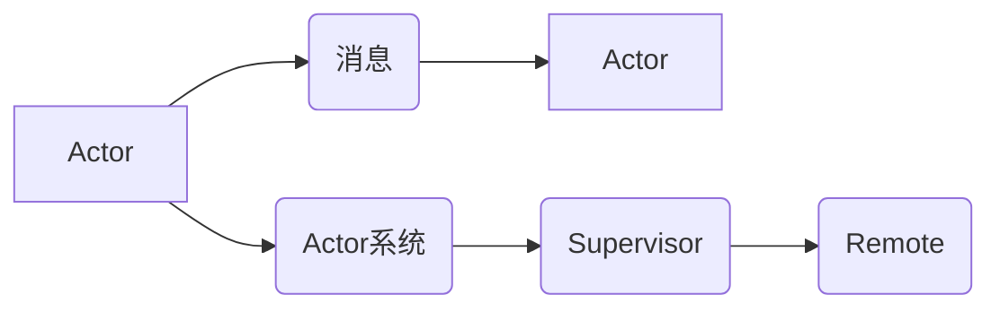
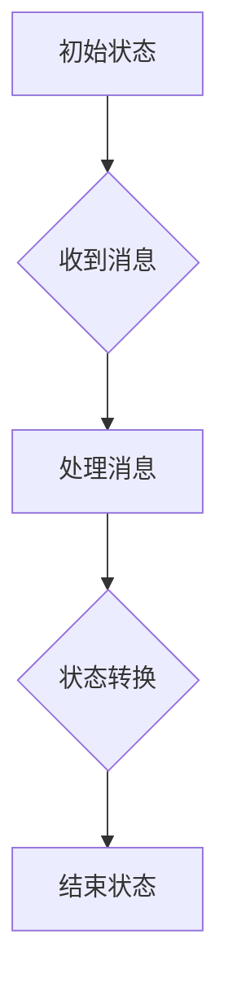

## 1. 背景介绍
### 1.1  问题的由来
在现代软件开发中，构建高并发、高可用的分布式系统越来越重要。传统的单进程架构难以应对海量并发请求和节点故障带来的挑战。为了解决这些问题，出现了许多并发编程框架和模型，其中Akka是一个基于Actor模型的分布式编程框架，它以其轻量级、弹性、容错性等特点，在构建高性能、可扩展的分布式系统方面展现出强大的优势。

### 1.2  研究现状
Actor模型起源于1973年，由Carl Hewitt提出。它是一种基于消息传递的并发编程模型，将系统分解成独立的Actor，每个Actor都是一个轻量级的进程，负责处理消息并执行相应的逻辑。Akka是基于Actor模型构建的开源框架，它提供了丰富的API和工具，帮助开发者构建高性能、可扩展的分布式系统。

### 1.3  研究意义
深入理解Akka框架的原理和应用，对于开发人员来说具有重要的意义：

* **掌握并发编程的最佳实践:** Akka框架提供了基于Actor模型的并发编程机制，可以帮助开发者更好地理解并发编程的原理和最佳实践。
* **构建高性能、可扩展的分布式系统:** Akka框架提供了丰富的工具和API，可以帮助开发者构建高性能、可扩展的分布式系统。
* **提高开发效率:** Akka框架的简洁易用性可以提高开发效率，帮助开发者更快地构建高质量的软件。

### 1.4  本文结构
本文将从Akka框架的背景介绍、核心概念、算法原理、代码实例、实际应用场景等方面进行详细讲解，帮助读者全面理解Akka框架的原理和应用。

## 2. 核心概念与联系
Akka框架的核心概念包括：

* **Actor:**  Akka框架的基本单元，是一个独立的进程，负责处理消息并执行相应的逻辑。
* **消息:**  Actor之间通信的方式，消息包含发送者、接收者和数据内容。
* **Actor系统:**  由多个Actor组成的集合，提供消息传递和管理机制。
* **Supervisor:**  负责管理子Actor的Actor，可以用于实现容错机制。
* **Remote:**  允许Actor跨节点通信，实现分布式系统。

**关系图:**



## 3. 核心算法原理 & 具体操作步骤
### 3.1  算法原理概述
Akka框架的核心算法是基于Actor模型的消息传递机制。每个Actor都维护一个消息队列，当收到消息时，会将其从队列中取出并执行相应的逻辑。Actor之间通过消息传递进行通信，消息传递过程是异步的，发送者不会等待接收者处理消息的完成。

### 3.2  算法步骤详解
1. **创建Actor:**  开发者需要创建Actor实例，并指定其行为逻辑。
2. **发送消息:**  开发者可以通过发送消息的方式与Actor进行交互。
3. **接收消息:**  Actor会从消息队列中取出消息，并根据消息内容执行相应的逻辑。
4. **处理消息:**  Actor处理消息的过程通常包括以下步骤：
    * 解析消息内容
    * 执行相应的逻辑
    * 发送回复消息
5. **管理Actor:**  开发者可以使用Supervisor管理子Actor，实现容错机制。

### 3.3  算法优缺点
**优点:**

* **轻量级:**  每个Actor都是一个轻量级的进程，可以高效地处理并发请求。
* **弹性:**  Actor系统可以轻松地扩展和缩减，以适应不同的负载情况。
* **容错性:**  Supervisor机制可以实现容错，即使某个Actor发生故障，也不会影响整个系统的运行。
* **易于维护:**  Actor模型的模块化设计使得系统易于维护和扩展。

**缺点:**

* **学习曲线:**  Actor模型的思维方式与传统的编程模型有所不同，需要一定的学习成本。
* **调试难度:**  由于Actor之间通过消息传递进行通信，调试Actor系统可能比较困难。

### 3.4  算法应用领域
Akka框架广泛应用于以下领域：

* **金融系统:**  处理高并发交易和风险管理。
* **电商平台:**  处理商品推荐、订单处理和支付等业务。
* **社交网络:**  处理用户消息、好友关系和数据分析等业务。
* **物联网:**  处理传感器数据采集、设备控制和数据分析等业务。

## 4. 数学模型和公式 & 详细讲解 & 举例说明
### 4.1  数学模型构建
Akka框架的数学模型可以抽象为一个状态机模型，其中每个状态代表一个Actor的状态，每个状态转换代表一个消息处理过程。

**状态机模型:**



### 4.2  公式推导过程
Akka框架的性能分析可以利用消息传递延迟、吞吐量和资源利用率等指标进行评估。

**吞吐量公式:**

```latex
吞吐量 = 1 / 平均处理时间
```

**资源利用率公式:**

```latex
资源利用率 = 实际使用资源 / 总资源
```

### 4.3  案例分析与讲解
假设有一个电商平台的订单处理系统，使用Akka框架构建。系统中包含多个Actor，分别负责接收订单、处理支付、发货等业务逻辑。

* **接收订单Actor:**  负责接收用户提交的订单信息，并将其发送到相应的处理Actor。
* **处理支付Actor:**  负责处理用户的支付请求，并更新订单状态。
* **发货Actor:**  负责处理发货请求，并更新订单状态。

通过Akka框架的Actor模型，可以实现订单处理系统的并发处理和容错机制。

### 4.4  常见问题解答
* **如何实现Actor之间的通信？**

Akka框架通过消息传递机制实现Actor之间的通信。

* **如何实现Actor的容错机制？**

Akka框架提供了Supervisor机制，可以实现Actor的容错机制。

* **如何监控Akka系统的性能？**

Akka框架提供了监控工具，可以监控系统的吞吐量、延迟和资源利用率等指标。

## 5. 项目实践：代码实例和详细解释说明
### 5.1  开发环境搭建
Akka框架可以使用Scala或Java语言开发。需要安装Scala或Java开发环境，以及Akka依赖库。

### 5.2  源代码详细实现
```scala
import akka.actor.{Actor, ActorRef, ActorSystem, Props}

class GreeterActor extends Actor {
  override def receive: Receive = {
    case "greet" =>
      sender() ! "Hello, world!"
  }
}

object GreeterApp extends App {
  val system = ActorSystem("GreeterSystem")
  val greeter = system.actorOf(Props[GreeterActor], "greeter")
  greeter ! "greet"
  system.terminate()
}
```

### 5.3  代码解读与分析
* **GreeterActor:**  这是一个简单的Actor，它接收"greet"消息，并回复"Hello, world!"消息。
* **GreeterApp:**  这是一个主程序，它创建了一个Actor系统，并创建了一个GreeterActor实例。然后，它向GreeterActor发送"greet"消息，并等待回复。最后，它终止Actor系统。

### 5.4  运行结果展示
运行上述代码，会输出以下结果：

```
Hello, world!
```

## 6. 实际应用场景
### 6.1  电商平台
Akka框架可以用于构建电商平台的订单处理系统、商品推荐系统、用户管理系统等。

### 6.2  金融系统
Akka框架可以用于构建金融系统的交易处理系统、风险管理系统、客户关系管理系统等。

### 6.3  社交网络
Akka框架可以用于构建社交网络的用户消息系统、好友关系系统、数据分析系统等。

### 6.4  未来应用展望
随着分布式系统的发展，Akka框架在未来将有更广泛的应用场景，例如：

* **物联网:**  处理传感器数据采集、设备控制和数据分析等业务。
* **云计算:**  构建云平台的资源管理系统、服务调度系统等。
* **人工智能:**  构建人工智能系统的模型训练系统、数据处理系统等。

## 7. 工具和资源推荐
### 7.1  学习资源推荐
* **Akka官方文档:** https://akka.io/docs/
* **Akka学习指南:** https://www.oreilly.com/library/view/akka-in-action/9781491959177/
* **Akka中文社区:** https://www.cnblogs.com/akka/

### 7.2  开发工具推荐
* **IntelliJ IDEA:** https://www.jetbrains.com/idea/
* **Eclipse:** https://www.eclipse.org/

### 7.3  相关论文推荐
* **Actor Model Programming:** https://dl.acm.org/doi/10.1145/329360.329367
* **Akka: A Distributed Actor Framework for Scala and Java:** https://dl.acm.org/doi/10.1145/2939672.2939707

### 7.4  其他资源推荐
* **Akka开源项目:** https://github.com/akka/akka

## 8. 总结：未来发展趋势与挑战
### 8.1  研究成果总结
Akka框架是一个成熟的分布式编程框架，它提供了基于Actor模型的并发编程机制，可以帮助开发者构建高性能、可扩展的分布式系统。

### 8.2  未来发展趋势
* **更强大的分布式功能:**  Akka框架将继续加强分布式功能，例如支持更复杂的分布式部署模式、更强大的消息传递机制等。
* **更易于使用的API:**  Akka框架将继续优化API，使其更易于使用和理解。
* **更广泛的应用场景:**  Akka框架将应用于更多领域，例如物联网、云计算、人工智能等。

### 8.3  面临的挑战
* **性能优化:**  随着系统规模的扩大，Akka框架需要不断优化性能，以满足更高的并发需求。
* **生态系统建设:**  Akka框架需要不断完善生态系统，例如提供更多工具、库和社区支持。
* **技术演进:**  Akka框架需要不断跟进技术演进，例如支持新的编程语言、新的分布式技术等。

### 8.4  研究展望
未来，Akka框架将继续发展壮大，成为分布式编程领域的重要力量。


## 9. 附录：常见问题与解答

### 9.1  Akka框架的学习资源有哪些？
* Akka官方文档: https://akka.io/docs/
* Akka学习指南: https://www.oreilly.com/library/view/akka-in-action/9781491959177/
* Akka中文社区: https://www.cnblogs.com/akka/

### 9.2  Akka框架有哪些优势？
* 轻量级:  每个Actor都是一个轻量级的进程，可以高效地处理并发请求。
* 弹性:  Actor系统可以轻松地扩展和缩减，以适应不同的负载情况。
* 容错性:  Supervisor机制可以实现Actor的容错机制。
* 易于维护:  Actor模型的模块化设计使得系统易于维护和扩展。

### 9.3  Akka框架有哪些应用场景？
* 电商平台
* 金融系统
* 社交网络
* 物联网
* 云计算
* 人工智能


作者：禅与计算机程序设计艺术 / Zen and the Art of Computer Programming 
<end_of_turn>