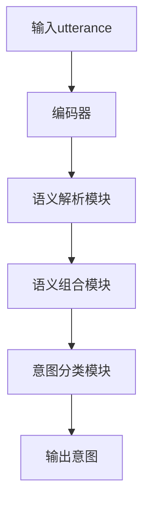

# CUI的意图理解技术详解

## 1. 背景介绍

### 1.1 问题的由来

在人机交互领域,自然语言处理(NLP)技术扮演着关键角色。其中,理解用户的真实意图是实现高效人机交互的核心问题之一。传统的基于规则或模板的方法无法很好地处理自然语言的复杂性和多样性,导致意图理解的准确性和鲁棒性较低。因此,需要一种更智能、更高效的意图理解技术来解决这一问题。

### 1.2 研究现状  

近年来,随着深度学习技术的快速发展,基于神经网络的意图理解方法取得了长足进步。其中,注意力机制、transformer模型等技术的应用,使得意图理解的性能得到大幅提升。但同时也面临着一些新的挑战,如数据标注成本高、解释性差、领域适应性不足等。

### 1.3 研究意义

意图理解技术的提升将直接促进人机交互体验的改善,推动智能对话系统、语音助手等应用的发展。同时,它也是实现真正的人工通用智能(AGI)的重要一环。因此,研究高效、可解释、可迁移的意图理解技术,具有重要的理论意义和应用价值。

### 1.4 本文结构

本文将全面介绍CUI(Compositional Understanding of Intent)意图理解技术。第2节阐述核心概念;第3节详细解释算法原理和步骤;第4节构建数学模型并推导公式;第5节给出代码实现示例;第6节列举实际应用场景;第7节推荐相关资源;第8节总结发展趋势和挑战;第9节列出常见问题解答。

## 2. 核心概念与联系

CUI技术的核心思想是将意图理解建模为一个组合性的问题。具体来说:

1) 将输入的自然语言utterance分解为多个语义单元(semantic unit)
2) 对每个语义单元进行意图标注(intent labeling)
3) 根据语义单元的组合关系推理出整个utterance的综合意图(compositional intent)

这种组合性建模方式能够更好地捕捉语义的细微差异,并通过组合推理来处理复杂查询,从而提高意图理解的准确性和解释性。

CUI技术涉及多个相关概念,包括:

- 语义表示(Semantic Representation):将自然语言映射到形式语义的过程
- 组合性原理(Principle of Compositionality):语义的组合方式决定了整体意义
- 注意力机制(Attention Mechanism):赋予模型对不同语义单元的选择性关注能力

这些概念的融合应用,构成了CUI意图理解技术的理论基础和技术支撑。

## 3. 核心算法原理 & 具体操作步骤  

### 3.1 算法原理概述

CUI算法的核心原理可概括为三个主要步骤:

1. **语义解析(Semantic Parsing)**: 将自然语言utterance解析为语义表示,通常采用序列标注的方式,预测每个词对应的语义标签。

2. **语义组合(Semantic Composition)**: 根据语义表示中的组合关系,将低级语义单元组合为高级语义表示,捕捉utterance整体意义。

3. **意图分类(Intent Classification)**: 将最终的语义表示映射到预定义的意图类别空间,得到utterance的综合意图标签。

这种分而治之的方法,将复杂的意图理解问题分解为低级语义解析、中级语义组合和高级意图分类三个子任务,从底层到顶层逐步建模和推理。

### 3.2 算法步骤详解

具体来说,CUI算法包括以下步骤:

1. **输入处理**:对原始utterance进行分词、词性标注等基础NLP预处理。

2. **编码(Encoding)**:将处理后的utterance输入编码器(如BERT),获得每个词的上下文语义表示。

3. **语义解析**:使用序列标注模型(如BiLSTM-CRF)对每个词的语义进行标注,得到低级语义表示序列。

4. **语义组合**:使用树状或图状结构对语义表示进行组合,模拟组合性原理。常用的是基于树的递归神经网络、基于图的关系网络等模型。

5. **意图分类**:将最终的高级语义表示输入到分类器(如前馈神经网络),预测utterance的综合意图标签。

6. **解码(Decoding)**:将模型输出的意图标签解码为可读的自然语言形式。

在训练阶段,使用标注好的数据集对各个子模块进行端到端的联合训练。在预测时,按上述流程对新的utterance进行意图推理。



### 3.3 算法优缺点

**优点**:

- 组合性建模捕捉细粒度语义,提高了意图理解的准确性和解释性。
- 模块化设计有利于错误分析和针对性优化。
- 支持构建可解释、可控制的人机交互系统。

**缺点**:

- 整体算法复杂度较高,需要大量标注数据进行训练。
- 跨领域迁移能力有待提高,需要一定量的领域数据进行微调。
- 对长距离依赖和复杂逻辑关系的建模仍有提升空间。

### 3.4 算法应用领域

CUI意图理解技术可广泛应用于:

- 智能对话系统:理解用户的真实查询意图,提供准确的回复。
- 智能语音助手:准确捕捉语音指令背后的用户需求。
- 智能问答系统:深入理解自然语言问题,给出针对性答复。
- 信息检索系统:提高查询意图的理解,改善检索质量。
- 人机交互界面:支持自然语言交互,提升用户体验。

总的来说,CUI技术为实现高效人机交互奠定了技术基础,是人工智能系统通向真正智能的关键一步。

## 4. 数学模型和公式 & 详细讲解 & 举例说明

### 4.1 数学模型构建

为了形式化描述CUI算法,我们首先构建数学模型。假设输入utterance为 $X=\{x_1,x_2,...,x_n\}$,其中$x_i$为第i个词。我们的目标是预测utterance的意图标签$y$。

在语义解析阶段,我们需要为每个词$x_i$预测其语义标签$s_i$,可表示为:

$$s_i = \arg\max_{s\in\mathcal{S}}P(s|x_i,X;\theta_1)$$

其中$\mathcal{S}$为预定义的语义标签集合, $\theta_1$为语义解析模型的参数。

在语义组合阶段,我们将语义表示序列$\mathbf{s}=\{s_1,s_2,...,s_n\}$组合为高级语义表示$\mathbf{h}$,通常由递归神经网络或关系网络等模型实现:

$$\mathbf{h} = \text{CompositionModel}(\mathbf{s};\theta_2)$$

其中$\theta_2$为语义组合模型参数。

最后,在意图分类阶段,我们将高级语义表示$\mathbf{h}$映射到意图空间$\mathcal{Y}$:

$$y = \arg\max_{y\in\mathcal{Y}}P(y|\mathbf{h};\theta_3)$$

$\theta_3$为意图分类器参数。

将以上步骤结合,我们可得到utterance $X$的综合意图预测:

$$\hat{y} = \arg\max_{y\in\mathcal{Y}}P(y|X;\theta)$$

其中$\theta=\{\theta_1,\theta_2,\theta_3\}$为整个CUI模型的所有可学习参数。

在训练阶段,给定包含(utterance, 意图标签)对的数据集$\mathcal{D}=\{(X^{(i)},y^{(i)})\}_{i=1}^N$,我们可以最小化损失函数:

$$\mathcal{L}(\theta) = -\frac{1}{N}\sum_{i=1}^N\log P(y^{(i)}|X^{(i)};\theta)$$

来学习最优参数$\theta^*$,从而获得最终的CUI意图理解模型。

### 4.2 公式推导过程

以上数学模型的核心思想源于贝叶斯决策理论。我们来推导一下公式的具体过程。

根据贝叶斯公式:

$$P(y|X) = \frac{P(X|y)P(y)}{P(X)}$$

由于分母$P(X)$对所有$y$是常数,因此最大化$P(y|X)$等价于最大化$P(X|y)P(y)$。进一步假设语义表示$\mathbf{s}$是utterance $X$和意图标签$y$的充分统计量,我们有:

$$\begin{aligned}
P(y|X) &\propto P(X|y)P(y)\\
       &= P(\mathbf{s}|y)P(y)\\
       &= P(y|\mathbf{s})P(\mathbf{s})
\end{aligned}$$

其中第二步是由语义表示$\mathbf{s}$充分描述了$X$和$y$的关系;第三步应用了贝叶斯公式。

由于我们的目标是最大化$P(y|X)$,等价于最大化$P(y|\mathbf{s})$。将$\mathbf{h}$作为$\mathbf{s}$的函数,我们有:

$$\begin{aligned}
\hat{y} &= \arg\max_{y}P(y|\mathbf{s})\\
       &= \arg\max_{y}P(y|\mathbf{h})\\
       &= \arg\max_{y}P(y|\text{CompositionModel}(\mathbf{s}))
\end{aligned}$$

这就是我们之前给出的意图分类公式的推导过程。通过数学建模,我们将复杂的意图理解问题分解为低级语义解析、中级语义组合和高级意图分类三个子问题,并给出了相应的公式描述,阐明了CUI算法的原理基础。

### 4.3 案例分析与讲解

现在我们来看一个具体的案例,分析CUI算法如何工作。假设输入utterance为:

"I want to book a flight from San Francisco to New York next Monday"

第一步是语义解析。我们的序列标注模型可能会输出类似这样的语义表示:

```
I       - 无语义
want    - 动作.预定
to      - 无语义 
book    - 动作.预定
a       - 无语义
flight  - 旅行.交通工具
from    - 来源.地点
San     - 来源.地点.城市
Francisco-来源.地点.城市
to      - 目的地.地点  
New     - 目的地.地点.城市
York    - 目的地.地点.城市
next    - 时间.日期
Monday  - 时间.日期.星期
```

可以看到,模型能够较好地识别出utterance中的核心语义单元,如动作、地点、时间等。

第二步是语义组合。一种可能的组合方式是建立一个以"动作.预定"为根节点的树状结构,将其他语义单元作为子节点相连,模拟utterance中的语义依赖关系。通过递归神经网络等模型,我们可以获得utterance的高级语义表示$\mathbf{h}$。

最后,将$\mathbf{h}$输入分类器,可能会输出意图标签为"flight_booking"。

整个过程模拟了人类理解这个utterance的认知过程:首先识别出核心语义单元,然后根据这些单元之间的组合关系,推理出utterance背后的整体意图是预定航班。

通过这个例子,我们可以直观地看到CUI算法是如何分步骤地捕捉细粒度语义、建模语义组合关系、并最终预测综合意图的。这种模块化、可解释的方法不仅提高了算法性能,也有利于错误分析和针对性优化。

### 4.4 常见问题解答

**Q:CUI算法如何处理同义词、近义词等语义歧义问题?**

A:常见的做法是在语义解析阶段,为同义词、近义词等赋予相同或相似的语义标签,从而在后续的组合和分类阶段能够正确识别它们的意图贡献。同时,预训练语言模型等技术也有助于提高对语义的理解能