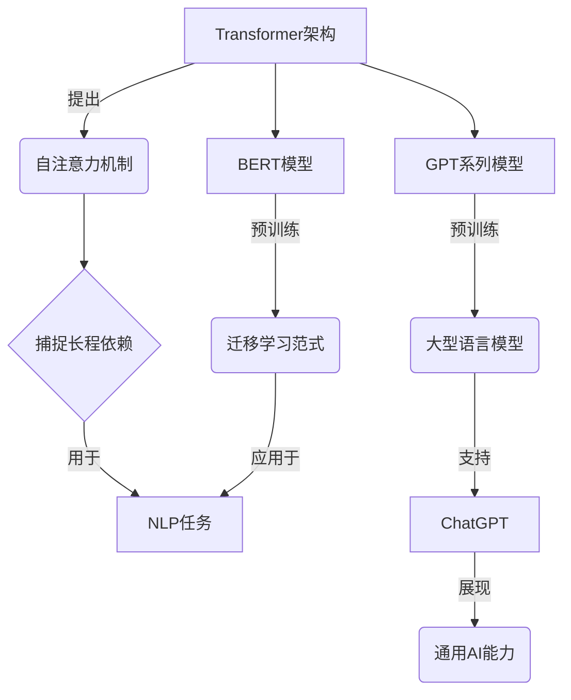

# ChatGPT背后的推手——OpenAI

## 1. 背景介绍

### 1.1 问题的由来

在过去几十年中,人工智能(AI)技术取得了长足的进步,尤其是在自然语言处理(NLP)和机器学习(ML)等领域。然而,传统的AI系统通常需要大量的人工标注数据和复杂的特征工程,这使得它们的开发和应用存在诸多挑战。直到2017年,一种名为"Transformer"的全新神经网络架构应运而生,它利用自注意力(Self-Attention)机制,可以更好地捕捉序列数据中的长程依赖关系,从而在NLP任务上取得了突破性的进展。

### 1.2 研究现状

基于Transformer架构,谷歌于2018年推出了BERT(Bidirectional Encoder Representations from Transformers)模型,它通过预训练的方式学习了大量的语料知识,在下游NLP任务上表现出色。这种预训练+微调(Pre-train and Fine-tune)的范式,被称为"迁移学习"(Transfer Learning),成为了NLP领域的主流方法。

随后,OpenAI等机构也相继推出了GPT(Generative Pre-trained Transformer)系列模型,如GPT-2、GPT-3等,这些大型语言模型(Large Language Models,LLMs)通过在海量文本数据上进行自监督预训练,掌握了丰富的自然语言知识,并展现出了强大的生成、理解和推理能力。

### 1.3 研究意义

ChatGPT是OpenAI于2022年11月推出的一款基于GPT-3.5架构的对话式AI助手,它不仅能够回答各种问题、撰写文章、编写代码等,更能够根据上下文进行多轮对话交互,为用户提供个性化的智能服务。ChatGPT的出现,标志着大型语言模型正在向通用人工智能(Artificial General Intelligence,AGI)的目标迈进。

研究ChatGPT及其背后的OpenAI技术,有助于我们深入理解当前最先进的NLP和人工智能技术,把握其发展趋势,并探索其在各行业的应用前景。同时,也需要权衡其潜在的风险和挑战,促进AI技术的健康发展。

### 1.4 本文结构

本文将从以下几个方面全面介绍ChatGPT及其背后的OpenAI技术:

1. 核心概念与联系
2. 核心算法原理与具体操作步骤
3. 数学模型和公式详细讲解与案例分析  
4. 项目实践:代码实例和详细解释
5. 实际应用场景
6. 工具和学习资源推荐
7. 未来发展趋势与挑战
8. 常见问题解答

## 2. 核心概念与联系

上图展示了ChatGPT及其相关核心概念的关系。我们可以看到:

1. **Transformer架构**提出了**自注意力机制**,能够更好地捕捉序列数据中的长程依赖关系,从而在NLP任务上取得突破。
2. 基于Transformer,**BERT模型**通过预训练的方式学习语料知识,建立了**迁移学习范式**,成为NLP领域主流方法。
3. 同样基于Transformer,**GPT系列模型**通过大规模预训练,成为了**大型语言模型**,展现出强大的语言理解和生成能力。
4. **ChatGPT**作为GPT-3.5的对话系统,进一步展现了大型语言模型在通用人工智能方向的潜力。

## 3. 核心算法原理与具体操作步骤

### 3.1 算法原理概述

ChatGPT的核心算法是**Transformer解码器**(Transformer Decoder),它基于自注意力机制,能够有效地捕捉输入序列中的长程依赖关系,并生成相应的输出序列。具体来说,Transformer解码器主要包括以下几个核心组件:

1. **嵌入层(Embedding Layer)**: 将输入的文本序列转换为向量表示,以便后续的计算。
2. **多头自注意力机制(Multi-Head Self-Attention)**: 捕捉输入序列中的上下文信息,建模单词与单词之间的关系。
3. **前馈神经网络(Feed-Forward Neural Network)**: 对自注意力的输出进行进一步的非线性变换,提取更高层次的特征表示。
4. **规范化层(Normalization Layer)**: 对每一层的输出进行归一化处理,以加速训练过程并提高模型性能。
5. **掩码机制(Masking Mechanism)**: 在生成过程中,掩码掉已生成的单词,确保模型只关注当前需要预测的单词。

通过多个Transformer解码器层的堆叠,ChatGPT能够逐步地生成自然语言输出,并根据上下文进行多轮对话交互。

### 3.2 算法步骤详解

ChatGPT的生成过程可以概括为以下几个主要步骤:

1. **输入编码**:将用户的输入文本序列转换为向量表示,作为Transformer解码器的初始输入。

2. **自注意力计算**:在每一个解码器层中,输入序列通过多头自注意力机制,计算出每个单词与其他单词之间的注意力权重,从而捕捉上下文信息。

3. **前馈神经网络变换**:自注意力的输出经过前馈神经网络的非线性变换,提取更高层次的特征表示。

4. **输出生成**:在最后一个解码器层,模型根据当前的特征表示,通过掩码机制预测下一个单词的概率分布。

5. **单词采样**:从概率分布中采样出一个单词,追加到已生成的序列中。

6. **迭代生成**:重复步骤2~5,直到生成完整的输出序列或达到最大长度。

7. **上下文更新**:将用户的新输入与模型的输出序列拼接,作为下一轮对话的输入上下文。

通过上述步骤的迭代,ChatGPT可以根据用户的问题和上下文,生成相应的自然语言回复,实现流畅的多轮对话交互。

### 3.3 算法优缺点

**优点**:

1. **长程依赖建模**:自注意力机制能够有效捕捉输入序列中的长程依赖关系,克服了传统RNN等序列模型的局限性。
2. **并行计算**:Transformer的结构使得训练和推理过程可以高度并行化,提高了计算效率。
3. **多任务能力**:通过预训练的方式,ChatGPT掌握了丰富的自然语言知识,可以应对多种NLP任务。
4. **上下文理解**:利用注意力机制,ChatGPT能够很好地理解和利用对话上下文信息。

**缺点**:

1. **计算资源需求大**:训练大型语言模型需要海量的数据和计算资源,成本高昂。
2. **幂等性缺失**:生成的结果存在一定的随机性,对于相同的输入,输出可能不完全一致。
3. **知识局限性**:尽管知识面广,但ChatGPT的知识仍然来自于训练数据,存在一定的局限性和偏差。
4. **安全性和可解释性**:大型语言模型的内部工作机理较为黑箱,存在潜在的安全和可解释性挑战。

### 3.4 算法应用领域

基于Transformer解码器的ChatGPT及其变体,展现出了广泛的应用前景:

1. **自然语言处理**: 对话系统、问答系统、文本摘要、机器翻译等。
2. **内容创作**: 新闻撰写、故事创作、诗歌创作、代码生成等。
3. **智能助理**: 提供个性化的问答服务、办公协助、教育辅导等。
4. **知识图谱构建**: 从大量非结构化数据中提取实体、关系等知识。
5. **多模态AI**: 结合视觉、语音等其他模态,实现多模态交互和理解。

## 4. 数学模型和公式详细讲解与举例说明

### 4.1 数学模型构建

ChatGPT的核心是一个基于Transformer解码器的序列生成模型,其目标是最大化给定上下文 $X$ 时生成目标序列 $Y$ 的条件概率 $P(Y|X)$。具体来说,我们需要学习一个模型参数 $\theta$ ,使得:

$$\max_\theta P(Y|X;\theta) = \max_\theta \prod_{t=1}^{|Y|} P(y_t|y_{<t},X;\theta)$$

其中 $y_t$ 表示目标序列的第 $t$ 个单词, $y_{<t}$ 表示前 $t-1$ 个单词的序列。

为了计算上述条件概率,我们可以引入自注意力机制,对输入序列 $X$ 和部分生成的序列 $y_{<t}$ 进行编码,得到它们的隐状态表示 $H_X$ 和 $H_{y_{<t}}$。然后,在每一步 $t$ ,解码器根据这些隐状态表示,计算出生成单词 $y_t$ 的概率分布:

$$P(y_t|y_{<t},X;\theta) = \text{Decoder}(H_{y_{<t}},H_X;\theta)$$

其中,Decoder表示Transformer解码器的具体计算过程。

在训练阶段,我们最小化模型在训练数据集上的负对数似然损失:

$$\mathcal{L}(\theta) = -\frac{1}{N}\sum_{n=1}^N\log P(Y^{(n)}|X^{(n)};\theta)$$

其中 $N$ 表示训练样本的数量。通过随机梯度下降等优化算法,可以学习到模型参数 $\theta$。

在推理阶段,给定上下文 $X$,我们根据学习到的模型参数 $\theta$,通过贪婪搜索或者beam search等策略,生成出条件概率最大的目标序列 $Y$。

### 4.2 公式推导过程

我们将详细推导自注意力机制中的"Scaled Dot-Product Attention"公式,这是Transformer模型的核心部分之一。

设输入序列为 $X = (x_1, x_2, \dots, x_n)$,我们需要计算其对应的注意力表示 $Z = (z_1, z_2, \dots, z_n)$。对于每个位置 $i$,其注意力表示 $z_i$ 是其他所有位置 $j$ 的加权和:

$$z_i = \sum_{j=1}^n \alpha_{ij}(x_jW^V)$$

其中, $W^V$ 是一个可学习的值向量(Value Vector),用于线性变换输入 $x_j$。注意力权重 $\alpha_{ij}$ 表示位置 $i$ 对位置 $j$ 的注意力程度,它是通过以下公式计算得到的:

$$\alpha_{ij} = \frac{\exp(e_{ij})}{\sum_{k=1}^n\exp(e_{ik})}$$

$$e_{ij} = \frac{(x_iW^Q)(x_jW^K)^T}{\sqrt{d_k}}$$

其中, $W^Q$ 和 $W^K$ 分别是可学习的查询向量(Query Vector)和键向量(Key Vector),用于线性变换输入 $x_i$ 和 $x_j$。 $d_k$ 是缩放因子,通常取键向量的维度。

上述公式可以解释为:对于每个位置 $i$,我们首先计算其与所有其他位置 $j$ 的相似度分数 $e_{ij}$,这是通过查询向量 $x_iW^Q$ 与键向量 $x_jW^K$ 的点积得到的,并除以 $\sqrt{d_k}$ 进行缩放。然后,我们对所有相似度分数进行softmax操作,得到注意力权重 $\alpha_{ij}$。最后,将每个位置 $j$ 的值向量 $x_jW^V$ 根据对应的注意力权重 $\alpha_{ij}$ 进行加权求和,得到位置 $i$ 的注意力表示 $z_i$。

通过上述自注意力机制,Transformer模型可以