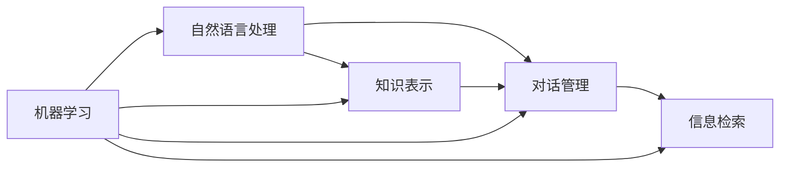

# Chatbots原理与代码实例讲解

作者：禅与计算机程序设计艺术 / Zen and the Art of Computer Programming

## 1. 背景介绍

### 1.1 问题的由来

随着人工智能技术的飞速发展，Chatbots（聊天机器人）已经成为了一个热门的研究方向和应用领域。Chatbots 能够通过自然语言与人类进行交互，提供信息、解答问题、完成任务等，极大地方便了人们的生活。然而，对于许多开发者和研究者来说，Chatbots 的原理和实现仍然是一个富有挑战性的课题。

### 1.2 研究现状

目前，Chatbots 的研究主要集中在自然语言处理（NLP）、知识表示、对话管理等方面。各大科技公司如 Google、Microsoft、Facebook 等都在积极投入 Chatbots 的研发，并已经取得了一定的成果。同时，开源社区也涌现出了许多优秀的 Chatbots 框架和工具，如 Rasa、Botpress、Dialogflow 等，降低了 Chatbots 开发的门槛。

### 1.3 研究意义

深入研究 Chatbots 的原理和实现，对于推动人工智能技术的发展具有重要意义。一方面，Chatbots 可以作为人工智能的一个应用场景，验证和改进现有的 NLP 和知识表示等技术；另一方面，Chatbots 也可以作为人机交互的一种新形式，探索更加自然和高效的人机协作方式。此外，Chatbots 在客服、教育、医疗等领域都有广阔的应用前景，研究成果可以直接服务于社会。

### 1.4 本文结构

本文将从以下几个方面对 Chatbots 的原理和实现进行详细讲解：

- 第二部分介绍 Chatbots 的核心概念和关键技术
- 第三部分重点讲解 Chatbots 的核心算法原理和具体操作步骤
- 第四部分给出 Chatbots 涉及的数学模型和公式，并进行详细讲解和举例说明
- 第五部分提供 Chatbots 的代码实例，并对关键代码进行解释说明
- 第六部分分析 Chatbots 的实际应用场景和未来发展趋势
- 第七部分推荐 Chatbots 相关的学习资源、开发工具等
- 第八部分对全文进行总结，并探讨 Chatbots 未来的挑战和机遇
- 第九部分为文章的附录，解答一些常见问题

## 2. 核心概念与联系

Chatbots 涉及到许多核心概念和关键技术，它们相互之间紧密联系、相辅相成：

- 自然语言处理（NLP）：使计算机能够理解、生成自然语言，是实现 Chatbots 的基础。其中涉及语言模型、句法分析、语义理解、指代消解等一系列技术。

- 知识表示：将结构化或非结构化的文本、图谱等知识转化为计算机可以理解和处理的形式，为 Chatbots 提供背景知识和推理能力。常见的知识表示方法有本体、语义网络、知识图谱等。

- 对话管理：控制 Chatbots 与用户之间对话的进行，根据上下文理解用户意图，生成恰当的回复。其中涉及到对话状态跟踪、对话策略学习等技术。

- 信息检索：从海量文本数据中快速、准确地查找所需信息，增强 Chatbots 的问答能力。常用的信息检索模型有向量空间模型、概率检索模型等。

- 机器学习：利用大规模语料数据，自动学习、优化 Chatbots 的模型和策略，提高系统的智能性和鲁棒性。其中既包括传统的监督学习、无监督学习算法，也包括强化学习、迁移学习等新兴方法。

下图展示了这些核心概念之间的联系：

可以看到，自然语言处理是 Chatbots 的语言基础，知识表示、对话管理、信息检索则构成了 Chatbots 的核心功能模块，而机器学习则是优化这些模块性能的关键手段。只有这些技术环环相扣、有机结合，才能构建出智能、高效、可用的 Chatbots 系统。

## 3. 核心算法原理 & 具体操作步骤

### 3.1 算法原理概述

Chatbots 的核心算法可以分为两大类：基于检索的方法和基于生成的方法。

基于检索的方法的基本思想是：给定用户输入，从预先构建的问答对、对话语料库中检索最相似、最合适的答案。其优点是答案质量较有保证，缺点是难以处理开放域问题，泛化能力较差。典型算法包括 TF-IDF、BM25 等。

基于生成的方法的基本思想是：根据当前对话状态和上下文，自动生成合适的回复文本。其优点是适用范围广、灵活性强，缺点是生成的文本质量和连贯性有待提高。典型算法包括 Seq2Seq、Transformer 等。

### 3.2 算法步骤详解

以基于 Transformer 的生成式 Chatbots 为例，其主要算法步骤如下：

1. 数据准备：收集大规模的对话语料，进行清洗、格式化、分词等预处理，构建成 (context, response) 配对形式。

2. 模型构建：搭建 Transformer 编解码架构，包括 Encoder、Decoder、Attention 等组件。Encoder 负责编码上下文信息，Decoder 负责解码生成回复。

3. 模型训练：将语料数据输入模型，通过监督学习（如极大似然估计）来优化模型参数，使其能够根据上下文生成合适的回复。训练过程通常需要并行化、分布式处理。

4. 模型推断：给定新的对话上下文，使用训练好的模型进行推断，解码生成回复文本。生成过程可采用 Beam Search 等策略，平衡质量和效率。

5. 模型评估：使用留出的测试集评估模型的性能，如 BLEU、Perplexity 等指标。也可进行人工评估，判断生成回复的流畅性、相关性、人类可接受度等。

6. 模型优化：根据评估结果，分析模型的不足之处，如过拟合、泛化差等。采取相应的优化措施，如调整模型结构、引入正则化、数据增强等。不断迭代上述步骤，直至满足要求。

### 3.3 算法优缺点

基于 Transformer 的生成式 Chatbots 具有以下优点：

- 生成能力强，可以处理开放域对话，具有一定的创造力
- 通过注意力机制，能够捕捉长距离依赖，生成连贯、流畅的回复
- 引入位置编码，使模型能够建模序列的顺序信息
- 采用自注意力，计算效率高，可以并行化训练和推断

同时也存在一些缺点：

- 生成的回复质量和连贯性有时不够理想，容易出现语法错误、不相关内容等
- 泛化能力有限，难以处理训练数据中未覆盖的话题和模式
- 推断速度慢，难以实时响应，需要较长的等待时间
- 模型参数量大，需要海量训练数据和计算资源，训练成本高

### 3.4 算法应用领域

基于 Transformer 的生成式 Chatbots 在多个领域得到了广泛应用，如：

- 客服系统：使用 Chatbots 自动回答用户的常见问题，提供 24 小时不间断服务，大幅提高人工客服的效率。

- 个人助理：通过 Chatbots 为用户提供日程管理、信息查询、生活服务等各种帮助，使人机交互更加自然便捷。

- 教育培训：利用 Chatbots 引导学生进行互动学习，答疑解惑，提供个性化的教学服务。

- 医疗健康：Chatbots 可以提供医疗咨询、心理疏导等服务，辅助医生进行初步诊断和治疗。

- 金融服务：Chatbots 能够为用户提供理财建议、业务办理等服务，提升用户体验和营销转化率。

未来，随着算法的不断演进和完善，Chatbots 有望在更多领域发挥重要作用，成为人机协作的重要界面。

## 4. 数学模型和公式 & 详细讲解 & 举例说明

### 4.1 数学模型构建

Transformer 的核心是注意力机制（Attention Mechanism），其数学模型可以表示为：

$$
Attention(Q,K,V) = softmax(\frac{QK^T}{\sqrt{d_k}})V
$$

其中，$Q$（Query）、$K$（Key）、$V$（Value）分别表示查询向量、键向量、值向量，$d_k$ 为 $K$ 的维度。$softmax$ 函数用于将注意力权重归一化为概率分布。

在 Self-Attention 中，$Q$、$K$、$V$ 来自同一个输入序列 $X$，经过线性变换得到：

$$
Q = XW^Q, K = XW^K, V = XW^V
$$

其中，$W^Q$、$W^K$、$W^V$ 为可学习的参数矩阵。

在 Encoder-Decoder Attention 中，$Q$ 来自 Decoder 的隐状态，$K$、$V$ 来自 Encoder 的输出。

### 4.2 公式推导过程

以 Self-Attention 为例，其前向计算过程可以推导如下：

1. 输入序列 $X$ 经过线性变换，得到 $Q$、$K$、$V$：

$$
Q = XW^Q, K = XW^K, V = XW^V
$$

2. 计算 $Q$ 和 $K$ 的点积注意力得分：

$$
score = \frac{QK^T}{\sqrt{d_k}}
$$

3. 对注意力得分进行 softmax 归一化：

$$
weight = softmax(score)
$$

4. 将注意力权重应用于 $V$，得到 Attention 的输出：

$$
Attention(Q,K,V) = weight \cdot V
$$

5. 将 Attention 输出传递给后续的前馈神经网络等组件，得到最终的隐状态。

### 4.3 案例分析与讲解

下面以一个简单的句子对 "How are you? I'm fine, thank you." 为例，说明 Self-Attention 的计算过程。

1. 将句子转化为向量序列 $X$：

$$
X = [x_1, x_2, x_3, x_4, x_5, x_6, x_7]
$$

其中，$x_1$ 到 $x_7$ 分别对应 "How"、"are"、"you"、"?"、"I'm"、"fine"、","、"thank"、"you"、"." 的词向量。

2. 计算 Self-Attention：

$$
Q = XW^Q, K = XW^K, V = XW^V \\
score = \frac{QK^T}{\sqrt{d_k}} \\
weight = softmax(score) \\
Attention(Q,K,V) = weight \cdot V
$$

其中，$W^Q$、$W^K$、$W^V$ 为随机初始化的参数矩阵。

3. 直观理解 Attention 的作用：

- 对于 "How" 这个词，Self-Attention 可以捕捉到与之相关的 "are"、"you" 等词，赋予较高的注意力权重。
- 对于 "fine" 这个词，Self-Attention 可以关联到 "I'm"、"thank" 等上下文词，体现出语义联系。
- 对于 "?" 这个标点，Self-Attention 可以学习到它在句子结尾的位置信息，赋予相应的权重。

通过 Self-Attention，模型能够在编码每个词时，都综合考虑句子中其他词的信息，从而得到更加全面、准确的表示。

### 4.4 常见问题解答

问题1：Self-Attention 是否能够捕捉词序信息？

答：单纯的 Self-Attention 是无法捕捉词序信息的，因为它是基于词向量的点积计算，而点积是对称的、无序的。为了引入词序信息，Transformer