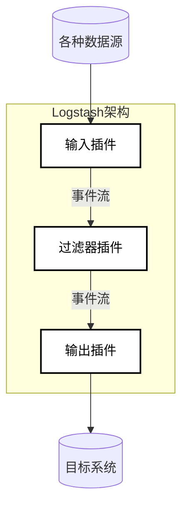

好的,我会严格按照您提供的要求和文章结构模板,以《ElasticSearch Logstash原理与代码实例讲解》为主题,使用专业的技术语言写一篇逻辑清晰、结构紧凑、深入全面的技术博客文章。

# ElasticSearch Logstash原理与代码实例讲解

## 1. 背景介绍

### 1.1 问题的由来

在当今大数据时代,海量数据的采集、传输、处理和分析已经成为企业和组织面临的一大挑战。传统的数据处理方式已经无法满足现代应用的需求,需要一种高效、可扩展、实时的数据处理平台。这就催生了Elasticsearch Logstash(简称ELK)技术栈的出现。

Logstash作为ELK技术栈的重要组成部分,主要负责数据的采集、传输和转换处理。它能够从各种不同的数据源(如日志文件、数据库、消息队列等)采集数据,并对数据进行过滤、格式化和丰富,最终将结构化的数据发送到Elasticsearch或其他存储系统中,为后续的数据分析和可视化做好准备。

### 1.2 研究现状  

Logstash作为一款开源的数据采集和处理工具,已经被广泛应用于各种场景,如日志管理、安全监控、数据集成等。目前,Logstash支持超过200种不同的输入/输出插件,可以与各种数据源和目标系统无缝集成。

然而,由于Logstash的复杂性和灵活性,很多用户在实际使用过程中会遇到一些挑战,如配置复杂、性能优化、故障排查等问题。因此,深入理解Logstash的原理和实现机制,掌握其核心算法和最佳实践,对于有效利用Logstash至关重要。

### 1.3 研究意义

本文将深入探讨Logstash的核心原理、算法实现和代码实例,旨在帮助读者全面掌握Logstash的工作机制,提高数据处理效率,优化系统性能。具体意义包括:

1. **理解核心原理**:剖析Logstash的内部架构和工作流程,揭示其背后的设计思想和技术细节,为灵活运用Logstash奠定基础。

2. **掌握核心算法**:深入解读Logstash中的关键算法,如数据过滤、格式转换、事件路由等,提升对算法实现的理解。

3. **代码实战演练**:通过丰富的代码示例和详细解说,帮助读者快速上手Logstash开发,提高编程能力。

4. **优化性能**:介绍Logstash性能优化的最佳实践,如配置调优、资源管理、故障排查等,提升系统稳定性和处理效率。

5. **拓展应用场景**:探讨Logstash在不同领域的应用案例,如日志管理、数据集成、安全监控等,拓展思路,启发创新。

### 1.4 本文结构

本文共分为9个章节,内容安排如下:

1. 背景介绍
2. Logstash核心概念与架构
3. 数据采集与输入插件
4. 数据过滤与转换
5. 数据输出与发送
6. Logstash性能优化
7. 实战案例:日志采集与分析
8. 工具与资源推荐
9. 总结与展望

## 2. 核心概念与架构

在深入探讨Logstash的实现细节之前,我们先来了解一下Logstash的核心概念和整体架构,为后续的学习打下坚实的基础。

### 2.1 Logstash核心概念

#### 2.1.1 事件(Event)

在Logstash中,所有的数据都被抽象为事件(Event)的形式。一个事件由一组键值对(key-value)组成,用于描述数据的各种属性和元数据。事件是Logstash内部处理数据的基本单元。

#### 2.1.2 输入(Input)

输入插件用于从各种数据源(如文件、数据库、消息队列等)采集数据,并将其转换为Logstash内部的事件格式。Logstash支持多种输入插件,可以同时从多个数据源采集数据。

#### 2.1.3 过滤器(Filter)

过滤器插件用于对输入的事件进行转换、格式化和丰富处理。通过使用各种过滤器,我们可以提取事件中的特定字段、修改字段值、删除不需要的字段,甚至执行一些复杂的数据转换操作。

#### 2.1.4 输出(Output)

输出插件负责将经过过滤器处理后的事件发送到指定的目的地,如Elasticsearch、数据库、文件系统等。Logstash支持多种输出插件,可以同时将数据发送到多个目的地。

#### 2.1.5 编码器(Codec)

编码器用于在输入和输出阶段对数据进行编码和解码。它们可以处理各种数据格式,如纯文本、JSON、XML等,确保数据在传输过程中保持一致性和可读性。

#### 2.1.6 配置文件

Logstash的配置文件是一个纯文本文件,用于定义输入、过滤器、输出插件及其相关设置。配置文件采用Ruby语言的DSL(Domain Specific Language)语法,易于编写和维护。

### 2.2 Logstash架构概览

Logstash采用了经典的数据管道(Data Pipeline)架构,将数据处理过程分为三个主要阶段:输入(Input)、过滤(Filter)和输出(Output)。下面是Logstash的整体架构示意图:

数据处理流程如下:

1. **输入阶段**: 输入插件从各种数据源(如日志文件、数据库、消息队列等)采集原始数据,并将其转换为Logstash内部的事件格式。

2. **过滤阶段**: 过滤器插件对输入的事件进行转换、格式化和丰富处理。可以使用多个过滤器插件进行链式处理,实现复杂的数据转换逻辑。

3. **输出阶段**: 输出插件将经过过滤器处理后的事件发送到指定的目的地,如Elasticsearch、数据库、文件系统等。

需要注意的是,Logstash支持多个输入插件同时运行,也可以在过滤阶段使用多个过滤器插件进行链式处理。这种灵活的架构设计使得Logstash能够适应各种复杂的数据处理场景。

## 3. 核心算法原理 & 具体操作步骤

在上一节中,我们介绍了Logstash的核心概念和整体架构。现在,让我们深入探讨Logstash核心算法的原理和实现细节。

### 3.1 算法原理概述

Logstash的核心算法主要包括以下几个方面:

1. **事件处理流程**
2. **数据过滤算法**
3. **事件路由算法**
4. **并发处理算法**

#### 3.1.1 事件处理流程

Logstash的事件处理流程遵循经典的数据管道模式,包括输入(Input)、过滤(Filter)和输出(Output)三个主要阶段。

在输入阶段,Logstash从各种数据源采集原始数据,并将其转换为内部的事件格式。事件是Logstash内部处理数据的基本单元,由一组键值对(key-value)组成,用于描述数据的各种属性和元数据。

接下来,事件进入过滤阶段,经过一系列过滤器插件的处理,实现数据的转换、格式化和丰富。过滤器插件可以提取事件中的特定字段、修改字段值、删除不需要的字段,甚至执行一些复杂的数据转换操作。

最后,经过过滤器处理后的事件被发送到输出阶段,由输出插件将其发送到指定的目的地,如Elasticsearch、数据库、文件系统等。

整个事件处理流程是Logstash核心算法的基础,确保了数据能够被高效、可靠地采集、转换和输出。

#### 3.1.2 数据过滤算法

数据过滤是Logstash核心算法中最为关键和复杂的部分。Logstash提供了丰富的过滤器插件,用于对事件进行各种转换和处理操作。常用的过滤器插件包括:

- **Grok**: 使用正则表达式从非结构化数据(如日志)中提取结构化字段。
- **Mutate**: 对事件进行各种转换操作,如重命名字段、删除字段、替换值等。
- **Date**: 从字段中提取日期时间,并将其转换为标准格式。
- **Geoip**: 根据IP地址查询地理位置信息,并将其添加到事件中。

这些过滤器插件可以单独使用,也可以通过链式组合实现更加复杂的数据转换逻辑。Logstash的过滤算法采用了基于事件的处理模式,每个事件都会独立地经过所有配置的过滤器插件处理。

为了提高过滤性能,Logstash还引入了一些优化策略,如事件缓存、条件过滤和并行处理等。这些策略有助于减少不必要的计算开销,提高数据处理效率。

#### 3.1.3 事件路由算法

在某些场景下,我们可能需要根据事件的特定条件,将其路由到不同的输出插件或目的地。Logstash提供了灵活的事件路由机制,允许用户定义复杂的路由规则。

事件路由算法的核心是条件判断。用户可以在配置文件中定义一系列条件,如字段值匹配、正则表达式匹配等。当一个事件满足某个条件时,它就会被路由到对应的输出插件或目的地。

此外,Logstash还支持多级路由,即一个事件可以被路由到多个输出插件,实现数据的广播或复制。这种灵活的路由机制使得Logstash能够适应各种复杂的数据处理场景。

#### 3.1.4 并发处理算法

为了提高数据处理效率,Logstash采用了并发处理算法,充分利用现代硬件的多核优势。

在输入阶段,Logstash可以启动多个输入插件实例,并行从不同的数据源采集数据。每个输入插件实例都有自己的事件队列,用于缓存采集到的事件。

过滤阶段采用了多线程并行处理模式。Logstash会启动多个工作线程,从输入队列中取出事件,并将其分发给空闲的过滤器线程进行处理。过滤器线程处理完事件后,会将其放入输出队列,等待发送到输出插件。

在输出阶段,Logstash也可以启动多个输出插件实例,并行将事件发送到不同的目的地。每个输出插件实例都有自己的输出队列,用于缓存待发送的事件。

通过这种并发处理算法,Logstash能够充分利用多核CPU的计算能力,显著提高数据处理吞吐量。同时,基于事件队列的设计也确保了数据处理的可靠性和顺序性。

### 3.2 算法步骤详解

在上一小节中,我们概述了Logstash核心算法的原理。现在,让我们更深入地探讨每个算法的具体实现步骤。

#### 3.2.1 事件处理流程

Logstash的事件处理流程包括以下几个主要步骤:

1. **输入阶段**:
   - 启动配置的输入插件实例
   - 输入插件从数据源采集原始数据
   - 将原始数据转换为Logstash内部的事件格式
   - 将事件放入输入队列,等待过滤处理

2. **过滤阶段**:
   - 启动配置的过滤器插件
   - 从输入队列取出事件
   - 根据配置的过滤器插件链进行数据转换和处理
   - 将处理后的事件放入输出队列,等待发送

3. **输出阶段**:
   - 启动配置的输出插件实例
   - 从输出队列取出事件
   - 根据配