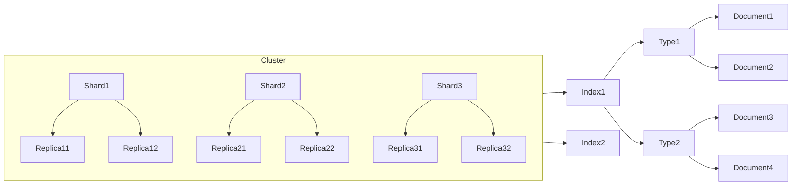

# ElasticSearch原理与代码实例讲解

## 1. 背景介绍

### 1.1 问题的由来

随着数据量的快速增长和多样化需求的不断扩展,传统的关系型数据库在处理海量数据和满足复杂查询需求时遇到了巨大的挑战。这就催生了全新的数据存储和检索解决方案的需求。ElasticSearch作为一种分布式、RESTful 风格的搜索和数据分析引擎,凭借其强大的全文检索能力、高可扩展性、近乎实时的性能等优势,成为了大数据时代下应对海量数据存储和检索挑战的有力武器。

### 1.2 研究现状

ElasticSearch基于Apache Lucene库构建,它是当前主流的企业级搜索引擎解决方案之一。越来越多的公司和组织开始采用ElasticSearch来满足其对日志数据分析、应用程序监控、业务智能等方面的需求。ElasticSearch生态系统也在不断壮大,衍生出了Logstash、Kibana等配套工具,形成了强大的"ELK"技术栈。

### 1.3 研究意义

深入理解ElasticSearch的原理和实现机制,对于充分发挥其强大功能、高效利用其优势、规避其不足至关重要。本文将全面解析ElasticSearch的核心概念、架构设计、索引原理、分布式机制、查询语法等,并结合大量实例代码,为读者提供一个系统性的ElasticSearch学习指南。

### 1.4 本文结构  

本文共分为9个部分:第一部分介绍ElasticSearch的背景;第二部分阐述核心概念;第三部分解析核心算法原理;第四部分构建数学模型并推导公式;第五部分给出项目实践代码示例;第六部分探讨实际应用场景;第七部分推荐相关工具和学习资源;第八部分总结并展望未来发展趋势和挑战;第九部分列出常见问题解答。

## 2. 核心概念与联系

ElasticSearch的核心概念包括:

- **节点(Node)**: 运行ElasticSearch实例的单个服务器,作为集群的一部分,可以存储数据,参与集群的索引和搜索功能。
- **集群(Cluster)**: 由一个或多个节点组成,共同承担数据存储和处理任务。每个集群都有一个唯一的集群名称标识。
- **索引(Index)**: ElasticSearch中的数据存储单元,用于存储关联数据。相当于关系型数据库中的"数据库"概念。
- **类型(Type)**: 索引下的逻辑数据分类,相当于关系型数据库中的"表"概念。(注:7.x版本后将移除Type概念)
- **文档(Document)**: ElasticSearch中的最小数据单元,用JSON格式表示,相当于关系型数据库中的"行"概念。
- **分片(Shard)**: 索引可以横向拆分为多个分片,分布在不同节点上以实现故障转移和水平扩展。
- **副本(Replica)**: 每个分片可以制作多个副本,副本用于提高数据冗余性,防止数据丢失。

这些核心概念相互关联,构成了ElasticSearch的基本数据组织和存储架构。下图展示了它们之间的关系:



## 3. 核心算法原理 & 具体操作步骤

### 3.1 算法原理概述

ElasticSearch的核心是建立在**倒排索引**的基础之上的。倒排索引是对于传统的正向索引的一种反转,它是文档到单词的映射,而不是单词到文档的映射。这种索引结构可以支持高效的全文本搜索。

倒排索引的构建过程包括:

1. **收集**:收集系统中的文档数据。
2. **分析**:对文档内容进行语言分析,如分词、去停用词等,得到词项流。
3. **索引**:将词项与文档进行映射,形成倒排索引结构。
4. **查询**:用户输入查询,查询被分析为词项流,在倒排索引中查找。

### 3.2 算法步骤详解

1. **收集(Collect)**

   ElasticSearch从各个数据源(如日志文件、数据库等)收集文档数据,并将其转换为标准的JSON格式。

2. **分析(Analysis)**

   对JSON文档进行分析,主要包括以下几个步骤:

   - 字符过滤(Character Filters):移除HTML标记、转换编码等。
   - 分词(Tokenization):将文本按照一定的规则切分为词项(词根、词元)序列。
   - 词项过滤(Token Filters):对分词结果进行转换,如小写、去停用词等。

3. **索引(Indexing)**

   将分析得到的词项与文档进行映射,形成倒排索引结构。倒排索引的基本过程:

   - 建立词项到文档的映射表。
   - 为每个词项建立一个倒排索引列表,记录包含该词项的所有文档。
   - 为每个文档统计不同词项的出现频率,用于相关性计算。

4. **查询(Query)**

   - 用户输入查询,查询字符串也会进行分析流程。
   - 取查询分析结果中的词项,从倒排索引列表中获取包含这些词项的文档。
   - 计算这些文档与查询的相关性得分,并根据得分排序输出结果。

### 3.3 算法优缺点

**优点**:

- 支持全文检索,可以根据文档内容快速查找相关文档。
- 具有高度的扩展性,支持分布式存储和并行计算。
- 查询效率高,能够实现近乎实时的搜索响应。

**缺点**:

- 对于精确匹配的点查询,性能不如传统数据库。
- 不擅长处理数据的聚合统计,对于复杂的聚合分析需求可能力有不足。
- 对于更新和删除操作,需要重新构建索引,成本较高。

### 3.4 算法应用领域

ElasticSearch可广泛应用于:

- 日志数据分析:通过搜索和分析日志,快速发现异常和问题。
- 全文搜索:如电商网站商品搜索、门户网站内容搜索等。
- 数据分析:对业务数据进行多维分析,提供商业智能支持。
- 安全分析:检测潜在的网络攻击、异常行为等。
- 地理信息数据:存储和查询与地理位置相关的数据。

## 4. 数学模型和公式 & 详细讲解 & 举例说明

### 4.1 数学模型构建

为了评估查询与文档的相关程度,ElasticSearch采用了**布尔模型(Boolean Model)**和**向量空间模型(Vector Space Model)**相结合的方式。

布尔模型是建立在集合论的基础之上,将文档集合视为获取满足查询的文档的过程。它可以精确地获取完全匹配查询条件的文档,但无法体现文档与查询的相关程度。

向量空间模型则将文档和查询表示为一个向量,通过计算两个向量的相似度来确定相关程度。具体来说,假设文档$d$由词项$\{t_1, t_2, ..., t_n\}$组成,每个词项$t_i$有一个权重$w_{i,d}$,则文档$d$可以表示为:

$$\vec{d} = (w_{1,d}, w_{2,d}, ..., w_{n,d})$$

同理,查询$q$也可以用类似的向量$\vec{q}$表示。文档$d$与查询$q$的相似度可以用两个向量的夹角余弦值(余弦相似度)来衡量:

$$\text{sim}(d, q) = \cos(\theta) = \frac{\vec{d} \cdot \vec{q}}{|\vec{d}||\vec{q}|} = \frac{\sum\limits_{i=1}^n w_{i,d}w_{i,q}}{\sqrt{\sum\limits_{i=1}^n w_{i,d}^2} \sqrt{\sum\limits_{i=1}^n w_{i,q}^2}}$$

这个相似度分数就是文档相关性评分的基础。

### 4.2 公式推导过程

在向量空间模型中,权重$w_{i,d}$和$w_{i,q}$的计算是相似度公式的关键。ElasticSearch使用**TF-IDF**模型对权重进行计算:

$$w_{i,d} = \text{tf}_{i,d} \times \text{idf}_i$$

其中:

- $\text{tf}_{i,d}$表示词项$t_i$在文档$d$中的词频(Term Frequency),可以是原始出现次数,也可以是次数的平滑函数。
- $\text{idf}_i$表示词项$t_i$的逆向文档频率(Inverse Document Frequency),用于衡量词项的稀有程度:

$$\text{idf}_i = \log\frac{1 + N}{1 + n_i} + 1$$

其中$N$是语料库中的总文档数量,$n_i$是包含词项$t_i$的文档数量。

将TF-IDF模型代入余弦相似度公式,可以得到ElasticSearch使用的实际相似度计算公式:

$$\begin{aligned}
\text{sim}(d, q) &= \frac{\sum\limits_{i=1}^n \text{tf}_{i,d} \times \text{idf}_i \times \text{tf}_{i,q} \times \text{idf}_i}{\sqrt{\sum\limits_{i=1}^n (\text{tf}_{i,d} \times \text{idf}_i)^2} \sqrt{\sum\limits_{i=1}^n (\text{tf}_{i,q} \times \text{idf}_i)^2}} \\
                &= \frac{\sum\limits_{i=1}^n \text{tf}_{i,d} \times \text{tf}_{i,q} \times \text{idf}_i^2}{\sqrt{\sum\limits_{i=1}^n (\text{tf}_{i,d} \times \text{idf}_i)^2} \sqrt{\sum\limits_{i=1}^n (\text{tf}_{i,q} \times \text{idf}_i)^2}}
\end{aligned}$$

这个公式综合考虑了词频和逆文档频率两个因素,能够较好地评估文档与查询的相关程度。

### 4.3 案例分析与讲解

假设有以下两个文档:

- $d_1$: "The brown fox jumps over the dog"
- $d_2$: "The quick brown fox leaps over the lazy cat"

我们用查询"the brown fox"来检索相关文档。首先构建词项到文档的倒排索引:

```
the: [d1, d2]
brown: [d1, d2]
fox: [d1, d2]
jumps: [d1]
over: [d1, d2]
dog: [d1]
quick: [d2]
leaps: [d2]
lazy: [d2]
cat: [d2]
```

可以看到,查询中的所有词项在两个文档中都出现过。接下来计算相似度分数:

- 对于$d_1$:
  - $\text{tf}_{the,d_1} = 2, \text{tf}_{brown,d_1} = 1, \text{tf}_{fox,d_1} = 1$
  - $\text{idf}_{the} = \log\frac{1+2}{1+2}+1 = 1, \text{idf}_{brown} = \text{idf}_{fox} = \log\frac{1+2}{1+2}+1 = 1$
  - $\text{sim}(d_1, q) = \frac{2 \times 1 \times 1^2 + 1 \times 1 \times 1^2 + 1 \times 1 \times 1^2}{\sqrt{2^2 + 1^2 + 1^2} \sqrt{1^2 + 1^2 + 1^2}} = \frac{3}{\sqrt{6}\sqrt{3}} \approx 0.63$

- 对于$d_2$:
  - $\text{tf}_{the,d_2} = 2, \text{tf}_{brown,d_2} = 1, \text{tf}_{fox,d_2} = 1$  
  - $\text{idf}_{the} = \text{idf}_{brown} = \text{idf}_{fox} = 1$
  - $\text{sim}(d_2, q) = \frac{2 \times 1 \times 1^2 + 1 \times 1 \times 1^2 +