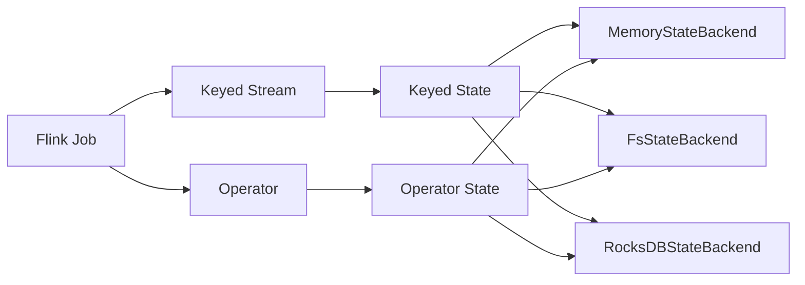

# Flink State状态管理原理与代码实例讲解

关键词：Flink、状态管理、Checkpoint、State Backend、Keyed State、Operator State、代码实例

## 1. 背景介绍
### 1.1  问题的由来
在流式计算中,状态管理是一个非常重要且具有挑战性的问题。流式作业通常需要在无界数据流上持续不断地进行计算,这就要求系统能够可靠地管理中间计算结果的状态。尤其是在面对故障和程序异常时,如何保证状态数据不丢失、快速恢复,成为流计算框架必须解决的核心问题。
### 1.2  研究现状
目前主流的分布式流计算引擎如Flink、Spark Streaming等,都提供了自己的状态管理方案。其中Flink凭借其高效、灵活、易用的状态管理机制脱颖而出,成为流计算领域的佼佼者。Flink不仅支持多种类型的状态,还提供了Checkpoint机制来保证exactly-once语义。越来越多的公司选择Flink来构建关键的流式应用。
### 1.3  研究意义
深入理解Flink的状态管理原理,对于我们设计和优化基于Flink的流式应用至关重要。通过对其内部机制的剖析,我们可以更好地利用Flink状态的特性,解锁更多应用场景。同时这也有助于我们吸取Flink的优秀设计思想,为构建下一代流计算引擎提供有益参考。
### 1.4  本文结构 
本文将首先介绍Flink状态管理的核心概念,然后重点剖析其Checkpoint机制的算法原理。接下来我们会通过数学模型和代码实例来加深理解。最后,讨论Flink状态管理的实际应用、发展趋势与挑战。

## 2. 核心概念与联系
在Flink中,状态可以分为两大类:Keyed State和Operator State。

**Keyed State**:这类状态与特定的key相关联。Flink根据key对数据流进行分区,每一个key对应一个状态分区。只有处理相同key的数据的算子才能访问和修改对应的状态。常见的Keyed State有ValueState、ListState、MapState等。

**OperatorState**:与Keyed State不同,Operator State与特定的算子实例绑定,整个算子的所有并发任务共享同一个状态。Operator State不会根据数据流的key进行区分。常见的Operator State有ListState和BroadcastState。

除了状态的类型,Flink还引入了State Backend的概念。State Backend定义了状态数据的存储位置和格式。Flink内置了3种State Backend:MemoryStateBackend、FsStateBackend和RocksDBStateBackend,分别利用JVM堆内存、HDFS等文件系统、RocksDB数据库来存储状态数据。

下面这张图描述了Flink状态管理的核心概念之间的关系:



## 3. 核心算法原理 & 具体操作步骤
### 3.1  算法原理概述
Flink状态管理的核心是Checkpoint机制。Checkpoint是Flink实现exactly-once语义的基础。它通过定期持久化存储状态数据来保证在故障发生后能够恢复之前的计算状态,从而避免数据丢失或重复处理。
### 3.2  算法步骤详解 
Flink的Checkpoint分为以下几个步骤:

1. JobManager向所有Source算子发送Barrier,触发新的Checkpoint
2. 当算子收到所有输入流的Barrier时,就对当前状态做个快照,然后把Barrier传递到下游
3. Sink算子收到Barrier,就把结果数据保存到外部系统,保证Sink的Checkpoint也完成 
4. 当所有算子都完成快照后,就认为本次Checkpoint完成。JobManager会把状态数据异步写入配置的State Backend
5. Checkpoint完成后,就可以安全地删除旧的状态数据,只保留最近的几个Checkpoint

当故障发生需要从Checkpoint恢复时,Flink重新部署应用,从State Backend读取保存的状态数据,从上次Checkpoint处继续计算。

### 3.3  算法优缺点
Flink Checkpoint的优点在于:
- 能够提供exactly-once的一致性保证,保证数据处理的精确性
- 支持大规模状态数据,Checkpoint开销小
- 恢复时间快,能够提供高可用性保证

但它也有一些局限性:
- 没有完善的跨版本升级方案,升级时必须停机
- 对于极大状态,完整Checkpoint的代价比较高
- 由于采用异步Checkpoint,在极端情况下可能会阻塞数据处理

### 3.4  算法应用领域
Flink状态管理在诸多领域得到应用,尤其适用于:
- 需要exactly-once语义的金融场景,如实时对账、风控等
- 需要保存大量中间状态的复杂流式计算,如 Multi-Pattern 的 CEP 
- 需要快速恢复的高可用场景,如监控告警、电信计费等

## 4. 数学模型和公式 & 详细讲解 & 举例说明
### 4.1  数学模型构建
我们可以用一个简化的数学模型来刻画Flink状态Checkpoint的过程。假设一个Flink Job由n个算子 $O={O_1,O_2,...,O_n}$ 组成,每个算子 $O_i$ 包含一组状态 $S_i={S_i^1,S_i^2,...}$,整个Job的状态为所有算子状态的集合 $S=\bigcup_{i=1}^n S_i$。

我们用 $C_t$ 表示第 $t$ 次Checkpoint,它本质上是 $t$ 时刻整个Job状态的一个快照,即 $C_t=S(t)$。当Checkpoint $C_t$ 完成后,就得到了一份状态副本 $S'(t)$,保存到State Backend。

当发生故障需要恢复到 $t$ 时刻的状态时,就从State Backend读取该时刻的状态副本数据 $S'(t)$,恢复各个算子的状态,继续计算。

### 4.2  公式推导过程
我们关注两个关键指标:

(1) Checkpoint总大小。假设每个算子 $O_i$ 的状态大小为 $|S_i|$,则第 $t$ 次Checkpoint的总大小为:

$$
|C_t| = |S(t)| = \sum_{i=1}^n |S_i(t)|
$$

(2) 恢复时间。假设从State Backend读取状态的吞吐量为 $v$,则从Checkpoint $C_t$ 恢复的时间为:

$$
T_{recover} = \frac{|C_t|}{v} = \frac{\sum_{i=1}^n |S_i(t)|}{v}
$$

可见Checkpoint的总大小和算子状态大小成正比,和State Backend的读取速度成反比。

### 4.3  案例分析与讲解
举一个具体的例子,假设我们有一个Flink Job由3个算子组成,每个算子的状态大小分别为10MB、20MB、5MB,Checkpoint间隔为1分钟,State Backend的读取速度为100MB/s。

则平均每次Checkpoint的大小为:
$$
|C_t| = 10MB + 20MB + 5MB = 35MB
$$

故障恢复时,从State Backend完全读取状态数据的时间为:
$$
T_{recover} = \frac{35MB}{100MB/s} = 0.35s
$$

在实际应用中我们往往需要权衡Checkpoint间隔、State Backend选型、算子状态大小等因素,设置合理的参数,来保证Checkpoint开销可控,恢复时间满足需求。

### 4.4  常见问题解答
Q: 如何设置合理的Checkpoint间隔?
A: Checkpoint间隔需要在恢复时间、Checkpoint开销之间做平衡。一般建议根据状态大小、吞吐量、可接受的恢复时间等因素设置,在几分钟到几十分钟之间。

Q: 如何选择合适的State Backend?  
A: 小状态建议用内存型的MemoryStateBackend或FsStateBackend,大状态建议用RocksDBStateBackend。还要考虑状态读写性能、可扩展性等因素。

Q: 能否避免无谓的状态快照?
A: 可以考虑增量Checkpoint等优化机制,避免每次都做全量快照。二进制格式也能减小状态序列化开销。

## 5. 项目实践：代码实例和详细解释说明
### 5.1  开发环境搭建
首先我们搭建Flink开发环境。这里以Java为例,需要安装:
- JDK 8+
- Maven 3+
- Flink 1.14+

然后创建一个Maven项目,添加Flink相关依赖:

```xml
<dependency>
    <groupId>org.apache.flink</groupId>
    <artifactId>flink-streaming-java_2.12</artifactId>
    <version>1.14.0</version>
</dependency>
<dependency>
    <groupId>org.apache.flink</groupId>
    <artifactId>flink-clients_2.12</artifactId>
    <version>1.14.0</version>
</dependency>
```

### 5.2  源代码详细实现
下面的代码演示了Flink状态管理的基本用法。我们实现了一个简单的单词计数应用,统计每个单词的出现次数。

```java
public class StatefulWordCount {
    public static void main(String[] args) throws Exception {
        StreamExecutionEnvironment env = StreamExecutionEnvironment.getExecutionEnvironment();
        
        // 开启Checkpoint，每1000 ms进行一次
        env.enableCheckpointing(1000);
        
        // 选择文件系统作为状态后端        
        env.setStateBackend(new FsStateBackend("file:///tmp/flink-checkpoints"));
        
        // 处理输入数据
        DataStream<String> inputStream = env.socketTextStream("localhost", 9999);
        
        DataStream<Tuple2<String, Integer>> resultStream = inputStream
            .flatMap(new Tokenizer())
            .keyBy(value -> value.f0)
            .map(new Counters());
        
        resultStream.print();
        
        env.execute("Stateful WordCount");
    }
    
    // 将文本行切分为单词
    public static final class Tokenizer implements FlatMapFunction<String, Tuple2<String, Integer>> {
        @Override
        public void flatMap(String value, Collector<Tuple2<String, Integer>> out) {
            String[] tokens = value.toLowerCase().split("\\W+");
            for (String token : tokens) {
                if (token.length() > 0) {
                    out.collect(new Tuple2<>(token, 1));
                }
            }
        }
    }
    
    // 使用状态来维护每个单词的计数
    public static final class Counters implements MapFunction<Tuple2<String, Integer>, Tuple2<String, Integer>>, CheckpointedFunction {
        // 单词计数统计的状态，每个单词都有一个
        private transient ValueState<Integer> state;
        
        @Override
        public Tuple2<String, Integer> map(Tuple2<String, Integer> value) throws Exception {
            // 获取当前单词的计数
            Integer currentState = state.value();
            
            if (currentState == null) {
                currentState = 0;
            }
            
            // 将计数加1并更新状态
            currentState += value.f1;
            state.update(currentState);
            
            return Tuple2.of(value.f0, currentState);
        }
        
        // 初始化状态        
        @Override
        public void initializeState(FunctionInitializationContext context) throws Exception {
            state = context.getKeyedStateStore().getState(new ValueStateDescriptor<>("wordCount", Integer.class));
        }
        
        // 将状态快照保存到Checkpoint时调用
        @Override
        public void snapshotState(FunctionSnapshotContext context) throws Exception {
        }
    }
}
```

### 5.3  代码解读与分析
上面的代码主要分为以下几个部分:

1. 创建执行环境,配置Checkpoint间隔和状态后端。这里我们选择了1秒一次的Checkpoint间隔,文件系统作为状态后端。
2. 加载输入数据流,这里从Socket读取文本数据。
3. 对数据流进行处理。首先用Tokenizer将文本切分为单词,然后按照单词进行keyBy分区,最后用Counters来统计每个单词的出现次数。
4. 输出结果并执行Job。

其中,Counters是保存状态的关键。它是一个有状态的MapFunction,同时实现了CheckpointedFunction接口。在initializeState方法中,它通过RuntimeContext初始化了一个ValueState,用于保存每个单词的计数值。在map方法中,通过state.