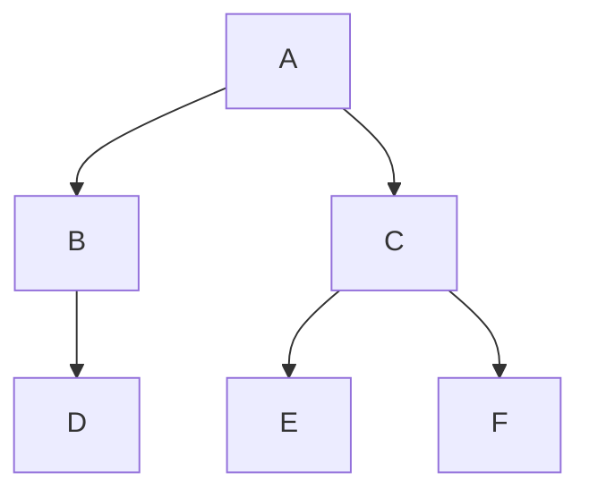
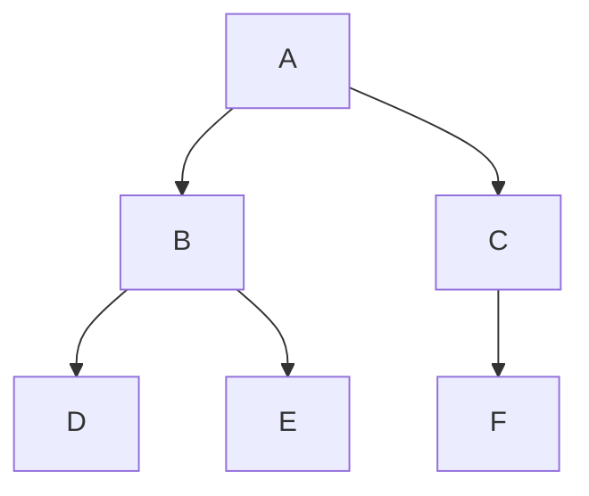

# Graph Vertex原理与代码实例讲解

## 1. 背景介绍

### 1.1 问题的由来

图论作为离散数学的重要分支，在计算机科学领域中扮演着至关重要的角色。从社交网络分析到路径规划，从机器学习到生物信息学，图数据结构和算法的应用无处不在。而在图论中，顶点（Vertex）作为最基本的构成元素，承载着图数据的核心信息。

随着互联网和物联网的快速发展，图数据的规模和复杂性日益增长，对图顶点的高效处理和分析提出了更高的要求。如何有效地存储、访问、更新和查询图顶点信息，成为构建高性能图计算系统的关键挑战之一。

### 1.2 研究现状

目前，图顶点的表示和处理方法主要分为两大类：

* **邻接矩阵表示法:** 使用一个二维数组来表示图中顶点之间的连接关系，优点是查询效率高，缺点是存储空间占用大，尤其对于稀疏图而言。
* **邻接表表示法:**  使用链表或数组来存储每个顶点的邻居节点信息，优点是存储空间占用小，适用于稀疏图，缺点是查询效率相对较低。

近年来，随着图数据库和图计算引擎的兴起，涌现出许多针对不同应用场景优化的图顶点存储和处理技术，例如：

* **基于属性的顶点存储:**  将顶点的属性信息存储在数据库中，并通过索引技术加速查询。
* **分布式图顶点存储:** 将图顶点数据分布式存储在多个节点上，以提高系统的可扩展性和容错性。
* **图顶点缓存技术:** 将频繁访问的顶点数据缓存到内存中，以减少磁盘 I/O 操作，提高查询效率。

### 1.3 研究意义

深入研究图顶点的原理和实现技术，对于以下方面具有重要意义：

* **提升图数据处理效率:**  高效的顶点存储和访问机制是构建高性能图计算系统的基础。
* **促进图算法的优化:**  针对不同类型的图顶点数据结构，可以设计和优化相应的图算法，提高算法效率。
* **拓展图应用领域:**  深入理解图顶点的特性，有助于开发新的图应用，解决更复杂的实际问题。

### 1.4 本文结构

本文将从以下几个方面对图顶点进行深入探讨：

* **核心概念与联系:**  介绍图顶点的定义、类型、属性以及与其他图论概念的关系。
* **核心算法原理 & 具体操作步骤:** 讲解与图顶点相关的常用算法，例如顶点插入、删除、查找、遍历等，并给出详细的操作步骤和代码实例。
* **数学模型和公式 & 详细讲解 & 举例说明:**  介绍图顶点的数学模型和相关公式，并结合实际案例进行详细讲解和举例说明。
* **项目实践：代码实例和详细解释说明:**  提供完整的代码实例，演示如何使用不同的编程语言和工具实现图顶点相关的操作，并对代码进行详细解释说明。
* **实际应用场景:**  介绍图顶点在实际应用场景中的应用，例如社交网络分析、路径规划、推荐系统等。
* **工具和资源推荐:**  推荐学习图顶点相关的书籍、网站、工具和开源项目。
* **总结：未来发展趋势与挑战:**  总结图顶点研究的成果、未来发展趋势以及面临的挑战。

## 2. 核心概念与联系

### 2.1 图顶点的定义

在图论中，图（Graph）是由顶点（Vertex）和边（Edge）组成的抽象数据结构，用于表示对象之间的关系。顶点是图的基本元素，表示图中的实体或对象。

### 2.2 图顶点的类型

图顶点可以根据其在图中的角色和属性进行分类：

* **孤立顶点:**  没有与任何其他顶点相连的顶点。
* **叶顶点:**  只有一个邻居节点的顶点。
* **内部顶点:**  具有两个或多个邻居节点的顶点。
* **源顶点:**  在有向图中，入度为 0 的顶点。
* **汇顶点:**  在有向图中，出度为 0 的顶点。

### 2.3 图顶点的属性

图顶点可以具有以下属性：

* **ID:**  用于唯一标识顶点的标识符。
* **标签:**  用于描述顶点类型的文本字符串。
* **权重:**  用于表示顶点重要性的数值。
* **其他自定义属性:**  根据具体应用场景，可以为顶点定义其他自定义属性。

### 2.4 图顶点与其他图论概念的关系

图顶点与其他图论概念密切相关，例如：

* **边:**  边连接两个顶点，表示它们之间的关系。
* **路径:**  由一系列顶点和连接它们的边组成的序列。
* **环:**  起点和终点相同的路径。
* **连通图:**  图中任意两个顶点之间都存在路径。

## 3. 核心算法原理 & 具体操作步骤

### 3.1 算法原理概述

本节将介绍与图顶点相关的常用算法，包括：

* **顶点插入:**  向图中添加新的顶点。
* **顶点删除:**  从图中删除指定的顶点。
* **顶点查找:**  在图中查找指定的顶点。
* **顶点遍历:**  按照一定的顺序访问图中的所有顶点。

### 3.2 算法步骤详解

#### 3.2.1 顶点插入

**邻接矩阵表示法:**

1. 扩展邻接矩阵的维度，新增一行和一列，用于表示新插入的顶点。
2. 将新顶点与其他顶点之间的连接关系更新到邻接矩阵中。

**邻接表表示法:**

1. 创建一个新的链表或数组，用于存储新顶点的邻居节点信息。
2. 将新顶点添加到图的顶点列表中。

#### 3.2.2 顶点删除

**邻接矩阵表示法:**

1. 删除邻接矩阵中对应于要删除顶点的行和列。
2. 更新其他顶点与被删除顶点之间的连接关系。

**邻接表表示法:**

1. 从图的顶点列表中删除要删除的顶点。
2. 遍历所有顶点的邻居节点列表，删除与被删除顶点相关的边。

#### 3.2.3 顶点查找

**邻接矩阵表示法:**

1. 遍历邻接矩阵的行或列，查找与目标顶点 ID 相匹配的元素。

**邻接表表示法:**

1. 遍历图的顶点列表，查找与目标顶点 ID 相匹配的顶点。

#### 3.2.4 顶点遍历

常见的图顶点遍历算法包括：

* **深度优先搜索 (DFS):**  从起始顶点开始，沿着一条路径尽可能深入地访问顶点，直到无法继续访问为止，然后回溯到上一个顶点，继续访问其他未被访问的顶点。



* **广度优先搜索 (BFS):**  从起始顶点开始，逐层访问其邻居节点，直到所有顶点都被访问为止。



### 3.3 算法优缺点

| 算法 | 优点 | 缺点 |
|---|---|---|
| 邻接矩阵 | 查询效率高 | 存储空间占用大，不适用于稀疏图 |
| 邻接表 | 存储空间占用小，适用于稀疏图 | 查询效率相对较低 |
| 深度优先搜索 | 适用于查找路径和遍历连通图 |  空间复杂度较高 |
| 广度优先搜索 | 适用于查找最短路径 |  时间复杂度较高 |

### 3.4 算法应用领域

* **顶点插入:**  社交网络中添加新用户，知识图谱中添加新实体。
* **顶点删除:**  社交网络中删除用户，图数据库中删除数据记录。
* **顶点查找:**  推荐系统中查找相似用户，路径规划中查找目标地点。
* **顶点遍历:**  网络爬虫中遍历网页，垃圾邮件检测中遍历邮件网络。

## 4. 数学模型和公式 & 详细讲解 & 举例说明

### 4.1 数学模型构建

图可以用数学语言描述为一个二元组 G = (V, E)，其中：

* V 表示顶点集，V = {v1, v2, ..., vn}。
* E 表示边集，E = {e1, e2, ..., em}。

### 4.2 公式推导过程

图的顶点数：|V|
图的边数：|E|

### 4.3 案例分析与讲解

**案例：社交网络**

在一个社交网络中，每个用户都可以看作是一个顶点，用户之间的朋友关系可以看作是边。

* 顶点集 V = {用户1, 用户2, ..., 用户n}
* 边集 E = {(用户1, 用户2), (用户1, 用户3), ..., (用户n-1, 用户n)}

**案例：交通网络**

在一个交通网络中，每个路口可以看作是一个顶点，道路可以看作是边。

* 顶点集 V = {路口1, 路口2, ..., 路口n}
* 边集 E = {(路口1, 路口2), (路口1, 路口3), ..., (路口n-1, 路口n)}

### 4.4 常见问题解答

**问题：如何判断两个顶点之间是否存在边？**

**解答：**

* 邻接矩阵表示法：检查对应元素的值是否为 1。
* 邻接表表示法：遍历其中一个顶点的邻居节点列表，查看是否存在目标顶点。

**问题：如何计算图的顶点数和边数？**

**解答：**

* 顶点数：顶点集 V 的元素个数，即 |V|。
* 边数：边集 E 的元素个数，即 |E|。

## 5. 项目实践：代码实例和详细解释说明

### 5.1 开发环境搭建

本节将使用 Python 语言和 NetworkX 库来演示图顶点的操作。

首先，需要安装 NetworkX 库：

```
pip install networkx
```

### 5.2 源代码详细实现

```python
import networkx as nx

# 创建一个无向图
graph = nx.Graph()

# 添加顶点
graph.add_node(1)
graph.add_node(2)
graph.add_node(3)

# 添加边
graph.add_edge(1, 2)
graph.add_edge(2, 3)

# 打印图的顶点和边
print("顶点:", graph.nodes)
print("边:", graph.edges)

# 删除顶点
graph.remove_node(2)

# 打印图的顶点和边
print("顶点:", graph.nodes)
print("边:", graph.edges)

# 查找顶点
if graph.has_node(1):
    print("顶点 1 存在")

# 遍历顶点
for node in graph.nodes:
    print(node)
```

### 5.3 代码解读与分析

* `nx.Graph()`: 创建一个无向图对象。
* `add_node()`: 向图中添加顶点。
* `add_edge()`: 向图中添加边。
* `nodes`: 返回图的所有顶点。
* `edges`: 返回图的所有边。
* `remove_node()`: 从图中删除顶点。
* `has_node()`: 检查图中是否存在指定的顶点。
* `for node in graph.nodes:`: 遍历图的所有顶点。

### 5.4 运行结果展示

```
顶点: [1, 2, 3]
边: [(1, 2), (2, 3)]
顶点: [1, 3]
边: []
顶点 1 存在
1
3
```

## 6. 实际应用场景

### 6.1 社交网络分析

* **好友推荐:**  分析用户之间的关系，推荐潜在的好友。
* **社区发现:**  将社交网络划分为不同的社区，发现用户群体特征。
* **影响力分析:**  识别社交网络中的关键节点，评估用户的影响力。

### 6.2 路径规划

* **最短路径算法:**  在地图中找到两个地点之间的最短路径。
* **导航系统:**  为用户提供路线规划和导航服务。
* **物流配送:**  优化物流配送路线，降低运输成本。

### 6.3 推荐系统

* **协同过滤:**  根据用户的历史行为和兴趣，推荐相似的商品或服务。
* **基于内容的推荐:**  根据商品或服务的特征，推荐相似的内容。
* **混合推荐:**  结合协同过滤和基于内容的推荐，提供更精准的推荐结果。

### 6.4 未来应用展望

* **图神经网络:**  将图数据应用于深度学习，解决更复杂的机器学习问题。
* **知识图谱:**  构建大规模的知识库，支持语义搜索和问答系统。
* **生物信息学:**  分析蛋白质相互作用网络、基因调控网络等生物网络。

## 7. 工具和资源推荐

### 7.1 学习资源推荐

* **书籍:**
    * 《算法导论》
    * 《图论及其应用》
    * 《网络科学导论》
* **网站:**
    * [GeeksforGeeks](https://www.geeksforgeeks.org/)
    * [Stanford CS224W: Machine Learning with Graphs](http://web.stanford.edu/class/cs224w/)

### 7.2 开发工具推荐

* **NetworkX (Python):**  用于创建、操作和分析图的 Python 库。
* **igraph (R):**  用于图分析的 R 包。
* **Neo4j:**  开源的图数据库。

### 7.3 相关论文推荐

* [PageRank: Bringing Order to the Web](https://infolab.stanford.edu/~backrub/google.html)
* [Node2Vec: Scalable Feature Learning for Networks](https://arxiv.org/abs/1607.00653)
* [Graph Convolutional Networks for Text Classification](https://arxiv.org/abs/1609.02907)

### 7.4 其他资源推荐

* [Graph Drawing](https://en.wikipedia.org/wiki/Graph_drawing):  图的可视化技术。
* [Graph Databases](https://en.wikipedia.org/wiki/Graph_database):  专门用于存储和查询图数据的数据库。

## 8. 总结：未来发展趋势与挑战

### 8.1 研究成果总结

图顶点作为图数据的核心元素，其高效处理和分析对于图计算系统的性能至关重要。近年来，涌现出许多针对不同应用场景优化的图顶点存储和处理技术，例如基于属性的顶点存储、分布式图顶点存储、图顶点缓存技术等。

### 8.2 未来发展趋势

* **大规模图数据处理:**  随着图数据的规模和复杂性不断增长，需要开发更高效的图顶点存储和处理技术，以应对大规模图数据处理的挑战。
* **图神经网络:**  图神经网络作为一种新兴的深度学习技术，将图数据应用于机器学习，具有巨大的发展潜力。
* **图计算与人工智能的融合:**  图计算和人工智能技术的融合将推动图应用的创新，解决更复杂的实际问题。

### 8.3 面临的挑战

* **图数据的复杂性:**  图数据通常具有高度的复杂性和异构性，对图顶点的处理和分析提出了更高的要求。
* **图算法的可扩展性:**  许多图算法在大规模图数据上效率低下，需要设计更具可扩展性的图算法。
* **图计算系统的性能优化:**  图计算系统的性能受到多个因素的影响，例如数据存储、计算模型、硬件平台等，需要进行全面的性能优化。

### 8.4 研究展望

随着图计算技术的不断发展，图顶点的研究将继续深入，并推动图应用的创新。未来，我们可以期待看到更高效的图顶点存储和处理技术、更强大的图算法以及更广泛的图应用。


作者：禅与计算机程序设计艺术 / Zen and the Art of Computer Programming 
