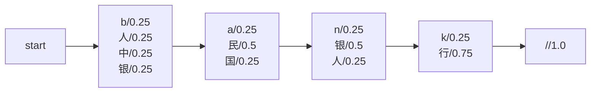

# Lucene分词原理与代码实例讲解

## 1. 背景介绍

### 1.1 问题的由来

在信息检索和自然语言处理领域,分词是一个基础且关键的任务。分词的目的是将一个较长的文本序列切分为多个单词(token)序列,为后续的处理做好准备。

对于英语等使用空格分隔单词的语言来说,分词任务相对简单。但对于汉语、日语等东亚语系,由于缺乏单词之间的明确分隔符,分词任务就变得异常复杂。比如"人民银行"可以分为"人民"和"银行",也可以分为"人"、"民"、"银"和"行"。

传统的分词方法主要有基于字典的正向最大匹配、反向最大匹配等。这些方法需要预先构建一个词典,在分词时匹配词典中的词条。但词典的构建和维护都是一个巨大的工程,且无法覆盖所有的新词语。

### 1.2 研究现状  

近年来,随着统计自然语言处理和深度学习技术的发展,基于统计模型和深度学习的分词方法逐渐兴起。这些方法不需要预先构建词典,而是通过大规模语料训练模型,自动学习语言的统计规律,从而实现分词。

Lucene是一个流行的开源全文检索引擎库,它提供了多种分词器(Analyzer)用于分词。其中基于有限状态转移机(FST)的分词器是Lucene分词的核心部分。

### 1.3 研究意义

全面掌握Lucene分词的原理和实现方式,对于从事信息检索、自然语言处理等相关领域的工程师和研究人员来说都是非常重要的。本文将深入探讨Lucene分词的核心思想和算法细节,并结合大量的代码示例,为读者提供一个全面的学习参考。

### 1.4 本文结构  

本文首先介绍Lucene分词的核心概念,包括Token、Tokenizer和TokenFilter等。接下来重点讲解有限状态转移机在分词中的应用原理,以及Lucene中FST分词器的具体实现。然后通过分析源代码,对Lucene分词器的使用方法和扩展方式进行详细的讲解。最后总结Lucene分词的优缺点,并对其未来的发展趋势进行展望。

## 2. 核心概念与联系

在深入探讨Lucene分词原理之前,我们先了解一些核心概念:

- **Token**: 分词的基本单位,通常表示一个单词或词组。
- **Tokenizer**: 将原始文本流切分为一系列Token的组件,是分词过程的第一步。
- **TokenFilter**: 对Tokenizer输出的Token流进行进一步加工处理的组件,如小写、去除标点等。
- **Analyzer**: Tokenizer和一系列TokenFilter的有序集合,负责完成全部分词处理流程。

Lucene分词的核心流程是:


其中,Tokenizer将原始文本流切分为初始Token流;然后这个Token流被送入有序的TokenFilter管道,每个TokenFilter对Token流进行特定的处理,最终输出加工过的Token流。

Lucene提供了多种内置的Tokenizer和TokenFilter实现,也允许用户自定义扩展。合理选择和组合不同的分词组件,可以构建出满足特定需求的Analyzer。

## 3. 核心算法原理 & 具体操作步骤

### 3.1 算法原理概述

Lucene分词的核心算法是基于有限状态转移机(Finite State Transducer,FST)的。FST是一种用于表示正则表达式的有效数据结构,可以高效地判断一个字符串是否被正则表达式匹配。

在分词任务中,我们可以将每个词条看作是一个正则表达式,并将它们全部编译到一个FST中。这样,对于任意给定的文本序列,我们就可以高效地在FST中匹配出所有可能的词条。

FST不仅可以表示确定的有限状态自动机,还可以表示更通用的无环有限状态转移机。Lucene分词器使用的是加权FST(Weighted FST),即在每个转移边上附加了权重(weight),可以表示概率或其他信息。

Lucene中的FST分词器由两部分组成:

1. **FST构建器(FST Builder)**: 根据词典文件,构建内存中的加权FST。
2. **FST分词器(FST Tokenizer)**: 使用内存中的FST,对给定文本进行分词。

### 3.2 算法步骤详解

我们以一个简单的例子来说明FST分词器的工作原理。假设我们有一个只包含4个词条的词典:

```
bank
银行
人民银行
中国人民银行
```

首先,FST构建器会根据这个词典文件,构建出如下所示的加权FST:



在这个FST中,每个状态用一个圆圈表示,每条边表示一个转移,边上标注了当前字符及其权重。权重通常设置为该词条的词频逆向文档频率(IDF)值,用于后续的打分排序。

接下来,FST分词器将使用这个FST对给定文本进行分词。我们以"中国人民银行存款"为例,分词过程如下:

1. 从起始状态`start`开始,匹配第一个字符`中`,权重为0.25,进入状态`A`。
2. 在状态`A`,匹配第二个字符`国`,权重为0.25,进入状态`B`。
3. 在状态`B`,匹配第三个字符`人`,权重为0.5,进入状态`C`。
4. 在状态`C`,匹配第四个字符`民`,权重为0.25,回到状态`B`。
5. 在状态`B`,匹配第五个字符`银`,权重为0.5,进入状态`C`。
6. 在状态`C`,匹配第六个字符`行`,权重为0.75,进入状态`D`。
7. 在状态`D`,匹配终止符`//`,权重为1.0,进入终止状态`E`。

因此,最终可以匹配出"中国人民银行"这个词条。对于剩余的"存款"部分,由于在FST中找不到匹配路径,将按字符逐个输出。

整个分词结果为:

```
中国人民银行, 存, 款
```

### 3.3 算法优缺点

FST分词算法的主要优点如下:

1. **高效**: FST是一种压缩高效的数据结构,可以在有限内存中存储大规模词典,查询速度也非常快。
2. **灵活**: 可以通过编辑词典文件,轻松更新和调整分词词典。
3. **可扩展**: 支持通过插件的方式扩展新的分词器。

但它也存在一些缺陷:

1. **规则有限**: 基于FST的分词算法只能识别词典中预先定义的模式,无法发现新词语。
2. **歧义问题**: 对于存在歧义的情况,无法合理分词,如"中国人民银行存款"的"中国人民"和"人民银行"部分。
3. **分词粒度**: 分词粒度完全由词典决定,不能对粗粒度或细粒度分词做出调整。

### 3.4 算法应用领域

FST分词算法在以下领域有着广泛应用:

- **全文检索**: Lucene等全文检索引擎库中的分词模块。
- **自然语言处理**: 文本挖掘、情感分析等任务的分词前处理。
- **用户查询解析**: 搜索引擎、智能助手中的查询语句分词。
- **词典和语料库构建**: 构建分词词典和语料库的基础组件。

## 4. 数学模型和公式 & 详细讲解 & 举例说明

### 4.1 数学模型构建

在正式介绍FST的数学模型之前,我们先了解一下有限状态自动机(Finite State Automaton,FSA)和有限状态转移机(Finite State Transducer,FST)的概念。

**有限状态自动机(FSA)**是一种用于识别给定模式的数学计算模型,由有限个状态和一系列转移规则组成。根据是否存在环路,可分为:

- **确定有限状态自动机(Deterministic FSA,DFSA)**: 不存在环路,对于任意状态和输入符号,只有唯一的转移路径。
- **非确定有限状态自动机(Non-deterministic FSA,NFSA)**: 可能存在环路,对于某些状态和输入符号,存在多条转移路径。

**有限状态转移机(FST)**是FSA的推广,不仅能识别模式,还能对输入字符串进行转换操作。FST在每条转移边上附加了输出标签,可以实现字符串到字符串的转换映射。

Lucene中使用的是**加权FST(Weighted FST)**,即在每条转移边上还附加了权重(weight)。权重通常用于表示转移概率,或其他用于打分排序的统计信息。

我们用数学符号对加权FST进行形式化定义:

$$
\begin{align*}
\mathcal{T} &= (Q, \Sigma, \Delta, q_0, F, \rho) \\
Q &= \{q_0, q_1, \dots, q_n\} & \text{(有限状态集)} \\
\Sigma &= \{\sigma_1, \sigma_2, \dots, \sigma_m\} & \text{(输入字母表)} \\
\Delta &\subseteq Q \times (\Sigma \cup \{\epsilon\}) \times (\Sigma^* \cup \{\epsilon\}) \times \mathbb{R} \times Q & \text{(转移关系集)} \\
q_0 &\in Q & \text{(初始状态)} \\
F &\subseteq Q & \text{(终止状态集)} \\
\rho &: \Delta \rightarrow \mathbb{R} & \text{(转移权重函数)}
\end{align*}
$$

其中:

- $Q$是有限状态集
- $\Sigma$是输入字母表,即所有可能输入字符的集合
- $\Delta$是转移关系集,每个元素$\delta = (q, \sigma, \gamma, w, q')$表示从状态$q$读入字符$\sigma$时,输出字符串$\gamma$,转移到状态$q'$,转移权重为$w$
- $q_0$是初始状态
- $F$是终止状态集合
- $\rho$是转移权重函数,将每个转移关系$\delta$映射到对应的权重$w$

通过上述数学模型,我们可以形式化地定义加权FST的运行过程。

### 4.2 公式推导过程

我们定义一个路径(path)$\pi$为一系列转移关系的序列:

$$
\pi = \delta_1 \delta_2 \dots \delta_k, \quad \delta_i = (q_i, \sigma_i, \gamma_i, w_i, q_{i+1}) \in \Delta
$$

其中$q_1 = q_0$是初始状态。路径的输入字符串为$\sigma(\pi) = \sigma_1 \sigma_2 \dots \sigma_k$,输出字符串为$\gamma(\pi) = \gamma_1 \gamma_2 \dots \gamma_k$。

我们将路径$\pi$的权重$w(\pi)$定义为所有转移权重的乘积:

$$
w(\pi) = \prod_{i=1}^k w_i
$$

那么,对于任意输入字符串$x \in \Sigma^*$,我们可以定义其对应的最佳输出字符串$y^*$为:

$$
y^* = \arg\max_{y \in \Sigma^*} \sum_{\pi \in \Pi(x, y)} w(\pi)
$$

其中$\Pi(x, y)$是所有将$x$转换为$y$的路径集合。也就是说,对于给定输入$x$,我们要找到一个输出$y^*$,使得所有将$x$转换为$y^*$的路径权重之和最大。

在分词任务中,我们将输入字符串$x$看作是原始文本,输出字符串$y$看作是分词结果。每个词条对应FST