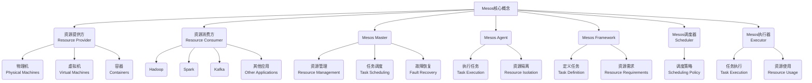

# Mesos原理与代码实例讲解

## 1. 背景介绍

### 1.1 问题的由来

在当今快速发展的云计算时代，资源管理和任务调度成为了关键的挑战。随着大数据、机器学习和微服务等应用的兴起,对计算资源的需求也呈现出了前所未有的多样性和动态性。传统的静态资源分配方式已经无法满足这种动态和多变的需求,因此需要一种更加灵活、高效的资源管理和调度系统。

Apache Mesos正是为解决这一问题而诞生的开源集群管理系统。它提供了一种通用的资源共享和隔离机制,可以在同一个集群中高效地运行不同类型的工作负载,如Hadoop、Spark、Kafka等,并实现资源的动态调度和高效利用。

### 1.2 研究现状

Mesos最初由加州大学伯克利分校的AMPLab开发,后来捐赠给Apache软件基金会,成为Apache顶级项目。目前,Mesos已经被许多知名公司和组织广泛使用,如Twitter、Airbnb、Netflix、Apple等,并被认为是云计算领域最具影响力的开源项目之一。

随着Mesos的不断发展和完善,越来越多的研究人员和开发者开始关注和探索Mesos的原理和实现细节。已有大量的文献、博客和开源项目致力于分析和解释Mesos的设计理念、架构和算法,并提供了丰富的实践案例和代码示例。

### 1.3 研究意义

深入理解Mesos的原理和实现对于以下几个方面具有重要意义:

1. **资源管理和调度优化**:了解Mesos的调度算法和资源隔离机制,可以帮助我们更好地管理和利用集群资源,提高资源利用率和系统吞吐量。

2. **大数据和微服务架构**:Mesos为运行各种大数据应用和微服务提供了一个统一的平台,研究Mesos有助于构建高效、可扩展的大数据和微服务架构。

3. **容器和虚拟化技术**:Mesos与Docker等容器技术深度集成,研究Mesos有助于更好地理解和应用容器虚拟化技术。

4. **开源社区贡献**:Mesos作为Apache顶级开源项目,研究其原理和实现有助于为开源社区做出贡献,推动技术发展。

### 1.4 本文结构

本文将从以下几个方面深入探讨Mesos的原理和实现:

1. 核心概念和架构
2. 调度算法和资源管理机制
3. 数学模型和公式推导
4. 代码实现细节和示例
5. 实际应用场景
6. 工具和资源推荐
7. 未来发展趋势和挑战

通过全面、系统的分析和讲解,读者可以深入理解Mesos的设计理念和实现细节,掌握其核心原理和实践技能。

## 2. 核心概念与联系

在深入探讨Mesos的原理和实现之前,我们需要先了解一些核心概念和它们之间的联系。这些概念构成了Mesos的基础框架,对于理解后续内容至关重要。

**资源提供方 (Resource Provider)**
Mesos集群中的资源提供方可以是物理机、虚拟机或容器。它们为集群提供了计算、内存、存储和其他资源。

**资源消费方 (Resource Consumer)**
资源消费方是指运行在Mesos集群上的各种应用和框架,如Hadoop、Spark、Kafka等。它们消耗集群中的资源来执行任务。

**Mesos Master**
Mesos Master是整个系统的大脑和控制中心。它负责资源管理、任务调度和故障恢复等关键功能。

**Mesos Agent**
Mesos Agent运行在每个资源提供方节点上,负责执行任务、管理本地资源和与Master通信。

**Mesos Framework**
Mesos Framework定义了要执行的任务类型和资源需求,并与Mesos Master交互以获取资源和启动任务。

**Mesos调度器 (Scheduler)**
Mesos调度器是Framework的一部分,它实现了特定的调度策略,决定如何分配资源和启动任务。

**Mesos执行器 (Executor)**
Mesos执行器也是Framework的一部分,它在Agent节点上运行,负责启动和监控任务的执行。

这些核心概念相互关联、协作,构成了Mesos的整体架构和工作流程。理解它们对于掌握Mesos的原理至关重要。

## 3. 核心算法原理 & 具体操作步骤

### 3.1 算法原理概述

Mesos的核心算法原理包括两个关键方面:资源管理和任务调度。

**资源管理**
Mesos采用了一种称为资源提供模型(Resource Offer Model)的资源管理机制。在这种模型下,Mesos Master不直接将资源分配给Framework,而是将可用资源以资源提供(Resource Offer)的形式提供给Framework的调度器。调度器可以根据自身的策略决定是否接受这些资源,或者拒绝并等待下一次提供。这种机制确保了资源的动态分配和高效利用。

**任务调度**
Mesos并没有规定特定的任务调度算法,而是允许每个Framework实现自己的调度器,根据应用的特点和需求采用不同的调度策略。常见的调度策略包括公平共享调度、优先级调度、机架感知调度等。调度器通过接受或拒绝资源提供来实现任务的调度和启动。

这种设计理念使Mesos具有很强的灵活性和扩展性,可以支持各种不同类型的工作负载和调度需求。

### 3.2 算法步骤详解

Mesos的资源管理和任务调度过程可以概括为以下几个主要步骤:

1. **资源发现**
   Mesos Agent启动时会发现本节点上的可用资源(CPU、内存、磁盘等),并将这些资源信息报告给Mesos Master。

2. **资源提供**
   Mesos Master根据集群中的资源情况,将可用资源打包成资源提供(Resource Offer),并发送给注册的Framework调度器。

3. **资源选择**
   Framework调度器收到资源提供后,会根据自身的调度策略和任务需求,决定是接受还是拒绝这些资源。如果接受,就需要指定要启动的任务。

4. **任务启动**
   如果调度器接受了资源提供,Mesos Master会在相应的Agent节点上启动指定的任务,并通知Framework执行器执行这些任务。

5. **任务监控**
   任务启动后,Framework执行器会监控任务的运行状态,并将状态信息报告给调度器。调度器可以根据任务状态做出相应的调度决策。

6. **资源回收**
   当任务完成或失败时,执行器会将占用的资源释放,这些资源将被Mesos Master回收,并在下一轮资源提供时重新分配。

7. **故障恢复**
   如果Agent节点或任务发生故障,Mesos Master会检测到并通知相应的Framework调度器。调度器可以根据策略决定是否在其他节点上重新启动任务。

这个过程是一个循环,不断重复,以实现资源的动态分配和高效利用。Mesos的设计使得整个系统具有很强的容错能力和可扩展性。

### 3.3 算法优缺点

Mesos的资源管理和任务调度算法具有以下优点:

1. **资源共享和隔离**
   Mesos支持在同一个集群中运行多种不同类型的工作负载,并实现资源的共享和隔离。

2. **动态调度和高效利用**
   资源提供模型确保了资源的动态分配,提高了资源利用率。

3. **高度可扩展和容错**
   分布式架构和故障恢复机制使Mesos具有很强的可扩展性和容错能力。

4. **灵活的调度策略**
   Framework可以实现自定义的调度器,支持各种调度策略。

5. **与容器技术集成**
   Mesos与Docker等容器技术深度集成,支持容器化的任务执行。

但是,Mesos的算法也存在一些潜在的缺点和挑战:

1. **复杂性**
   Mesos的架构和算法相对复杂,对于新手来说可能有一定的学习曲线。

2. **中心化瓶颈**
   尽管Mesos Master具有高可用性,但它仍然是一个中心化的组件,可能会成为性能瓶颈。

3. **资源FragMENTATION**
   频繁的任务启动和终止可能会导致资源碎片化,降低资源利用率。

4. **调度器实现复杂度**
   实现高效的调度器需要深入理解应用的特点和需求,可能会增加开发难度。

5. **安全性和隔离性挑战**
   在多租户环境下,确保安全性和资源隔离性是一个持续的挑战。

总的来说,Mesos的算法设计体现了对可扩展性、灵活性和高效性的追求,但也需要权衡和解决一些潜在的缺陷和挑战。

### 3.4 算法应用领域

Mesos的资源管理和任务调度算法可以广泛应用于以下领域:

1. **云计算和数据中心**
   Mesos可以作为云计算和数据中心的资源管理和调度平台,支持各种云原生应用的部署和运行。

2. **大数据和机器学习**
   Mesos可以高效地运行Hadoop、Spark等大数据框架,并支持机器学习工作负载的调度和执行。

3. **微服务和容器化应用**
   Mesos与Docker等容器技术的集成使其成为部署和管理微服务和容器化应用的理想平台。

4. **科学计算和HPC**
   Mesos的动态资源分配和高度可扩展性使其适用于科学计算和高性能计算(HPC)领域。

5. **物联网和边缘计算**
   Mesos可以在边缘设备和物联网环境中提供资源管理和任务调度能力。

6. **混合云和多云环境**
   Mesos可以跨多个云平台和本地数据中心统一管理资源,支持混合云和多云部署。

总的来说,Mesos的算法设计使其成为一种通用的资源管理和调度解决方案,可以广泛应用于各种需要动态资源分配和高效利用的场景。

## 4. 数学模型和公式 & 详细讲解 & 举例说明

### 4.1 数学模型构建

为了更好地理解和优化Mesos的资源管理和任务调度算法,我们可以构建一些数学模型来形式化描述和分析这些问题。

**资源模型**
我们可以将集群中的资源抽象为一个向量:

$$R = (R_1, R_2, \dots, R_n)$$

其中$R_i$表示第$i$种资源(如CPU、内存、磁盘等)的总量。

每个任务$t$都有一个资源需求向量:

$$r_t = (r_{t1}, r_{t2}, \dots, r_{tn})$$

其中$r_{ti}$表示任务$t$对第$i$种资源的需求。

**目标函数**
我们可以定义一个目标函数来最大化资源利用率和任务完成率,例如:

$$\max \sum_{