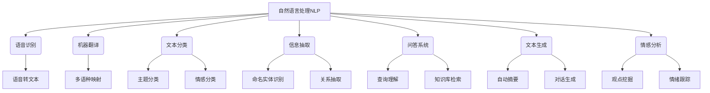

# Natural Language Processing

## 1. 背景介绍

### 1.1 问题的由来

自计算机诞生以来,人与机器之间的交互一直是一个巨大的挑战。早期的计算机只能理解机器语言,这使得人机交互变得异常困难。随着科技的发展,人工智能(AI)和自然语言处理(NLP)应运而生,旨在缩小人与机器之间的鸿沟。

NLP的核心目标是使计算机能够理解和生成人类语言,从而实现自然、流畅的人机对话。这项技术的应用前景广阔,包括机器翻译、智能问答系统、文本分类和情感分析等领域。然而,自然语言的复杂性和多样性给NLP带来了巨大的挑战。

### 1.2 研究现状

近年来,NLP取得了长足的进步,这主要归功于深度学习技术的兴起。深度神经网络能够从大量数据中自动学习特征表示,极大地提高了NLP系统的性能。

目前,NLP领域的主流模型包括:

1. **Word Embedding**: 将词语映射到低维连续向量空间,捕捉词语之间的语义关系。
2. **Recurrent Neural Networks (RNNs)**: 能够处理序列数据,广泛应用于机器翻译、语音识别等任务。
3. **Attention Mechanism**: 允许模型关注输入序列的不同部分,提高了模型的性能和解释能力。
4. **Transformer**: 基于自注意力机制的全新架构,在机器翻译等任务中取得了卓越的成绩。
5. **BERT**: 一种预训练语言模型,通过大规模无监督预训练,为下游NLP任务提供了强大的语义表示。

尽管取得了显著的进展,但NLP仍然面临着诸多挑战,如长期依赖问题、多语言支持、常识推理等,这些都是未来研究的重点方向。

### 1.3 研究意义

NLP技术的发展对于提升人机交互体验、促进信息获取和知识传播具有重要意义。它能够帮助我们更好地理解和利用海量的自然语言数据,为各行业带来巨大的价值。例如:

- 智能助理和聊天机器人可以提供个性化的服务和支持。
- 机器翻译可以消除语言障碍,促进不同文化之间的交流。
- 情感分析可以帮助企业了解客户需求,改进产品和服务。
- 自动文本摘要和问答系统可以提高信息获取的效率。

总的来说,NLP技术的发展将极大地改善人类与信息和知识的交互方式,推动人工智能的发展,为社会的各个领域带来革命性的变化。

### 1.4 本文结构

本文将全面介绍NLP的核心概念、算法原理、数学模型、项目实践、应用场景、工具资源以及未来发展趋势。内容安排如下:

1. 核心概念与联系
2. 核心算法原理与具体操作步骤
3. 数学模型和公式详细讲解与举例说明
4. 项目实践:代码实例和详细解释说明
5. 实际应用场景
6. 工具和资源推荐
7. 总结:未来发展趋势与挑战
8. 附录:常见问题与解答

## 2. 核心概念与联系

自然语言处理(NLP)是一门研究计算机处理人类语言的学科,旨在使计算机能够理解和生成自然语言。它包含了多个子领域和任务,如语音识别、机器翻译、文本分类、信息抽取、问答系统、文本生成和情感分析等。

1. **语音识别**: 将人类语音转换为文本,是人机交互的基础。
2. **机器翻译**: 实现跨语言的自动翻译,促进不同语种之间的交流。
3. **文本分类**: 根据文本内容自动对文本进行分类,如主题分类、情感分类等。
4. **信息抽取**: 从非结构化文本中提取结构化信息,如命名实体识别、关系抽取等。
5. **问答系统**: 能够理解自然语言问题,从知识库中检索相关信息并生成答案。
6. **文本生成**: 自动生成连贯、流畅的自然语言文本,如自动摘要、对话生成等。
7. **情感分析**: 识别文本中表达的观点、情绪和情感倾向。

这些子领域相互关联、相辅相成,共同推动着NLP技术的发展。掌握NLP的核心概念对于建立完整的知识体系至关重要。

## 3. 核心算法原理与具体操作步骤

### 3.1 算法原理概述

NLP算法的核心原理可以概括为以下几个方面:

1. **特征工程**: 将自然语言转换为计算机可以理解的数值特征向量。
2. **机器学习模型**: 基于特征向量,使用监督或无监督的机器学习算法进行训练。
3. **深度学习模型**: 利用神经网络自动从数据中学习特征表示,避免了手工设计特征的过程。
4. **序列建模**: 处理自然语言序列数据,捕捉上下文信息和长距离依赖关系。
5. **注意力机制**: 允许模型动态地关注输入序列的不同部分,提高了模型的性能和解释能力。
6. **迁移学习**: 利用在大规模语料库上预训练的模型,将学习到的知识迁移到下游NLP任务中。

下面将详细介绍一些核心算法的具体原理和操作步骤。

### 3.2 算法步骤详解

#### 3.2.1 Word Embedding

Word Embedding是NLP中一种常用的词向量表示方法,它将词语映射到低维连续向量空间,使得语义相似的词语在向量空间中彼此靠近。常用的Word Embedding算法包括Word2Vec、GloVe等。

以Word2Vec的Skip-gram模型为例,其核心思想是基于上下文预测目标词,算法步骤如下:

1. 构建训练语料库,对语料进行预处理(分词、去停用词等)。
2. 初始化两个向量矩阵:输入向量矩阵和输出向量矩阵。
3. 对于每个目标词,获取其上下文窗口内的上下文词。
4. 使用输入向量矩阵对上下文词进行向量表示,输入到神经网络。
5. 神经网络的目标是最大化目标词的概率,通过反向传播算法更新输入和输出向量矩阵的参数。
6. 重复3-5步骤,直到收敛。
7. 输出向量矩阵中的向量即为词向量表示。

通过Word Embedding,我们可以捕捉词语之间的语义关系,为后续的NLP任务提供有效的特征表示。

#### 3.2.2 序列到序列模型(Seq2Seq)

序列到序列(Seq2Seq)模型是一种广泛应用于机器翻译、文本摘要等任务的架构,它能够处理变长的输入和输出序列。

Seq2Seq模型通常由两部分组成:编码器(Encoder)和解码器(Decoder)。算法步骤如下:

1. **编码器**:
    - 将输入序列按时间步展开,每个时间步输入一个词向量。
    - 递归神经网络(如LSTM或GRU)在每个时间步对输入进行编码,产生一系列隐藏状态向量。
    - 最后一个隐藏状态向量被视为输入序列的编码表示。

2. **解码器**:
    - 初始化解码器的隐藏状态为编码器的最后一个隐藏状态。
    - 对于每个时间步:
        - 将上一时间步的输出词和当前隐藏状态作为输入。
        - 递归神经网络对输入进行解码,产生新的隐藏状态和输出概率分布。
        - 从输出概率分布中采样得到当前时间步的输出词。
    - 重复上述过程,直到生成完整的输出序列或达到最大长度。

通过编码器捕捉输入序列的上下文信息,再由解码器生成目标序列,Seq2Seq模型可以有效地建模序列与序列之间的映射关系。

#### 3.2.3 Transformer

Transformer是一种全新的基于注意力机制的序列建模架构,它不依赖于递归神经网络,而是通过自注意力机制直接捕捉输入序列中任意两个位置之间的依赖关系。

Transformer的核心组件包括:编码器(Encoder)、解码器(Decoder)和注意力机制(Attention)。算法步骤如下:

1. **编码器**:
    - 将输入序列按位置展开,每个位置输入一个词向量。
    - 通过多头自注意力层捕捉输入序列中任意两个位置之间的依赖关系。
    - 对每个位置的表示进行层归一化和位置编码,得到该位置的编码表示。
    - 重复上述过程N次(N为编码器层数),得到最终的序列编码表示。

2. **解码器**:
    - 初始化解码器输入为特殊的开始符号。
    - 对于每个位置:
        - 通过遮掩的多头自注意力层,只允许关注该位置之前的输出表示。
        - 通过编码器-解码器注意力层,将目标位置的表示与编码器的输出序列相关联。
        - 对该位置的表示进行层归一化和位置编码,得到最终的解码表示。
        - 从解码表示生成当前位置的输出概率分布,并采样得到输出词。
    - 重复上述过程,直到生成完整的输出序列或达到最大长度。

Transformer架构中的自注意力机制和残差连接赋予了模型强大的表示能力,在机器翻译等任务中取得了卓越的成绩。

### 3.3 算法优缺点

上述算法在NLP领域发挥着重要作用,但也存在一定的优缺点:

**Word Embedding**:
- 优点:能够捕捉词语之间的语义关系,为后续任务提供有效的特征表示。
- 缺点:无法处理词义纷歧、新词等问题,且难以捕捉长距离依赖关系。

**Seq2Seq**:
- 优点:能够有效地建模序列与序列之间的映射关系,广泛应用于机器翻译、文本摘要等任务。
- 缺点:存在长期依赖问题,对于过长的序列,性能会显著下降。

**Transformer**:
- 优点:自注意力机制能够直接捕捉输入序列中任意两个位置之间的依赖关系,避免了长期依赖问题。
- 缺点:计算量较大,对硬件要求较高;缺乏对位置信息的直接建模能力。

总的来说,这些算法各有优缺点,需要根据具体任务和场景进行选择和组合使用。未来的研究方向包括改进现有算法、设计新的模型架构,以及探索多模态数据的处理等。

### 3.4 算法应用领域

NLP算法在诸多领域都有广泛的应用,下面列举了一些典型的应用场景:

1. **机器翻译**: 使用Seq2Seq、Transformer等模型实现跨语言的自动翻译。
2. **文本分类**: 利用Word Embedding、深度神经网络等技术对文本进行主题分类、情感分类等。
3. **信息抽取**: 通过序列标注模型实现命名实体识别、关系抽取等任务。
4. **问答系统**: 结合检索和机器阅读理解技术,从知识库中找到问题的答案。
5. **自动摘要**: 使用序列