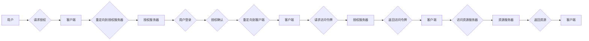

# OAuth 2.0 的详细应用

## 1. 背景介绍

### 1.1 问题的由来

在互联网发展早期，用户想要使用某个网站的服务，往往需要注册一个新的账号。随着互联网应用的普及，这种方式暴露出越来越多的问题：

* **用户需要记住大量的账号密码**，这不仅繁琐，而且容易忘记或泄露。
* **网站需要存储用户的敏感信息**，例如密码、信用卡信息等，这增加了数据泄露的风险。
* **用户数据分散在各个网站**，难以进行统一管理和利用。

为了解决这些问题，OAuth 协议应运而生。OAuth 允许用户授权第三方应用访问其在资源服务器上的资源，而无需向第三方应用提供用户名和密码。

### 1.2 研究现状

OAuth 2.0 是 OAuth 协议的最新版本，于 2012 年发布。相比于 OAuth 1.0，OAuth 2.0 更安全、更灵活、更易于实现。目前，OAuth 2.0 已经成为互联网领域最流行的授权协议之一，被广泛应用于各种 Web 应用、移动应用和物联网设备中。

### 1.3 研究意义

OAuth 2.0 的应用，不仅可以提高用户体验，还可以增强数据安全性，促进数据共享和开放。深入研究 OAuth 2.0 的原理和应用，对于构建安全、可靠、易用的互联网应用具有重要意义。

### 1.4 本文结构

本文将详细介绍 OAuth 2.0 的原理和应用，主要内容包括：

* 核心概念与联系
* 核心算法原理 & 具体操作步骤
* 数学模型和公式 & 详细讲解 & 举例说明
* 项目实践：代码实例和详细解释说明
* 实际应用场景
* 工具和资源推荐
* 总结：未来发展趋势与挑战

## 2. 核心概念与联系

### 2.1 角色

OAuth 2.0 定义了四种角色：

* **资源拥有者 (Resource Owner)**：拥有资源访问权限的用户，例如网站用户。
* **客户端 (Client)**：请求访问资源的应用，例如第三方应用。
* **授权服务器 (Authorization Server)**：负责验证用户身份并颁发授权令牌的服务器。
* **资源服务器 (Resource Server)**：存储和提供资源的服务器。

### 2.2 授权流程

OAuth 2.0 的授权流程如下图所示：



1. 用户访问客户端，请求访问受保护的资源。
2. 客户端将用户重定向到授权服务器，请求用户授权。
3. 用户在授权服务器上进行身份验证，并确认授权请求。
4. 授权服务器将用户重定向回客户端，并携带授权码。
5. 客户端使用授权码向授权服务器请求访问令牌。
6. 授权服务器验证授权码，并返回访问令牌。
7. 客户端使用访问令牌访问资源服务器。
8. 资源服务器验证访问令牌，并返回受保护的资源。

### 2.3 授权类型

OAuth 2.0 定义了四种授权类型：

* **授权码模式 (Authorization Code Grant)**：适用于 Web 应用，安全性最高。
* **简化模式 (Implicit Grant)**：适用于单页应用，安全性较低。
* **密码模式 (Resource Owner Password Credentials Grant)**：适用于客户端高度信任的场景，安全性最低。
* **客户端凭证模式 (Client Credentials Grant)**：适用于服务器端应用，无需用户参与。

## 3. 核心算法原理 & 具体操作步骤

### 3.1 算法原理概述

OAuth 2.0 的核心算法是基于令牌的授权机制。授权服务器使用加密算法生成访问令牌，并将其颁发给客户端。客户端使用访问令牌访问资源服务器，资源服务器验证访问令牌的有效性，并根据令牌中包含的权限信息决定是否允许访问资源。

### 3.2 算法步骤详解

以授权码模式为例，OAuth 2.0 的授权流程中涉及的主要算法步骤如下：

1. **生成授权码**：授权服务器使用随机数生成器生成一个唯一的授权码，并将授权码与用户的授权信息相关联。
2. **生成访问令牌**：授权服务器使用加密算法（例如，HMAC-SHA256）对授权码、客户端 ID、客户端密钥等信息进行签名，生成访问令牌。
3. **验证访问令牌**：资源服务器使用相同的加密算法对访问令牌进行验证，确保令牌的完整性和有效性。

### 3.3 算法优缺点

**优点：**

* **安全性高**：OAuth 2.0 使用加密算法保护令牌，防止令牌被窃取或伪造。
* **灵活性强**：OAuth 2.0 支持多种授权类型，可以满足不同应用场景的需求。
* **易于实现**：OAuth 2.0 的规范文档详细，并且有大量的开源库和工具可以帮助开发者快速实现 OAuth 2.0 授权。

**缺点：**

* **复杂性**：OAuth 2.0 的授权流程相对复杂，需要开发者理解多个概念和步骤。
* **性能损耗**：OAuth 2.0 的授权流程需要进行多次网络请求，可能会影响应用的性能。

### 3.4 算法应用领域

OAuth 2.0 广泛应用于各种互联网应用中，例如：

* **社交登录**：用户可以使用其 Facebook、Google 等账号登录第三方应用。
* **API 授权**：第三方应用可以访问用户的 Google 日历、Twitter 数据等。
* **单点登录**：用户可以使用同一套账号密码登录多个应用。

## 4. 数学模型和公式 & 详细讲解 & 举例说明

### 4.1 数学模型构建

OAuth 2.0 的数学模型可以抽象为一个三元组 (C, AS, RS)，其中：

* **C**：客户端集合，表示所有请求访问资源的应用。
* **AS**：授权服务器，负责验证用户身份并颁发授权令牌。
* **RS**：资源服务器集合，表示所有存储和提供资源的服务器。

### 4.2 公式推导过程

OAuth 2.0 的授权流程中涉及的主要公式如下：

* **授权码生成公式**：
```
Authorization Code = generateRandomString(length)
```

* **访问令牌生成公式**：
```
Access Token = HMAC-SHA256(client_secret, authorization_code + client_id + redirect_uri)
```

* **访问令牌验证公式**：
```
verify(access_token, client_secret) = true/false
```

### 4.3 案例分析与讲解

假设用户想要使用第三方应用访问其 Google 日历数据，授权流程如下：

1. 用户访问第三方应用，请求访问 Google 日历数据。
2. 第三方应用将用户重定向到 Google 的授权服务器，请求用户授权。
3. 用户在 Google 的授权服务器上进行身份验证，并确认授权请求。
4. Google 的授权服务器将用户重定向回第三方应用，并携带授权码。
5. 第三方应用使用授权码向 Google 的授权服务器请求访问令牌。
6. Google 的授权服务器验证授权码，并返回访问令牌。
7. 第三方应用使用访问令牌访问 Google 日历 API。
8. Google 日历 API 验证访问令牌，并返回用户的日历数据。

### 4.4 常见问题解答

**1. OAuth 2.0 和 OAuth 1.0 的区别是什么？**

OAuth 2.0 相比于 OAuth 1.0，主要有以下改进：

* **更安全**：OAuth 2.0 使用 HTTPS 协议传输数据，并使用加密算法保护令牌。
* **更灵活**：OAuth 2.0 支持多种授权类型，可以满足不同应用场景的需求。
* **更易于实现**：OAuth 2.0 的规范文档详细，并且有大量的开源库和工具可以帮助开发者快速实现 OAuth 2.0 授权。

**2. OAuth 2.0 的授权码模式和简化模式有什么区别？**

授权码模式适用于 Web 应用，安全性最高。简化模式适用于单页应用，安全性较低。

**3. 如何选择合适的 OAuth 2.0 授权类型？**

选择 OAuth 2.0 授权类型需要考虑以下因素：

* **应用类型**：Web 应用、移动应用、服务器端应用等。
* **安全需求**：安全性要求高低。
* **用户体验**：授权流程是否简单易用。

## 5. 项目实践：代码实例和详细解释说明

### 5.1 开发环境搭建

本节以 Python 语言为例，介绍如何使用 Flask 框架实现一个简单的 OAuth 2.0 授权服务器。

首先，需要安装 Flask 框架和 python-oauth2 库：

```
pip install Flask python-oauth2
```

### 5.2 源代码详细实现

```python
from flask import Flask, request, redirect, session
from oauth2 import Provider, ErrorResponse, Client
from oauth2.store.memory import ClientStore, TokenStore
from oauth2.grant import AuthorizationCodeGrant

app = Flask(__name__)
app.secret_key = 'secret'

# 创建 OAuth 2.0 提供者
provider = Provider(
    access_token_expiration=3600,
    client_store=ClientStore(),
    token_store=TokenStore(),
)

# 添加授权码授权类型
provider.add_grant(AuthorizationCodeGrant())

# 注册客户端
client = Client(
    client_id='client_id',
    client_secret='client_secret',
    redirect_uris=['http://localhost:8000/callback'],
)
provider.client_store.add_client(client)

# 授权码模式授权端点
@app.route('/authorize')
def authorize():
    # 验证客户端
    response = provider.validate_authorization_request(request.url, request.method, request.headers, request.body)
    if response.is_error:
        return ErrorResponse.from_response(response).json, response.status_code

    # 保存授权请求信息
    session['authorization_request'] = response.to_dict()

    # 重定向到用户登录页面
    return redirect('/login')

# 用户登录页面
@app.route('/login')
def login():
    # 模拟用户登录逻辑
    # ...

    # 获取授权请求信息
    authorization_request = session.pop('authorization_request')

    # 生成授权码
    response = provider.create_authorization_response(
        uri=authorization_request['redirect_uri'],
        response_type=authorization_request['response_type'],
        client_id=authorization_request['client_id'],
        state=authorization_request.get('state'),
        scopes=authorization_request.get('scopes'),
        user_id='user_id',
    )

    # 重定向到客户端
    return redirect(response.location)

# 访问令牌端点
@app.route('/token', methods=['POST'])
def token():
    # 验证客户端
    response = provider.validate_token_request(request.url, request.method, request.headers, request.body)
    if response.is_error:
        return ErrorResponse.from_response(response).json, response.status_code

    # 生成访问令牌
    response = provider.create_token_response(
        request.form.get('grant_type'),
        client_id=response.client.client_id,
        client_secret=response.client.client_secret,
        code=request.form.get('code'),
        redirect_uri=response.client.redirect_uris[0],
        user_id='user_id',
    )

    # 返回访问令牌
    return response.json, response.status_code

if __name__ == '__main__':
    app.run(debug=True)
```

### 5.3 代码解读与分析

* **创建 OAuth 2.0 提供者**：使用 `Provider` 类创建一个 OAuth 2.0 提供者，并配置访问令牌过期时间、客户端存储、令牌存储等参数。
* **添加授权码授权类型**：使用 `add_grant` 方法添加授权码授权类型。
* **注册客户端**：使用 `Client` 类创建一个客户端，并配置客户端 ID、客户端密钥、重定向 URI 等参数。
* **授权码模式授权端点**：处理客户端的授权请求，验证客户端身份，保存授权请求信息，并将用户重定向到登录页面。
* **用户登录页面**：模拟用户登录逻辑，获取授权请求信息，生成授权码，并将用户重定向回客户端。
* **访问令牌端点**：处理客户端的访问令牌请求，验证客户端身份，生成访问令牌，并返回访问令牌。

### 5.4 运行结果展示

启动 Flask 应用后，访问 `http://localhost:5000/authorize`，即可体验 OAuth 2.0 授权流程。

## 6. 实际应用场景

### 6.1 社交登录

用户可以使用其 Facebook、Google 等账号登录第三方应用，无需注册新的账号。

### 6.2 API 授权

第三方应用可以访问用户的 Google 日历、Twitter 数据等，无需获取用户的用户名和密码。

### 6.3 单点登录

用户可以使用同一套账号密码登录多个应用，无需重复输入用户名和密码。

### 6.4 未来应用展望

随着物联网、人工智能等技术的快速发展，OAuth 2.0 将在更多领域得到应用，例如：

* **智能家居**：用户可以使用 OAuth 2.0 授权智能家居设备访问其个人数据。
* **自动驾驶**：汽车可以使用 OAuth 2.0 授权访问用户的驾驶数据和地图信息。

## 7. 工具和资源推荐

### 7.1 学习资源推荐

* **OAuth 2.0 官方网站**：https://oauth.net/2/
* **RFC 6749 - The OAuth 2.0 Authorization Framework**：https://tools.ietf.org/html/rfc6749

### 7.2 开发工具推荐

* **python-oauth2**：Python 的 OAuth 2.0 库。
* **oauth2orize**：Node.js 的 OAuth 2.0 中间件。
* **Spring Security OAuth**：Java 的 OAuth 2.0 框架。

### 7.3 相关论文推荐

* **OAuth 2.0 Threat Model and Security Considerations**：https://tools.ietf.org/html/rfc6819

### 7.4 其他资源推荐

* **OAuth 2.0 Playground**：https://oauthplayground.com/

## 8. 总结：未来发展趋势与挑战

### 8.1 研究成果总结

OAuth 2.0 是一种安全、灵活、易于实现的授权协议，已经成为互联网领域最流行的授权协议之一。

### 8.2 未来发展趋势

随着物联网、人工智能等技术的快速发展，OAuth 2.0 将在更多领域得到应用。

### 8.3 面临的挑战

* **安全性**：OAuth 2.0 仍然面临着一些安全挑战，例如令牌被窃取、重放攻击等。
* **复杂性**：OAuth 2.0 的授权流程相对复杂，需要开发者理解多个概念和步骤。

### 8.4 研究展望

未来的研究方向包括：

* **增强 OAuth 2.0 的安全性**，例如使用更安全的加密算法、引入新的安全机制等。
* **简化 OAuth 2.0 的授权流程**，例如开发更易于使用的工具和库等。

## 9. 附录：常见问题与解答

**1. OAuth 2.0 和 OpenID Connect 有什么区别？**

OAuth 2.0 是一种授权协议，而 OpenID Connect 是一种身份验证协议。OpenID Connect 建立在 OAuth 2.0 之上，提供了一种标准化的方式来验证用户身份并获取用户信息。

**2. OAuth 2.0 如何防止 CSRF 攻击？**

OAuth 2.0 使用 state 参数来防止 CSRF 攻击。state 参数是一个随机字符串，客户端在发起授权请求时将其发送给授权服务器，授权服务器在重定向回客户端时将其原样返回。客户端可以通过验证 state 参数来确保授权请求来自合法的来源。


作者：禅与计算机程序设计艺术 / Zen and the Art of Computer Programming 
