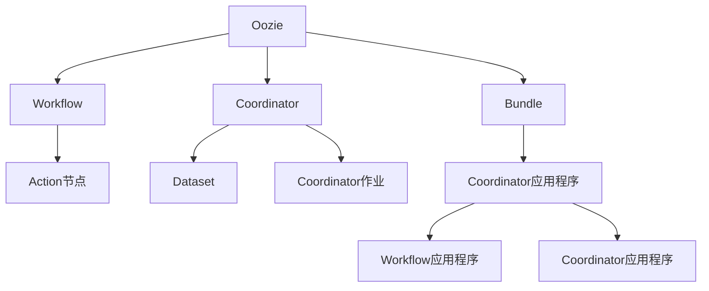

# Oozie Coordinator 原理与代码实例讲解

## 1. 背景介绍

### 1.1 问题的由来

在大数据时代,数据处理已经成为企业的核心需求之一。由于数据量的不断增长和处理需求的复杂性,单一的批处理作业已经无法满足现代企业的需求。许多企业面临着需要协调和管理大量的工作流作业的挑战,这些作业可能具有复杂的依赖关系、不同的调度周期和失败重试策略。手动管理和协调这些作业不仅低效,而且容易出错。因此,需要一种自动化的工作流调度和协调系统来简化这一过程。

### 1.2 研究现状

Apache Oozie 作为 Apache Hadoop 生态系统中的一个关键组件,旨在解决大数据工作流调度和协调的问题。它提供了一种声明式的方式来定义和管理复杂的工作流,支持多种类型的 Hadoop 作业,如 MapReduce、Pig、Hive 和 Sqoop 等。Oozie 还支持作业之间的依赖关系管理、失败重试策略和数据传输等功能。

Oozie 包含两个主要组件:Workflow 和 Coordinator。Workflow 用于定义和执行一系列有向无环图(DAG)作业,而 Coordinator 则用于调度和协调重复执行的工作流。Coordinator 可以根据时间或数据可用性触发工作流的执行,并支持各种复杂的调度策略。

### 1.3 研究意义

Oozie Coordinator 作为 Oozie 的核心组件之一,对于企业级大数据处理具有重要意义。它可以简化复杂工作流的管理,提高数据处理的效率和可靠性。通过深入研究 Oozie Coordinator 的原理和实现,我们可以更好地理解和利用其强大的调度和协调功能,从而优化企业的大数据处理流程。

### 1.4 本文结构

本文将全面介绍 Oozie Coordinator 的原理和实现。首先,我们将探讨 Oozie Coordinator 的核心概念和与其他组件的关系。接下来,详细阐述 Coordinator 的算法原理和具体操作步骤。然后,我们将构建数学模型并推导公式,并通过案例分析和常见问题解答来加深理解。此外,我们还将提供一个完整的代码实例,包括开发环境搭建、源代码实现、代码解读和运行结果展示。最后,我们将讨论 Oozie Coordinator 的实际应用场景、未来发展趋势和面临的挑战。

## 2. 核心概念与联系

Oozie Coordinator 是 Apache Oozie 工作流调度系统的核心组件之一。它与 Oozie 中的其他关键概念密切相关,如 Workflow、Bundle 和 Coordinator 应用程序。

1. **Workflow**: 定义并执行有向无环图(DAG)作业的基本单元,由一系列 Action 节点组成。每个 Action 节点可以是 MapReduce、Pig、Hive、Sqoop 等不同类型的作业。

2. **Coordinator**: 用于调度和协调重复执行的 Workflow。它根据时间或数据可用性触发 Workflow 的执行,并支持各种复杂的调度策略。

3. **Bundle**: 将多个 Coordinator 应用程序和 Workflow 应用程序组合在一起,作为一个逻辑单元进行管理和执行。

4. **Coordinator 应用程序**: 定义 Coordinator 的配置和属性,包括调度策略、数据集(Dataset)、输入/输出事件等。

5. **Dataset**: 表示 Coordinator 作业所依赖的数据集,用于触发作业的执行。Dataset 可以是 HDFS 上的目录或文件,也可以是 Hive 表或 HCatalog 表。

6. **Coordinator 作业**: 由 Coordinator 应用程序实例化的具体作业,用于执行特定的 Workflow。每个 Coordinator 作业都对应一个 Workflow 实例。

通过上述核心概念的协作,Oozie Coordinator 实现了对复杂工作流的调度和协调,简化了大数据处理的管理和维护。

## 3. 核心算法原理 & 具体操作步骤

### 3.1 算法原理概述

Oozie Coordinator 的核心算法原理是基于时间和数据可用性来触发和协调 Workflow 的执行。它采用了一种声明式的方式来定义调度策略,支持多种复杂的调度规则。

算法的主要流程如下:

1. 用户定义 Coordinator 应用程序,包括调度策略、数据集(Dataset)、输入/输出事件等。

2. Oozie 根据 Coordinator 应用程序的配置,创建 Coordinator 作业实例。

3. Coordinator 作业实例根据调度策略和数据可用性,决定是否触发 Workflow 的执行。

4. 如果满足触发条件,Coordinator 作业实例将实例化一个 Workflow 应用程序,并提交给 Oozie 执行。

5. Workflow 应用程序执行完成后,Coordinator 作业实例根据输出事件和调度策略,决定是否重新触发下一次 Workflow 的执行。

6. 上述过程循环执行,直到满足终止条件。

该算法的核心在于调度策略的定义和执行。Oozie Coordinator 支持多种复杂的调度策略,包括基于时间的调度(如 cron 表达式)、基于数据可用性的调度(如文件或目录的创建、修改或可用性)、以及两者的组合。

### 3.2 算法步骤详解

1. **定义 Coordinator 应用程序**

   用户需要创建一个 XML 文件来定义 Coordinator 应用程序。该文件包含以下主要元素:

   - `<start>`: 定义 Coordinator 作业的开始时间。
   - `<end>`: 定义 Coordinator 作业的结束时间。
   - `<frequency>`: 定义 Coordinator 作业的执行频率,可以是基于时间(如 cron 表达式)或基于数据可用性。
   - `<datasets>`: 定义 Coordinator 作业所依赖的数据集(Dataset)。
   - `<input-events>`: 定义触发 Workflow 执行的输入事件,如数据集的可用性。
   - `<output-events>`: 定义 Workflow 执行完成后的输出事件,如数据集的更新。
   - `<action>`: 定义要执行的 Workflow 应用程序。

2. **创建 Coordinator 作业实例**

   Oozie 根据 Coordinator 应用程序的配置,创建 Coordinator 作业实例。每个作业实例都有一个唯一的ID和状态(如 WAITING、RUNNING、SUCCEEDED 或 FAILED)。

3. **检查触发条件**

   Coordinator 作业实例根据调度策略和数据可用性,检查是否满足触发 Workflow 执行的条件。

   - 对于基于时间的调度,Coordinator 作业实例会检查当前时间是否符合调度频率(如 cron 表达式)。
   - 对于基于数据可用性的调度,Coordinator 作业实例会检查输入事件中定义的数据集是否可用。

4. **触发 Workflow 执行**

   如果满足触发条件,Coordinator 作业实例将实例化一个 Workflow 应用程序,并提交给 Oozie 执行。Workflow 应用程序由一系列 Action 节点组成,每个节点可以是 MapReduce、Pig、Hive 或 Sqoop 等不同类型的作业。

5. **处理输出事件**

   Workflow 应用程序执行完成后,Coordinator 作业实例会处理输出事件。根据输出事件和调度策略,Coordinator 作业实例决定是否重新触发下一次 Workflow 的执行。

6. **循环执行**

   上述过程循环执行,直到满足终止条件。终止条件可以是:

   - 达到 Coordinator 应用程序定义的结束时间。
   - 所有预期的 Workflow 执行完成。
   - 发生不可恢复的错误。

### 3.3 算法优缺点

**优点**:

1. **灵活性**: Oozie Coordinator 支持多种复杂的调度策略,包括基于时间和基于数据可用性的调度,以及两者的组合。这种灵活性可以满足各种大数据处理场景的需求。

2. **可靠性**: Coordinator 作业实例会持久化其状态和元数据,确保在发生故障时可以恢复执行。它还支持失败重试和恢复策略,提高了作业执行的可靠性。

3. **可扩展性**: Oozie Coordinator 可以轻松地扩展到大规模的工作流调度和协调场景,处理大量的作业和数据集。

4. **集成性**: Coordinator 与 Apache Hadoop 生态系统紧密集成,支持多种类型的 Hadoop 作业,如 MapReduce、Pig、Hive 和 Sqoop 等。

**缺点**:

1. **复杂性**: 定义和管理 Coordinator 应用程序可能会比较复杂,需要熟悉 XML 配置文件和 Oozie 的概念。

2. **性能瓶颈**: 在高负载场景下,Oozie 服务器可能会成为性能瓶颈,影响作业的调度和执行效率。

3. **依赖管理**: 如果 Coordinator 作业依赖的数据集发生变化或移动,可能需要手动更新 Coordinator 应用程序的配置。

4. **可视化和监控**: Oozie 提供的可视化和监控功能相对有限,可能需要集成第三方工具来提高可用性。

### 3.4 算法应用领域

Oozie Coordinator 广泛应用于各种大数据处理场景,尤其是需要协调和管理复杂工作流的领域。以下是一些典型的应用领域:

1. **数据处理流水线**: 在数据处理流水线中,Coordinator 可以协调多个阶段的数据转换、清理和加载作业,确保数据按照预期的顺序和时间进行处理。

2. **ETL (提取、转换、加载)**: Coordinator 可以用于管理 ETL 过程,从各种数据源提取数据,进行转换和加载到数据仓库或数据湖中。

3. **数据分析**: 在数据分析领域,Coordinator 可以调度和协调各种分析作业,如数据探索、特征工程、模型训练和评估等。

4. **机器学习管道**: Coordinator 可以协调机器学习管道中的各个步骤,包括数据预处理、模型训练、模型评估和部署等。

5. **日志处理**: 对于需要定期处理大量日志数据的应用程序,Coordinator 可以调度和协调日志收集、解析和分析作业。

6. **数据备份和归档**: Coordinator 可以用于调度和管理数据备份和归档任务,确保数据的安全性和可用性。

总的来说,Oozie Coordinator 为大数据处理提供了一种强大的工作流调度和协调机制,简化了复杂任务的管理和自动化。

## 4. 数学模型和公式 & 详细讲解 & 举例说明

在 Oozie Coordinator 中,我们可以使用数学模型和公式来描述和优化调度策略。本节将介绍一些常见的数学模型和公式,并通过案例分析和常见问题解答来加深理解。

### 4.1 数学模型构建

#### 4.1.1 时间序列模型

时间序列模型可用于描述和预测基于时间的调度策略。我们可以将 Coordinator 作业的执行时间序列建模为一个随机过程 $\{X_t\}$,其中 $X_t$ 表示在时间 $t$ 执行的作业数量。

对于基于时间的调度策略,我们可以使用自回归移动平均模型 (ARMA) 或自回归综合移动平均模型 (ARIMA) 来捕获时间序列的自相关性和趋势。ARIMA 模型的一般形式如下:

$$
X_t = c + \phi_1 X_{t-1} + \phi_2 X_{t-2} + ... + \phi_p X_{t-p} + \theta_1 \epsilon_{t-1} + \theta_2 \epsilon_{t-2} + ... + \theta_q \epsilon_{t-q} + \epsilon_t
$$

其中:

- $c$ 是常数项
- $\phi_