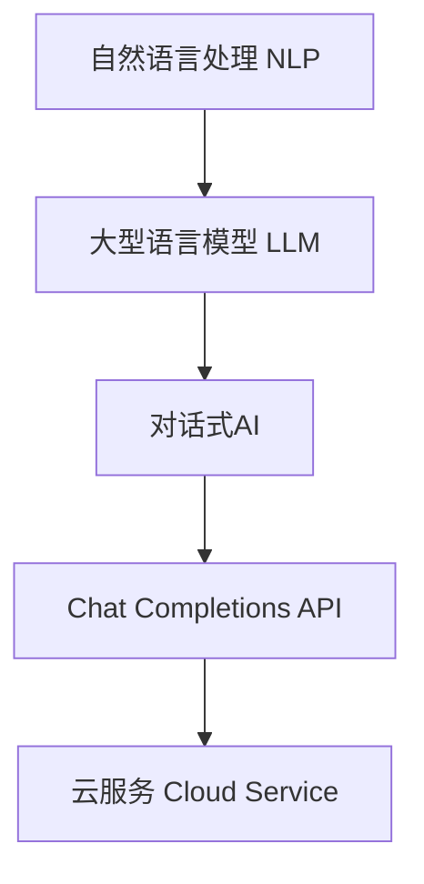

# OpenAI Chat Completions API

## 1. 背景介绍

### 1.1 问题的由来

随着人工智能技术的不断发展,大型语言模型已经成为当前最热门的研究领域之一。这些模型能够理解和生成人类语言,为各种应用程序提供强大的自然语言处理(NLP)能力。然而,训练和部署这些庞大的模型需要大量的计算资源,对于大多数组织和个人来说,这是一个巨大的挑战。

为了解决这个问题,OpenAI推出了Chat Completions API,这是一项基于GPT-3.5架构的语言模型服务。通过这个API,开发者可以轻松地将强大的自然语言处理能力集成到他们的应用程序中,而无需训练或部署复杂的模型。这种即服务(as-a-service)的方式极大地降低了使用大型语言模型的门槛,使NLP技术变得更加易于访问和使用。

### 1.2 研究现状

大型语言模型已经在各个领域取得了令人瞩目的成就,例如内容生成、问答系统、机器翻译等。但是,训练和部署这些模型需要大量的计算资源和专业知识,这对于大多数组织和个人来说是一个巨大的障碍。

为了解决这个问题,一些科技公司开始提供基于云的语言模型服务,例如OpenAI的GPT-3 API、Google的PaLM API和Anthropic的Claude API。这些服务允许开发者通过API调用来利用预先训练好的大型语言模型,而无需自己训练或部署模型。

OpenAI的Chat Completions API是这一领域的最新进展。它基于GPT-3.5架构,是一种对话式的语言模型,能够更好地理解和生成上下文相关的响应。与之前的GPT-3 API相比,Chat Completions API具有更强的上下文理解能力和更自然的对话交互体验。

### 1.3 研究意义

Chat Completions API的推出意味着大型语言模型的强大能力将变得更加易于访问和使用。这将为各种应用程序带来巨大的机遇,例如:

- **智能助手和聊天机器人**: 通过API,开发者可以构建具有自然语言交互能力的智能助手和聊天机器人,为用户提供更加人性化的体验。

- **内容生成**: API可以用于自动生成各种形式的内容,如文章、故事、代码等,大大提高了内容创作的效率。

- **问答系统**: 利用API的强大的自然语言理解和生成能力,可以构建高质量的问答系统,为用户提供准确和相关的答复。

- **机器翻译**: API可以用于实时翻译,为跨语言交流提供便利。

总的来说,Chat Completions API将推动人工智能技术在各个领域的广泛应用,为我们的工作和生活带来全新的体验。

### 1.4 本文结构

本文将全面介绍OpenAI的Chat Completions API,内容包括:

1. 核心概念和架构
2. API的工作原理和算法细节
3. 数学模型和公式推导
4. 代码实现和实践案例
5. 实际应用场景
6. 未来发展趋势和挑战
7. 相关资源推荐

通过本文,读者将对Chat Completions API有深入的理解,并能够熟练地将其应用于各种场景。

## 2. 核心概念与联系

在深入探讨Chat Completions API的细节之前,我们先来了解一些核心概念和它们之间的联系。

### 2.1 自然语言处理(NLP)

自然语言处理(Natural Language Processing,NLP)是人工智能的一个分支,旨在使计算机能够理解和生成人类语言。它涉及多个子领域,如语音识别、语义分析、机器翻译等。

Chat Completions API的核心是一个基于GPT-3.5架构的大型语言模型,它通过深度学习技术训练而成,能够对自然语言进行高质量的理解和生成。因此,NLP是Chat Completions API的基础。

### 2.2 大型语言模型

大型语言模型(Large Language Model,LLM)是一种基于深度学习的NLP模型,具有极大的参数量(通常超过10亿个参数)和海量的训练数据。这使得它们能够捕捉到语言的复杂模式和细微差别,从而实现高质量的语言理解和生成。

GPT-3.5是OpenAI最新的大型语言模型,它是Chat Completions API的核心。相比之前的GPT-3,GPT-3.5在对话能力和上下文理解方面有了显著提升,更加擅长生成连贯、相关的响应。

### 2.3 对话式AI

传统的NLP系统通常专注于单一任务,如机器翻译或问答。而对话式AI(Conversational AI)则旨在与人类进行自然、流畅的对话交互。它需要能够理解上下文,捕捉对话的语义和逻辑,并生成恰当的响应。

Chat Completions API被设计为一种对话式AI系统,它能够跟踪对话的历史,并基于上下文生成相关的回复。这使得它在构建智能助手、聊天机器人等应用时具有独特的优势。

### 2.4 API和云服务

API(Application Programming Interface,应用程序编程接口)是一种软件接口,允许不同的应用程序相互通信和交换数据。而云服务(Cloud Service)则是通过互联网提供的按需付费的计算资源和服务。

Chat Completions API是一种基于云的API服务,它允许开发者通过HTTP请求调用OpenAI的大型语言模型,而无需在本地部署和维护这个庞大的模型。这种即服务的方式大大降低了使用NLP技术的门槛和成本。

### 2.5 核心概念关系总结

以上几个核心概念之间的关系可以用下图总结:

自然语言处理是基础,大型语言模型是核心技术,对话式AI是应用目标,而Chat Completions API则是将这一切集成并通过云服务的方式提供给开发者。

## 3. 核心算法原理和具体操作步骤

### 3.1 算法原理概述

Chat Completions API的核心算法是一种基于Transformer的序列到序列(Seq2Seq)模型,被称为GPT(Generative Pre-trained Transformer)。它是一种自回归(auto-regressive)语言模型,能够根据给定的文本序列生成新的连贯文本。

GPT模型的工作原理可以概括为以下几个步骤:

1. **编码(Encoding)**: 将输入文本序列转换为模型可以理解的向量表示。
2. **自注意力机制(Self-Attention)**: 模型通过自注意力机制捕捉输入序列中的长程依赖关系。
3. **解码(Decoding)**: 模型根据输入序列的向量表示,自回归地生成新的文本序列。
4. **掩码机制(Masking)**: 在训练过程中,通过掩码机制确保模型只能看到当前位置之前的文本,从而学习生成连贯的序列。

GPT-3.5是GPT架构的最新迭代版本,它在原有基础上进行了多项改进,如更大的模型规模、更强大的计算能力、更高效的训练算法等,从而获得了更出色的性能。

### 3.2 算法步骤详解

现在让我们更详细地了解一下Chat Completions API的工作流程。

1. **请求初始化**

用户通过HTTP请求向API发送初始消息,例如一个问题或指令。API会根据请求创建一个新的对话会话(Conversation Session),并将初始消息作为上下文(Context)存储起来。

2. **编码和向量化**

API将初始消息进行标记化(Tokenization)和向量化(Vectorization),将文本转换为模型可以理解的数字向量表示。这一步使用了GPT-3.5的编码器(Encoder)模块。

3. **上下文注入**

将向量化后的初始消息注入到GPT-3.5的解码器(Decoder)模块中,作为生成回复的上下文。

4. **自回归生成**

GPT-3.5的解码器模块基于注入的上下文,自回归地生成一个候选回复序列。在这个过程中,模型会根据已生成的部分序列,预测下一个最可能的token(单词或子词)。

5. **结果过滤和排序**

由于自回归生成过程是概率性的,模型会生成多个候选回复序列。API会对这些候选序列进行过滤和排序,选择最合适的一个作为最终回复。

6. **上下文更新**

将最终的回复序列添加到对话上下文中,为下一轮对话做好准备。

7. **响应返回**

API将最终的回复序列返回给用户,完成这一轮的对话交互。

该过程会在用户发送新的消息时重复执行,实现持续的对话交互。

### 3.3 算法优缺点

像任何算法一样,GPT-3.5及其在Chat Completions API中的应用也有其优缺点。

**优点**:

- **强大的语言理解和生成能力**: 由于大规模的预训练,GPT-3.5能够捕捉到语言的复杂模式和细微差别,从而实现高质量的语言理解和生成。
- **上下文理解**: 与之前的GPT-3相比,GPT-3.5在对话能力和上下文理解方面有了显著提升,能够生成更加连贯、相关的响应。
- **多功能性**: 由于GPT-3.5是一种通用的语言模型,Chat Completions API可以应用于多种NLP任务,如内容生成、问答、机器翻译等。
- **可扩展性**: API的云服务架构使其具有很强的可扩展性,能够根据需求动态调整计算资源。

**缺点**:

- **缺乏常识推理能力**: 尽管GPT-3.5在语言理解和生成方面表现出色,但它缺乏真正的常识推理能力,有时会生成不合理或者矛盾的内容。
- **存在偏见和不当内容**: 由于训练数据的局限性,GPT-3.5可能会反映出某些偏见或生成不当内容。
- **缺乏可解释性**: GPT-3.5是一个黑盒模型,很难解释它内部是如何工作的,这在一定程度上影响了其可信赖性。
- **对话一致性**: 虽然GPT-3.5在对话能力上有所提升,但保持长期对话的一致性和连贯性仍然是一个挑战。
- **隐私和安全风险**: 由于API处理的是用户输入的自然语言数据,因此存在一定的隐私和安全风险。

总的来说,Chat Completions API凭借强大的语言能力为开发者提供了巨大的便利,但也存在一些需要注意和改进的地方。

### 3.4 算法应用领域

由于其通用性和强大的语言处理能力,Chat Completions API可以应用于多个领域:

1. **智能助手和聊天机器人**:  API可以用于构建具有自然语言交互能力的智能助手和聊天机器人,为用户提供个性化的服务和支持。

2. **内容生成**: 利用API的文本生成能力,可以自动创作各种形式的内容,如新闻文章、故事、诗歌、代码等,大大提高了内容创作的效率。

3. **问答系统**: API可以用于构建高质量的问答系统,为用户提供准确和相关的答复。

4. **机器翻译**: API的多语种支持使其可以应用于实时机器翻译,为跨语言交流提供便利。

5. **数据分析和可视化**: 通过与API的交互,用户可以自然语言方式查询和分析数据,并生成相应的可视化报告。

6. **教育和学习辅助**: API可以作为虚拟教师或学习伴侣,为学生提供个性化的学习支持和反馈。

7. **客户服务和技术支持**: 在客户服务和技术支持领域,API可以提供7x24小时的自助服务和问题解答。

8. **医疗保健**: API可以用于医疗对话系统,为患者提供初步的症状评估和建议。

9. **创作辅助**: 作家、诗人和其他创作者可以利用API的创意