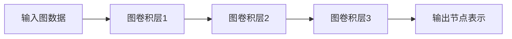

# Python机器学习实战：实战图神经网络(GNN)在社交网络分析中的应用

## 1. 背景介绍

### 1.1 问题的由来

在当今时代,社交网络已经成为人们生活中不可或缺的一部分。随着社交媒体平台的不断发展,海量的社交数据被持续产生和积累。这些数据蕴含着宝贵的信息,如果能够有效地分析和利用,将为各个领域带来巨大的价值。然而,社交网络数据具有高度的复杂性和多样性,传统的数据分析方法往往难以充分挖掘其中蕴含的丰富信息。

### 1.2 研究现状

为了更好地理解和利用社交网络数据,研究人员提出了图神经网络(Graph Neural Networks, GNNs)这一全新的机器学习范式。图神经网络是一种专门设计用于处理图结构数据的深度学习模型,它能够有效地捕捉图数据中节点之间的复杂关系,并对节点进行高效的表示学习。

近年来,图神经网络在社交网络分析领域展现出了巨大的潜力。研究人员已经将图神经网络应用于链路预测、社区发现、节点分类等多个任务,取得了令人鼓舞的成果。然而,由于图神经网络的理论和实践都还处于快速发展的阶段,如何更好地利用图神经网络来解决社交网络分析中的实际问题,仍然是一个值得深入探索的课题。

### 1.3 研究意义

社交网络分析对于理解人类行为、优化社交媒体产品、提高营销效率等具有重要意义。利用图神经网络进行社交网络分析,不仅能够帮助我们更深入地挖掘社交数据中蕴含的丰富信息,还可以为相关领域提供有价值的见解和指导。

本文将系统地介绍如何使用Python及其生态系统中的图神经网络库,来实战解决社交网络分析中的实际问题。通过详细的理论阐述、算法解析、代码实现和案例分析,读者将全面掌握图神经网络在社交网络分析中的应用方法,为将来在相关领域的研究和实践奠定坚实的基础。

### 1.4 本文结构

本文共分为九个部分:

1. 背景介绍
2. 核心概念与联系
3. 核心算法原理与具体操作步骤
4. 数学模型和公式详细讲解与举例说明
5. 项目实践:代码实例和详细解释说明
6. 实际应用场景
7. 工具和资源推荐
8. 总结:未来发展趋势与挑战
9. 附录:常见问题与解答

## 2. 核心概念与联系

在深入探讨图神经网络在社交网络分析中的应用之前,我们需要先了解几个核心概念及它们之间的联系。

### 2.1 社交网络

社交网络是一种由节点(代表个体)和边(代表个体之间的关系)组成的网络结构。在社交网络中,节点通常代表用户,边则表示用户之间的某种交互关系,如好友关系、关注关系等。社交网络数据可以用图的形式来表示和存储。

### 2.2 图数据

图数据是一种以图的形式组织的数据结构,由节点和边组成。图数据广泛存在于现实世界中,如社交网络、交通网络、知识图谱等。图数据具有一些独特的属性,如非欧几里德性、无序性和多样性,这使得处理图数据成为一个具有挑战性的任务。

### 2.3 图神经网络(GNN)

图神经网络是一种专门设计用于处理图数构数据的深度学习模型。与传统的神经网络模型不同,图神经网络能够直接对图数据进行端到端的学习,并捕捉图数据中节点之间的复杂关系。图神经网络通过在图上进行信息传播和聚合,对每个节点进行表示学习,从而实现对图数据的高效处理。

### 2.4 核心联系

社交网络数据本质上是一种图数据,图神经网络正是专门设计用于处理这种图数据的深度学习模型。因此,将图神经网络应用于社交网络分析是一个自然而然的选择。通过图神经网络,我们可以更好地捕捉社交网络中用户之间的复杂关系,从而对用户进行更准确的表示学习,为下游的社交网络分析任务(如链路预测、社区发现、节点分类等)提供有力的支持。

## 3. 核心算法原理与具体操作步骤

### 3.1 算法原理概述

图神经网络的核心思想是在图上进行信息传播和聚合,从而对每个节点进行表示学习。具体来说,图神经网络通过以下几个关键步骤来实现对图数据的处理:

1. **邻居聚合(Neighbor Aggregation)**: 对于每个节点,图神经网络会收集其邻居节点的表示,并将它们聚合成一个邻居信息向量。
2. **信息传播(Message Passing)**: 图神经网络将每个节点的当前表示与其邻居信息向量相结合,生成该节点的新表示。这个过程被称为"信息传播",因为节点的表示会在图上传播和更新。
3. **表示学习(Representation Learning)**: 通过多次迭代地进行邻居聚合和信息传播,图神经网络最终能够学习到每个节点的高质量表示,这些表示能够很好地捕捉图数据中节点之间的复杂关系。

不同的图神经网络模型在具体实现上会有所不同,但它们都遵循上述基本原理。下面我们将详细介绍一种广为人知的图神经网络模型:图卷积神经网络(Graph Convolutional Networks, GCN)。

### 3.2 算法步骤详解

#### 3.2.1 图卷积神经网络(GCN)

图卷积神经网络是一种经典的图神经网络模型,它将卷积操作从欧几里得数据(如图像、序列等)推广到了非欧几里得数据(如图数据)。GCN的核心思想是通过"图卷积"操作来实现节点表示的更新和传播。

具体来说,GCN模型包括以下几个关键步骤:

1. **图拉普拉斯矩阵构建**

   对于一个无向图 $\mathcal{G} = (\mathcal{V}, \mathcal{E})$,我们首先构建其邻接矩阵 $\mathbf{A}$,其中 $A_{ij} = 1$ 当且仅当节点 $i$ 和节点 $j$ 之间存在边。然后,我们计算度矩阵 $\mathbf{D}$,其中 $D_{ii} = \sum_j A_{ij}$。最后,我们可以得到归一化的拉普拉斯矩阵:

   $$\mathbf{L} = \mathbf{I} - \mathbf{D}^{-\frac{1}{2}}\mathbf{A}\mathbf{D}^{-\frac{1}{2}}$$

   其中 $\mathbf{I}$ 是单位矩阵。

2. **图卷积操作**

   在 GCN 中,图卷积操作被定义为:

   $$\mathbf{H}^{(l+1)} = \sigma\left(\widetilde{\mathbf{D}}^{-\frac{1}{2}}\widetilde{\mathbf{A}}\widetilde{\mathbf{D}}^{-\frac{1}{2}}\mathbf{H}^{(l)}\mathbf{W}^{(l)}\right)$$

   其中 $\mathbf{H}^{(l)}$ 和 $\mathbf{H}^{(l+1)}$ 分别表示第 $l$ 层和第 $l+1$ 层的节点表示矩阵, $\mathbf{W}^{(l)}$ 是第 $l$ 层的权重矩阵, $\sigma$ 是非线性激活函数(如 ReLU), $\widetilde{\mathbf{A}} = \mathbf{A} + \mathbf{I}$ 是加入自环后的邻接矩阵, $\widetilde{\mathbf{D}}$ 是对应的度矩阵。

   这个操作实现了节点表示在图上的传播和更新,其中 $\widetilde{\mathbf{D}}^{-\frac{1}{2}}\widetilde{\mathbf{A}}\widetilde{\mathbf{D}}^{-\frac{1}{2}}$ 可以看作是一种"图卷积核",它对节点表示进行了加权求和,从而实现了邻居信息的聚合。

3. **多层堆叠**

   为了提高模型的表示能力,GCN 通常会堆叠多个图卷积层,每一层都会对节点表示进行更新和传播。最终,GCN 能够学习到每个节点的高质量表示,这些表示能够很好地捕捉图数据中节点之间的复杂关系。

下面是 GCN 模型的一个简单示意图:

通过上述步骤,GCN 能够对图数据进行高效的表示学习,为下游的各种图任务(如节点分类、链路预测等)提供有力的支持。

### 3.3 算法优缺点

#### 优点

1. **端到端学习**:GCN 能够直接对图数据进行端到端的学习,无需手工设计特征,大大简化了图数据处理的流程。
2. **高效表示学习**:GCN 能够通过邻居聚合和信息传播,学习到每个节点的高质量表示,这些表示能够很好地捕捉图数据中节点之间的复杂关系。
3. **泛化能力强**:GCN 的核心思想是基于图拉普拉斯矩阵的谱域卷积,因此它具有很强的泛化能力,可以应用于各种类型的图数据。

#### 缺点

1. **过平滑问题**:在 GCN 中,由于节点表示在图上进行了多次传播和更新,因此可能会导致不同节点的表示变得过于相似,从而失去了区分能力。这就是所谓的"过平滑"问题。
2. **缺乏灵活性**:GCN 的卷积操作是基于图拉普拉斯矩阵的,这种方式虽然具有一定的泛化能力,但也限制了模型的灵活性。一些新型的图神经网络模型试图通过设计更加灵活的卷积操作来克服这个缺陷。
3. **计算复杂度高**:由于需要对整个图进行卷积操作,GCN 的计算复杂度相对较高,这在处理大规模图数据时可能会成为一个瓶颈。

### 3.4 算法应用领域

GCN 及其变体已经被广泛应用于各种图数据相关的任务,包括但不限于:

1. **节点分类**:根据节点的特征和图结构,对节点进行分类。在社交网络中,这可以用于用户属性预测、垃圾账号检测等任务。
2. **链路预测**:预测图中两个节点之间是否存在边。在社交网络中,这可以用于好友推荐、关注推荐等任务。
3. **图分类**:根据整个图的结构和节点特征,对图进行分类。在社交网络中,这可以用于社区类型识别等任务。
4. **图生成**:生成新的图数据,可用于数据增强、模型预训练等目的。
5. **图嵌入**:将图数据映射到低维连续空间,以便进行下游的机器学习任务。
6. **知识图谱完成**:在知识图谱中预测缺失的实体和关系。

除了上述任务之外,GCN 还可以应用于计算机视觉、自然语言处理、生物信息学等多个领域,展现出了广阔的应用前景。

## 4. 数学模型和公式详细讲解与举例说明

### 4.1 数学模型构建

在正式推导 GCN 模型的公式之前,我们需要先构建一个合适的数学模型来描述图数据。

假设我们有一个无向图 $\mathcal{G} = (\mathcal{V}, \mathcal{E})$,其中 $\mathcal{V}$ 是节点集合,包含