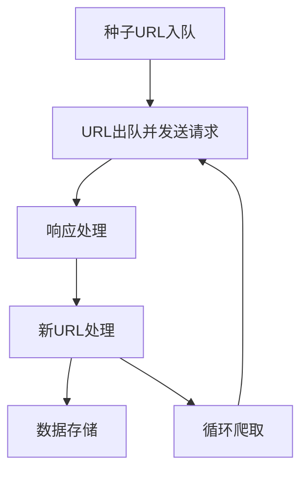

# Reptile原理与代码实例讲解

## 1. 背景介绍

### 1.1 问题的由来

在当今信息时代,网络已经成为人们获取信息和资源的重要渠道。然而,由于网络信息分散、动态变化和隐私保护等原因,很多有价值的信息无法通过传统方式获取。这就催生了网络爬虫(Web Crawler)或网络蜘蛛(Web Spider)的出现,它可以自动化地从万维网上搜集、提取和处理所需的数据。

网络爬虫是一种按照特定规则自动浏览万维网并获取网页信息的程序或脚本。它可以模拟人类浏览器的行为,访问网站并下载网页内容,从而实现大规模数据采集和处理。随着大数据时代的到来,网络爬虫在数据挖掘、信息检索、商业智能等领域发挥着越来越重要的作用。

### 1.2 研究现状

网络爬虫技术经过多年的发展,已经形成了较为成熟的理论体系和工具链。目前,主流的网络爬虫框架包括Python的Scrapy、Requests、Selenium等,以及Java的Jsoup、HttpClient等。这些框架提供了强大的功能,可以方便地实现网页解析、数据提取、异步请求、中间件集成等操作。

然而,网络爬虫技术仍然面临着一些挑战,例如:

- 反爬虫机制:许多网站为了保护自身利益,会采取各种反爬虫措施,如IP限制、用户行为识别、验证码等,给爬虫的开发和运行带来了困难。
- 数据质量:由于网页内容的复杂性和多样性,很难保证爬取数据的准确性和完整性。
- 性能和效率:对于大规模的数据采集任务,需要考虑爬虫的并发能力、请求调度、数据存储等问题,以提高爬虫的性能和效率。
- 法律和伦理:网络爬虫可能会侵犯网站的知识产权和隐私权,因此需要遵守相关法律法规和道德准则。

### 1.3 研究意义

掌握网络爬虫技术对于当前和未来的数据驱动型应用具有重要意义:

- 数据采集:网络爬虫可以从互联网上采集各种结构化和非结构化数据,为大数据分析、机器学习等应用提供宝贵的数据源。
- 信息监测:利用网络爬虫可以实时监测网络上的新闻、舆情、竞争对手等信息,为决策提供支持。
- 自动化测试:网络爬虫可以用于自动化测试网站的功能、性能和安全性,提高软件质量。
- 知识图谱构建:通过爬取各种网络资源,可以自动化地构建知识图谱,为智能问答、语义搜索等应用提供基础数据。

总之,掌握网络爬虫技术不仅可以满足各种数据需求,还可以促进人工智能、大数据等前沿技术的发展。

### 1.4 本文结构

本文将全面介绍网络爬虫Reptile的原理和实现,内容安排如下:

1. 背景介绍
2. 核心概念与联系
3. 核心算法原理与具体操作步骤
4. 数学模型和公式及详细讲解
5. 项目实践:代码实例和详细解释说明
6. 实际应用场景
7. 工具和资源推荐
8. 总结:未来发展趋势与挑战
9. 附录:常见问题与解答

## 2. 核心概念与联系

在深入探讨Reptile的原理之前,我们需要先了解一些核心概念及其相互关系。

### 2.1 URL

URL(Uniform Resource Locator)是万维网上标准的资源地址,用于唯一标识互联网上的资源。一个标准的URL由以下几部分组成:

```
scheme://host:port/path?query#fragment
```

其中:

- scheme: 指定访问服务器所使用的协议,如http、https、ftp等。
- host: 服务器的IP地址或域名。
- port: 服务器上进程所监听的端口号,常见端口有80(http)、443(https)等。
- path: 服务器上资源的路径。
- query: 发送到服务器的查询字符串,用于传递参数。
- fragment: 资源内的片段标识符,用于指向资源中的某一部分。

网络爬虫通常从一个或多个种子URL开始,获取初始页面,并从中提取新的URL继续爬取,以此类推,形成一个多叉树状的遍历过程。

### 2.2 HTML

HTML(HyperText Markup Language)是构建网页的标准语言。它使用一系列元素(Element)来描述网页的结构和语义,如`<html>` `<head>` `<body>` `<div>` `<p>`等。每个元素可以包含属性(Attribute)来提供额外的信息,如`<a href="...">链接文字</a>`。

网络爬虫需要解析HTML文档,从中提取所需的数据,如文本、链接、图片等。常用的HTML解析库有Python的BeautifulSoup、lxml等。

### 2.3 HTTP

HTTP(HyperText Transfer Protocol)是万维网数据通信的基础协议。它规定了客户端(通常是浏览器)如何向服务器发送请求,以及服务器如何回应这些请求。

网络爬虫模拟浏览器的行为,通过发送HTTP请求并接收响应来获取网页数据。HTTP请求包括方法(GET、POST等)、头部(Header)、主体(Body)等部分。常用的HTTP客户端库有Python的Requests、Urllib等。

### 2.4 Robots协议

Robots协议(也称Robots排除标准)允许网站管理员通过robots.txt文件来指示网络爬虫可以或不可以访问网站的哪些部分。爬虫在访问一个新网站之前,通常会首先检查该网站的robots.txt文件,以遵守网站的规则。

### 2.5 反爬虫机制

为了保护网站的利益,很多网站会采取各种反爬虫措施,如IP限制、用户行为识别、验证码等,阻止爬虫的访问。网络爬虫需要相应地设计绕过这些机制的策略,如IP代理池、模拟人类行为、验证码识别等。

### 2.6 数据存储

网络爬虫获取的数据需要进行持久化存储,以便后续的分析和处理。常用的数据存储方式包括文件系统(如CSV、JSON等格式)、关系型数据库(如MySQL、PostgreSQL等)、NoSQL数据库(如MongoDB、Redis等)等。

### 2.7 分布式爬虫

对于大规模的数据采集任务,单机爬虫可能无法满足性能和效率要求。这时可以采用分布式爬虫架构,将任务分配到多个节点上并行执行,从而提高爬取效率。分布式爬虫需要考虑URL调度、去重、负载均衡等问题。

### 2.8 深度学习与爬虫

近年来,深度学习技术在计算机视觉、自然语言处理等领域取得了突破性进展,也逐渐被应用于网络爬虫中。例如,可以使用深度学习模型来识别和破解验证码、从网页中智能提取结构化数据等,提高爬虫的智能化水平。

上述概念相互关联、环环相扣,共同构建了网络爬虫的理论基础和技术体系。在下一章节中,我们将深入探讨Reptile的核心算法原理。

## 3. 核心算法原理与具体操作步骤

### 3.1 算法原理概述

Reptile是一种通用的网络爬虫框架,它的核心算法可以概括为以下几个主要步骤:

1. **种子URL入队**: 将一个或多个初始URL作为种子加入待爬取队列。
2. **URL出队并发送请求**: 从待爬取队列中取出一个URL,并向该URL发送HTTP请求。
3. **响应处理**: 解析HTTP响应,提取页面中的有价值数据(如文本、链接、图片等)。
4. **新URL处理**: 从提取的数据中获取新的URL,并进行去重、规范化等处理,将合法的新URL加入待爬取队列。
5. **数据存储**: 将提取的有价值数据进行持久化存储,如写入文件、数据库等。
6. **循环爬取**: 重复步骤2~5,直到待爬取队列为空或达到其他终止条件。

该算法的核心思想是以种子URL为起点,通过不断提取新URL并发送请求的方式,实现对网站内容的广度优先或深度优先遍历。同时,通过数据提取和存储机制,可以获取所需的结构化或非结构化数据。

为了提高爬取效率,Reptile采用了多线程/异步编程模型,能够并发发送多个请求。此外,它还支持分布式架构,可以在多个节点上并行执行爬取任务。

下面我们使用一个流程图来直观地展示Reptile的核心算法:



### 3.2 算法步骤详解

接下来,我们对Reptile算法的每个步骤进行详细解释。

#### 3.2.1 种子URL入队

种子URL是爬虫启动的入口点,可以是一个单独的URL,也可以是一个URL列表。种子URL的选择直接影响爬虫能够覆盖的网站范围,因此需要根据具体需求进行合理设置。

例如,如果我们想爬取某个新闻网站的所有新闻内容,可以将该网站的首页作为种子URL;如果我们想爬取某个主题(如体育、科技等)的相关内容,可以将该主题的入口页面作为种子URL。

在Reptile中,我们可以使用一个队列(如Python的Queue模块)来存储待爬取的URL。种子URL将被首先加入该队列。

#### 3.2.2 URL出队并发送请求

从待爬取队列中取出一个URL,并使用HTTP客户端库(如Requests)向该URL发送请求。请求可以携带一些头部信息,如User-Agent(模拟浏览器行为)、Referer(防止被拦截)、Cookie(维持会话状态)等。

为了提高效率,Reptile通常会启动多个线程或协程,并发地从队列中获取URL并发送请求。这种并发模型可以充分利用CPU和网络资源,加快爬取速度。

#### 3.2.3 响应处理

当收到HTTP响应时,需要对响应进行解析和处理。主要包括以下几个步骤:

1. **检查响应状态码**: 如果状态码不是200(OK),可能需要进行重试或记录错误信息。
2. **解码响应内容**: 根据响应头中的编码信息(如UTF-8、GBK等)对响应内容进行解码,获取可读的文本数据。
3. **解析HTML/XML**: 使用HTML/XML解析库(如BeautifulSoup、lxml等)从响应内容中提取所需的数据,如文本、链接、图片等。
4. **数据清洗**: 对提取的数据进行必要的清洗和规范化处理,如去除HTML标签、剥离无用信息、格式化日期时间等。

在这个步骤中,我们需要根据具体的网页结构和数据需求,编写相应的解析逻辑。这通常需要一定的经验和调试工作。

#### 3.2.4 新URL处理

从提取的数据中获取新的URL,并进行以下处理:

1. **URL去重**: 由于网页之间可能存在相互链接,为了避免重复爬取,需要对新发现的URL进行去重处理。常用的去重方法有基于集合(Set)、布隆过滤器(Bloom Filter)、哈希表等。
2. **URL规范化**: 由于URL可能存在大小写、编码、相对路径等差异,需要对URL进行规范化处理,将其转换为标准格式。
3. **URL过滤**: 根据需求对URL进行过滤,如只保留同一域名下的URL、排除某些文件类型的URL等。
4. **URL入队**: 将合法的新URL加入待爬取队列,等待后续处理。

在这个步骤中,我们需要权衡URL去重和规范化的效率与精度,以及URL过滤的策