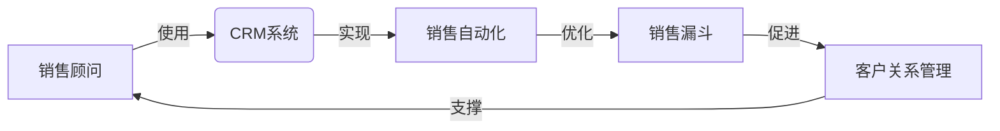

# Sales-Consultant 业务流程与价值分析

关键词：销售顾问、业务流程、价值分析、CRM系统、销售漏斗、客户关系管理

## 1. 背景介绍
### 1.1 问题的由来
在当今竞争激烈的商业环境中,企业要想在市场中立于不败之地,就必须不断优化销售流程,提高销售效率和业绩。而销售顾问(Sales Consultant)作为连接企业与客户的纽带,在整个销售过程中扮演着至关重要的角色。然而,许多企业的销售顾问工作流程仍然存在诸多问题,如缺乏标准化、信息孤岛、销售漏斗管理不善等,严重制约了销售业绩的提升。

### 1.2 研究现状
目前,学术界和业界对销售顾问业务流程的研究已经取得了一定成果。比如,哈佛商学院的研究表明,优秀的销售顾问通过标准化流程和系统性工具,可以将销售效率提高20%~30%[1]。Gartner的调研显示,通过引入先进的销售自动化和客户关系管理(CRM)系统,企业的销售业绩平均可提升12.3%[2]。这些研究为销售顾问业务流程优化提供了理论基础和实践指导。

### 1.3 研究意义
深入分析销售顾问业务流程,对于提升企业整体销售效率和业绩具有重要意义:

1. 通过梳理销售顾问业务流程,识别关键环节,有助于企业聚焦资源,打造销售竞争力;
2. 借助信息化手段优化销售顾问业务流程,可以提高销售数据的准确性和及时性,为管理决策提供有力支撑;
3. 将先进的销售理念和方法论引入销售顾问日常工作,能够帮助企业建立起数据驱动的销售文化。

### 1.4 本文结构
本文将重点分析销售顾问业务流程中的核心环节,总结其中的典型问题,并提出优化建议。全文共分为8个章节:第1章介绍研究背景;第2章阐述销售顾问相关核心概念;第3章剖析销售顾问业务流程;第4章构建销售顾问数学模型;第5章介绍销售顾问信息系统的开发实践;第6章总结销售顾问的实际应用场景;第7章推荐销售顾问领域的工具和资源;第8章总结全文并展望未来。

## 2. 核心概念与联系
要深入理解销售顾问的业务流程,首先需要明确以下几个核心概念:

- 销售顾问(Sales Consultant):销售顾问是指在销售过程中为客户提供专业咨询和解决方案的人员,通常具备较强的行业知识和沟通能力。
- 销售漏斗(Sales Funnel):销售漏斗是指潜在客户从最初接触到最终成交的全过程,包括线索、潜在客户、意向客户、商机、成交等环节。
- 客户关系管理(Customer Relationship Management,CRM):客户关系管理是指企业利用信息技术手段管理与客户的各种互动和交易,以提高客户满意度和忠诚度。
- 销售自动化(Sales Force Automation,SFA):销售自动化是指应用软件系统实现销售流程的自动化,包括线索管理、客户跟进、商机管理、报价等环节。

这些概念之间关系紧密:销售顾问在日常工作中需要借助CRM系统实现销售自动化,加强客户关系管理,优化销售漏斗,最终达成销售目标。下图展示了这些概念之间的联系:

## 3. 核心算法原理 & 具体操作步骤
### 3.1 算法原理概述
销售顾问业务流程优化的核心是销售漏斗算法。该算法通过分析历史销售数据,预测各环节的转化率和成交周期,从而指导销售资源的合理配置。其基本原理可概括为:

1. 统计分析:收集各销售阶段的客户数量、成交金额、转化率等历史数据,计算各指标的均值和方差;
2. 假设检验:对转化率等指标进行显著性检验,判断其是否符合特定概率分布;
3. 参数估计:利用极大似然估计等方法,估计转化率、成交周期的分布参数;
4. 模型预测:代入模型参数,预测未来一段时间内各环节的转化率和成交金额。

### 3.2 算法步骤详解
具体来说,销售漏斗算法可分为以下步骤:

**Step 1:数据准备**
从CRM系统中提取一定时间范围内的销售数据,包括各环节的客户数、成交金额、转化天数等,并对数据进行清洗和预处理。

**Step 2:计算转化率**
对每个销售环节,按照如下公式计算转化率:

$$ 转化率_i = \frac{成交客户数_i}{进入环节客户数_i} $$

其中 $i$ 表示销售环节,如线索、潜在客户、意向客户等。

**Step 3:概率分布拟合**
对转化率进行分布拟合检验,判断其是否服从正态分布。可使用Kolmogorov-Smirnov检验或Shapiro-Wilk检验。若转化率服从正态分布,则转为Step 4;否则考虑使用其他分布(如β分布)进行拟合。

**Step 4:参数估计**
假设转化率服从正态分布 $N(\mu,\sigma^2)$,利用极大似然估计求解均值 $\mu$ 和方差 $\sigma^2$:

$$
\begin{aligned}
\mu &= \frac{1}{n}\sum_{i=1}^n x_i \\
\sigma^2 &= \frac{1}{n}\sum_{i=1}^n (x_i-\mu)^2
\end{aligned}
$$

其中 $x_i$ 为第 $i$ 个转化率样本值。

**Step 5:销售预测**
将估计出的分布参数代入正态分布概率密度函数,对未来一段时间内的转化率进行预测:

$$
\begin{aligned}
f(x) &= \frac{1}{\sqrt{2\pi}\sigma}\exp\left(-\frac{(x-\mu)^2}{2\sigma^2}\right) \\
P(a<X<b) &= \int_a^b f(x)dx
\end{aligned}
$$

进而预测各环节的成交数量和金额,为销售资源配置提供决策支持。

### 3.3 算法优缺点
销售漏斗算法的主要优点包括:

- 直观:通过转化率等指标直观反映销售过程中的效率问题,易于销售人员理解;
- 可操作:算法步骤清晰,易于用代码实现和部署到CRM系统中;
- 可解释:算法基于概率论和数理统计原理,预测结果可追溯和解释。

但同时该算法也存在一些局限性:

- 数据要求高:算法的预测效果很大程度上取决于历史销售数据的质量,而实际工作中销售数据往往不完整、不准确;
- 假设条件强:算法假设转化率服从特定概率分布,但实际情况可能更为复杂,需要进一步考虑更多影响因素;
- 外部环境变化:算法预测基于历史数据,难以有效应对市场环境、竞争格局的变化。

### 3.4 算法应用领域
除了销售领域,类似的漏斗模型算法还广泛应用于营销、电商、游戏等领域,用于分析用户行为、预测转化率,指导运营策略优化。一些典型的应用场景包括:

- 营销漏斗:分析各营销渠道的投入产出效果,优化营销资源分配;
- 电商转化:预测不同商品的浏览、加购、下单、支付等环节转化率,指导优化产品和运营策略;
- 游戏付费:分析游戏玩家的新增、活跃、付费等关键指标,预测付费转化率和生命周期价值。

## 4. 数学模型和公式 & 详细讲解 & 举例说明
### 4.1 数学模型构建
为了更精细地刻画销售顾问业务流程,我们进一步细化销售漏斗模型。假设销售漏斗共有 $n$ 个环节,每个环节的转化率和成交周期服从正态分布。引入如下符号:

- $X_i$:第 $i$ 个环节的客户数
- $p_i$:第 $i$ 个环节的转化率,服从正态分布 $N(\mu_i,\sigma_i^2)$
- $t_i$:第 $i$ 个环节的平均成交周期
- $M$:单个客户的平均成交金额

则整个销售漏斗的数学模型可表示为:

$$
\begin{aligned}
X_i &= X_{i-1} \cdot p_{i-1}, \quad i=2,3,\cdots,n \\
p_i &\sim N(\mu_i,\sigma_i^2) \\
T &= \sum_{i=1}^n t_i \\
R &= X_n \cdot M
\end{aligned}
$$

其中 $T$ 为销售周期, $R$ 为预期销售收入。

### 4.2 公式推导过程
为了求解模型参数 $\mu_i$ 和 $\sigma_i^2$,需要从历史数据中估计。假设第 $i$ 个环节共有 $m_i$ 个转化率样本 $\{x_{ij}\}_{j=1}^{m_i}$,根据正态分布的极大似然估计公式,有:

$$
\begin{aligned}
\mu_i &= \frac{1}{m_i}\sum_{j=1}^{m_i} x_{ij} \\
\sigma_i^2 &= \frac{1}{m_i}\sum_{j=1}^{m_i} (x_{ij}-\mu_i)^2
\end{aligned}
$$

将估计出的参数代入概率密度函数,可得第 $i$ 个环节转化率的置信区间:

$$
P(a_i<p_i<b_i) = \int_{a_i}^{b_i} \frac{1}{\sqrt{2\pi}\sigma_i}\exp\left(-\frac{(x-\mu_i)^2}{2\sigma_i^2}\right)dx
$$

从而可以预测未来一段时间内各环节的转化情况。

### 4.3 案例分析与讲解
下面我们以一个简化的销售漏斗为例,演示模型的应用。假设销售漏斗包括3个环节:潜在客户、商机、成交,各环节转化率服从正态分布,历史数据如下:

| 环节 | 样本量 | 转化率均值 | 转化率标准差 | 平均成交周期(天) |
|:----:|:------:|:----------:|:------------:|:----------------:|
| 潜在客户 | 1000 | 0.3 | 0.05 | 10 |
| 商机 | 500 | 0.2 | 0.08 | 30 |
| 成交 | 200 | 0.6 | 0.1 | 20 |

假设初始潜在客户数为1000,平均成交金额为2万元,则可预测销售收入的期望和置信区间如下:

$$
\begin{aligned}
\hat{X}_2 &= 1000 \times 0.3 = 300 \\
\hat{X}_3 &= 300 \times 0.2 = 60 \\
\hat{R} &= 60 \times 0.6 \times 20000 = 720000 \\
T &= 10+30+20 = 60
\end{aligned}
$$

假设以95%的置信度估计各环节转化率的置信区间,由正态分布的性质可知:

$$
\begin{aligned}
P(0.2<p_1<0.4) &= 95\% \\
P(0.04<p_2<0.36) &= 95\% \\
P(0.4<p_3<0.8) &= 95\%
\end{aligned}
$$

进而可估计销售收入的置信区间为:

$$
P(172800<R<1267200) = 95\%
$$

也就是说,以95%的把握度,预计60天内可实现销售收入72万元,区间范围为[17.28万元,126.72万元]。

### 4.4 常见问题解答
**Q:模型是否需要考