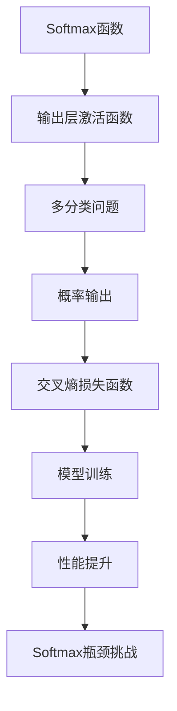

# Softmax瓶颈的挑战

## 1. 背景介绍

### 1.1 问题的由来

在深度学习领域中,Softmax函数作为一种广泛应用的激活函数,被用于多分类问题的输出层。它可以将神经网络的输出值映射到(0,1)之间,并且所有输出值的总和为1,从而可以将这些输出值解释为预测目标类别的概率。然而,随着深度学习模型规模的不断扩大和应用场景的多样化,Softmax函数在实际应用中暴露出了一些瓶颈和局限性,这些问题已经成为制约深度学习模型性能提升的重要因素之一。

### 1.2 研究现状

目前,学术界和工业界都在积极探索解决Softmax瓶颈问题的方法。一些研究人员提出了新型的激活函数,如Spherical Softmax、Arc-Softmax等,试图改善Softmax在处理大规模数据集时的性能。另一些研究则集中在优化Softmax的计算效率,如通过近似计算、层级Softmax等方式来加速计算过程。此外,也有研究者尝试从模型结构和训练策略的角度来缓解Softmax带来的问题,例如采用级联式分类结构或者知识蒸馏等技术。

### 1.3 研究意义 

解决Softmax瓶颈问题,对于提升深度学习模型的性能和扩展其应用范围具有重要意义。首先,克服Softmax在大规模数据集上的计算瓶颈,可以支持更大规模的深度学习模型训练,从而获得更强的模型表示能力。其次,改进Softmax在处理类别不平衡数据时的性能,有助于提高深度学习在实际应用中的泛化能力。此外,探索Softmax替代方案,也有望激发出新的模型结构和训练范式,推动深度学习技术的创新和发展。

### 1.4 本文结构

本文将从以下几个方面深入探讨Softmax瓶颈的挑战:

1. 介绍Softmax函数的核心概念及其在深度学习中的作用。
2. 分析Softmax函数在实际应用中面临的主要瓶颈和局限性。
3. 详细阐述Softmax瓶颈问题的核心算法原理和数学模型。
4. 介绍现有的解决方案,包括新型激活函数、计算优化和模型结构改进等。
5. 通过实际项目案例,演示如何应用这些解决方案。
6. 探讨Softmax瓶颈问题的未来发展趋势和面临的挑战。

## 2. 核心概念与联系

Softmax函数是一种广泛应用于深度学习中的激活函数,主要用于多分类问题的输出层。它的作用是将神经网络的输出值映射到(0,1)区间,并且所有输出值的总和为1,从而可以将这些输出值解释为预测目标类别的概率。

Softmax函数的数学表达式如下:

$$\text{Softmax}(x_i) = \frac{e^{x_i}}{\sum_{j=1}^{K}e^{x_j}}$$

其中,K表示分类数量,$x_i$表示第i个神经元的输出值。

在训练过程中,通过最小化交叉熵损失函数,可以使得Softmax输出的概率值逼近真实的类别分布。交叉熵损失函数的表达式为:

$$J(\theta) = -\frac{1}{m}\sum_{i=1}^{m}\sum_{j=1}^{K}y_j^{(i)}\log\hat{y}_j^{(i)}$$

其中,$\theta$表示模型参数,m表示训练样本数量,K表示分类数量,$y_j^{(i)}$表示第i个样本的真实标签(0或1),而$\hat{y}_j^{(i)}$表示Softmax输出的第j类的预测概率。

Softmax函数在深度学习中扮演着至关重要的角色,它将神经网络的输出值映射到概率分布,使得模型可以对多分类问题进行预测和决策。然而,随着深度学习模型规模的不断扩大和应用场景的多样化,Softmax函数在实际应用中暴露出了一些瓶颈和局限性,这些问题已经成为制约深度学习模型性能提升的重要因素之一。

## 3. 核心算法原理 & 具体操作步骤

### 3.1 算法原理概述

Softmax函数的核心算法原理可以概括为以下三个步骤:

1. **指数运算**: 对每个输入值$x_i$进行指数运算$e^{x_i}$,将其映射到正数域。
2. **归一化**: 将指数运算的结果除以所有输出值的指数和$\sum_{j=1}^{K}e^{x_j}$,使得所有输出值的总和为1。
3. **概率解释**: 将归一化后的输出值解释为预测目标类别的概率分布。

这种算法原理的关键在于通过指数运算和归一化操作,将任意实数映射到(0,1)区间,并且所有输出值的总和为1,从而可以将其解释为概率分布。

### 3.2 算法步骤详解

1. **输入层**:输入数据$\boldsymbol{x}=(x_1, x_2, \cdots, x_n)$,其中$n$表示输入特征的维度。

2. **隐藏层**:输入数据经过一系列线性变换和非线性激活函数的处理,得到隐藏层的输出$\boldsymbol{h}=(h_1, h_2, \cdots, h_m)$,其中$m$表示隐藏层神经元的数量。

3. **输出层**:隐藏层的输出$\boldsymbol{h}$经过一个线性变换,得到输出层的原始输出$\boldsymbol{z}=(z_1, z_2, \cdots, z_K)$,其中$K$表示分类数量。

4. **Softmax计算**:对输出层的原始输出$\boldsymbol{z}$应用Softmax函数,得到最终的输出$\boldsymbol{y}=(y_1, y_2, \cdots, y_K)$,其中$y_i$表示第$i$类的预测概率,计算公式为:

$$y_i = \text{Softmax}(z_i) = \frac{e^{z_i}}{\sum_{j=1}^{K}e^{z_j}}$$

5. **损失计算**:将Softmax输出$\boldsymbol{y}$与真实标签$\boldsymbol{t}=(t_1, t_2, \cdots, t_K)$进行比较,计算交叉熵损失函数:

$$J = -\sum_{i=1}^{K}t_i\log y_i$$

6. **反向传播**:根据损失函数的梯度,利用反向传播算法更新模型参数,最小化损失函数的值。

7. **迭代训练**:重复步骤1-6,直到模型收敛或达到预设的迭代次数。

### 3.3 算法优缺点

**优点**:

- 简单高效:Softmax函数的计算过程相对简单,可以高效地将神经网络的输出映射到概率分布。
- 概率意义明确:Softmax函数的输出值可以直接解释为预测目标类别的概率,便于理解和应用。
- 数学理论支持:Softmax函数与交叉熵损失函数相结合,具有坚实的数学理论基础。

**缺点**:

- 计算瓶颈:当分类数量K较大时,Softmax函数的计算复杂度为O(K),会导致计算效率降低。
- 类别不平衡:对于类别分布不平衡的数据集,Softmax函数可能会过度关注主导类别,忽视长尾类别。
- 相似度缺失:Softmax函数无法很好地捕捉类别之间的相似度关系,对于具有层次结构的分类问题,表现可能不佳。

### 3.4 算法应用领域

Softmax函数及其变体广泛应用于以下领域:

- **图像分类**:在计算机视觉任务中,Softmax函数常被用于图像分类的输出层,将神经网络的输出映射为各个类别的概率分布。
- **自然语言处理**:在自然语言处理任务中,Softmax函数可用于文本分类、机器翻译、语音识别等任务的输出层。
- **推荐系统**:在推荐系统中,Softmax函数可用于预测用户对不同项目的偏好概率。
- **异常检测**:在异常检测任务中,Softmax函数可用于将输出映射为正常类别和异常类别的概率分布。

## 4. 数学模型和公式 & 详细讲解 & 举例说明

### 4.1 数学模型构建

为了更好地理解Softmax函数的数学原理,我们可以从最大熵模型(Maximum Entropy Model)的角度来推导它。最大熵模型是一种基于信息论原理构建的概率模型,它试图在满足已知约束条件的前提下,选择熵最大的概率分布,从而做出最保守的预测。

设$\boldsymbol{x}=(x_1, x_2, \cdots, x_n)$为输入特征向量,$\boldsymbol{y}=(y_1, y_2, \cdots, y_K)$为输出概率分布,我们希望找到一个条件概率分布$P(\boldsymbol{y}|\boldsymbol{x})$,使得它满足以下约束条件:

$$\sum_{\boldsymbol{y}}P(\boldsymbol{y}|\boldsymbol{x})f_i(\boldsymbol{x},\boldsymbol{y}) = E_i(\boldsymbol{x}),\quad i=1,2,\cdots,m$$

其中,$f_i(\boldsymbol{x},\boldsymbol{y})$是已知的特征函数,而$E_i(\boldsymbol{x})$是这些特征函数的期望值。

根据最大熵原理,我们需要最大化条件熵:

$$H(P) = -\sum_{\boldsymbol{x},\boldsymbol{y}}P(\boldsymbol{x})P(\boldsymbol{y}|\boldsymbol{x})\log P(\boldsymbol{y}|\boldsymbol{x})$$

同时满足上述约束条件。利用拉格朗日乘数法,可以得到最优的条件概率分布为:

$$P(\boldsymbol{y}|\boldsymbol{x}) = \frac{1}{Z(\boldsymbol{x})}\exp\left(\sum_{i=1}^{m}\lambda_i(\boldsymbol{x})f_i(\boldsymbol{x},\boldsymbol{y})\right)$$

其中,$Z(\boldsymbol{x})$是归一化因子,用于确保概率和为1,$\lambda_i(\boldsymbol{x})$是对应于每个约束条件的拉格朗日乘数。

在多分类问题中,我们可以将输出层的原始输出$\boldsymbol{z}=(z_1, z_2, \cdots, z_K)$视为特征函数$f_i(\boldsymbol{x},\boldsymbol{y})$的线性组合,即:

$$f_i(\boldsymbol{x},\boldsymbol{y}) = \begin{cases}
z_i, & \text{if}\ y_i=1\\
0, & \text{otherwise}
\end{cases}$$

将这个特征函数代入上式,我们可以得到Softmax函数的形式:

$$P(y_i=1|\boldsymbol{x}) = \frac{e^{z_i}}{\sum_{j=1}^{K}e^{z_j}} = \text{Softmax}(z_i)$$

因此,Softmax函数可以看作是最大熵模型在多分类问题中的一个特例,它试图在满足输出概率和为1的约束条件下,选择熵最大的概率分布。

### 4.2 公式推导过程

接下来,我们将详细推导Softmax函数的数学公式。

首先,我们定义一个函数$g(\boldsymbol{z})$,它将输出层的原始输出$\boldsymbol{z}$映射到概率分布$\boldsymbol{y}$:

$$\boldsymbol{y} = g(\boldsymbol{z}) = (g_1(z_1), g_2(z_2), \cdots, g_K(z_K))$$

其中,$g_i(z_i)$表示第$i$个输出的概率。

为了确保$\boldsym