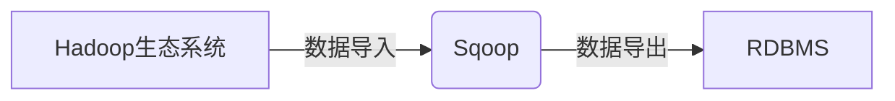

# Sqoop导入导出原理与代码实例讲解

## 1. 背景介绍

### 1.1 问题的由来

在当今大数据时代，海量数据的存储和分析成为了各个企业面临的巨大挑战。传统的关系型数据库（RDBMS）如 MySQL、Oracle 等，在处理海量数据时往往显得力不从心。而 Hadoop 生态系统中的分布式文件系统 HDFS 和分布式计算框架 MapReduce 等组件，则为海量数据的存储和分析提供了强大的支持。

然而，如何将存储在 RDBMS 中的结构化数据高效地导入到 Hadoop 生态系统中，以及如何将 Hadoop 生态系统中处理后的数据导出到 RDBMS 中，成为了一个亟待解决的问题。

### 1.2 研究现状

为了解决上述问题，各种数据迁移工具应运而生，如 Sqoop、Flume、Kafka 等。其中，Sqoop 是一款专门用于在 Hadoop 生态系统和 RDBMS 之间进行数据迁移的工具。

### 1.3 研究意义

Sqoop 的出现，极大地简化了 RDBMS 和 Hadoop 生态系统之间的数据迁移过程，提高了数据迁移的效率，降低了数据迁移的成本。

### 1.4 本文结构

本文将深入浅出地讲解 Sqoop 的导入导出原理，并结合代码实例，详细介绍 Sqoop 的使用方法。

## 2. 核心概念与联系

### 2.1 Hadoop 生态系统

Hadoop 生态系统是一个用于存储和处理海量数据的开源软件框架，其核心组件包括：

* **HDFS（Hadoop Distributed File System）**: 分布式文件系统，用于存储海量数据。
* **MapReduce**: 分布式计算框架，用于对海量数据进行并行处理。
* **YARN（Yet Another Resource Negotiator）**: 资源管理系统，负责为 MapReduce 等应用程序分配资源。

### 2.2 RDBMS

RDBMS（Relational Database Management System）即关系型数据库管理系统，是一种基于关系模型的数据库管理系统，其数据以表格的形式进行组织和存储。常见的 RDBMS 包括 MySQL、Oracle、PostgreSQL 等。

### 2.3 Sqoop

Sqoop 是一款专门用于在 Hadoop 生态系统和 RDBMS 之间进行数据迁移的工具。它可以将 RDBMS 中的数据导入到 HDFS 中，也可以将 HDFS 中的数据导出到 RDBMS 中。

### 2.4 核心概念关系图



## 3. 核心算法原理 & 具体操作步骤

### 3.1 算法原理概述

Sqoop 的数据导入和导出过程，主要基于以下两个核心算法：

* **MapReduce**: Sqoop 利用 MapReduce 框架实现数据的并行导入和导出。
* **JDBC（Java Database Connectivity）**: Sqoop 利用 JDBC 连接 RDBMS，并进行数据的读写操作。

### 3.2 算法步骤详解

#### 3.2.1 数据导入

1. **连接 RDBMS**: Sqoop 使用 JDBC 连接 RDBMS，并获取数据库和表的元数据信息。
2. **数据切片**: Sqoop 根据指定的切片条件，将数据表切分成多个数据块。
3. **并行读取数据**: Sqoop 启动多个 Map 任务，每个 Map 任务负责读取一个数据块，并将数据写入到 HDFS 中。
4. **数据合并**: 所有 Map 任务完成后，Sqoop 将所有数据块合并成一个完整的数据文件。

#### 3.2.2 数据导出

1. **连接 HDFS**: Sqoop 连接 HDFS，并读取要导出的数据文件。
2. **数据切片**: Sqoop 根据指定的切片条件，将数据文件切分成多个数据块。
3. **并行写入数据**: Sqoop 启动多个 Map 任务，每个 Map 任务负责将一个数据块写入到 RDBMS 中。
4. **数据提交**: 所有 Map 任务完成后，Sqoop 向 RDBMS 提交数据。

### 3.3 算法优缺点

#### 3.3.1 优点

* **高效性**: Sqoop 利用 MapReduce 框架实现数据的并行导入和导出，效率高。
* **易用性**: Sqoop 提供了简单易用的命令行工具，方便用户操作。
* **可扩展性**: Sqoop 支持多种数据格式，并可以扩展支持其他数据源。

#### 3.3.2 缺点

* **依赖性**: Sqoop 依赖于 Hadoop 生态系统和 RDBMS。
* **数据一致性**: Sqoop 在数据迁移过程中，需要保证数据的一致性。

### 3.4 算法应用领域

Sqoop 主要应用于以下领域：

* **数据仓库**: 将 RDBMS 中的数据导入到 Hadoop 生态系统中，进行数据分析和挖掘。
* **ETL**: 将 RDBMS 中的数据进行抽取、转换、加载，构建数据仓库。
* **数据迁移**: 将 RDBMS 中的数据迁移到其他数据存储系统中。

## 4. 数学模型和公式 & 详细讲解 & 举例说明

### 4.1 数学模型构建

Sqoop 的数据导入和导出过程，可以抽象成一个数据流模型：


其中：

* 数据源：指 RDBMS 或 HDFS。
* 数据目标：指 HDFS 或 RDBMS。

### 4.2 公式推导过程

Sqoop 的数据导入和导出效率，主要取决于以下因素：

* **数据量**: 数据量越大，数据迁移的时间越长。
* **网络带宽**: 网络带宽越大，数据迁移的速度越快。
* **硬件配置**: 硬件配置越高，数据迁移的速度越快。
* **数据切片**: 数据切片越合理，数据迁移的效率越高。

### 4.3 案例分析与讲解

假设我们要将 MySQL 数据库中的一张表 `user` 导入到 HDFS 中，表结构如下：

| 字段名 | 数据类型 |
|---|---|
| id | int |
| name | varchar(255) |
| age | int |

我们可以使用以下 Sqoop 命令完成数据导入：

```
sqoop import \
  --connect jdbc:mysql://localhost:3306/test \
  --username root \
  --password root \
  --table user \
  --target-dir /user/hive/warehouse/user \
  --m 4
```

其中：

* `--connect`: 指定 MySQL 数据库的连接地址。
* `--username`: 指定 MySQL 数据库的用户名。
* `--password`: 指定 MySQL 数据库的密码。
* `--table`: 指定要导入的表名。
* `--target-dir`: 指定 HDFS 中的目标目录。
* `--m`: 指定 Map 任务的数量，这里设置为 4，表示启动 4 个 Map 任务并行读取数据。

### 4.4 常见问题解答

**Q: Sqoop 支持哪些数据格式？**

A: Sqoop 支持 Avro、CSV、SequenceFile、Text 等多种数据格式。

**Q: 如何保证 Sqoop 数据迁移过程中数据的一致性？**

A: Sqoop 提供了以下机制保证数据的一致性：

* **事务控制**: Sqoop 支持使用数据库的事务机制，保证数据导入和导出操作的原子性。
* **数据校验**: Sqoop 可以在数据导入和导出完成后，进行数据校验，确保数据的一致性。

## 5. 项目实践：代码实例和详细解释说明

### 5.1 开发环境搭建

* 操作系统：CentOS 7
* Hadoop 版本：3.2.2
* MySQL 版本：5.7.29
* Sqoop 版本：1.4.7

### 5.2 源代码详细实现

**1. 创建 MySQL 数据库和表**

```sql
CREATE DATABASE test;

USE test;

CREATE TABLE user (
  id INT PRIMARY KEY AUTO_INCREMENT,
  name VARCHAR(255) NOT NULL,
  age INT
);

INSERT INTO user (name, age) VALUES
  ('Alice', 20),
  ('Bob', 25),
  ('Charlie', 30);
```

**2. 将 MySQL 数据导入到 HDFS**

```
sqoop import \
  --connect jdbc:mysql://localhost:3306/test \
  --username root \
  --password root \
  --table user \
  --target-dir /user/hive/warehouse/user \
  --m 4
```

**3. 查看 HDFS 中的数据**

```
hdfs dfs -ls /user/hive/warehouse/user
```

**4. 将 HDFS 数据导出到 MySQL**

```
sqoop export \
  --connect jdbc:mysql://localhost:3306/test \
  --username root \
  --password root \
  --table user_copy \
  --export-dir /user/hive/warehouse/user \
  --input-fields-terminated-by '\t'
```

**5. 查看 MySQL 数据库中的数据**

```sql
USE test;

SELECT * FROM user_copy;
```

### 5.3 代码解读与分析

* **数据导入**: 使用 `sqoop import` 命令将 MySQL 数据库中的 `user` 表导入到 HDFS 中的 `/user/hive/warehouse/user` 目录下。
* **数据导出**: 使用 `sqoop export` 命令将 HDFS 中的 `/user/hive/warehouse/user` 目录下的数据导出到 MySQL 数据库中的 `user_copy` 表中。

### 5.4 运行结果展示

* 数据导入成功后，可以在 HDFS 中的 `/user/hive/warehouse/user` 目录下看到导入的数据文件。
* 数据导出成功后，可以在 MySQL 数据库中的 `user_copy` 表中看到导出的数据。

## 6. 实际应用场景

### 6.1 数据仓库

将企业内部各个业务系统中的数据，通过 Sqoop 导入到 Hadoop 生态系统中，构建企业级数据仓库，为企业决策提供数据支持。

### 6.2 ETL

将 RDBMS 中的数据，通过 Sqoop 导入到 Hadoop 生态系统中，进行数据清洗、转换、加载等 ETL 操作，构建数据仓库。

### 6.3 数据迁移

将 RDBMS 中的数据，通过 Sqoop 迁移到其他数据存储系统中，例如 NoSQL 数据库、云存储等。

### 6.4 未来应用展望

随着大数据技术的不断发展，Sqoop 也会不断地进行更新和完善，未来将在以下方面有所发展：

* **支持更多的数据源**: 支持更多的数据源，例如 NoSQL 数据库、云存储等。
* **更高的性能**: 优化数据导入和导出的性能，提高数据迁移的效率。
* **更强大的功能**: 提供更强大的功能，例如数据增量同步、数据质量校验等。

## 7. 工具和资源推荐

### 7.1 学习资源推荐

* **Sqoop 官方文档**: https://sqoop.apache.org/docs/1.4.7/SqoopUserGuide.html
* **Hadoop 官方文档**: https://hadoop.apache.org/docs/stable/

### 7.2 开发工具推荐

* **Eclipse**: Java 集成开发环境，可以用于开发 Sqoop 应用程序。
* **IntelliJ IDEA**: Java 集成开发环境，可以用于开发 Sqoop 应用程序。

### 7.3 相关论文推荐

* **Sqoop: Bulk Data Transfer between Hadoop and Structured Datastores**: https://www.microsoft.com/en-us/research/publication/sqoop-bulk-data-transfer-between-hadoop-and-structured-datastores/

### 7.4 其他资源推荐

* **Sqoop GitHub 仓库**: https://github.com/apache/sqoop

## 8. 总结：未来发展趋势与挑战

### 8.1 研究成果总结

Sqoop 是一款功能强大、易于使用的数据迁移工具，可以高效地将 RDBMS 中的数据导入到 Hadoop 生态系统中，也可以将 Hadoop 生态系统中处理后的数据导出到 RDBMS 中。

### 8.2 未来发展趋势

未来，Sqoop 将会支持更多的数据源、更高的性能、更强大的功能，为企业数据迁移提供更便捷、高效的解决方案。

### 8.3 面临的挑战

* **数据一致性**: 如何保证数据迁移过程中数据的一致性，是一个挑战。
* **性能优化**: 如何进一步优化数据导入和导出的性能，提高数据迁移的效率，也是一个挑战。

### 8.4 研究展望

未来，Sqoop 将会继续发展和完善，为企业数据迁移提供更加完善的解决方案。

## 9. 附录：常见问题与解答

**Q: Sqoop 和 Flume 有什么区别？**

A: Sqoop 和 Flume 都是数据迁移工具，但它们的设计目标和应用场景不同。Sqoop 主要用于 RDBMS 和 Hadoop 生态系统之间的数据迁移，而 Flume 主要用于实时数据的采集和传输。

**Q: Sqoop 和 Kafka 有什么区别？**

A: Sqoop 和 Kafka 都是数据迁移工具，但它们的设计目标和应用场景不同。Sqoop 主要用于批量数据的迁移，而 Kafka 主要用于实时数据的传输。

作者：禅与计算机程序设计艺术 / Zen and the Art of Computer Programming 
