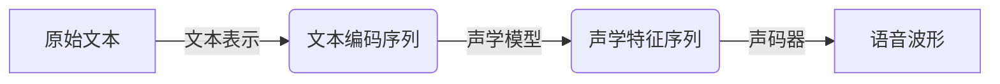
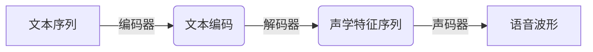
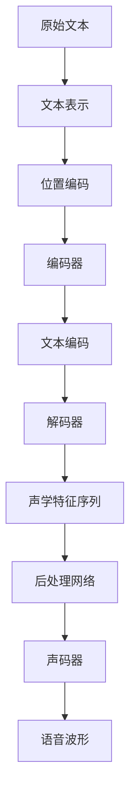

# Text-to-Speech (TTS)原理与代码实例讲解

## 1. 背景介绍

### 1.1 问题的由来

在当今信息时代,人机交互已经成为不可或缺的一部分。传统的文本输入输出方式虽然高效,但在某些场景下存在一定的局限性。比如,驾车时双手无法操作键盘和鼠标;残疾人群在输入文本时可能会遇到困难;儿童和老年人可能对传统输入设备不太熟悉等。因此,语音交互技术应运而生,以提供更加自然、无障碍的人机交互方式。

语音交互技术包括两个主要部分:语音识别(Speech Recognition)和语音合成(Speech Synthesis)。语音识别是将人类语音转换为文本的过程,而语音合成则是将文本转换为语音的过程,后者也被称为文本到语音(Text-to-Speech,TTS)技术。本文将重点探讨TTS技术的原理和实现。

### 1.2 研究现状  

早期的TTS系统主要采用连接波形(Concatenative)方法,即通过拼接预先录制的语音片段来合成语音。这种方法虽然可以产生较为自然的语音,但受限于语音库的大小和覆盖范围,难以生成多样化的语音。

近年来,基于深度学习的端到端(End-to-End)TTS模型逐渐成为研究热点。这种方法使用神经网络直接从文本到语音的映射,无需手工设计复杂的特征提取和信号处理模块。端到端TTS模型可以自动学习文本和语音之间的复杂映射关系,生成更加自然流畅的语音。

目前,基于变分自编码器(Variational Autoencoder)、注意力机制(Attention Mechanism)、生成对抗网络(Generative Adversarial Network)等技术的TTS模型取得了卓越的性能,在自然度、多样性和鲁棒性等方面都有了长足的进步。

### 1.3 研究意义

高质量的TTS技术在诸多领域都有广泛的应用前景:

- 辅助工具:为残障人士提供无障碍的信息获取和交互方式。
- 车载系统:驾驶时可通过语音交互操作导航、音乐等功能,提高驾驶安全性。  
- 智能家居:语音控制家电、查询信息等,提升生活质量。
- 教育和游戏:TTS可以赋予虚拟角色生动的语音,增强沉浸感。
- 内容创作:自动生成有声书、新闻广播等音频内容。

此外,TTS技术也是构建智能语音助手的关键组成部分,对于推动人工智能的发展具有重要意义。

### 1.4 本文结构  

本文将全面介绍TTS技术的原理、算法和实现细节。具体来说,第2部分将介绍TTS系统的核心概念和基本流程;第3部分将重点阐述基于深度学习的端到端TTS模型的工作原理和算法细节;第4部分将从数学角度对模型进行建模和公式推导;第5部分将提供基于PyTorch的TTS模型实现代码并加以解释;第6部分将讨论TTS技术在实际场景中的应用;第7部分将推荐相关的学习资源和开发工具;最后第8部分将总结TTS技术的发展趋势和面临的挑战。

## 2. 核心概念与联系

在深入探讨TTS算法之前,我们先介绍一些核心概念:

1. **文本表示(Text Representation)**: 将原始文本转换为模型可以处理的数字序列的过程。常用的编码方式包括字符级编码、词级编码、子词编码等。

2. **声学特征(Acoustic Features)**: 描述语音信号的数字特征,如频谱包络(Spectral Envelope)、基频(Fundamental Frequency)、能量(Energy)等,是语音合成的基础。

3. **声学模型(Acoustic Model)**: 将文本表示映射到声学特征的模型,是TTS系统的核心部分。

4. **声码器(Vocoder)**: 将声学特征转换为实际的语音波形信号的模块,如WORLD、Griffin-Lim等。

5. **注意力机制(Attention Mechanism)**: 一种加权计算模型输出的方法,能够自动学习输入和输出之间的对应关系,在序列到序列(Seq2Seq)建模任务中发挥关键作用。

6. **生成对抗网络(GAN)**: 由生成器和判别器组成的无监督学习框架,可用于生成更加自然、多样化的语音。

上述概念相互关联、环环相扣,共同构成了TTS系统的基本框架,如下图所示:

接下来,我们将详细介绍声学模型的工作原理和算法细节。

## 3. 核心算法原理及具体操作步骤

### 3.1 算法原理概述  

基于深度学习的端到端TTS模型通常采用编码器-解码器(Encoder-Decoder)的Seq2Seq结构。编码器将文本序列编码为中间表示,解码器则将该中间表示解码为声学特征序列。注意力机制被广泛应用于解码器,以建立文本和声学特征之间的对应关系。

常见的端到端TTS模型包括Tacotron、Transformer TTS、FastSpeech等。以Transformer TTS为例,其基本架构如下:

编码器使用多层Self-Attention和前馈网络对文本序列进行编码,生成文本编码;解码器则通过Multi-Head Attention和前馈网络将文本编码解码为声学特征序列;最后,声码器(如WORLD Vocoder)将声学特征转换为最终的语音波形。

与Tacotron等早期模型相比,Transformer TTS借鉴了Transformer的架构,完全基于Self-Attention机制,避免了RNN的局限性,能够充分捕获长程依赖关系。此外,Transformer TTS还引入了扩展的注意力机制(如前馈注意力、双向注意力等),进一步提高了模型性能。

### 3.2 算法步骤详解

以下是Transformer TTS算法的具体步骤:

1. **文本表示**:将原始文本转换为字符或词的one-hot编码序列。

2. **位置编码**:为序列中的每个元素添加位置信息,使模型能够捕获元素在序列中的相对位置关系。

3. **编码器**:
    - 通过Self-Attention层捕获文本序列中元素之间的依赖关系,生成注意力表示。
    - 通过前馈网络对注意力表示进行变换,生成最终的文本编码。

4. **解码器**:
    - 使用Masked Self-Attention捕获已生成声学特征序列中元素之间的依赖关系。
    - 通过Multi-Head Attention将文本编码和上一步的注意力表示相结合。
    - 前馈网络对注意力表示进行变换,生成新的声学特征。
    - 上述过程循环进行,逐步生成完整的声学特征序列。

5. **后处理网络**:对生成的声学特征序列进行后处理,如添加高通滤波器等,以提高语音质量。

6. **声码器**:将处理后的声学特征序列转换为实际的语音波形。

上述算法步骤可以用下面的流程图进行总结:

### 3.3 算法优缺点

基于Transformer的端到端TTS模型具有以下优点:

- **端到端建模**:无需手工设计复杂的特征提取和信号处理模块,能够自动学习文本到语音的映射。
- **长程依赖建模**:Self-Attention机制能够有效捕获长程依赖关系,生成更加自然流畅的语音。
- **并行计算**:与RNN相比,Transformer结构更加适合并行计算,推理速度更快。
- **多样性**:引入注意力机制和生成对抗网络等技术,能够生成更加多样化、自然的语音。

但同时也存在一些缺点和挑战:

- **训练数据需求大**:为了获得良好的性能,通常需要大量的高质量语音数据进行训练。
- **推理延迟**:尽管推理速度比RNN快,但对于一些实时应用场景,延迟可能仍然较高。
- **细粒度控制困难**:目前的模型难以对语音的细节(如语调、停顿等)进行精细控制。
- **鲁棒性问题**:对于带有噪音或口音的文本输入,模型的性能可能会下降。

### 3.4 算法应用领域

高质量的TTS技术在以下领域具有广泛的应用前景:

- **智能语音助手**:TTS是构建智能语音助手(如Siri、Alexa等)的关键组成部分。
- **无障碍辅助**:为视障、听障等残疾人群提供无障碍的信息获取和交互方式。
- **车载系统**:语音交互可以提高驾驶安全性,避免分散驾驶员的注意力。
- **智能家居**:通过语音控制家电、查询信息等,提升生活质量。
- **教育和游戏**:为虚拟角色、动画人物等赋予生动的语音,增强沉浸感。
- **多媒体创作**:自动生成有声书、新闻广播、网络视频配音等音频内容。
- **机器翻译**:与语音识别技术相结合,实现多语种语音到语音的实时翻译。

## 4. 数学模型和公式及详细讲解

在这一部分,我们将从数学角度对Transformer TTS模型进行建模和公式推导,并通过具体案例进行说明和分析。

### 4.1 数学模型构建

我们首先定义输入文本序列$X=\{x_1, x_2, \ldots, x_T\}$和目标声学特征序列$Y=\{y_1, y_2, \ldots, y_T'\}$,其中$T$和$T'$分别表示两个序列的长度。

Transformer TTS模型的目标是最大化条件概率$P(Y|X)$,即给定文本序列$X$,生成对应的声学特征序列$Y$的概率。根据贝叶斯公式,我们有:

$$P(Y|X) = \frac{P(X|Y)P(Y)}{P(X)}$$

由于分母$P(X)$是个常量,我们可以最大化分子部分$P(X|Y)P(Y)$。进一步展开:

$$\begin{aligned}
P(X|Y)P(Y) &= P(Y)\prod_{t=1}^{T'}P(x_t|x_{<t}, Y) \\
           &= P(Y)\prod_{t=1}^{T'}P(x_t|x_{<t}, y_{<t'})
\end{aligned}$$

其中,第二个等式是基于条件独立性假设,即在给定前$t'$个目标元素$y_{<t'}$的情况下,$x_t$与剩余的$Y$是条件独立的。

我们的目标就是最大化上式,即最大化生成声学特征序列$Y$的概率乘以给定$Y$生成文本序列$X$的概率。这可以通过最小化负对数似然损失函数来实现:

$$\mathcal{L} = -\log P(Y) - \sum_{t=1}^{T'}\log P(x_t|x_{<t}, y_{<t'})$$

上式中的第一项是生成$Y$的损失,第二项是给定$(x_{<t}, y_{<t'})$生成$x_t$的损失。在训练过程中,我们需要最小化这个损失函数。

### 4.2 公式推导过程

接下来,我们将推导Transformer TTS模型中不同组件的具体公式。

**1. 位置编码**

为了使模型能够捕获序列元素的位置信息,我们为每个元素添加位置编码$PE(pos, i)$:

$$PE(pos, i)