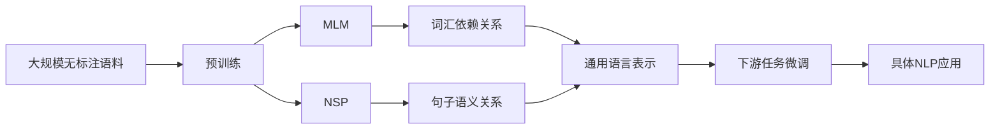

# Transformer大模型实战 BERT 的配置

关键词：Transformer, BERT, 预训练模型, 自然语言处理, 迁移学习, 微调

## 1. 背景介绍
### 1.1  问题的由来
随着深度学习的发展,自然语言处理(NLP)领域取得了巨大的进步。传统的NLP方法主要依赖于人工设计的特征和领域知识,难以有效捕捉语言的深层语义信息。2017年,Google提出了Transformer模型[1],引入了自注意力机制,极大地提升了NLP任务的性能。在此基础上,2018年提出的BERT(Bidirectional Encoder Representations from Transformers)[2]模型进一步将预训练引入NLP领域,通过在大规模无标注语料上进行预训练,再在下游任务上进行微调,刷新了多项NLP任务的最好成绩。BERT的成功开启了预训练大模型的新时代。

### 1.2  研究现状
BERT提出后,预训练大模型得到了学术界和工业界的广泛关注。各大科技公司纷纷推出了自己的预训练模型,如OpenAI的GPT系列[3]、Facebook的RoBERTa[4]、Google的ALBERT[5]等。这些模型在参数量、训练数据、训练目标等方面进行了改进和创新,不断刷新着NLP基准任务的性能。同时,预训练模型也被应用到了问答、对话、信息抽取、文本分类等诸多实际场景中,极大地推动了NLP技术的发展。

### 1.3  研究意义
尽管BERT等预训练模型取得了巨大成功,但对于如何有效地配置和应用这些大模型,业界还缺乏系统性的指导。不同的任务场景对模型性能、推理速度、资源占用等方面的要求不尽相同,需要根据实际情况对模型进行适配和优化。深入探讨BERT的内在机制和最佳实践,对于推动预训练大模型技术的成熟和落地具有重要意义。

### 1.4  本文结构
本文将围绕BERT模型的配置与应用展开深入探讨。第2节介绍BERT的核心概念和内在联系;第3节重点阐述BERT的训练原理和优化策略;第4节从理论角度对BERT的数学基础进行推导和分析;第5节给出BERT的代码实现示例;第6节总结BERT在各领域的实际应用;第7节梳理BERT相关的学习资源和工具;第8节对BERT的未来趋势和挑战进行展望;第9节列举BERT实践中的常见问题。

## 2. 核心概念与联系
BERT是一种基于Transformer的预训练语言模型,其核心是利用自注意力机制和双向编码器结构,在大规模无标注语料上进行预训练,学习通用的语言表示。预训练阶段主要包括以下两个任务:

1. Masked Language Model(MLM):随机Mask掉输入序列的部分Token,让模型根据上下文预测这些Token。这使得模型能学习到词汇间的依赖关系。 

2. Next Sentence Prediction(NSP):将两个句子拼接作为输入,让模型判断第二个句子是否为第一个的下一句。这使得模型能学习到句子间的语义关系。

通过这两个任务,BERT学习到了语言的通用表示。在应用到下游任务时,只需在预训练的基础上添加任务特定的输出层,并在少量标注数据上进行微调即可。这种预训练-微调范式使得BERT能够快速适应不同的NLP任务,并取得优异的性能。

BERT的核心概念如下图所示:

## 3. 核心算法原理 & 具体操作步骤
### 3.1  算法原理概述
BERT的训练分为两个阶段:预训练和微调。预训练阶段在大规模无标注语料上进行,目标是学习通用的语言表示。微调阶段在特定任务的标注数据上进行,目标是让模型适应具体任务。下面详细介绍这两个阶段的原理和步骤。

### 3.2  算法步骤详解
#### 3.2.1 预训练阶段
1. 语料准备:收集大规模无标注的文本语料,进行清洗和预处理。  
2. 输入表示:将输入文本转换为WordPiece分词形式,添加[CLS]、[SEP]等特殊Token,并将词转换为嵌入向量。
3. MLM任务:随机Mask掉部分Token(如15%),让模型根据上下文预测这些Token。损失函数为遮蔽词的交叉熵。
4. NSP任务:将两个句子拼接为一个序列,添加[CLS]、[SEP]标记。让模型预测第二句是否为第一句的下一句。损失函数为二元交叉熵。
5. 模型训练:使用Adam优化器训练模型,学习率采用Warmup策略。在MLM和NSP任务上联合训练。

#### 3.2.2 微调阶段
1. 任务数据:根据具体任务准备标注数据集,划分为训练集、验证集和测试集。
2. 模型构建:在预训练BERT的基础上,根据任务需要添加相应的输出层,如分类、序列标注等。
3. 模型训练:使用任务数据对模型进行微调,通常只需训练新添加的输出层,而保持大部分BERT参数不变。
4. 模型评估:在验证集上评估模型性能,并根据需要调整超参数。
5. 模型预测:用训练好的模型对测试集进行预测,得到任务的最终结果。

### 3.3  算法优缺点
BERT的主要优点包括:
- 通过预训练学习通用语言表示,可以显著提升下游任务性能。
- 采用双向Transformer编码器,能更好地捕捉词汇和句子间的依赖关系。
- 引入MLM和NSP任务,使得模型能学习更加丰富的语言信息。
- 预训练-微调范式使得模型可以快速适应新任务,降低了任务特定数据的需求。

BERT的主要缺点包括:  
- 模型参数量巨大,训练和推理成本高,对计算资源要求较高。
- 对于一些特定领域的任务,模型的泛化能力有限,需要在领域语料上进一步预训练。
- 预训练语料的质量对模型性能影响较大,需要大量高质量的无标注数据。
- 模型解释性较差,难以解释模型的内部工作机制和决策过程。

### 3.4  算法应用领域
BERT在NLP领域得到了广泛应用,主要包括以下方面:
- 文本分类:如情感分析、新闻分类、垃圾邮件检测等。
- 序列标注:如命名实体识别、词性标注、语义角色标注等。 
- 问答系统:基于BERT构建问答系统,如阅读理解、开放域问答等。
- 信息抽取:利用BERT进行关系抽取、事件抽取、属性抽取等。
- 文本生成:如对话生成、文本摘要、机器翻译等生成任务。
- 语义匹配:如文本相似度计算、自然语言推理、语义搜索等。

除了上述经典任务外,BERT还被用于构建更大规模的预训练模型,如GPT、ALBERT、RoBERTa等,进一步拓展了预训练语言模型的应用范围。

## 4. 数学模型和公式 & 详细讲解 & 举例说明
### 4.1  数学模型构建
BERT的核心是基于Transformer的编码器结构。Transformer由多层自注意力(Self-Attention)和前馈(Feed-Forward)网络组成,可以并行计算序列中元素间的依赖关系。

假设输入序列为 $\mathbf{x}=(x_1,\ldots,x_n)$,每个 $x_i \in \mathbb{R}^d$ 表示词嵌入向量。自注意力机制通过查询(Query)、键(Key)、值(Value)三个矩阵计算序列元素之间的相似度和权重。

查询矩阵 $\mathbf{Q} \in \mathbb{R}^{n \times d_k}$、键矩阵 $\mathbf{K} \in \mathbb{R}^{n \times d_k}$、值矩阵 $\mathbf{V} \in \mathbb{R}^{n \times d_v}$ 分别为输入 $\mathbf{X}$ 乘以可学习矩阵 $\mathbf{W}^Q, \mathbf{W}^K, \mathbf{W}^V$:

$$
\mathbf{Q} = \mathbf{X} \mathbf{W}^Q, \quad
\mathbf{K} = \mathbf{X} \mathbf{W}^K, \quad
\mathbf{V} = \mathbf{X} \mathbf{W}^V
$$

自注意力的输出为值矩阵 $\mathbf{V}$ 与注意力权重矩阵 $\mathbf{A}$ 的乘积,其中 $\mathbf{A}$ 通过 $\mathbf{Q}$ 和 $\mathbf{K}$ 的点积并归一化得到:

$$
\mathrm{Attention}(\mathbf{Q}, \mathbf{K}, \mathbf{V}) = \mathrm{softmax}(\frac{\mathbf{Q}\mathbf{K}^T}{\sqrt{d_k}}) \mathbf{V}
$$

BERT使用多头自注意力(Multi-Head Self-Attention),将 $\mathbf{Q},\mathbf{K},\mathbf{V}$ 分别线性变换为 $h$ 个不同的子空间,并行计算 $h$ 个自注意力的结果,再拼接起来:

$$
\begin{aligned}
\mathrm{MultiHead}(\mathbf{Q}, \mathbf{K}, \mathbf{V}) &= \mathrm{Concat}(\mathrm{head_1}, \ldots, \mathrm{head_h}) \mathbf{W}^O \\
\text{where} \quad \mathrm{head_i} &= \mathrm{Attention}(\mathbf{Q}\mathbf{W}_i^Q, \mathbf{K}\mathbf{W}_i^K, \mathbf{V}\mathbf{W}_i^V)
\end{aligned}
$$

多头注意力的结果经过前馈网络、残差连接和层归一化后,得到Transformer编码器的最终输出。

### 4.2  公式推导过程
以下推导BERT在MLM任务中的损失函数。假设词表大小为 $V$,输入序列 $\mathbf{x}$ 经WordPiece分词后共 $n$ 个Token,其中被Mask的Token索引集合为 $\mathcal{M}$。

对于第 $i \in \mathcal{M}$ 个Mask位置,记 $y_i$ 为真实词的索引, $\hat{y}_i$ 为模型预测的概率分布。MLM任务的损失函数为所有Mask位置预测分布与真实标签的交叉熵损失:

$$
\mathcal{L}_{\mathrm{MLM}} = -\sum_{i \in \mathcal{M}} \log P(\hat{y}_i=y_i | \mathbf{x})
$$

其中, $P(\hat{y}_i=y_i | \mathbf{x})$ 表示在给定上下文 $\mathbf{x}$ 的条件下,位置 $i$ 的预测词为真实词 $y_i$ 的概率。将其展开可得:

$$
\begin{aligned}
P(\hat{y}_i=y_i | \mathbf{x}) &= \mathrm{softmax}(\mathbf{h}_i \mathbf{W}^{MLM} + \mathbf{b}^{MLM})_{y_i} \\
&= \frac{\exp(\mathbf{h}_i \mathbf{w}_{y_i}^{MLM} + b_{y_i}^{MLM})}{\sum_{j=1}^V \exp(\mathbf{h}_i \mathbf{w}_j^{MLM} + b_j^{MLM})}
\end{aligned}
$$

其中, $\mathbf{h}_i \in \mathbb{R}^d$ 为位置 $i$ 的隐藏层输出, $\mathbf{W}^{MLM} \in \mathbb{R}^{d \times V}$ 和 $\mathbf{b}^{MLM} \in \mathbb{R}^V$ 为MLM任务的输出层参数