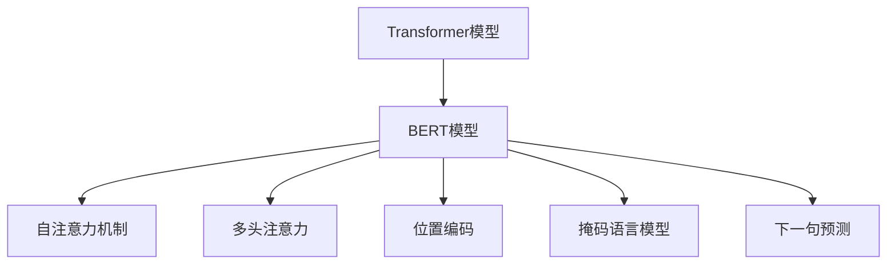

# Transformer大模型实战 将BERT模型应用于其他语言

## 1. 背景介绍

### 1.1 问题的由来

随着自然语言处理(NLP)技术的不断发展,transformer模型在各种NLP任务中展现出了卓越的性能。作为transformer模型的代表之作,BERT(Bidirectional Encoder Representations from Transformers)模型自2018年发布以来,就在多个基准测试中取得了最佳成绩,并被广泛应用于各种NLP任务中。然而,BERT模型最初是基于英语语料训练的,因此在将其应用于其他语言时,往往需要对模型进行重新预训练或微调,以适应新语言的语法和语义特征。

### 1.2 研究现状

目前,已有多项研究工作致力于将BERT模型应用于非英语语言。一种常见的方法是在大规模的目标语言语料库上对BERT模型进行预训练,以获得针对该语言的语言模型表示。另一种方法是在多语言语料库上联合训练BERT模型,使其能够同时处理多种语言。此外,还有一些工作探索了跨语言迁移学习的方法,即在源语言上预训练BERT模型,然后将其迁移到目标语言上进行微调。

### 1.3 研究意义

将BERT模型成功应用于非英语语言具有重要的理论和实践意义。从理论层面上,它有助于验证transformer模型的通用性和可扩展性,并推动NLP技术在多语种场景下的发展。从实践层面上,它可以为非英语语言的NLP任务提供强大的语言模型支持,提高相关应用的性能和质量。

### 1.4 本文结构

本文将详细介绍如何将BERT模型应用于其他语言,包括以下几个方面:

1. 核心概念与联系:介绍BERT模型的核心概念,以及其与transformer模型和自注意力机制的联系。
2. 核心算法原理与具体操作步骤:阐述BERT模型的核心算法原理,并详细说明将其应用于其他语言的具体操作步骤。
3. 数学模型和公式详细讲解:介绍BERT模型中涉及的数学模型和公式,并通过案例进行详细讲解。
4. 项目实践:代码实例和详细解释说明:提供一个将BERT模型应用于其他语言的实践项目,包括开发环境搭建、源代码实现、代码解读和运行结果展示。
5. 实际应用场景:探讨BERT模型在其他语言中的实际应用场景,以及未来的应用展望。
6. 工具和资源推荐:推荐相关的学习资源、开发工具、论文和其他资源。
7. 总结:未来发展趋势与挑战:总结研究成果,展望未来发展趋势,并讨论可能面临的挑战。
8. 附录:常见问题与解答:列出一些常见问题及其解答。

## 2. 核心概念与联系

BERT是一种基于transformer模型的双向编码器表示,旨在学习上下文化的词嵌入表示。它的核心概念包括:

1. **Transformer模型**: BERT是基于transformer模型构建的,transformer模型是一种全新的基于注意力机制的序列到序列模型。它完全依赖于注意力机制来捕获输入和输出之间的全局依赖关系,而不使用循环和卷积。

2. **自注意力机制(Self-Attention)**: 自注意力机制是transformer模型的核心,它允许模型在计算表示时关注整个输入序列的不同位置。与RNN和CNN不同,自注意力机制不需要严格的序列顺序,可以并行计算,从而提高了计算效率。

3. **多头注意力(Multi-Head Attention)**: 多头注意力是在多个注意力头上并行计算注意力,并将它们的结果串联起来作为最终值。这种结构可以允许模型从不同的表示子空间中获取不同的信息。

4. **位置编码(Positional Encoding)**: 由于transformer模型没有捕获序列顺序的内在机制,因此需要使用位置编码来注入序列顺序信息。

5. **掩码语言模型(Masked Language Model)**: BERT使用了掩码语言模型的预训练任务,即在输入序列中随机掩码一些token,然后预测这些被掩码的token。这种方式可以让模型学习双向表示。

6. **下一句预测(Next Sentence Prediction)**: BERT还使用了下一句预测的预训练任务,即判断两个句子是否相邻。这有助于捕获句子之间的关系和语境。

BERT模型通过预训练学习到了丰富的语义和语法知识,可以很好地捕获词与词之间、句与句之间的关系,从而在下游NLP任务中取得出色表现。

## 3. 核心算法原理 & 具体操作步骤

### 3.1 算法原理概述

BERT模型的核心算法原理可以概括为以下几个方面:

1. **输入表示**: BERT模型的输入是一个token序列,每个token都被转换为一个embedding向量。此外,还添加了一个特殊的[CLS]标记作为序列的表示,以及一个[SEP]标记用于分隔序列。

2. **编码器层**: BERT使用了transformer的编码器结构,包括多个相同的编码器层。每个编码器层由两个子层组成:多头自注意力机制和前馈神经网络。自注意力机制捕获输入序列中token之间的依赖关系,而前馈神经网络对每个token的表示进行非线性映射。

3. **预训练任务**: BERT使用了两个无监督预训练任务:掩码语言模型(MLM)和下一句预测(NSP)。MLM任务通过随机掩码输入序列中的一些token,然后预测这些被掩码的token,从而学习双向语境表示。NSP任务则是判断两个句子是否相邻,有助于捕获句子之间的关系。

4. **微调**: 在下游NLP任务上,BERT模型会根据具体任务对最后一层的[CLS]向量进行微调和分类。这种迁移学习方式可以利用预训练模型中学习到的语义和语法知识,从而提高下游任务的性能。

### 3.2 算法步骤详解

将BERT模型应用于其他语言的具体步骤如下:

1. **语料准备**: 收集目标语言的大规模语料库,包括书籍、新闻、网页等多种文本数据。对语料进行必要的预处理,如分词、去除噪声等。

2. **词表构建**: 基于语料库构建目标语言的词表(vocabulary),包括常见词汇、特殊标记等。词表的大小通常在几万到几十万之间。

3. **预训练**: 在目标语言的语料库上,使用掩码语言模型(MLM)和下一句预测(NSP)任务对BERT模型进行预训练。预训练过程通常需要大量的计算资源和时间。

4. **微调**: 对于特定的下游NLP任务,如文本分类、命名实体识别等,需要在相应的标注数据集上对预训练的BERT模型进行微调。微调过程相对较快,可以快速将BERT模型迁移到新的任务上。

5. **评估**: 在测试集上评估微调后的BERT模型在目标语言的下游任务上的性能表现,如准确率、F1分数等指标。

6. **部署**: 将训练好的BERT模型集成到实际的NLP应用系统中,用于处理目标语言的文本数据。

需要注意的是,由于不同语言的语法和语义特征存在差异,直接将预训练好的英语BERT模型应用于其他语言可能会导致性能下降。因此,在目标语言的语料库上进行预训练和微调是非常必要的。

### 3.3 算法优缺点

BERT模型在应用于其他语言时具有以下优缺点:

**优点**:

1. **通用性强**: BERT模型的核心思想和架构具有很强的通用性,可以很好地迁移到其他语言上。

2. **性能卓越**: 通过在大规模语料库上预训练,BERT模型可以学习到丰富的语义和语法知识,在下游任务上表现出色。

3. **可解释性好**: 自注意力机制使BERT模型具有较好的可解释性,可以分析每个token对最终预测的贡献。

4. **无监督学习**: BERT模型的预训练过程是无监督的,只需要大量的原始文本数据,无需人工标注。

**缺点**:

1. **计算资源需求高**: 预训练BERT模型需要大量的计算资源,包括GPU、内存和存储空间。

2. **训练时间长**: 在大规模语料库上预训练BERT模型通常需要数周甚至数月的时间。

3. **模型大小庞大**: BERT模型的参数量通常在数亿到数十亿之间,导致模型文件体积庞大,不利于部署。

4. **语言差异影响**: 不同语言的语法和语义特征存在差异,可能需要对BERT模型进行特定的调整和优化。

### 3.4 算法应用领域

BERT模型及其变体在以下领域有广泛的应用:

1. **自然语言理解(NLU)**: 如文本分类、情感分析、命名实体识别、关系抽取等任务。

2. **自然语言生成(NLG)**: 如机器翻译、文本摘要、对话系统等任务。

3. **问答系统**: 利用BERT模型的语义理解能力,可以构建高质量的问答系统。

4. **信息检索**: 将BERT模型应用于相关性排序、语义搜索等信息检索任务。

5. **知识图谱构建**: 利用BERT模型的关系抽取能力,可以从文本中抽取三元组知识,用于构建知识图谱。

6. **生物医学领域**: BERT模型在蛋白质相互作用抽取、基因命名实体识别等生物医学NLP任务中表现出色。

总的来说,BERT模型及其变体为各种NLP任务提供了强大的语言表示能力,在自然语言理解和生成等领域有着广泛的应用前景。

## 4. 数学模型和公式 & 详细讲解 & 举例说明

### 4.1 数学模型构建

BERT模型的核心是transformer的编码器结构,其中自注意力机制是关键组件。我们首先介绍自注意力机制的数学模型。

对于一个长度为$n$的输入序列$\boldsymbol{x} = (x_1, x_2, \dots, x_n)$,其中$x_i \in \mathbb{R}^{d_\text{model}}$是$d_\text{model}$维的向量表示,自注意力机制的计算过程如下:

$$\begin{aligned}
\boldsymbol{q}_i &= \boldsymbol{x}_i \boldsymbol{W}^Q \\
\boldsymbol{k}_i &= \boldsymbol{x}_i \boldsymbol{W}^K \\
\boldsymbol{v}_i &= \boldsymbol{x}_i \boldsymbol{W}^V
\end{aligned}$$

其中$\boldsymbol{W}^Q \in \mathbb{R}^{d_\text{model} \times d_k}$、$\boldsymbol{W}^K \in \mathbb{R}^{d_\text{model} \times d_k}$和$\boldsymbol{W}^V \in \mathbb{R}^{d_\text{model} \times d_v}$是可学习的线性投影矩阵,将输入向量$\boldsymbol{x}_i$映射到查询(query)、键(key)和值(value)空间。

然后,计算查询$\boldsymbol{q}_i$与所有键$\boldsymbol{k}_j$的点积,对其进行缩放并应用softmax函数,得到注意力权重:

$$\alpha_{ij} = \text{softmax}\left(\frac{\boldsymbol{q}_i^\top \boldsymbol{k}_j}{\sqrt{d_k}}\right)$$

注意力权重$\alpha_{ij}$表示查询$\boldsymbol{q}_i$对键$\boldsymbol{k}_j$的注意力程度。$\sqrt{d_k}$是用于缩放点积,以防止过大的值导致softmax函数饱和。

最后,将注意力权重与值向量$\boldsym