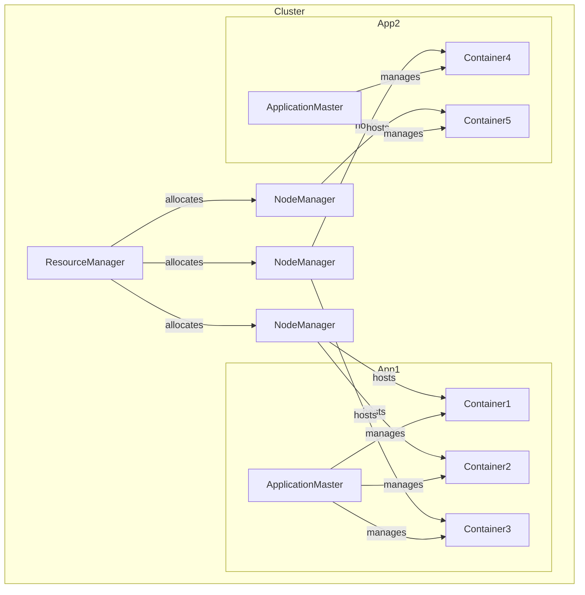

# YARN Application Master 原理与代码实例讲解

## 1. 背景介绍

### 1.1 问题的由来

在大数据时代,海量数据的存储和计算成为了一个巨大的挑战。Apache Hadoop作为一个分布式系统基础架构,为解决这一问题提供了可靠、可扩展的解决方案。Hadoop的核心组件之一是资源管理和任务调度框架YARN(Yet Another Resource Negotiator)。

YARN中的Application Master(AM)是一个关键的组件,负责管理整个应用程序的生命周期。它在集群中协调资源分配、监控任务执行、处理故障恢复等重要功能。深入理解AM的原理和实现对于充分利用YARN进行大数据处理至关重要。

### 1.2 研究现状  

目前已有许多研究文献探讨了YARN的架构和设计原理,但大多数只是概括地介绍了AM的作用,缺乏对其内部实现机制的深入剖析。一些专业书籍和官方文档虽然提供了AM源代码的解释,但往往过于技术细节,缺乏对核心概念的系统梳理。

### 1.3 研究意义

全面深入地理解AM原理对于提高YARN的使用效率、优化资源利用率、实现自定义调度策略等方面都有重要意义。本文将系统地阐述AM的设计理念、核心算法和实现细节,并结合实际应用场景,为读者提供一个完整的学习路径。

### 1.4 本文结构  

本文首先介绍YARN和AM的核心概念,然后深入探讨AM的实现原理和算法,包括资源协商、任务执行、容错机制等。接下来通过数学模型和代码实例,对AM的关键环节进行详细分析和讲解。最后讨论AM在实际场景中的应用,以及未来的发展趋势和面临的挑战。

## 2. 核心概念与联系

YARN的核心思想是将资源管理和任务监控调度相分离,由一个统一的全局ResourceManager(RM)和每个应用程序专属的ApplicationMaster(AM)协同工作。

ResourceManager负责整个集群的资源管理和调度,跟踪可用资源,并为各个AM分配资源容器。ApplicationMaster负责单个应用程序的生命周期管理,包括向RM申请资源、启动任务、监控进度和处理故障等。

ApplicationMaster本质上是一个库,由应用程序框架(如MapReduce)实现和调用。不同的计算框架可以基于自身的策略,实现定制化的AM以获得更好的资源利用和任务调度。

上图展示了YARN中RM、NM、AM和Container之间的关系。RM负责跨节点的资源分配,而AM负责单个应用程序内的任务调度和监控。

## 3. 核心算法原理 & 具体操作步骤  

### 3.1 算法原理概述

ApplicationMaster的核心算法可概括为以下几个关键步骤:

1. **资源协商(Resource Negotiation)**: AM根据应用程序的需求向RM申请资源,RM分配可用的容器资源。
2. **任务分发(Task Dispatch)**: AM将分配的容器资源映射为任务,并启动相应的任务进程。  
3. **进度监控(Progress Monitoring)**: AM持续跟踪任务的执行进度,处理任务完成/失败事件。
4. **容错恢复(Fault Tolerance)**: 在发生任务失败或节点故障时,AM负责重新调度任务或申请新的容器资源。
5. **任务收尾(Task Cleanup)**: 所有任务完成后,AM向RM释放使用的资源,并进行必要的清理工作。

### 3.2 算法步骤详解

1. **资源协商**

   - AM启动时向RM注册,并通过心跳机制持续发送资源请求
   - RM根据集群的资源状况,按照特定的调度策略分配容器资源给AM
   - AM收到分配的容器资源后,更新自身的资源视图和待分配队列

2. **任务分发**  

   - AM从待分配队列中选择合适的任务
   - 将任务与已分配的容器资源一一映射
   - 通过容器启动命令在对应节点上启动任务进程
   - 更新任务状态和资源视图

3. **进度监控**

   - 任务进程周期性地向AM发送心跳和进度更新
   - AM跟踪每个任务的状态:正在运行、完成或失败
   - 对于已完成的任务,AM进行必要的输出处理
   - 对于失败的任务,AM进行容错恢复

4. **容错恢复** 

   - 任务失败时,AM尝试在其他节点上重新调度该任务
   - 如果是节点故障,AM向RM申请新的容器资源
   - 根据应用程序的策略,决定是否终止或继续执行

5. **任务收尾**

   - 所有任务完成后,AM向RM发出资源释放请求
   - 进行必要的日志、统计数据和状态清理
   - 应用程序正常/异常退出

### 3.3 算法优缺点

**优点**:

- 集中式调度,可实现全局资源分配的公平性和高效性
- 应用程序级别的自主管理,可支持不同框架的定制化策略  
- 分层故障隔离,提高系统的鲁棒性

**缺点**:  

- 引入了额外的通信开销,如AM与RM、AM与任务之间的心跳交互
- AM单点故障的风险,需要实现AM的高可用性机制
- 中心化的RM可能会成为系统瓶颈,限制了吞吐量

### 3.4 算法应用领域

ApplicationMaster算法被广泛应用于以下领域:

- 大数据分析: MapReduce、Spark、Flink等
- 机器学习: TensorFlow on YARN
- 科学计算: 高性能计算框架
- 流处理: Storm/Heron on YARN  
- 工作流调度: Apache Oozie

## 4. 数学模型和公式 & 详细讲解 & 举例说明

### 4.1 数学模型构建

为了量化描述AM的资源分配和任务调度过程,我们可以构建如下数学模型:

假设有一个YARN集群,包含$N$个节点,每个节点$i$有$R_i$个可用容器资源。

有$M$个应用程序,每个应用程序$j$有$\lambda_j$个map任务和$\rho_j$个reduce任务需要执行。

我们的目标是最小化所有应用程序的总完成时间:

$$\min \sum_{j=1}^{M} C_j$$

其中$C_j$是应用程序$j$的完成时间,等于该应用程序中最后一个任务的完成时间。

对于每个应用程序$j$,我们有:

$$C_j = \max\limits_{1\leq k\leq \lambda_j}\{c^m_{jk}\} + \max\limits_{1\leq l\leq \rho_j}\{c^r_{jl}\}$$

其中$c^m_{jk}$和$c^r_{jl}$分别表示该应用程序的第$k$个map任务和第$l$个reduce任务的完成时间。

### 4.2 公式推导过程  

我们将任务的执行时间建模为:

$$c_{jk} = w_{jk} + \frac{d_{jk}}{s_{jk}}$$

其中:

- $w_{jk}$是任务$jk$的等待时间,即获取容器资源的时间
- $d_{jk}$是任务$jk$的数据量或工作量
- $s_{jk}$是分配给任务$jk$的容器的计算能力

我们的目标是最小化所有应用程序的总完成时间,可以转化为:

$$\begin{aligned}
\min\limits_{\boldsymbol{x},\boldsymbol{s}} \quad & \sum_{j=1}^{M} \left( \max\limits_{1\leq k\leq \lambda_j}\left\{w_{jk} + \frac{d^m_{jk}}{s^m_{jk}}\right\} + \max\limits_{1\leq l\leq \rho_j}\left\{w_{jl} + \frac{d^r_{jl}}{s^r_{jl}}\right\} \right) \\
\text{s.t.} \quad & \sum_{j=1}^{M}\sum_{k=1}^{\lambda_j}x^m_{ijk} \leq R_i, \quad \forall i=1,\ldots,N \\
& \sum_{j=1}^{M}\sum_{l=1}^{\rho_j}x^r_{ijl} \leq R_i, \quad \forall i=1,\ldots,N \\
& \sum_{i=1}^{N}x^m_{ijk} = 1, \quad \forall j,k \\
& \sum_{i=1}^{N}x^r_{ijl} = 1, \quad \forall j,l \\
& x^m_{ijk}, x^r_{ijl} \in \{0, 1\}
\end{aligned}$$

其中$\boldsymbol{x}$是任务到容器的分配变量,如果map任务$jk$被分配到节点$i$上,则$x^m_{ijk}=1$,否则为0。$\boldsymbol{s}$是容器能力变量。

约束条件表示每个节点上容器资源的使用量不能超过可用量,且每个任务只能被分配到一个容器上。

这是一个经典的混合整数线性规划问题,可以使用已有的求解器和算法进行求解。

### 4.3 案例分析与讲解

考虑一个具有3个节点的YARN集群,每个节点有4个容器资源。有2个应用程序需要运行:

- 应用程序1: 5个map任务,3个reduce任务
- 应用程序2: 4个map任务,2个reduce任务  

我们的目标是最小化这两个应用程序的总完成时间。假设任务的数据量和容器能力已知,利用上述模型,我们可以求解出最优的任务分配方案。

例如,一种可能的分配是:

- 节点1:
  - 应用程序1的map1和map2
  - 应用程序2的map1和map2
- 节点2:  
  - 应用程序1的map3和reduce1 
  - 应用程序2的map3
- 节点3:
  - 应用程序1的map4、map5和reduce2、reduce3
  - 应用程序2的map4和reduce1、reduce2

通过这种分配,两个应用程序可以并行执行,且考虑了数据本地性,从而提高了整体吞吐量和效率。

### 4.4 常见问题解答

**Q: 如何处理应用程序的优先级?**

A: 可以在目标函数中加入权重,对不同应用程序的完成时间进行加权求和。权重可以基于应用程序的优先级、队列优先级等因素确定。

**Q: 如何考虑数据局部性?**

A: 可以在模型中引入数据位置的信息,例如增加一个数据传输代价项,对非本地任务分配增加一个惩罚因子。

**Q: 如何处理容器资源的动态变化?**

A: 可以将模型扩展为动态优化问题,在每个调度周期内重新计算并优化任务分配方案。同时需要考虑任务迁移的代价。

**Q: AM失败会怎样?**

A: YARN提供了AM失败恢复的机制。当AM失败时,RM会根据应用程序的重启策略,为该应用程序重新启动一个新的AM实例,并将未完成的任务和容器资源重新分配给新AM。

## 5. 项目实践:代码实例和详细解释说明

### 5.1 开发环境搭建

要研究YARN ApplicationMaster的实现细节,我们需要先准备Hadoop开发环境。以下是主要步骤:

1. 下载Hadoop发行版(如Apache Hadoop 3.3.1)
2. 配置Hadoop环境变量
3. 伪分布式或完全分布式集群部署
4. 启动HDFS和YARN组件
5. 准备构建工具(如Apache Maven)

完成上述步骤后,我们就可以开始研究ApplicationMaster的源代码了。

### 5.2 源代码