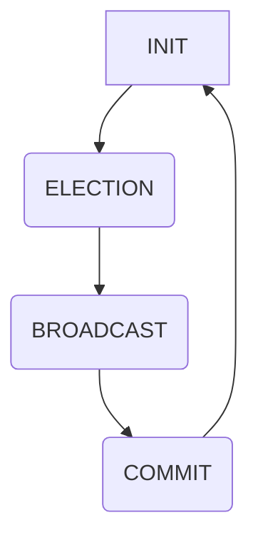

## 1. 背景介绍
### 1.1  问题的由来
在分布式系统中，数据一致性是至关重要的。当多个节点需要访问和修改共享数据时，如何保证数据的一致性就成为一个难题。传统的数据库解决方案难以直接应用于分布式环境，因为它们通常依赖于单一的事务管理器和共享存储。

ZooKeeper 作为一种分布式协调服务，旨在解决分布式系统中的一致性问题。它提供了一种可靠、高效的机制来管理和协调分布式应用程序的配置、状态和数据。

### 1.2  研究现状
ZooKeeper 的核心协议是 ZAB 协议（ZooKeeper Atomic Broadcast Protocol），它是一种基于 Paxos 协议的分布式一致性算法。ZAB 协议通过将数据广播到所有节点，并确保所有节点都接受相同的版本，从而保证数据的一致性。

### 1.3  研究意义
深入理解 ZAB 协议的原理和实现细节对于开发和维护分布式系统至关重要。它可以帮助我们更好地理解 ZooKeeper 的工作机制，以及如何利用它来解决分布式系统中的各种一致性问题。

### 1.4  本文结构
本文将详细介绍 ZooKeeper ZAB 协议的原理和代码实例，包括：

* ZAB 协议的背景和设计目标
* ZAB 协议的核心概念和流程
* ZAB 协议的数学模型和公式
* ZAB 协议的代码实现和分析
* ZAB 协议的实际应用场景

## 2. 核心概念与联系
ZAB 协议的核心概念包括：

* **Leader 选举:** ZooKeeper 中存在一个 Leader 节点，负责协调数据广播和一致性维护。
* **日志记录:** 所有数据操作都记录在日志中，并以有序的方式广播到所有节点。
* **确认机制:** 节点在接收数据后会发送确认消息，确保数据被所有节点正确接收。
* **冲突解决:** 当多个节点同时提交数据操作时，ZAB 协议会采用一定的机制来解决冲突。

这些概念相互关联，共同构成了 ZAB 协议的完整框架。

## 3. 核心算法原理 & 具体操作步骤
### 3.1  算法原理概述
ZAB 协议的核心思想是将数据操作广播到所有节点，并确保所有节点都接受相同的版本。它通过以下步骤实现：

1. **Leader 选举:** ZooKeeper 集群中会选举出一个 Leader 节点。
2. **数据提交:** 当一个节点需要提交数据操作时，它会将操作发送给 Leader 节点。
3. **日志记录:** Leader 节点将数据操作记录在本地日志中，并以有序的方式广播到所有节点。
4. **确认机制:** 节点在接收数据后会发送确认消息给 Leader 节点，确保数据被正确接收。
5. **冲突解决:** 当多个节点同时提交数据操作时，ZAB 协议会采用一定的机制来解决冲突，例如使用版本号进行比较。

### 3.2  算法步骤详解
1. **Leader 选举:** ZooKeeper 集群中会使用 Paxos 协议进行 Leader 选举。
2. **数据提交:** 当一个节点需要提交数据操作时，它会将操作发送给 Leader 节点。Leader 节点会将操作记录在本地日志中，并生成一个唯一的操作 ID。
3. **日志广播:** Leader 节点会将操作 ID 和操作数据广播到所有节点。
4. **节点确认:** 节点在接收操作 ID 和操作数据后，会将确认消息发送给 Leader 节点。
5. **冲突解决:** 如果多个节点同时提交了数据操作，Leader 节点会根据操作 ID 的顺序进行排序，并选择最新的操作进行处理。
6. **数据一致性:** 当所有节点都确认了操作后，数据操作就会被视为成功完成，并被所有节点视为一致的。

### 3.3  算法优缺点
**优点:**

* **高可靠性:** ZAB 协议通过 Leader 选举和确认机制，确保数据的一致性和可靠性。
* **高可用性:** 即使 Leader 节点发生故障，ZooKeeper 集群仍然可以继续运行，并选举出新的 Leader 节点。
* **高性能:** ZAB 协议采用异步广播机制，可以提高数据处理的性能。

**缺点:**

* **复杂性:** ZAB 协议的实现比较复杂，需要对分布式系统和一致性算法有深入的了解。
* **性能瓶颈:** 当节点数量增加时，数据广播可能会成为性能瓶颈。

### 3.4  算法应用领域
ZAB 协议广泛应用于分布式系统中，例如：

* **配置管理:** ZooKeeper 可以用于管理分布式应用程序的配置信息。
* **状态管理:** ZooKeeper 可以用于管理分布式应用程序的状态信息。
* **数据同步:** ZooKeeper 可以用于同步分布式应用程序的数据。
* **服务发现:** ZooKeeper 可以用于发现和注册分布式服务。

## 4. 数学模型和公式 & 详细讲解 & 举例说明
### 4.1  数学模型构建
ZAB 协议的数学模型可以抽象为一个状态机，其中每个状态代表一个协议阶段，每个状态转换由特定的事件触发。

**状态:**

* **INIT:** 初始状态，没有 Leader 节点。
* **ELECTION:** Leader 选举阶段。
* **BROADCAST:** 数据广播阶段。
* **COMMIT:** 数据提交阶段。

**事件:**

* **TIMEOUT:** 节点超时事件。
* **ELECTION_REQUEST:** 节点发起 Leader 选举请求。
* **ELECTION_RESPONSE:** 节点响应 Leader 选举请求。
* **DATA_REQUEST:** 节点请求数据。
* **DATA_RESPONSE:** 节点响应数据请求。

### 4.2  公式推导过程
ZAB 协议的数学模型可以利用状态转移图和概率论来描述。

**状态转移图:**



**概率论:**

* 节点选举 Leader 的概率取决于节点数量和网络拓扑结构。
* 数据广播的成功率取决于网络可靠性和节点确认机制。
* 数据提交的成功率取决于所有节点的确认。

### 4.3  案例分析与讲解
假设 ZooKeeper 集群中有三个节点，A、B、C。

1. **Leader 选举:** 节点 A 发起 Leader 选举请求，节点 B 和 C 响应请求，最终节点 A 被选为 Leader。
2. **数据提交:** 节点 B 提交一个数据操作，Leader 节点 A 将操作记录在本地日志中，并广播到所有节点。
3. **节点确认:** 节点 B 和 C 接收数据操作后，发送确认消息给 Leader 节点 A。
4. **数据一致性:** 当所有节点都确认了数据操作后，数据操作就会被视为成功完成，并被所有节点视为一致的。

### 4.4  常见问题解答
* **如何解决 Leader 节点故障问题？** ZooKeeper 会自动选举新的 Leader 节点。
* **如何保证数据的一致性？** ZAB 协议通过 Leader 选举、日志记录和确认机制来保证数据的一致性。
* **如何提高 ZAB 协议的性能？** 可以使用异步广播机制和数据压缩技术来提高性能。

## 5. 项目实践：代码实例和详细解释说明
### 5.1  开发环境搭建
* JDK 8 或以上
* Maven 或 Gradle
* ZooKeeper 集群

### 5.2  源代码详细实现
```java
// Leader 节点代码示例
public class Leader {

    private String id;
    private List<Node> nodes;

    public Leader(String id, List<Node> nodes) {
        this.id = id;
        this.nodes = nodes;
    }

    public void broadcast(Operation operation) {
        for (Node node : nodes) {
            node.receive(operation);
        }
    }

    public void handleConfirmation(Node node) {
        // 处理节点确认消息
    }
}

// 节点代码示例
public class Node {

    private String id;
    private Leader leader;

    public Node(String id, Leader leader) {
        this.id = id;
        this.leader = leader;
    }

    public void receive(Operation operation) {
        // 接收数据操作
    }

    public void sendConfirmation() {
        // 发送确认消息
    }
}
```

### 5.3  代码解读与分析
* Leader 节点负责协调数据广播和一致性维护。
* 节点负责接收数据操作和发送确认消息。
* ZAB 协议通过 Leader 选举、日志记录和确认机制来保证数据的一致性。

### 5.4  运行结果展示
当节点提交数据操作时，Leader 节点会广播数据操作到所有节点。所有节点接收数据操作后，会发送确认消息给 Leader 节点。当所有节点都确认了数据操作后，数据操作就会被视为成功完成，并被所有节点视为一致的。

## 6. 实际应用场景
### 6.1  配置管理
ZooKeeper 可以用于管理分布式应用程序的配置信息，例如服务地址、端口号、数据库连接信息等。

### 6.2  状态管理
ZooKeeper 可以用于管理分布式应用程序的状态信息，例如服务状态、任务进度、用户登录状态等。

### 6.3  数据同步
ZooKeeper 可以用于同步分布式应用程序的数据，例如缓存数据、日志数据、用户数据等。

### 6.4  未来应用展望
随着分布式系统的不断发展，ZAB 协议的应用场景将会更加广泛，例如：

* **微服务架构:** ZooKeeper 可以用于管理微服务之间的通信和服务发现。
* **云计算:** ZooKeeper 可以用于管理云平台上的资源和服务。
* **物联网:** ZooKeeper 可以用于管理物联网设备的连接和数据传输。

## 7. 工具和资源推荐
### 7.1  学习资源推荐
* **ZooKeeper 官方文档:** https://zookeeper.apache.org/doc/
* **ZooKeeper 中文文档:** http://zookeeper.apache.org/zh-cn/doc/
* **ZooKeeper 源码:** https://github.com/apache/zookeeper

### 7.2  开发工具推荐
* **Apache Curator:** https://curator.apache.org/
* **ZooKeeper Java Client:** https://zookeeper.apache.org/doc/r3.6.3/zookeeperClient.html

### 7.3  相关论文推荐
* **The ZooKeeper Service:** https://www.usenix.org/system/files/conference/osdi08/osdi08-paper-choudhary.pdf
* **Paxos Made Live: An Engineering Perspective:** https://www.usenix.org/system/files/conference/hotos01/hotos01-paper-lamport.pdf

### 7.4  其他资源推荐
* **ZooKeeper 社区论坛:** https://zookeeper.apache.org/community.html
* **ZooKeeper 博客:** https://zookeeper.apache.org/blog/

## 8. 总结：未来发展趋势与挑战
### 8.1  研究成果总结
ZAB 协议是一种高效、可靠的分布式一致性算法，广泛应用于分布式系统中。它为分布式系统提供了可靠的数据一致性保证，并为开发人员提供了丰富的 API 和工具支持。

### 8.2  未来发展趋势
* **性能优化:** 研究更有效的 ZAB 协议实现，提高数据处理性能。
* **安全性增强:** 加强 ZAB 协议的安全性，防止攻击和数据泄露。
* **跨数据中心部署:** 研究 ZAB 协议在跨数据中心部署时的实现方案。

### 8.3  面临的挑战
* **网络延迟:** 网络延迟会影响 ZAB 协议的性能和可靠性。
* **节点故障:** 节点故障会影响 ZAB 协议的正常运行。
* **数据规模:** 数据规模的增长会对 ZAB 协议的性能和复杂度造成挑战。

### 8.4  研究展望
未来，ZAB 协议的研究方向将集中在性能优化、安全性增强和跨数据中心部署等方面。随着分布式系统的不断发展，ZAB 协议将继续发挥重要作用，为分布式系统提供可靠的数据一致性保证。

## 9. 附录：常见问题与解答
* **Q1: ZAB 协议的性能如何？**
* **A1:** ZAB 协议的性能取决于网络拓扑结构、节点数量和数据操作频率等因素。

* **Q2: ZAB 协议的安全性如何？**
* **A2:** ZAB 协议采用 Leader 选举和确认机制来保证数据的一致性，并提供一定的安全性保障。

* **Q3: ZAB 协议的复杂度如何？**
* **A3:** ZAB 协议的实现比较复杂，需要对分布式系统和一致性算法有深入的了解。


<end_of_turn>