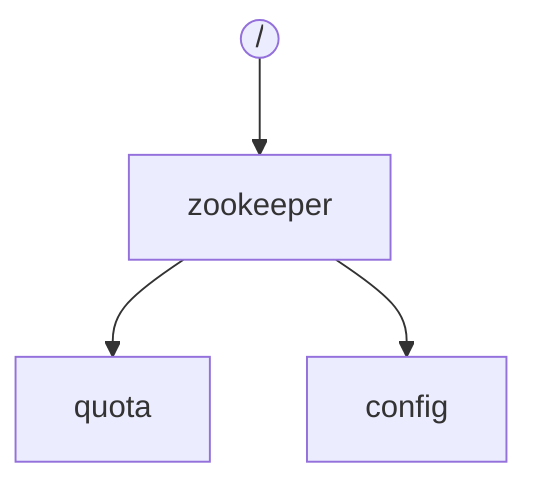
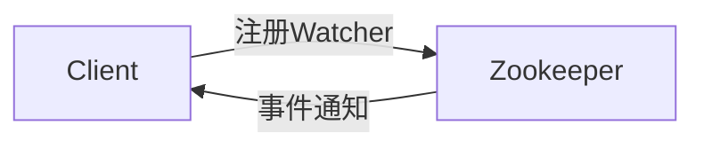

# Zookeeper原理与代码实例讲解

## 1. 背景介绍

### 1.1 问题的由来

在分布式系统中，服务化架构已经成为主流。随着业务规模的扩大，服务的数量和复杂度不断增加，如何有效地管理和协调这些服务成为一个重要的挑战。常见的挑战包括：

* **服务发现**:  服务提供者需要将自己注册到一个中心化的注册中心，服务消费者需要从注册中心获取可用的服务列表。
* **配置管理**:  分布式系统中存在大量的配置信息，如何保证配置信息的一致性和实时更新是一个难题。
* **主节点选举**:  某些服务需要选举出一个主节点来协调工作，如何保证主节点的唯一性和高可用性是一个挑战。
* **分布式锁**:  在分布式环境下实现互斥访问共享资源，需要一种可靠的分布式锁机制。

为了解决这些问题，Zookeeper应运而生。

### 1.2 研究现状

Zookeeper是一个开源的分布式协调服务，由雅虎研究院开发，是Google Chubby服务的开源实现。它提供了一套简单易用的接口，可以方便地实现服务发现、配置管理、主节点选举、分布式锁等功能。

Zookeeper采用树形数据结构来存储数据，每个节点称为znode，znode可以存储数据，也可以作为其他znode的父节点。Zookeeper使用Zab协议来保证数据的一致性，使用Watcher机制来实现事件通知。

目前，Zookeeper已经被广泛应用于各种分布式系统中，例如Hadoop、HBase、Kafka等。

### 1.3 研究意义

Zookeeper作为一款成熟的分布式协调服务，对于构建高可用、高性能的分布式系统具有重要的意义。深入理解Zookeeper的原理和使用方法，可以帮助我们更好地设计和开发分布式系统。

### 1.4 本文结构

本文将从以下几个方面详细介绍Zookeeper：

* **核心概念与联系**：介绍Zookeeper的核心概念，例如znode、Watcher、Zab协议等，并阐述它们之间的联系。
* **核心算法原理 & 具体操作步骤**：深入分析Zookeeper的核心算法原理，例如Zab协议、Watcher机制等，并结合具体的代码实例进行讲解。
* **数学模型和公式 & 详细讲解 & 举例说明**：使用数学模型和公式来描述Zookeeper的核心算法，并结合实际案例进行分析和讲解。
* **项目实践：代码实例和详细解释说明**：提供完整的代码实例，演示如何使用Zookeeper实现服务发现、配置管理、主节点选举、分布式锁等功能。
* **实际应用场景**：介绍Zookeeper在实际项目中的应用场景，例如Hadoop、HBase、Kafka等。
* **工具和资源推荐**：推荐一些学习Zookeeper的工具和资源，例如书籍、网站、开源项目等。
* **总结：未来发展趋势与挑战**：总结Zookeeper的优缺点，展望其未来发展趋势，并分析其面临的挑战。

## 2. 核心概念与联系

### 2.1 数据模型

Zookeeper采用树形数据结构来存储数据，每个节点称为znode。znode可以存储数据，也可以作为其他znode的父节点。



### 2.2 节点类型

Zookeeper中有四种类型的znode：

* **持久节点（PERSISTENT）**:  一旦创建，除非主动删除，否则一直存在。
* **临时节点（EPHEMERAL）**:  与客户端会话绑定，会话结束后自动删除。
* **持久顺序节点（PERSISTENT_SEQUENTIAL）**:  在持久节点的基础上，创建节点时会自动分配一个递增的序列号。
* **临时顺序节点（EPHEMERAL_SEQUENTIAL）**:  在临时节点的基础上，创建节点时会自动分配一个递增的序列号。

### 2.3 Watcher机制

Zookeeper提供了一种Watcher机制，客户端可以注册Watcher监听znode的变化，例如节点创建、节点删除、数据更新等。当znode发生变化时，Zookeeper会通知所有注册了Watcher的客户端。



### 2.4 Zab协议

Zookeeper使用Zab协议来保证数据的一致性。Zab协议是一种基于Paxos算法的崩溃恢复原子广播协议，它可以保证：

* **消息原子性**:  所有进程要么都接收到消息，要么都没有接收到消息。
* **消息顺序性**:  所有进程接收到消息的顺序一致。
* **领导者选举**:  当领导者崩溃时，可以快速选举出新的领导者。

## 3. 核心算法原理 & 具体操作步骤

### 3.1 Zab协议

Zab协议分为两个阶段：

* **领导者选举阶段**:  当Zookeeper集群启动时，或者领导者崩溃时，会触发领导者选举。
* **数据同步阶段**:  领导者被选举出来后，会将自己的数据同步给所有Follower，并接收Follower的数据更新请求。

#### 3.1.1 领导者选举阶段

Zab协议的领导者选举算法基于Epoch和ZXID：

* **Epoch**:  代表领导者的任期号，每次选举都会产生一个新的Epoch。
* **ZXID**:  代表事务ID，每个写请求都会分配一个唯一的ZXID。

领导者选举过程如下：

1. 每个服务器启动时，都处于LOOKING状态，并向其他服务器发送投票请求。
2. 服务器接收到投票请求后，比较自己的Epoch和ZXID与投票请求中的Epoch和ZXID：
    * 如果自己的Epoch更大，或者Epoch相同但ZXID更大，则投票给自己，并将自己的Epoch和ZXID发送给其他服务器。
    * 否则，投票给投票请求中的服务器，并更新自己的Epoch和ZXID。
3. 当一个服务器获得超过半数的投票时，成为领导者，并向其他服务器发送领导者通知。
4. 其他服务器接收到领导者通知后，更新自己的状态为FOLLOWING，并与领导者进行数据同步。

#### 3.1.2 数据同步阶段

领导者被选举出来后，会将自己的数据同步给所有Follower，并接收Follower的数据更新请求。

数据同步过程如下：

1. 领导者将未同步的事务记录发送给Follower。
2. Follower接收到事务记录后，写入本地磁盘，并发送ACK确认消息给领导者。
3. 领导者接收到超过半数的ACK确认消息后，提交事务，并将提交消息发送给Follower。
4. Follower接收到提交消息后，提交事务。

### 3.2 Watcher机制

Watcher机制的实现依赖于Zookeeper的客户端和服务器之间的长连接。

1. 客户端向Zookeeper服务器注册Watcher，并指定要监听的znode路径和事件类型。
2. Zookeeper服务器将Watcher信息存储在内存中。
3. 当znode发生变化时，Zookeeper服务器会触发相应的事件，并将事件通知发送给所有注册了该事件类型的Watcher的客户端。
4. 客户端接收到事件通知后，可以进行相应的处理。

### 3.3 算法优缺点

#### 3.3.1 Zab协议

**优点**:

* **高可用性**:  Zab协议可以容忍半数以内的服务器崩溃，保证了Zookeeper集群的高可用性。
* **数据一致性**:  Zab协议可以保证数据的一致性，所有客户端看到的都是一致的数据。

**缺点**:

* **性能瓶颈**:  Zab协议的性能瓶颈在于领导者，所有写请求都需要经过领导者处理。
* **脑裂问题**:  当网络发生分区时，可能会出现多个领导者的情况，导致数据不一致。

#### 3.3.2 Watcher机制

**优点**:

* **实时性**:  Watcher机制可以实时通知客户端znode的变化，保证了数据的实时性。
* **灵活性**:  客户端可以根据需要注册不同的Watcher，监听不同的事件类型。

**缺点**:

* **性能损耗**:  Watcher机制会增加Zookeeper服务器的负担，尤其是在Watcher数量很多的情况下。
* **事件丢失**:  当Zookeeper服务器发生故障时，可能会导致事件丢失。

### 3.4 算法应用领域

* **服务发现**:  Zookeeper可以作为服务注册中心，提供服务注册和发现功能。
* **配置管理**:  Zookeeper可以存储和管理配置信息，并提供配置信息的实时更新功能。
* **主节点选举**:  Zookeeper可以实现主节点选举，保证主节点的唯一性和高可用性。
* **分布式锁**:  Zookeeper可以实现分布式锁，保证在分布式环境下对共享资源的互斥访问。

## 4. 数学模型和公式 & 详细讲解 & 举例说明

### 4.1 Zab协议数学模型

Zab协议可以使用状态机模型来描述。

* **状态**:  每个服务器都有一个状态，例如LOOKING、FOLLOWING、LEADING。
* **消息**:  服务器之间通过消息进行通信，例如投票请求、投票响应、领导者通知、数据同步请求、数据同步响应等。
* **状态转移**:  服务器接收到消息后，会根据消息类型和当前状态进行状态转移。

### 4.2 公式推导过程

Zab协议的领导者选举算法可以使用数学公式来描述。

假设Zookeeper集群中有N个服务器，每个服务器的Epoch为Ei，ZXID为Zi。

**投票规则**:

* 服务器i投票给服务器j的条件是：Ej > Ei 或 (Ej == Ei and Zj > Zi)。

**领导者选举条件**:

* 服务器i成为领导者的条件是：获得超过半数(N/2 + 1)个服务器的投票。

### 4.3 案例分析与讲解

假设Zookeeper集群中有5个服务器，初始状态如下：

| 服务器 | Epoch | ZXID | 状态     |
| ------ | ----- | ---- | -------- |
| 1       | 0     | 0    | LOOKING |
| 2       | 0     | 0    | LOOKING |
| 3       | 0     | 0    | LOOKING |
| 4       | 0     | 0    | LOOKING |
| 5       | 0     | 0    | LOOKING |

**领导者选举过程**:

1. 所有服务器都处于LOOKING状态，并向其他服务器发送投票请求。
2. 服务器1接收到其他服务器的投票请求后，比较Epoch和ZXID，发现自己的Epoch和ZXID都是最小的，因此投票给其他服务器。
3. 服务器2、3、4、5也进行相同的操作，最终所有服务器都投票给了服务器5。
4. 服务器5获得5票，超过半数，成为领导者，并向其他服务器发送领导者通知。
5. 其他服务器接收到领导者通知后，更新自己的状态为FOLLOWING，并与领导者进行数据同步。

### 4.4 常见问题解答

**1. Zookeeper如何保证数据的一致性？**

Zookeeper使用Zab协议来保证数据的一致性。Zab协议是一种基于Paxos算法的崩溃恢复原子广播协议，它可以保证消息原子性、消息顺序性和领导者选举。

**2. Zookeeper的Watcher机制是如何实现的？**

Watcher机制的实现依赖于Zookeeper的客户端和服务器之间的长连接。客户端向Zookeeper服务器注册Watcher，当znode发生变化时，Zookeeper服务器会通知所有注册了Watcher的客户端。

**3. Zookeeper有哪些应用场景？**

Zookeeper可以用于服务发现、配置管理、主节点选举、分布式锁等场景。

## 5. 项目实践：代码实例和详细解释说明

### 5.1 开发环境搭建

* JDK 1.8+
* Zookeeper 3.4.x+

### 5.2 源代码详细实现

#### 5.2.1 创建Zookeeper客户端

```java
import org.apache.zookeeper.*;

public class ZookeeperClient {

    private ZooKeeper zk;

    public ZookeeperClient(String connectString) throws Exception {
        zk = new ZooKeeper(connectString, 3000, new Watcher() {
            @Override
            public void process(WatchedEvent event) {
                System.out.println("事件类型：" + event.getType());
                System.out.println("事件路径：" + event.getPath());
            }
        });
    }

    // ...
}
```

#### 5.2.2 创建节点

```java
    public void createNode(String path, String data) throws Exception {
        zk.create(path, data.getBytes(), ZooDefs.Ids.OPEN_ACL_UNSAFE, CreateMode.PERSISTENT);
    }
```

#### 5.2.3 获取节点数据

```java
    public String getNodeData(String path) throws Exception {
        byte[] data = zk.getData(path, false, null);
        return new String(data);
    }
```

#### 5.2.4 更新节点数据

```java
    public void updateNodeData(String path, String data) throws Exception {
        zk.setData(path, data.getBytes(), -1);
    }
```

#### 5.2.5 删除节点

```java
    public void deleteNode(String path) throws Exception {
        zk.delete(path, -1);
    }
```

### 5.3 代码解读与分析

* `ZooKeeper`类是Zookeeper客户端的核心类，用于连接Zookeeper服务器并进行操作。
* `create()`方法用于创建节点，`getData()`方法用于获取节点数据，`setData()`方法用于更新节点数据，`delete()`方法用于删除节点。
* `Watcher`接口用于监听znode的变化，`process()`方法会在znode发生变化时被调用。

### 5.4 运行结果展示

```
事件类型：NodeCreated
事件路径：/test
```

## 6. 实际应用场景

### 6.1 服务发现

Zookeeper可以作为服务注册中心，提供服务注册和发现功能。

* 服务提供者启动时，将自己的IP地址和端口号注册到Zookeeper的指定路径下。
* 服务消费者启动时，从Zookeeper的指定路径下获取可用的服务列表。
* 当服务提供者宕机时，Zookeeper会通知服务消费者更新服务列表。

### 6.2 配置管理

Zookeeper可以存储和管理配置信息，并提供配置信息的实时更新功能。

* 将配置信息存储到Zookeeper的指定路径下。
* 应用程序启动时，从Zookeeper的指定路径下读取配置信息。
* 当配置信息发生变化时，Zookeeper会通知应用程序更新配置信息。

### 6.3 主节点选举

Zookeeper可以实现主节点选举，保证主节点的唯一性和高可用性。

* 所有节点都尝试在Zookeeper的指定路径下创建临时节点。
* 创建成功的节点成为主节点。
* 当主节点宕机时，临时节点会被删除，其他节点会重新进行选举。

### 6.4 分布式锁

Zookeeper可以实现分布式锁，保证在分布式环境下对共享资源的互斥访问。

* 获取锁时，在Zookeeper的指定路径下创建临时节点。
* 创建成功的节点获得锁。
* 释放锁时，删除临时节点。

## 7. 工具和资源推荐

### 7.1 学习资源推荐

* 《ZooKeeper: Distributed Process Coordination》
* 《从Paxos到Zookeeper: 分布式一致性原理与实践》

### 7.2 开发工具推荐

* IntelliJ IDEA
* Eclipse

### 7.3 相关论文推荐

* Zab: High-performance broadcast for primary-backup systems
* Paxos Made Simple

### 7.4 其他资源推荐

* Zookeeper官网: https://zookeeper.apache.org/

## 8. 总结：未来发展趋势与挑战

### 8.1 研究成果总结

Zookeeper作为一款成熟的分布式协调服务，已经被广泛应用于各种分布式系统中。它提供了一套简单易用的接口，可以方便地实现服务发现、配置管理、主节点选举、分布式锁等功能。

### 8.2 未来发展趋势

* **云原生支持**:  随着云计算的普及，Zookeeper需要更好地支持云原生环境，例如提供容器化部署、自动伸缩等功能。
* **性能优化**:  随着数据规模的增大，Zookeeper的性能瓶颈越来越明显，需要进一步优化性能，例如采用更高效的算法、优化网络通信等。
* **安全性增强**:  Zookeeper存储着重要的数据，需要进一步增强安全性，例如采用更安全的认证和授权机制、加密数据传输等。

### 8.3 面临的挑战

* **数据一致性**:  在分布式环境下，保证数据的一致性是一个挑战，Zookeeper需要不断优化Zab协议，提高数据一致性的可靠性。
* **性能瓶颈**:  Zab协议的性能瓶颈在于领导者，所有写请求都需要经过领导者处理，需要探索更高效的算法来解决性能瓶颈问题。
* **运维成本**:  Zookeeper集群的运维成本较高，需要专业的运维人员来维护，需要探索更简便的运维方式。

### 8.4 研究展望

随着分布式系统的发展，Zookeeper将会面临更多的挑战和机遇。相信通过不断的技术创新和发展，Zookeeper将会在未来继续发挥重要作用。


作者：禅与计算机程序设计艺术 / Zen and the Art of Computer Programming 
