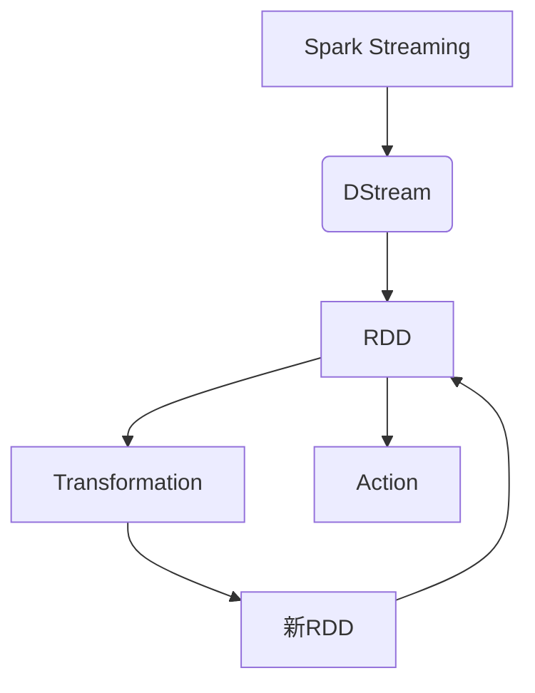

好的,我会严格遵循您提供的约束条件,以"Spark Streaming"为主题,撰写一篇专业的技术博客文章。

# 【AI大数据计算原理与代码实例讲解】Spark Streaming

## 1. 背景介绍

### 1.1 问题的由来

在当今大数据时代,海量的数据不断产生,如何高效地处理这些连续不断的数据流成为了一个迫切的需求。传统的批处理系统如Apache Hadoop虽然可以处理静态的大数据集,但对于实时数据流却无能为力。为了解决这一问题,流式计算应运而生。

### 1.2 研究现状  

Apache Spark作为一种新型的大数据处理框架,提供了Spark Streaming这一流式计算组件,支持实时流数据的处理。Spark Streaming将流数据切分为一系列的小批次,使用Spark的RDD(Resilient Distributed Dataset)模型进行分布式计算,从而实现了高吞吐量、低延迟的流式计算。

### 1.3 研究意义

掌握Spark Streaming不仅可以让我们充分利用实时数据的价值,如实时监控、实时预测等,更能让我们深入理解流式计算的设计思想和实现原理,为后续的大数据系统设计和优化奠定坚实基础。

### 1.4 本文结构

本文将首先介绍Spark Streaming的核心概念,然后深入探讨其算法原理和数学模型,并结合代码实例进行详细讲解。最后,我们将分析Spark Streaming在实际应用中的场景,并对其未来发展趋势和面临的挑战进行展望。

## 2. 核心概念与联系



Spark Streaming的核心抽象是离散流(Discretized Stream)或DStream,它是一个连续的数据流按照其到达的时间被分割为一系列的小批次。每个批次都被存储为Spark中的RDD(Resilient Distributed Dataset),RDD支持两种操作:Transformation(转换)和Action(动作)。

- Transformation会生成一个新的RDD
- Action会对RDD进行计算并输出结果

DStream通过对底层的RDD执行Transformation和Action操作,实现了对流数据的处理。

## 3. 核心算法原理 & 具体操作步骤  

### 3.1 算法原理概述

Spark Streaming的核心算法思想是"微批次计算"。它将连续的数据流按照时间切分为一系列的小批次,每个批次内的数据使用RDD进行并行处理,从而实现了流式计算。

算法的关键步骤包括:

1. 从数据源获取输入数据流
2. 将数据流切分成一系列小批次
3. 对每个批次中的数据创建一个RDD
4. 对RDD执行Spark计算(Transformation和Action)
5. 输出计算结果

### 3.2 算法步骤详解

1. **获取输入数据流**

Spark Streaming可以从多种数据源获取输入流,如Kafka、Flume、HDFS等。开发者需要创建一个输入DStream来表示这个数据流。

```scala
val lines = ssc.socketTextStream("localhost", 9999)
```

2. **切分数据流为批次**

Spark Streaming使用一个批次间隔(batchInterval)参数来设置批次的时间间隔。在这个时间间隔内到达的数据会被当作一个批次进行处理。

```scala
// 每2秒切分一个批次
val batchInterval = Seconds(2)
val lines = ssc.socketTextStream("localhost", 9999, StorageLevel.MEMORY_AND_DISK_SER_2).window(batchInterval)  
```

3. **创建RDD并执行Spark计算**

对于每个批次,Spark Streaming会创建一个RDD,并对其执行Transformation和Action操作。

```scala
val words = lines.flatMap(_.split(" "))
val pairs = words.map(word => (word, 1))
val wordCounts = pairs.reduceByKey(_ + _)

wordCounts.print()
```

4. **输出结果**

计算结果可以输出到文件系统、数据库或控制台等。

### 3.3 算法优缺点

**优点:**

- 吞吐量高:Spark的RDD模型支持高效的并行计算
- 低延迟:微批次计算模式可以提供近乎实时的处理能力
- 容错性强:RDD的容错机制确保了计算过程的可靠性
- 易于编程:基于Spark的RDD API,开发人员可以轻松编写流式计算程序

**缺点:**

- 微批处理的延迟:虽然比批处理系统有了很大改善,但仍存在一定的延迟
- 状态管理复杂:对于有状态的流式计算,需要手动管理状态,增加了编程复杂度
- 资源占用较高:Spark本身对内存和CPU的资源占用较高

### 3.4 算法应用领域

Spark Streaming广泛应用于以下领域:

- 实时数据分析:金融交易监控、网站用户行为分析等
- 实时机器学习:推荐系统、实时预测等
- 实时数据处理:日志收集、消息队列等
- 传感器数据处理:物联网、智能交通等

## 4. 数学模型和公式 & 详细讲解 & 举例说明

### 4.1 数学模型构建

我们将数据流建模为一个无限序列:

$$D = \{d_1, d_2, d_3, \ldots\}$$

其中$d_i$表示第i个数据元素。

Spark Streaming将这个无限序列切分为一系列批次:

$$B = \{B_1, B_2, B_3, \ldots\}$$

其中$B_i$是一个RDD,表示第i个批次,包含了$[t_i, t_{i+1})$时间段内到达的数据。

在批次$B_i$上执行计算$f$:

$$y_i = f(B_i)$$

则最终的输出序列为:

$$Y = \{y_1, y_2, y_3, \ldots\}$$

### 4.2 公式推导过程

假设我们要对一个文本数据流进行单词计数。首先,我们从输入流$D$中提取出所有单词:

$$W = \{w_1, w_2, w_3, \ldots\}$$

其中$w_i$表示第i个单词。

然后,我们将单词序列$W$划分为批次:

$$W_B = \{W_{B_1}, W_{B_2}, W_{B_3}, \ldots\}$$

其中$W_{B_i}$包含了批次$B_i$中的所有单词。

对于每个批次$W_{B_i}$,我们执行单词计数操作$count$:

$$C_i = count(W_{B_i})$$

其中$C_i$是一个(word, count)对的集合,表示该批次中每个单词的计数。

最终的输出序列为:

$$C = \{C_1, C_2, C_3, \ldots\}$$

### 4.3 案例分析与讲解

让我们以一个简单的例子来说明单词计数的过程。假设输入数据流为:

```
D = {"Apache Spark is great", "Spark Streaming is awesome", "Learn Spark Streaming"}
```

我们以2秒为批次间隔,对这个数据流进行单词计数。

1) 第一个批次(0-2秒):

```
B1 = {"Apache Spark is great"}
W_{B1} = {"Apache", "Spark", "is", "great"}
C1 = count(W_{B1}) = {"Apache": 1, "Spark": 1, "is": 1, "great": 1}
```

2) 第二个批次(2-4秒):

```
B2 = {"Spark Streaming is awesome"} 
W_{B2} = {"Spark", "Streaming", "is", "awesome"}
C2 = count(W_{B2}) = {"Spark": 1, "Streaming": 1, "is": 1, "awesome": 1}
```

3) 第三个批次(4-6秒):

```
B3 = {"Learn Spark Streaming"}
W_{B3} = {"Learn", "Spark", "Streaming"} 
C3 = count(W_{B3}) = {"Learn": 1, "Spark": 1, "Streaming": 1}
```

最终的输出序列为:

$$C = \{C_1, C_2, C_3\}$$
$$  = \{{"Apache": 1, "Spark": 1, "is": 1, "great": 1},$$
$$    \quad {"Spark": 1, "Streaming": 1, "is": 1, "awesome": 1},$$
$$    \quad {"Learn": 1, "Spark": 1, "Streaming": 1}\}$$

### 4.4 常见问题解答

**Q: Spark Streaming是否真正实现了流式计算?**

A: 严格来说,Spark Streaming并没有实现真正的流式计算,而是采用了微批次计算的方式。它将连续的数据流切分成一系列小批次,每个批次内的数据使用Spark的RDD模型进行分布式计算。这种方式虽然无法做到完全的实时计算,但可以提供近乎实时的低延迟处理能力。

**Q: 如何选择合适的批次间隔?**

A: 批次间隔的选择需要权衡延迟和吞吐量。较小的批次间隔可以提供更低的延迟,但会增加系统的开销;较大的批次间隔则可以提高吞吐量,但延迟会增加。通常需要根据具体应用场景和数据量进行测试,选择一个合适的批次间隔。

**Q: Spark Streaming如何保证容错性?**

A: Spark Streaming利用了Spark的RDD容错机制。当某个节点出现故障时,Spark可以根据RDD的血统重新计算出故障节点的数据分区。此外,Spark Streaming还提供了检查点机制,可以将已经计算过的RDD持久化到存储系统中,避免重新计算。

## 5. 项目实践:代码实例和详细解释说明

### 5.1 开发环境搭建

1. 安装Java 8
2. 下载Spark 2.4.5版本: https://spark.apache.org/downloads.html
3. 解压Spark压缩包
4. 设置SPARK_HOME环境变量指向Spark根目录

### 5.2 源代码详细实现

```scala
import org.apache.spark.SparkConf
import org.apache.spark.streaming.{Seconds, StreamingContext}

object NetworkWordCount {
  def main(args: Array[String]): Unit = {
    // 创建SparkConf
    val conf = new SparkConf().setMaster("local[2]").setAppName("NetworkWordCount")
    
    // 创建StreamingContext
    val ssc = new StreamingContext(conf, Seconds(2))
    
    // 创建DStream
    val lines = ssc.socketTextStream("localhost", 9999)
    val words = lines.flatMap(_.split(" "))
    
    // 单词计数
    val pairs = words.map(word => (word, 1))
    val wordCounts = pairs.reduceByKey(_ + _)

    // 输出结果
    wordCounts.print()

    // 启动计算
    ssc.start()
    ssc.awaitTermination()
  }
}
```

1. 首先,我们创建一个SparkConf对象,设置master URL为"local[2]"(本地模式,使用2个线程)。
2. 使用SparkConf创建StreamingContext对象,设置批次间隔为2秒。
3. 通过ssc.socketTextStream创建一个DStream对象lines,表示从localhost:9999获取的文本数据流。
4. 对lines执行flatMap操作,将每一行拆分为单词,得到一个新的DStream words。
5. 对words执行map操作,将每个单词映射为(word, 1)对,得到pairs DStream。
6. 对pairs执行reduceByKey操作,对每个key(单词)的值(计数)进行求和,得到wordCounts DStream。
7. 调用wordCounts.print()将计算结果输出到控制台。
8. 调用ssc.start()启动Spark Streaming计算,ssc.awaitTermination()等待计算结束。

### 5.3 代码解读与分析  

1. **SparkConf和StreamingContext**

SparkConf用于配置Spark应用程序的运行环境,如设置master URL、应用名称等。StreamingContext是Spark Streaming的入口点,需要指定批次间隔。

2. **DStream操作**

- lines = ssc.socketTextStream(...): 创建DStream对象lines,表示从socket获取的文本数据流。
- words = lines.flatMap(_.split(" ")): 对lines执行flatMap操作,将每一行拆分为单词序列,得到words DStream。
- pairs = words.map(word => (word, 1)): 对words执行map操作,将每个单词映射为(word, 1)对,得到pairs DStream。
- wordCounts = pairs.reduceByKey(_ + _): 对pairs执行reduceByKey操作,对每个key(单词)的值(计数)进行求和,得到wor