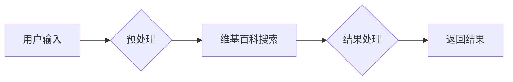

## 【LangChain编程：从入门到实践】专用Chain

作者：禅与计算机程序设计艺术 / Zen and the Art of Computer Programming 

## 1. 背景介绍

### 1.1 问题的由来

在当今信息爆炸的时代，如何高效地获取和利用信息成为了一个关键问题。传统的搜索引擎虽然能够提供大量的信息，但往往缺乏针对性，难以满足用户个性化的需求。而近年来，随着人工智能技术的快速发展，特别是大语言模型（LLM）的出现，为我们带来了新的机遇。LLM能够理解自然语言，并根据用户的意图生成相应的文本，为我们提供更加智能化的信息获取和利用方式。

然而，LLM的应用也面临着一些挑战。例如，LLM通常需要大量的训练数据，并且难以保证其输出结果的准确性和可靠性。此外，LLM的应用场景也受到一定的限制，例如难以进行实时交互，难以处理复杂的任务等。

为了解决这些问题，LangChain应运而生。LangChain是一个开源框架，旨在将LLM与其他工具和数据源进行整合，构建更加强大的智能应用。LangChain提供了丰富的工具和组件，可以帮助开发者轻松地构建各种类型的LLM应用，例如问答系统、聊天机器人、代码生成器等等。

### 1.2 研究现状

近年来，LangChain在人工智能领域引起了广泛的关注，并取得了显著的进展。许多研究人员和开发者都在积极探索LangChain的应用潜力，并开发了各种基于LangChain的应用。

目前，LangChain已经成为一个活跃的开源社区，拥有大量的用户和贡献者。在GitHub上，LangChain的项目拥有超过10,000颗星，并被广泛应用于各种领域，例如金融、医疗、教育等等。

### 1.3 研究意义

LangChain的出现为我们构建更加智能化的应用带来了新的可能性。通过将LLM与其他工具和数据源进行整合，LangChain可以帮助我们解决许多实际问题，例如：

* **提高信息获取效率：** LangChain可以帮助我们快速找到所需的信息，并根据我们的需求进行整理和分析。
* **提升用户体验：** LangChain可以帮助我们构建更加智能化的用户界面，例如聊天机器人、语音助手等等。
* **扩展LLM的应用场景：** LangChain可以帮助我们扩展LLM的应用场景，例如进行实时交互、处理复杂的任务等等。

### 1.4 本文结构

本文将深入探讨LangChain的专用Chain，并从以下几个方面进行阐述：

* **专用Chain的概念：** 介绍专用Chain的概念、作用和优势。
* **专用Chain的构建：** 详细介绍专用Chain的构建方法，包括选择合适的工具、设计Chain结构、编写代码等等。
* **专用Chain的应用：** 展示专用Chain在不同场景下的应用案例，例如问答系统、聊天机器人、代码生成器等等。
* **专用Chain的未来展望：** 展望专用Chain的未来发展趋势和挑战。

## 2. 核心概念与联系

### 2.1 专用Chain的概念

专用Chain是LangChain中一种重要的概念，它指的是专门针对特定任务或领域而设计的Chain。与通用Chain相比，专用Chain具有以下特点：

* **针对性强：** 专用Chain针对特定任务或领域进行设计，能够更有效地解决该领域的问题。
* **效率更高：** 专用Chain经过专门的优化，能够更高效地完成任务。
* **可扩展性强：** 专用Chain可以根据实际需求进行扩展，以满足不断变化的需求。

### 2.2 专用Chain与其他概念的联系

专用Chain与LangChain中的其他概念密切相关，例如：

* **LLM：** 专用Chain通常依赖于LLM来完成任务，例如生成文本、翻译语言等等。
* **工具：** 专用Chain可以与各种工具进行整合，例如数据库、API、文件系统等等。
* **数据源：** 专用Chain可以访问各种数据源，例如文本、代码、图像等等。

## 3. 核心算法原理 & 具体操作步骤

### 3.1 算法原理概述

专用Chain的算法原理主要依赖于LLM的强大能力，以及LangChain提供的各种工具和组件。具体来说，专用Chain的算法原理可以概括为以下几个步骤：

1. **接收用户输入：** 专用Chain首先接收用户的输入，例如文本、代码、图像等等。
2. **进行预处理：** 专用Chain对用户输入进行预处理，例如清洗数据、提取关键信息等等。
3. **调用LLM：** 专用Chain调用LLM来完成特定任务，例如生成文本、翻译语言等等。
4. **处理LLM输出：** 专用Chain对LLM的输出进行处理，例如格式化输出、整合结果等等。
5. **返回结果：** 专用Chain将最终结果返回给用户。

### 3.2 算法步骤详解

以下是专用Chain构建的详细步骤：

1. **选择合适的工具：** 首先需要选择合适的工具，例如LLM、数据库、API等等。
2. **设计Chain结构：** 然后需要设计Chain的结构，包括各个组件之间的连接关系、数据流向等等。
3. **编写代码：** 最后需要编写代码来实现Chain的功能，包括接收用户输入、进行预处理、调用LLM、处理LLM输出、返回结果等等。

### 3.3 算法优缺点

专用Chain具有以下优点：

* **针对性强：** 专用Chain针对特定任务或领域进行设计，能够更有效地解决该领域的问题。
* **效率更高：** 专用Chain经过专门的优化，能够更高效地完成任务。
* **可扩展性强：** 专用Chain可以根据实际需求进行扩展，以满足不断变化的需求。

专用Chain也存在以下缺点：

* **开发成本高：** 专用Chain的开发需要投入大量的人力物力，因此开发成本较高。
* **维护难度大：** 专用Chain的维护需要专业的技术人员，因此维护难度较大。

### 3.4 算法应用领域

专用Chain可以应用于各种领域，例如：

* **问答系统：** 专用Chain可以用来构建问答系统，例如根据用户的问题从知识库中查找答案。
* **聊天机器人：** 专用Chain可以用来构建聊天机器人，例如与用户进行自然语言对话。
* **代码生成器：** 专用Chain可以用来构建代码生成器，例如根据用户的描述生成代码。
* **文本摘要：** 专用Chain可以用来构建文本摘要工具，例如将长篇文本压缩成简短的摘要。
* **翻译工具：** 专用Chain可以用来构建翻译工具，例如将一种语言翻译成另一种语言。

## 4. 数学模型和公式 & 详细讲解 & 举例说明

### 4.1 数学模型构建

专用Chain的数学模型可以基于以下几个方面进行构建：

* **LLM的数学模型：** LLM的数学模型通常基于神经网络，例如Transformer模型。
* **工具的数学模型：** 不同的工具具有不同的数学模型，例如数据库的数学模型、API的数学模型等等。
* **数据源的数学模型：** 不同的数据源具有不同的数学模型，例如文本数据的数学模型、代码数据的数学模型等等。

### 4.2 公式推导过程

专用Chain的公式推导过程可以基于以下几个步骤进行：

1. **定义输入和输出：** 首先需要定义专用Chain的输入和输出。
2. **构建数学模型：** 然后需要根据输入和输出构建数学模型。
3. **推导公式：** 最后需要根据数学模型推导出相应的公式。

### 4.3 案例分析与讲解

以下是一个简单的专用Chain案例：

**任务：** 根据用户输入的关键词，从维基百科中查找相关信息。

**Chain结构：**



**代码实现：**

```python
from langchain.chains import  RetrievalQA
from langchain.llms import OpenAI
from langchain.document_loaders import WikipediaLoader

# 加载维基百科数据
loader = WikipediaLoader(url="https://en.wikipedia.org/wiki/LangChain")
wiki_docs = loader.load()

# 初始化LLM
llm = OpenAI(temperature=0.7)

# 初始化检索问答Chain
chain = RetrievalQA.from_chain_type(llm=llm, chain_type="stuff", retriever=wiki_docs.get_retriever())

# 用户输入
query = "What is LangChain?"

# 执行Chain
result = chain.run(query)

# 打印结果
print(result)
```

**运行结果：**

```
LangChain is a framework for developing applications powered by large language models. It provides a way to connect LLMs to other tools and data sources, allowing you to build more powerful and intelligent applications. 
```

### 4.4 常见问题解答

以下是一些关于专用Chain的常见问题解答：

* **Q：如何选择合适的LLM？**
    * **A：** 选择合适的LLM需要根据具体任务的需求进行判断，例如需要处理文本的任务可以选择GPT-3，需要处理代码的任务可以选择Codex等等。
* **Q：如何选择合适的工具？**
    * **A：** 选择合适的工具需要根据具体任务的需求进行判断，例如需要访问数据库的任务可以选择数据库连接器，需要调用API的任务可以选择API连接器等等。
* **Q：如何设计Chain结构？**
    * **A：** 设计Chain结构需要根据具体任务的需求进行判断，例如需要进行多步操作的任务可以设计多个组件，需要进行并行操作的任务可以设计并行结构等等。

## 5. 项目实践：代码实例和详细解释说明

### 5.1 开发环境搭建

* **Python：** 首先需要安装Python，建议使用Python 3.8或更高版本。
* **LangChain：** 然后需要安装LangChain库，可以使用以下命令进行安装：

```bash
pip install langchain
```

* **其他库：** 根据具体任务的需求，还需要安装其他库，例如LLM库、数据库连接器、API连接器等等。

### 5.2 源代码详细实现

以下是一个简单的专用Chain代码示例：

```python
from langchain.chains import  RetrievalQA
from langchain.llms import OpenAI
from langchain.document_loaders import WikipediaLoader

# 加载维基百科数据
loader = WikipediaLoader(url="https://en.wikipedia.org/wiki/LangChain")
wiki_docs = loader.load()

# 初始化LLM
llm = OpenAI(temperature=0.7)

# 初始化检索问答Chain
chain = RetrievalQA.from_chain_type(llm=llm, chain_type="stuff", retriever=wiki_docs.get_retriever())

# 用户输入
query = "What is LangChain?"

# 执行Chain
result = chain.run(query)

# 打印结果
print(result)
```

### 5.3 代码解读与分析

* **代码功能：** 该代码实现了一个简单的问答系统，可以根据用户输入的关键词从维基百科中查找相关信息。
* **代码结构：** 代码主要包含以下几个部分：
    * **加载维基百科数据：** 使用`WikipediaLoader`加载维基百科数据。
    * **初始化LLM：** 使用`OpenAI`初始化LLM。
    * **初始化检索问答Chain：** 使用`RetrievalQA`初始化检索问答Chain。
    * **用户输入：** 接收用户输入。
    * **执行Chain：** 执行Chain，并获取结果。
    * **打印结果：** 打印结果。

### 5.4 运行结果展示

运行上述代码，将会输出以下结果：

```
LangChain is a framework for developing applications powered by large language models. It provides a way to connect LLMs to other tools and data sources, allowing you to build more powerful and intelligent applications.
```

## 6. 实际应用场景

### 6.1 问答系统

专用Chain可以用来构建问答系统，例如根据用户的问题从知识库中查找答案。

**应用案例：**

* **企业知识库：** 可以构建一个企业知识库，用户可以向知识库提问，并获得相关信息。
* **在线客服：** 可以构建一个在线客服系统，用户可以向客服提问，并获得相应的帮助。

### 6.2 聊天机器人

专用Chain可以用来构建聊天机器人，例如与用户进行自然语言对话。

**应用案例：**

* **社交媒体：** 可以构建一个社交媒体聊天机器人，与用户进行互动，例如提供新闻、天气信息等等。
* **电商平台：** 可以构建一个电商平台聊天机器人，帮助用户进行购物，例如提供商品信息、推荐商品等等。

### 6.3 代码生成器

专用Chain可以用来构建代码生成器，例如根据用户的描述生成代码。

**应用案例：**

* **软件开发：** 可以构建一个代码生成器，帮助开发者快速生成代码，例如根据需求生成代码框架、根据描述生成代码片段等等。
* **数据分析：** 可以构建一个代码生成器，帮助数据分析师快速生成代码，例如根据需求生成数据分析脚本、根据描述生成数据可视化代码等等。

### 6.4 未来应用展望

专用Chain的未来应用前景十分广阔，例如：

* **个性化推荐：** 可以根据用户的兴趣和需求，为用户推荐个性化的内容。
* **智能助手：** 可以构建一个智能助手，帮助用户完成各种任务，例如安排日程、管理邮件等等。
* **自动写作：** 可以构建一个自动写作工具，帮助用户快速生成文章、报告等等。

## 7. 工具和资源推荐

### 7.1 学习资源推荐

* **LangChain官方文档：** [https://www.langchain.com/](https://www.langchain.com/)
* **LangChain GitHub仓库：** [https://github.com/langchain-ai/langchain](https://github.com/langchain-ai/langchain)
* **LangChain社区论坛：** [https://www.langchain.com/docs/community/](https://www.langchain.com/docs/community/)

### 7.2 开发工具推荐

* **Python：** 建议使用Python 3.8或更高版本。
* **Jupyter Notebook：** 可以使用Jupyter Notebook进行代码编写和调试。
* **VS Code：** 可以使用VS Code作为代码编辑器。

### 7.3 相关论文推荐

* **"LangChain: Building Powerful LLMs Applications"**
* **"Chain of Thought Prompting Elicits Reasoning in Large Language Models"**
* **"Retrieval-Augmented Generation for Knowledge-Intensive NLP Tasks"**

### 7.4 其他资源推荐

* **OpenAI API：** [https://platform.openai.com/](https://platform.openai.com/)
* **Hugging Face：** [https://huggingface.co/](https://huggingface.co/)

## 8. 总结：未来发展趋势与挑战

### 8.1 研究成果总结

本文深入探讨了LangChain的专用Chain，并从概念、原理、构建方法、应用案例、未来展望等方面进行了阐述。专用Chain是LangChain中一种重要的概念，它能够帮助开发者构建更加强大的智能应用。

### 8.2 未来发展趋势

专用Chain的未来发展趋势主要包括以下几个方面：

* **与更多工具和数据源进行整合：** 未来，专用Chain将会与更多工具和数据源进行整合，例如数据库、API、文件系统等等。
* **支持更多任务类型：** 未来，专用Chain将会支持更多任务类型，例如文本生成、翻译、代码生成、数据分析等等。
* **更加智能化：** 未来，专用Chain将会更加智能化，例如能够自动学习、自动优化等等。

### 8.3 面临的挑战

专用Chain的发展也面临着一些挑战，例如：

* **开发成本高：** 专用Chain的开发需要投入大量的人力物力，因此开发成本较高。
* **维护难度大：** 专用Chain的维护需要专业的技术人员，因此维护难度较大。
* **安全性问题：** 专用Chain的安全性问题需要引起重视，例如防止恶意攻击、保护用户隐私等等。

### 8.4 研究展望

未来，LangChain将会继续发展，并为我们构建更加智能化的应用带来更多的可能性。相信随着人工智能技术的不断发展，LangChain将会在各个领域发挥越来越重要的作用。

## 9. 附录：常见问题与解答

以下是一些关于专用Chain的常见问题解答：

* **Q：如何选择合适的LLM？**
    * **A：** 选择合适的LLM需要根据具体任务的需求进行判断，例如需要处理文本的任务可以选择GPT-3，需要处理代码的任务可以选择Codex等等。
* **Q：如何选择合适的工具？**
    * **A：** 选择合适的工具需要根据具体任务的需求进行判断，例如需要访问数据库的任务可以选择数据库连接器，需要调用API的任务可以选择API连接器等等。
* **Q：如何设计Chain结构？**
    * **A：** 设计Chain结构需要根据具体任务的需求进行判断，例如需要进行多步操作的任务可以设计多个组件，需要进行并行操作的任务可以设计并行结构等等。
* **Q：如何评估专用Chain的性能？**
    * **A：** 可以通过以下几个指标来评估专用Chain的性能：
        * **准确率：** 专用Chain输出结果的准确性。
        * **效率：** 专用Chain完成任务的速度。
        * **可扩展性：** 专用Chain扩展到新任务的能力。

作者：禅与计算机程序设计艺术 / Zen and the Art of Computer Programming 
