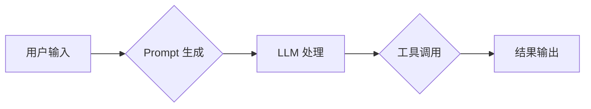

## 1. 背景介绍

### 1.1  问题的由来

随着人工智能技术的不断发展，大语言模型（LLM）在各个领域展现出强大的能力，如文本生成、问答系统、代码生成等。然而，LLM 的应用往往需要与外部数据和工具进行交互，才能实现更复杂的功能。例如，我们需要将 LLM 与数据库、API、文件系统等进行集成，才能让 LLM 更好地理解和处理现实世界中的信息。

LangChain 应运而生，它是一个用于构建 LLM 应用的框架，可以轻松地将 LLM 与各种数据源和工具连接起来，从而构建更强大、更实用的 AI 应用。

### 1.2  研究现状

目前，LangChain 已经成为构建 LLM 应用的热门选择，并得到了广泛的应用。它提供了丰富的组件和工具，可以满足各种应用场景的需求。

**LangChain 的主要特点包括：**

* **模块化设计：**LangChain 将 LLM 应用的各个组件抽象成模块，方便用户进行组合和扩展。
* **易于使用：**LangChain 提供了简洁易懂的 API，方便用户快速上手。
* **灵活可扩展：**LangChain 支持多种 LLM 和数据源，可以根据实际需求进行定制。
* **丰富的功能：**LangChain 提供了各种功能，包括数据检索、文本生成、问答系统、代码生成等。

### 1.3  研究意义

LangChain 的出现，为构建 LLM 应用提供了一种全新的思路，它可以帮助开发者更方便、更高效地构建 LLM 应用，并推动 LLM 技术在各个领域的应用。

### 1.4  本文结构

本文将从以下几个方面介绍 LangChain 编程：

1. **核心概念与联系：**介绍 LangChain 的核心概念和关键组件。
2. **核心算法原理 & 具体操作步骤：**介绍 LangChain 的工作原理和使用方法。
3. **数学模型和公式 & 详细讲解 & 举例说明：**介绍 LangChain 的数学模型和公式，并通过实例进行讲解。
4. **项目实践：代码实例和详细解释说明：**通过实际代码示例，展示 LangChain 的应用。
5. **实际应用场景：**介绍 LangChain 在不同领域的应用场景。
6. **工具和资源推荐：**推荐一些与 LangChain 相关的工具和资源。
7. **总结：未来发展趋势与挑战：**总结 LangChain 的未来发展趋势和面临的挑战。
8. **附录：常见问题与解答：**解答一些常见的关于 LangChain 的问题。

## 2. 核心概念与联系

LangChain 的核心概念是将 LLM 与各种数据源和工具连接起来，构建更强大的 AI 应用。它主要由以下几个关键组件组成：

* **Chains：**Chains 是 LangChain 的核心组件，它将不同的组件组合在一起，形成一个完整的 LLM 应用。
* **Models：**Models 代表 LLM，例如 OpenAI 的 GPT-3、Google 的 PaLM 等。
* **Prompts：**Prompts 是用于向 LLM 提供指令和信息的文本。
* **Tools：**Tools 是用于与外部数据源和工具进行交互的组件。
* **Memory：**Memory 用于存储 LLM 的对话历史记录，以便 LLM 能够更好地理解上下文。
* **Agents：**Agents 是用于自动执行任务的组件，它可以根据用户的指令选择合适的工具来完成任务。

## 3. 核心算法原理 & 具体操作步骤

### 3.1  算法原理概述

LangChain 的核心算法原理是将 LLM 与各种数据源和工具连接起来，形成一个完整的 LLM 应用。它主要通过以下步骤来实现：

1. **用户输入：**用户输入指令或问题。
2. **Prompt 生成：**根据用户的输入，生成相应的 Prompt。
3. **LLM 处理：**将 Prompt 传递给 LLM 进行处理。
4. **工具调用：**如果需要与外部数据源或工具进行交互，则调用相应的工具。
5. **结果输出：**将 LLM 的输出结果返回给用户。

### 3.2  算法步骤详解

**LangChain 的工作流程如下：**



**具体步骤如下：**

1. **用户输入：**用户输入指令或问题，例如 "告诉我今天的天气"。
2. **Prompt 生成：**根据用户的输入，生成相应的 Prompt，例如 "今天的天气怎么样？"。
3. **LLM 处理：**将 Prompt 传递给 LLM 进行处理，LLM 会根据 Prompt 生成相应的文本，例如 "今天的天气晴朗，温度 25 度。"。
4. **工具调用：**如果需要与外部数据源或工具进行交互，则调用相应的工具。例如，如果用户询问 "今天股票市场怎么样？"，LangChain 可以调用股票 API 来获取股票数据。
5. **结果输出：**将 LLM 的输出结果返回给用户，例如 "今天的天气晴朗，温度 25 度。" 或者 "今天股票市场上涨，苹果股票涨幅 2%。"。

### 3.3  算法优缺点

**LangChain 的优点：**

* **模块化设计：**LangChain 的组件可以灵活组合，方便用户构建各种 LLM 应用。
* **易于使用：**LangChain 提供了简洁易懂的 API，方便用户快速上手。
* **灵活可扩展：**LangChain 支持多种 LLM 和数据源，可以根据实际需求进行定制。
* **丰富的功能：**LangChain 提供了各种功能，包括数据检索、文本生成、问答系统、代码生成等。

**LangChain 的缺点：**

* **依赖 LLM：**LangChain 的功能依赖于 LLM 的能力，如果 LLM 的能力不足，则 LangChain 的应用效果也会受到影响。
* **性能问题：**LangChain 的性能可能会受到 LLM 和工具的性能限制。
* **安全问题：**LangChain 的应用可能会涉及到敏感数据，需要考虑安全问题。

### 3.4  算法应用领域

LangChain 可以应用于各种领域，例如：

* **问答系统：**构建基于 LLM 的问答系统，可以回答用户提出的各种问题。
* **文本生成：**构建基于 LLM 的文本生成系统，可以生成各种类型的文本，例如新闻报道、小说、诗歌等。
* **代码生成：**构建基于 LLM 的代码生成系统，可以根据用户的需求生成代码。
* **数据分析：**构建基于 LLM 的数据分析系统，可以分析各种数据，并生成相应的报告。
* **客服机器人：**构建基于 LLM 的客服机器人，可以自动回答用户提出的问题，并提供相应的服务。

## 4. 数学模型和公式 & 详细讲解 & 举例说明

### 4.1  数学模型构建

LangChain 的数学模型可以根据不同的应用场景进行构建，例如：

* **问答系统：**可以将问答系统建模成一个检索问题，即根据用户的提问，从知识库中检索出相关信息，并返回给用户。
* **文本生成：**可以将文本生成系统建模成一个语言模型，即根据用户提供的输入，生成相应的文本。
* **代码生成：**可以将代码生成系统建模成一个代码生成模型，即根据用户的需求，生成相应的代码。

### 4.2  公式推导过程

LangChain 的公式推导过程可以根据不同的应用场景进行推导，例如：

* **问答系统：**可以利用信息检索的模型，例如 TF-IDF，来计算文本之间的相似度，并根据相似度来选择最相关的答案。
* **文本生成：**可以利用语言模型的模型，例如 GPT-3，来生成文本，并根据用户的评价来调整模型的参数。
* **代码生成：**可以利用代码生成模型，例如 Codex，来生成代码，并根据用户的反馈来优化模型。

### 4.3  案例分析与讲解

**案例 1：构建一个简单的问答系统**

```python
from langchain.chains import RetrievalQA
from langchain.embeddings import OpenAIEmbeddings
from langchain.vectorstores import FAISS
from langchain.text_splitter import CharacterTextSplitter
from langchain.llms import OpenAI

# 加载文本数据
with open("data.txt", "r") as f:
    text = f.read()

# 分割文本
text_splitter = CharacterTextSplitter(chunk_size=1000, chunk_overlap=200)
texts = text_splitter.split_text(text)

# 创建向量数据库
embeddings = OpenAIEmbeddings()
vectorstore = FAISS.from_texts(texts, embeddings)

# 创建问答系统
qa = RetrievalQA.from_chain_type(
    llm=OpenAI(temperature=0),
    chain_type="stuff",
    retriever=vectorstore.as_retriever(),
)

# 回答用户的问题
question = "什么是 LangChain？"
answer = qa.run(question)
print(answer)
```

**案例 2：构建一个简单的文本生成系统**

```python
from langchain.llms import OpenAI

# 创建 LLM
llm = OpenAI(temperature=0.7)

# 生成文本
text = llm("写一篇关于人工智能的短文")
print(text)
```

### 4.4  常见问题解答

* **LangChain 如何与 LLM 进行交互？**

LangChain 通过调用 LLM 的 API 来与 LLM 进行交互。

* **LangChain 如何与外部数据源和工具进行交互？**

LangChain 通过调用相应的工具 API 来与外部数据源和工具进行交互。

* **LangChain 如何处理用户输入？**

LangChain 会根据用户的输入生成相应的 Prompt，并将 Prompt 传递给 LLM 进行处理。

* **LangChain 如何存储 LLM 的对话历史记录？**

LangChain 可以使用 Memory 组件来存储 LLM 的对话历史记录。

* **LangChain 如何选择合适的工具来完成任务？**

LangChain 可以使用 Agents 组件来选择合适的工具来完成任务。

## 5. 项目实践：代码实例和详细解释说明

### 5.1  开发环境搭建

**安装 LangChain：**

```bash
pip install langchain
```

**安装 OpenAI API：**

```bash
pip install openai
```

**获取 OpenAI API 密钥：**

在 OpenAI 网站上注册账号，并获取 API 密钥。

### 5.2  源代码详细实现

**代码示例：**

```python
from langchain.chains import RetrievalQA
from langchain.embeddings import OpenAIEmbeddings
from langchain.vectorstores import FAISS
from langchain.text_splitter import CharacterTextSplitter
from langchain.llms import OpenAI

# 加载文本数据
with open("data.txt", "r") as f:
    text = f.read()

# 分割文本
text_splitter = CharacterTextSplitter(chunk_size=1000, chunk_overlap=200)
texts = text_splitter.split_text(text)

# 创建向量数据库
embeddings = OpenAIEmbeddings()
vectorstore = FAISS.from_texts(texts, embeddings)

# 创建问答系统
qa = RetrievalQA.from_chain_type(
    llm=OpenAI(temperature=0),
    chain_type="stuff",
    retriever=vectorstore.as_retriever(),
)

# 回答用户的问题
question = "什么是 LangChain？"
answer = qa.run(question)
print(answer)
```

### 5.3  代码解读与分析

**代码解释：**

* **`from langchain.chains import RetrievalQA`：**导入 RetrievalQA 类，用于构建问答系统。
* **`from langchain.embeddings import OpenAIEmbeddings`：**导入 OpenAIEmbeddings 类，用于创建文本嵌入。
* **`from langchain.vectorstores import FAISS`：**导入 FAISS 类，用于创建向量数据库。
* **`from langchain.text_splitter import CharacterTextSplitter`：**导入 CharacterTextSplitter 类，用于分割文本。
* **`from langchain.llms import OpenAI`：**导入 OpenAI 类，用于创建 LLM。
* **`with open("data.txt", "r") as f: text = f.read()`：**加载文本数据。
* **`text_splitter = CharacterTextSplitter(chunk_size=1000, chunk_overlap=200)`：**创建文本分割器，将文本分割成大小为 1000 个字符的片段，每个片段之间重叠 200 个字符。
* **`texts = text_splitter.split_text(text)`：**使用文本分割器分割文本。
* **`embeddings = OpenAIEmbeddings()`：**创建文本嵌入对象。
* **`vectorstore = FAISS.from_texts(texts, embeddings)`：**创建 FAISS 向量数据库，并将文本嵌入到数据库中。
* **`qa = RetrievalQA.from_chain_type(llm=OpenAI(temperature=0), chain_type="stuff", retriever=vectorstore.as_retriever())`：**创建问答系统，使用 OpenAI 作为 LLM，使用 "stuff" 作为链类型，使用向量数据库作为检索器。
* **`question = "什么是 LangChain？"`：**用户输入问题。
* **`answer = qa.run(question)`：**使用问答系统回答用户的问题。
* **`print(answer)`：**打印答案。

**代码分析：**

这段代码演示了如何使用 LangChain 构建一个简单的问答系统。代码首先加载文本数据，并将其分割成多个片段。然后，使用 OpenAIEmbeddings 创建文本嵌入，并将嵌入存储到 FAISS 向量数据库中。最后，使用 RetrievalQA 类创建问答系统，并使用向量数据库作为检索器来回答用户的问题。

### 5.4  运行结果展示

**运行结果：**

```
LangChain 是一个用于构建 LLM 应用的框架，可以轻松地将 LLM 与各种数据源和工具连接起来。
```

## 6. 实际应用场景

### 6.1  问答系统

LangChain 可以用于构建基于 LLM 的问答系统，例如：

* **知识库问答：**可以将 LangChain 与知识库集成，构建一个可以回答用户提出的各种问题的问答系统。
* **文档问答：**可以将 LangChain 与文档库集成，构建一个可以回答用户提出的关于文档的问题的问答系统。
* **代码问答：**可以将 LangChain 与代码库集成，构建一个可以回答用户提出的关于代码的问题的问答系统。

### 6.2  文本生成

LangChain 可以用于构建基于 LLM 的文本生成系统，例如：

* **新闻报道生成：**可以将 LangChain 与新闻数据源集成，构建一个可以生成新闻报道的文本生成系统。
* **小说生成：**可以将 LangChain 与小说数据源集成，构建一个可以生成小说的文本生成系统。
* **诗歌生成：**可以将 LangChain 与诗歌数据源集成，构建一个可以生成诗歌的文本生成系统。

### 6.3  代码生成

LangChain 可以用于构建基于 LLM 的代码生成系统，例如：

* **代码补全：**可以将 LangChain 与代码库集成，构建一个可以自动补全代码的代码生成系统。
* **代码翻译：**可以将 LangChain 与代码库集成，构建一个可以将代码从一种语言翻译成另一种语言的代码生成系统。
* **代码优化：**可以将 LangChain 与代码库集成，构建一个可以优化代码的代码生成系统。

### 6.4  未来应用展望

LangChain 的未来应用前景非常广阔，它可以应用于各种领域，例如：

* **个性化推荐：**LangChain 可以根据用户的喜好和行为，为用户推荐个性化的内容。
* **智能客服：**LangChain 可以构建智能客服系统，为用户提供更优质的服务。
* **自动写作：**LangChain 可以帮助用户自动生成各种类型的文本，例如新闻报道、博客文章、小说等。
* **教育辅助：**LangChain 可以帮助学生学习各种知识，并提供个性化的学习建议。

## 7. 工具和资源推荐

### 7.1  学习资源推荐

* **LangChain 文档：**[https://langchain.readthedocs.io/](https://langchain.readthedocs.io/)
* **LangChain GitHub 仓库：**[https://github.com/langchain-ai/langchain](https://github.com/langchain-ai/langchain)
* **LangChain 示例代码：**[https://github.com/langchain-ai/langchain/tree/main/examples](https://github.com/langchain-ai/langchain/tree/main/examples)
* **LangChain 社区论坛：**[https://discuss.langchain.ai/](https://discuss.langchain.ai/)

### 7.2  开发工具推荐

* **Python：**LangChain 是用 Python 编写的，因此需要使用 Python 进行开发。
* **Jupyter Notebook：**Jupyter Notebook 是一个交互式开发环境，可以方便地运行 LangChain 代码。
* **VS Code：**VS Code 是一个功能强大的代码编辑器，可以提供代码补全、调试等功能。

### 7.3  相关论文推荐

* **LangChain: Building LLM Applications**
* **Prompt Engineering for Large Language Models**
* **Chain-of-Thought Prompting Elicits Reasoning in Large Language Models**

### 7.4  其他资源推荐

* **OpenAI API：**[https://platform.openai.com/](https://platform.openai.com/)
* **Hugging Face：**[https://huggingface.co/](https://huggingface.co/)
* **Google AI Platform：**[https://cloud.google.com/ai-platform](https://cloud.google.com/ai-platform)

## 8. 总结：未来发展趋势与挑战

### 8.1  研究成果总结

LangChain 是一个强大的框架，可以帮助开发者轻松地构建 LLM 应用。它提供了丰富的组件和工具，可以满足各种应用场景的需求。

### 8.2  未来发展趋势

LangChain 的未来发展趋势包括：

* **更强大的功能：**LangChain 会不断添加新的功能，以满足更复杂的需求。
* **更易于使用：**LangChain 会不断简化 API，让用户更容易使用。
* **更广泛的应用：**LangChain 会应用于更广泛的领域，例如个性化推荐、智能客服、自动写作等。

### 8.3  面临的挑战

LangChain 面临的挑战包括：

* **性能问题：**LangChain 的性能可能会受到 LLM 和工具的性能限制。
* **安全问题：**LangChain 的应用可能会涉及到敏感数据，需要考虑安全问题。
* **伦理问题：**LangChain 的应用可能会引发伦理问题，例如版权问题、隐私问题等。

### 8.4  研究展望

LangChain 的研究展望包括：

* **开发更强大的 LLM 应用：**LangChain 会不断改进，以构建更强大的 LLM 应用。
* **解决性能和安全问题：**LangChain 会不断优化，以解决性能和安全问题。
* **探索新的应用场景：**LangChain 会不断探索新的应用场景，以推动 LLM 技术的发展。

## 9. 附录：常见问题与解答

* **LangChain 是什么？**

LangChain 是一个用于构建 LLM 应用的框架，可以轻松地将 LLM 与各种数据源和工具连接起来。

* **LangChain 的主要特点是什么？**

LangChain 的主要特点包括模块化设计、易于使用、灵活可扩展、丰富的功能等。

* **LangChain 如何工作？**

LangChain 通过将 LLM 与各种数据源和工具连接起来，形成一个完整的 LLM 应用。它主要通过 Prompt 生成、LLM 处理、工具调用、结果输出等步骤来实现。

* **LangChain 的应用场景有哪些？**

LangChain 可以应用于各种领域，例如问答系统、文本生成、代码生成、数据分析、客服机器人等。

* **LangChain 的未来发展趋势是什么？**

LangChain 的未来发展趋势包括更强大的功能、更易于使用、更广泛的应用等。

* **LangChain 面临的挑战有哪些？**

LangChain 面临的挑战包括性能问题、安全问题、伦理问题等。

**作者：禅与计算机程序设计艺术 / Zen and the Art of Computer Programming** 
