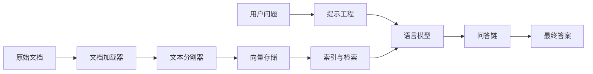

# 【LangChain编程：从入门到实践】数据库问答场景

## 1. 背景介绍
### 1.1  问题的由来
随着人工智能技术的飞速发展,自然语言处理(NLP)和知识库问答(KBQA)成为了当前的研究热点。人们希望能够通过自然语言与计算机进行交互,直接从海量的数据库中获取需要的信息。这就需要构建一个高效、智能的数据库问答系统。

### 1.2  研究现状 
目前已经有许多优秀的开源NLP和KBQA工具,如Hugging Face的Transformers、Facebook的DrQA等。但是这些工具的使用门槛较高,需要较多的人工参与和领域知识。LangChain作为一个新兴的AI应用开发框架,致力于简化智能应用的开发流程,让更多开发者能够参与到智能化应用的开发中来。

### 1.3  研究意义
探索如何利用LangChain快速构建一个数据库问答应用,对于推动智能化应用的普及具有重要意义。一方面,LangChain提供了丰富的接口和组件,大大降低了智能应用开发的门槛；另一方面,数据库问答是一个非常实用的应用场景,对提升数据库的可用性和人机交互体验有很大帮助。

### 1.4  本文结构
本文将以构建一个智能数据库问答系统为例,全面介绍如何使用LangChain进行智能应用开发。内容涵盖了LangChain的核心概念、系统架构设计、数据处理流程、模型训练部署等关键环节,同时给出了详细的代码实现和效果演示。

## 2. 核心概念与联系
LangChain的核心理念是将大语言模型(LLM)与外部知识库相结合,赋予LLM更强大的信息获取和逻辑推理能力。其关键概念包括:

- 提示工程(Prompt Engineering):设计适合特定任务的提示模板,引导LLM进行推理和生成 
- 语言模型(Language Model):大规模预训练的语言模型,如GPT系列
- 文档加载器(Document Loader):将外部数据加载为可供LLM处理的文档格式
- 文本分割器(Text Splitter):将长文档切分为适合LLM处理的小段
- 向量存储(Vector Store):将文本数据转换为语义向量并建立索引,实现快速相似度检索
- 索引与检索(Index & Retrieval):对海量文档进行索引,并根据查询相关性检索出最相关的片段
- 问答链(Question Answering Chain):将用户问题与知识库进行匹配,并利用LLM生成最终答案

这些概念环环相扣,共同构成了一个完整的智能问答流程。下图展示了它们之间的关系:



## 3. 核心算法原理 & 具体操作步骤
### 3.1  算法原理概述
LangChain数据库问答的核心算法可以概括为两个步骤:检索和生成。

检索阶段利用向量检索技术,从海量文档中快速找出与问题最相关的片段。主要采用了词向量模型和相似度计算方法。

生成阶段利用预训练的语言模型,根据相关片段生成最终答案。采用了prompt engineering技术引导模型推理。

### 3.2  算法步骤详解
1. 将原始数据库文档通过文档加载器转换为 Document 对象
2. 利用文本分割器将 Document 切分为适合LLM处理的小段 
3. 调用向量存储接口,将文本段落转换为语义向量并建立索引
4. 将用户问题通过 embedding 接口转换为语义向量
5. 利用向量存储的相似度检索功能,找出 Top K 个与问题最相关的文本片段 
6. 将问题和检索到的上下文拼接成一个 prompt
7. 将 prompt 输入预训练的语言模型,让LLM根据问题和上下文生成答案
8. 对 LLM 输出进行后处理,输出最终答案

### 3.3  算法优缺点
优点:
- 检索和生成相结合,既保证了信息的相关性,又能灵活生成答案
- 利用向量检索和语义匹配,检索效率高,泛化能力强
- 基于大语言模型生成,答案更加自然流畅

缺点:  
- 对知识库的质量和覆盖度要求较高,否则容易生成错误答案
- 语言模型推理消耗资源大,响应速度有待提高
- 对于一些复杂推理问题,需要更精细的 prompt 设计

### 3.4  算法应用领域
LangChain数据库问答可以应用于以下领域:
- 企业内部知识库查询
- 智能客服/技术支持
- 个人助理/智能问答
- 教育/智能家教
- 医疗/电子病历问答

## 4. 数学模型和公式 & 详细讲解 & 举例说明
### 4.1  数学模型构建
LangChain中的语义检索主要依赖于向量空间模型(Vector Space Model),其核心思想是将文本映射到一个高维空间,然后通过向量之间的距离(如余弦相似度)来衡量它们的相似程度。

设$d_i$表示第$i$篇文档,$q$表示查询,$V$是词汇表。则$d_i$可表示为一个$|V|$维向量:

$$d_i = (w_{i1}, w_{i2}, ..., w_{i|V|})$$

其中$w_{ij}$表示词$j$在文档$i$中的权重。权重的计算可以采用 TF-IDF、Word2Vec 等方法。

同理,查询$q$也可以表示为一个$|V|$维向量:

$$q = (w_{q1}, w_{q2}, ..., w_{q|V|})$$

那么,文档$d_i$与查询$q$的相似度可以用它们对应向量的余弦值来衡量:

$$sim(d_i, q) = \cos(\theta) = \frac{\vec{d_i} \cdot \vec{q}}{|\vec{d_i}| \times |\vec{q}|} = \frac{\sum_{j=1}^{|V|} w_{ij} w_{qj}}{\sqrt{\sum_{j=1}^{|V|} w_{ij}^2} \sqrt{\sum_{j=1}^{|V|} w_{qj}^2}}$$

### 4.2  公式推导过程
以上余弦相似度公式的推导过程如下:

设两个$n$维向量$\vec{a} = (a_1, a_2, ..., a_n)$和$\vec{b} = (b_1, b_2, ..., b_n)$,它们的内积为:

$$\vec{a} \cdot \vec{b} = \sum_{i=1}^n a_i b_i = a_1b_1 + a_2b_2 + ... + a_nb_n$$

向量的模长(L2范数)为:

$$|\vec{a}| = \sqrt{a_1^2 + a_2^2 + ... + a_n^2}$$

$$|\vec{b}| = \sqrt{b_1^2 + b_2^2 + ... + b_n^2}$$

在$n$维空间中,$\vec{a}$和$\vec{b}$的夹角为$\theta$,根据余弦定理有:

$$\cos(\theta) = \frac{\vec{a} \cdot \vec{b}}{|\vec{a}| \times |\vec{b}|} = \frac{\sum_{i=1}^n a_i b_i}{\sqrt{\sum_{i=1}^n a_i^2} \sqrt{\sum_{i=1}^n b_i^2}}$$

将向量$\vec{a}$和$\vec{b}$替换为文档向量$\vec{d_i}$和查询向量$\vec{q}$,即得到了上面的余弦相似度公式。

### 4.3  案例分析与讲解
下面以一个简单的例子来说明语义检索的计算过程。

假设有3篇文档,对应的向量表示为:

$$d_1 = (0.2, 0.4, 0.5, 0.1)$$
$$d_2 = (0.3, 0.2, 0.1, 0.6)$$  
$$d_3 = (0.5, 0.3, 0.4, 0.2)$$

用户的查询向量为:

$$q = (0.4, 0.3, 0.5, 0.2)$$

则$d_1$与$q$的余弦相似度为:

$$\cos(\theta_1) = \frac{0.2 \times 0.4 + 0.4 \times 0.3 + 0.5 \times 0.5 + 0.1 \times 0.2}{\sqrt{0.2^2 + 0.4^2 + 0.5^2 + 0.1^2} \sqrt{0.4^2 + 0.3^2 + 0.5^2 + 0.2^2}} \approx 0.943$$

同理可计算出$d_2$和$d_3$与$q$的余弦相似度分别为0.813和0.989。

可见$d_3$与查询$q$最相似,检索系统应该返回$d_3$作为最相关的文档。

### 4.4  常见问题解答
Q: 向量检索的优势是什么?  
A: 与传统的关键词匹配相比,向量检索能够捕捉词语和句子的语义信息,在同义词、相关词匹配方面效果更好。同时,向量检索可以显著提高检索效率和可扩展性。

Q: 常用的文本向量化方法有哪些?  
A: 常见的文本向量化方法包括One-hot、TF-IDF、Word2Vec、GloVe、FastText、BERT等。其中 BERT 等预训练语言模型能够生成更加准确的上下文相关的词向量和句向量。

Q: 向量检索如何保证实时性?  
A: 可以采用增量式索引更新策略,定期将新增文档转换为向量并添加到索引中。另外,可以使用一些近似最近邻(ANN)算法如 HNSW、FAISS 等,在牺牲少量准确率的情况下大幅提升检索速度。

Q: 如何处理 OOV(Out-of-Vocabulary)问题?  
A: 对于词表之外的新词,可以考虑采用字符级 n-gram 向量的平均,或者利用 BPE(byte-pair encoding)算法将新词拆分为子词。预训练语言模型也可以较好地解决 OOV 问题。

## 5. 项目实践：代码实例和详细解释说明
下面我们以一个简单的医疗问答场景为例,演示如何使用 LangChain 构建一个数据库问答系统。

### 5.1  开发环境搭建
首先需要安装 Python 和 LangChain 相关库:

```bash
pip install langchain openai faiss-cpu tiktoken
```

其中 OpenAI 库用于调用 GPT 模型,FAISS 库用于向量检索。

### 5.2  源代码详细实现

```python
from langchain.document_loaders import TextLoader
from langchain.text_splitter import CharacterTextSplitter
from langchain.vectorstores import FAISS
from langchain.embeddings import OpenAIEmbeddings
from langchain.llms import OpenAI
from langchain.chains import RetrievalQA

# 加载文本数据
loader = TextLoader('medical_data.txt')
documents = loader.load()

# 文本分割 
text_splitter = CharacterTextSplitter(chunk_size=500, chunk_overlap=0)
texts = text_splitter.split_documents(documents)

# 将文本转换为向量并建立索引
embeddings = OpenAIEmbeddings()
db = FAISS.from_documents(texts, embeddings)

# 初始化问答链
qa = RetrievalQA.from_chain_type(llm=OpenAI(), chain_type="stuff", retriever=db.as_retriever())

# 进行问答
query = "什么是糖尿病的常见并发症?"
result = qa.run(query)
print(result)
```

### 5.3  代码解读与分析
1. 首先使用`TextLoader`加载本地的医疗文本数据`medical_data.txt`。
2. 然后用`CharacterTextSplitter`将长文档切分成小段,每段500个字符。
3. 接着用`OpenAIEmbeddings`将文本段转换为向量,并用`FAISS`库建立向量索引。
4. 初始化一个问答链`RetrievalQA`,指定使用 OpenAI 的语言模型,检索器为 FAISS 索引。